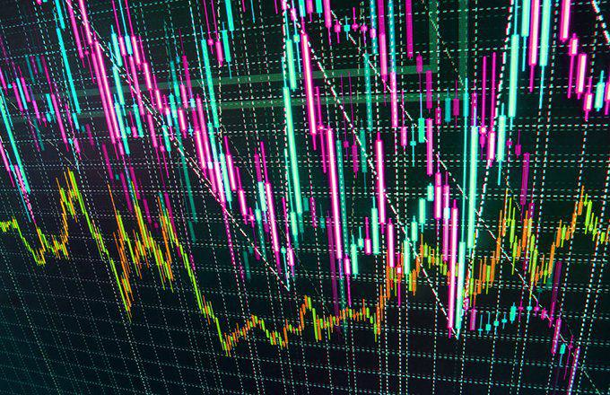

In the fast-paced world of financial markets, trading strategies have rapidly evolved alongside technological advancements. High-frequency trading (HFT) and algorithmic trading stand out as transformative approaches that have reshaped the landscape of modern trading. These trading methodologies leverage sophisticated algorithms and high-speed data processing to execute a vast number of trades with remarkable speed and precision, often within fractions of a second. 

High-frequency trading and algorithmic trading are characterized by their reliance on automation and technology to analyze market conditions, identify trading opportunities, and execute trades more efficiently than traditional manual methods. HFT, in particular, focuses on executing a large volume of orders at extremely high speeds, while algorithmic trading encompasses a broader range of strategies, including executing complex mathematical models to automate trading decisions.



The primary advantage of these strategies lies in their ability to capitalize on market inefficiencies and short-lived opportunities, which are often imperceptible to human traders. Additionally, they enhance liquidity and contribute to tighter bid-ask spreads, theoretically promoting more efficient market dynamics. However, the increasing prevalence of HFT and algorithmic trading has also raised concerns about market volatility, fairness, and the potential for systemic risks.

This article aims to provide a comprehensive overview of high-frequency and algorithmic trading. It will explore the operational mechanisms of these strategies, outline their advantages, and address the challenges they present. For those seeking to understand or engage in high-frequency and algorithmic trading, this discussion will offer valuable insights into the current and future landscape of automated trading.

## Table of Contents

## What is High-Frequency Trading?

High-frequency trading (HFT) is a trading method characterized by the execution of numerous trades at exceptionally high speeds made possible by sophisticated algorithms. These algorithms are designed to identify and exploit minute mismatches in prices and market trends, capitalizing on opportunities that could last only for a fraction of a second. 

The origins of HFT can be traced back to the late 20th century when the advent of computerized trading systems revolutionized the financial markets. With the implementation of electronic exchanges like NASDAQ and the New York Stock Exchange's switch to electronic trading platforms, the stage was set for the rapid growth of high-frequency trading. 

At its core, [HFT](/wiki/high-frequency-trading-strategies) operates by using powerful computers and high-speed internet connections to execute hundreds or even thousands of trades in microseconds, far exceeding the human capacity. This pursuit of speed is driven by the "latency" concern in trading environments, where the delay in data transmission and order execution is kept to an absolute minimum. As such, traders invest heavily in low-latency technologies to gain a competitive edge.

HFT contributes to market dynamics by providing [liquidity](/wiki/liquidity-risk-premium) and narrowing bid-ask spreads. By continuously buying and selling securities, high-frequency traders offer tighter spreads, which benefits retail and institutional traders alike by reducing the cost of transactions. Moreover, HFT can enhance price discovery mechanisms due to its rapid adjustment to new market information.

However, the role of HFT in financial markets is not without controversy. Critics argue that it can lead to increased [volatility](/wiki/volatility-trading-strategies) and systemic risks due to the sheer [volume](/wiki/volume-trading-strategy) and speed of trades. Nonetheless, proponents highlight its contributions to market efficiency and its role in processing vast amounts of data to inform trading strategies.

Overall, high-frequency trading has become an integral component of modern financial markets, significantly impacting how trading is conducted across various asset classes, including stocks and foreign exchange ([forex](/wiki/forex-system)). As technology continues to advance, the industry is poised to see further evolution in HFT methodologies, continually reshaping market landscapes.

## The Evolution and Impact of Algorithmic Trading

Algorithmic trading, the use of computer programs to automate the buying and selling of financial instruments, traces its origins to the late 20th century. Initially, the focus was on reducing transaction costs and improving execution speeds. The adoption of electronic communication networks (ECNs) in the 1990s marked a significant milestone, enabling automated systems to interact directly with order [books](/wiki/algo-trading-books) of exchanges.

By employing coded rules and algorithms, [algorithmic trading](/wiki/algorithmic-trading) transforms trading strategies by incorporating a variety of inputs, including price, volume, and time. These algorithms are capable of optimizing trades without human intervention, thus facilitating efficient market operations and allowing for swift responses to market dynamics.

Historically, one of the primary drivers of algorithmic trading adoption was the Securities and Exchange Commission's (SEC) Regulation National Market System (Reg NMS) in 2007, which promoted fair access to markets and improved transparency. This regulation contributed to the proliferation of algorithmic strategies by ensuring that investor orders were executed at the best possible price, thereby incentivizing the development of sophisticated algorithms to capitalize on these opportunities.

Algorithmic trading has had a profound impact on financial markets, enhancing liquidity by distributing trades evenly across time and reducing the bid-ask spread. This improvement in liquidity is beneficial for market participants, as it lowers transaction costs and reduces price volatility. Moreover, algorithmic trading strategies such as statistical [arbitrage](/wiki/arbitrage) and [market making](/wiki/market-making) optimize capital allocation by exploiting inefficiencies across different markets and instruments.

The integration of [machine learning](/wiki/machine-learning) and [artificial intelligence](/wiki/ai-artificial-intelligence) (AI) into algorithmic trading systems further enhances their ability to process large datasets and identify patterns that are not immediately apparent through traditional analysis. For example, recent advancements in natural language processing (NLP) allow algorithms to parse news articles and social media feeds, adjusting trading strategies based on sentiment analysis and predictive analytics.

To illustrate, consider a simple moving average crossover strategy implemented in Python. The strategy generates buy and sell signals when a short-term moving average crosses above or below a long-term moving average:

```python
import pandas as pd

def moving_average_crossover(data, short_window, long_window):
    data['Short_MA'] = data['Close'].rolling(window=short_window, min_periods=1).mean()
    data['Long_MA'] = data['Close'].rolling(window=long_window, min_periods=1).mean()
    data['Signal'] = 0
    data['Signal'][short_window:] = np.where(data['Short_MA'][short_window:] > data['Long_MA'][short_window:], 1, -1)
    return data

# Example usage
historical_data = pd.read_csv('historical_stock_data.csv')  # Load historical stock price data
strategy_results = moving_average_crossover(historical_data, short_window=40, long_window=100)
```

Such coding examples illustrate the potential for algorithmic strategies to adapt to a wide range of trading conditions, thereby enhancing the robustness of trading systems.

Despite its benefits, algorithmic trading also introduces challenges such as the risk of flash crashes and the potential for increased market fragmentation. These issues necessitate ongoing regulatory scrutiny and technological resilience to ensure stable market conditions.

In conclusion, algorithmic trading has fundamentally transformed the landscape of modern financial markets. By increasing the efficiency of trading operations, it continues to shape investment strategies and market behavior, underscoring the importance of technological integration and the need for adaptive regulatory frameworks.

## Key High-Frequency Trading Strategies

High-frequency trading employs several sophisticated strategies to exploit brief inefficiencies within the financial markets. Each strategy leverages advanced algorithms to capitalize on split-second opportunities, often leading to significant cumulative gains. 

**Market Making**: 

Market making is one of the most prevalent high-frequency trading strategies. This strategy involves placing simultaneous buy and sell orders to profit from the spread, the difference between the bid and ask prices of a security. Market makers provide liquidity to the market by continuously placing limit orders. For instance, if a market maker places a bid order at $10 and an ask order at $10.05, the profit margin is $0.05 per share traded. High-frequency trading firms execute these orders at computerized speeds, allowing them to adjust rapidly to market conditions, thus minimizing risk while maximizing opportunities for profit.

**Statistical Arbitrage**:

Statistical arbitrage involves leveraging quantitative models to identify and exploit pricing inefficiencies between related securities. This strategy is based on the assumption that temporary mispricing will revert to statistical norms over time. For example, if two historically correlated stocks deviate from their typical price ratio, an HFT system might buy the undervalued stock while shorting the overvalued one, anticipating a convergence to their normal price relationship. Python code can be employed to model these scenarios, applying statistical methods to predict reversion:

```python
import numpy as np
import pandas as pd
from statsmodels.tsa.stattools import coint

def find_cointegrated_pairs(data: pd.DataFrame):
    n = data.shape[1]
    score_matrix = np.zeros((n, n))
    pvalue_matrix = np.ones((n, n))
    keys = data.columns
    pairs = []
    for i in range(n):
        for j in range(i+1, n):
            S1 = data[keys[i]]
            S2 = data[keys[j]]
            score, pvalue, _ = coint(S1, S2)
            score_matrix[i, j] = score
            pvalue_matrix[i, j] = pvalue
            if pvalue < 0.05:
                pairs.append((keys[i], keys[j]))
    return pairs

# Example Usage
data = pd.DataFrame({
    'Stock_A': [100, 102, 101, 104, 102],
    'Stock_B': [102, 105, 103, 106, 104],
})
print(find_cointegrated_pairs(data))
```

**News-Based Trading**:

News-based trading harnesses the real-time analysis of news feeds to make informed trading decisions. This strategy exploits the market's reaction to news events such as earnings reports, economic data releases, or geopolitical developments. High-frequency trading systems equipped with natural language processing (NLP) algorithms can parse news articles, social media feeds, and official announcements, making near-instantaneous decisions on buying or selling securities. For instance, if an earnings report reveals better-than-expected performance, an algorithm might trigger a buy order milliseconds after the news is published, capturing favorable price movements before the broader market reacts.

These high-frequency trading strategies, while profitable, require substantial technological infrastructure and pose certain market risks, including the potential to amplify volatility due to their rapid execution nature. Understanding and responsibly managing these strategies are paramount for maintaining market stability.

## Challenges and Controversies in High-Frequency Trading

High-frequency trading (HFT) has become a pivotal component of modern financial markets, offering potential advantages such as improved liquidity and narrower bid-ask spreads. However, it also brings to light several challenges and controversies that have sparked significant debate among market participants, regulators, and academics.

One of the primary criticisms of HFT is its potential to exacerbate market volatility. High-speed trading can lead to abrupt price swings, as algorithms rapidly enter and [exit](/wiki/exit-strategy) positions. The frequent and sudden transactions inherent in HFT may contribute to instability in markets, especially during periods of stress or uncertainty. The phenomenon of "feedback loops," where trading algorithms react to each other's actions, can amplify these price movements, potentially leading to volatility spikes.

Moreover, the fairness of access to HFT technology and infrastructure is often questioned. High-frequency traders typically require costly co-location services, which allow their servers to be physically situated near stock exchange servers. This proximity reduces latency and grants an advantage in terms of execution speed. Critics argue that this creates an uneven playing field, favoring firms that can afford these technological advantages over traditional investors.

Market manipulation is another serious concern associated with HFT. Strategies such as "spoofing" and "layering," where traders place large orders with the intent to cancel them before execution to manipulate prices, have been observed. These practices can distort market operations, misleading investors about the true supply and demand dynamics. Although regulations such as the Dodd-Frank Act in the United States have been implemented to curb these illegal activities, enforcement remains a challenge due to the nuanced and rapid nature of HFT transactions.

Additionally, the risk of "flash crashes" is a major controversy tied to HFT. These are extremely rapid and severe market sell-offs followed by a quick recovery. The most notable flash crash occurred on May 6, 2010, when the Dow Jones Industrial Average plummeted nearly 1,000 points within minutes. Investigations revealed that high-frequency trading algorithms played a substantial role in the event. Such incidents raise questions about the systemic risk HFT poses to financial stability.

In response to these challenges, regulatory efforts have been undertaken to enhance market integrity and protect investors. Regulations like the European Union's Markets in Financial Instruments Directive II (MiFID II) aim to increase transparency and impose stricter controls on high-frequency trading activities. These include requirements for algorithm testing, order-to-trade ratios, and monitoring mechanisms to prevent abusive practices.

Efforts to address the controversies surrounding HFT continue to evolve, balancing the need for innovation in financial markets with the protection of investor interests and market stability. As technology develops, ongoing regulatory vigilance and adaptation are essential to mitigate the risks associated with high-frequency trading.

## Alternatives to High-Frequency Trading

As high-frequency trading (HFT) encounters increasing scrutiny due to its potential to amplify market volatility and other criticisms, traders are actively exploring alternative strategies that offer different risk-reward profiles and leverage market inefficiencies. Notably, [momentum](/wiki/momentum) trading, automated news-based trading, and social media feed-based trading present viable alternatives to traditional HFT approaches.

Momentum trading is a strategy that capitalizes on existing market trends. Traders using this approach aim to buy assets whose prices are rising and sell those whose prices are falling, basing their decisions on the observed persistence in asset price trends. The underlying assumption is that assets which have demonstrated significant upward or downward movements will continue to do so for some period. Quantitative models often define momentum as returns over a specific historical time window, and traders might apply thresholds to signal buy or sell actions. The momentum strategy does not require trades to be executed at ultra-high speeds, thus differentiating it from HFT.

Automated news-based trading uses algorithms to interpret and act upon news data. Developments in natural language processing (NLP) and machine learning have enabled algorithms to rapidly parse news articles, earnings reports, or economic releases to gauge sentiment and predict the impact on asset prices. For example, a Python-based approach could involve using libraries such as `NLTK` or `spaCy` to parse news data and assign sentiment scores. Sentiment analysis can drive decisions on whether to enter or exit trades based on anticipated market reactions, allowing traders to react quickly but not necessarily at the microsecond level characteristic of HFT.

Social media feed-based trading is a strategy that evaluates the sentiment and trends observed on platforms such as Twitter and Reddit for market insights. Similar to news-based trading, it involves sentiment analysis where algorithms assess the tone and content of social media posts. Given the rapid dissemination of information and opinions on these platforms, traders can gain early insights into market sentiment shifts. Algorithms can be crafted to detect significant changes in social media activity relating to specific assets, prompting traders to buy or sell based on this crowd-sourced sentiment.

Each of these alternative strategies can complement or replace HFT by leveraging different aspects of market inefficiencies. While they do not rely on ultra-fast execution speeds, they still benefit from technological advancements in data analytics and machine learning, representing agile and insightful approaches to trading that can cater to different market conditions and investor preferences.

## The Future of Algorithmic and High-Frequency Trading

High-frequency trading (HFT) and algorithmic trading are at the forefront of financial market evolution, principally influenced by technological advancements and changing regulatory landscapes. One of the most notable emerging trends is the integration of artificial intelligence (AI), which is poised to redefine trading operations by enhancing decision-making, risk management, and market prediction accuracy.

**AI Integration in Trading:**
AI algorithms, particularly those utilizing machine learning (ML) and [deep learning](/wiki/deep-learning), offer sophisticated analytical capabilities that can process large datasets in real-time. These capabilities enable traders to identify patterns and correlations that may not be evident through traditional analysis. For instance, AI can be employed to optimize trading strategies by learning from historical data and adjusting to new market conditions without human intervention. A common implementation involves the use of neural networks to predict pricing movements by analyzing technical indicators and sentiment data derived from social media and news articles. 

```python
import numpy as np
from sklearn.model_selection import train_test_split
from sklearn.neural_network import MLPRegressor

# Sample feature set representing indicator data
X = np.array([...])  # Predictor variables (e.g., historical prices, sentiment scores)
y = np.array([...])  # Target variables (e.g., future prices)

# Split data into training and testing sets
X_train, X_test, y_train, y_test = train_test_split(X, y, test_size=0.2)

# Initialize and train the neural network model
model = MLPRegressor(hidden_layer_sizes=(100,100), max_iter=500)
model.fit(X_train, y_train)

# Predict future prices
predictions = model.predict(X_test)
```

**Global Expansion and Market Access:**
Algorithmic trading is expanding globally, facilitated by improved internet connectivity and more accessible financial markets. This expansion allows traders from different regions to participate in markets previously dominated by local participants. Global exchanges are increasingly adopting electronic trading systems, providing algorithmic traders opportunities to exploit arbitrage possibilities across time zones and markets. 

**Regulatory Changes and Market Integrity:**
As HFT and algorithmic trading continue to grow, so too does the scrutiny from regulators aiming to maintain market integrity and prevent systemic risks. Regulations are increasingly focusing on ensuring fair access to market data and trading infrastructure. Furthermore, measures to address potential market abuses, such as spoofing and layering, are expected to become more sophisticated. These regulatory changes necessitate that algorithmic traders adapt their systems to comply with new rules and maintain ethical standards.

**Preparing for Future Developments:**
Traders can remain competitive by investing in technology and infrastructure that supports rapid data processing and decision-making. A keen understanding of emerging technologies, such as quantum computing, could offer significant advantages in executing complex algorithms efficiently. Additionally, cultivating a comprehensive risk management framework is essential in mitigating the impacts of volatile market conditions exacerbated by algorithmic trading speeds.

In conclusion, as algorithmic trading assimilates AI and spreads globally, it is vital for traders to keep abreast of technological and regulatory changes. By doing so, they can harness these advancements to enhance performance while ensuring compliance and ethical trading practices.

## Conclusion

High-frequency and algorithmic trading have fundamentally reshaped the landscape of financial markets, making them more dynamic and interconnected. These trading strategies offer the potential for enhanced liquidity provision and increased trading efficiency, which can reduce transaction costs and narrow bid-ask spreads. By leveraging advanced algorithms and cutting-edge technology, traders can capitalize on rapid market movements and execute trades at speeds traditionally unattainable by human traders.

Despite these advantages, high-frequency and algorithmic trading present distinct challenges that require meticulous management. The potential to exacerbate market volatility is a significant concern, as is the risk of flash crashes which can arise from automated trading algorithms reacting to anomalies in the market. Moreover, issues relating to fairness of market access and potential manipulation are ongoing points of debate in financial circles. Regulatory bodies are increasingly focusing on these areas, aiming to ensure market stability while fostering innovation.

As financial markets continue to evolve, driven by technological advancements and changing regulatory landscapes, market participants must remain informed and adaptable. The integration of artificial intelligence and machine learning into trading algorithms signifies a new era of development, promising further innovation but also necessitating a nuanced understanding of the accompanying risks. For traders and institutions alike, the ability to stay abreast of these developments and respond with agility will be crucial to navigating the future of high-frequency and algorithmic trading successfully.

## References & Further Reading

[1]: Bergstra, J., Bardenet, R., Bengio, Y., & Kégl, B. (2011). ["Algorithms for Hyper-Parameter Optimization."](https://dl.acm.org/doi/10.5555/2986459.2986743) Advances in Neural Information Processing Systems 24.

[2]: ["Advances in Financial Machine Learning"](https://www.amazon.com/Advances-Financial-Machine-Learning-Marcos/dp/1119482089) by Marcos Lopez de Prado

[3]: ["Evidence-Based Technical Analysis: Applying the Scientific Method and Statistical Inference to Trading Signals"](https://www.amazon.com/Evidence-Based-Technical-Analysis-Scientific-Statistical/dp/0470008741) by David Aronson

[4]: ["Machine Learning for Algorithmic Trading"](https://github.com/stefan-jansen/machine-learning-for-trading) by Stefan Jansen

[5]: ["Quantitative Trading: How to Build Your Own Algorithmic Trading Business"](https://www.amazon.com/Quantitative-Trading-Build-Algorithmic-Business/dp/1119800064) by Ernest P. Chan