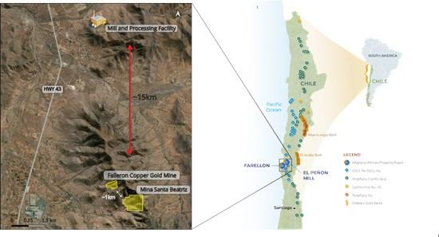

The dynamic world of finance is constantly evolving, with technology driving new opportunities for investors. Financial derivatives, particularly options, are at the forefront of this transformation, offering a range of strategic opportunities. Options, as a versatile financial instrument, allow traders to hedge risks, speculate, and leverage their trading strategies. The development of algorithmic trading has significantly enhanced these strategies, offering precision and speed beyond traditional manual trading approaches.

With the advent of algorithmic trading, specifically Altiplano option trading in the derivatives market, there’s a newfound potential for efficient and strategic investing. Algorithmic trading employs computer algorithms to execute trades at speeds and frequencies that are impossible for human traders, enhancing decision-making processes and execution times. This capability is essential in option trading, where rapid decisions can make a substantial difference due to market volatility.



This article explores the intersection of financial derivatives, options trading, and the role of algorithmic trading, focusing on the unique aspects of Altiplano options. Altiplano options, an exotic class of derivatives, offer innovative features such as a guaranteed payout even if the strike price is not reached. These unique attributes make them a valuable component of diversified investment portfolios.

We will examine the mechanisms, benefits, challenges, and future prospects of this innovative approach in trading. By understanding how Altiplano options function within the ecosystem of algorithmic trading, investors can strategically position themselves to capitalize on market movements, optimize their portfolios, and manage risks effectively. As technology continues to advance, the integration of options trading and algorithmic systems promises to unfold new horizons for investors seeking to leverage complex financial instruments.

## Table of Contents

## Understanding Financial Derivatives and Options

Financial derivatives are financial instruments that derive their value from an underlying asset, index, or benchmark. These contracts are pivotal in modern finance, enabling the transfer of risk and the discovery of market prices. Derivatives facilitate the hedging of potential losses, allow for speculation on market movements, and leverage positions to amplify gains or losses.

Options are among the most widely used types of financial derivatives. They grant the holder the right, but not the obligation, to buy or sell a particular asset at a predetermined price (the strike price) within a specific timeframe. This flexibility is central to their appeal in various trading strategies. There are primarily two types of options: call options and put options. A call option provides the right to purchase the asset, whereas a put option provides the right to sell it.

### Versatility and Applications

The versatility of options stems from their ability to be used for hedging, speculation, and leveraging in trading strategies:

1. **Hedging**: Options can mitigate risk by providing insurance against adverse price movements. For example, a stockholder anticipating a potential decline in stock value might purchase a put option as a hedge.

2. **Speculation**: Traders often use options to speculate on the future direction of market prices. The limited investment required for options compared to trading the actual asset also makes them attractive for speculative purposes.

3. **Leverage**: Options inherently provide leverage by allowing traders to control substantial amounts of the underlying asset with relatively small capital outlays. The leverage effect can significantly amplify potential returns, but it also increases potential losses.

### Mathematical Representation

The pricing of options commonly employs mathematical models such as the Black-Scholes model, which helps to estimate fair premium prices. The Black-Scholes formula for a European call option is represented mathematically as:

$$
C = S_0 N(d_1) - X e^{-rT} N(d_2)
$$

where:
- $C$ is the call option price.
- $S_0$ is the current price of the underlying asset.
- $X$ is the strike price.
- $T$ is the time to maturity.
- $r$ is the risk-free interest rate.
- $N(d)$ is the cumulative distribution function of the standard normal distribution.
- $d_1 = \frac{\ln(S_0 / X) + (r + \sigma^2 / 2)T}{\sigma \sqrt{T}}$
- $d_2 = d_1 - \sigma \sqrt{T}$
- $\sigma$ is the volatility of the asset's return.

These mathematical models and strategies underscore the importance of options in creating diversified portfolios that can withstand varying market conditions.

## The Altiplano Option: A Closer Look

Altiplano options are a specialized form of exotic derivatives classified within the "mountain range options" family. Unlike standard options, which are typically linked to a single underlying asset, Altiplano options derive their value from a basket of securities. This composition allows for an innovative approach to risk and return management, attracting investors seeking alternative investment strategies.

The defining characteristic of Altiplano options is their guaranteed minimum payout, regardless of whether the strike prices of the involved securities are reached. This feature provides a layer of security uncommon in traditional options, making Altiplano options appealing for risk-averse investors who desire exposure to multiple underlying assets without complete dependence on their individual performance.

Structurally, the payoff of an Altiplano option can be represented by the formula:

$$
P = \max(G, f(S_1, S_2, \ldots, S_n))
$$

Where:
- $P$ is the payout of the option.
- $G$ is the guaranteed minimum payout.
- $f(S_1, S_2, \ldots, S_n)$ is a function that details the payoff based on the performance of the underlying securities $S_1, S_2, \ldots, S_n$.

This structure means that even if none of the underlying securities achieve their strike price, the investor will still receive the baseline payout determined by $G$. The actual payout could exceed $G$ if the function $f$ yields a higher value based on favorable market conditions.

Altiplano options differ from traditional options in their inherent design to spread exposure and mitigate risk through diversification in the underlying asset basket. In typical vanilla options, the outcome is generally binary: the option is either exercised or it expires worthless, depending solely on whether the asset's price crosses a predetermined threshold. In contrast, Altiplano options provide a non-zero payoff floor, enhancing their utility as a risk management tool while still offering participation in potential upside.

The unique mechanics of Altiplano options require sophisticated pricing models that account for the correlation, [volatility](/wiki/volatility-trading-strategies), and dynamic behavior of the multiple underlying assets. As such, they are primarily used by professional traders and institutions with the resources to implement complex strategies and perform rigorous quantitative analysis.

In summary, Altiplano options present a distinctive investment opportunity by combining the potential for diversified returns with a baseline level of financial security. This hybrid nature makes them an attractive instrument for expanding the toolkit available to investors and portfolio managers in search of innovative risk-adjusted return profiles.

## Algorithmic Trading: A Revolution in Investment Strategies

Algorithmic trading utilizes sophisticated computer systems to execute trading orders at speeds and frequencies that are beyond human capabilities. These systems are capable of processing vast amounts of market data to make trading decisions within milliseconds, exploiting market inefficiencies that would otherwise be unnoticeable to human traders. By relying on predefined algorithms, traders can automate the decision-making process, ensuring that trades are executed based on real-time data without the influence of human emotions.

In options trading, particularly, the need for rapid execution is paramount due to the market's inherent volatility and time-sensitive nature. Options are derivatives that require intricate calculations for pricing, including variables like volatility, time decay, and the relationships between the underlying asset prices. Algorithmic trading systems can manage these calculations in real-time, providing traders with the agility needed to respond to market shifts instantly. This capability is especially valuable in environments where decisions must be made quickly to capitalize on opportunities or mitigate losses.

Moreover, when applied to complex derivative portfolios such as those involving Altiplano options, [algorithmic trading](/wiki/algorithmic-trading) provides significant enhancements in efficiency and management. Altiplano options, being exotic derivatives, require an understanding of multiple sensitivities related to the underlying securities. The integration of algorithmic trading tools allows traders to automate and optimize the execution strategies for these options, efficiently managing risk and exploiting [arbitrage](/wiki/arbitrage) opportunities that arise from the intricate structures of such derivatives.

Python, widely used in financial applications, offers numerous libraries such as NumPy and pandas for data analysis, along with specialized tools like QuantLib for derivatives pricing, which facilitate the development of algorithmic trading strategies. These tools enable the design of algorithms that can dynamically adjust trading strategies in response to evolving market conditions, thus maintaining an optimal balance between risk and reward.

For example, an algorithm for trading Altiplano options might be structured as follows in Python:

```python
import numpy as np
import pandas as pd
from quantlib.pricingengines import OptionPricingEngine

def trade_algorithm(data):
    # Load market data
    df = pd.DataFrame(data)

    # Define trading strategy parameters
    strike_price = 100
    volatility_threshold = 0.2

    # Initialize option pricing engine
    engine = OptionPricingEngine()

    # Execute trading logic
    for index, row in df.iterrows():
        price = engine.calculate_option_price(row['underlying_price'], strike_price, row['volatility'])

        if row['volatility'] > volatility_threshold:
            # Execute buy order logic
            print(f"Buying option at time {row['time']} with calculated price {price}")
        else:
            # Execute sell order logic
            print(f"Selling option at time {row['time']} with calculated price {price}")

# Example market data
market_data = [
    {'time': '10:00', 'underlying_price': 102, 'volatility': 0.15},
    {'time': '10:01', 'underlying_price': 105, 'volatility': 0.25},
    {'time': '10:02', 'underlying_price': 107, 'volatility': 0.18},
]

trade_algorithm(market_data)
```

This script showcases a basic framework where trading decisions are made based on the volatility of the underlying asset. Using algorithmic trading in this way allows for systematic approaches that manage risk and execute trades with precision, a critical advantage in the fast-paced world of options trading. As markets continue to evolve with technological advancements, algorithmic trading remains a pivotal component in executing strategies effectively and efficiently.

## Benefits of Combining Altiplano Options with Algorithmic Trading

The integration of Altiplano options with algorithmic trading systems offers numerous advantages, significantly enhancing trade execution, reducing errors, and improving risk management. Automated trading systems are highly effective at handling the intricate calculations involved in options pricing and hedging. This computational capability ensures traders can manage portfolios systematically and with greater precision. Algorithms rapidly process large datasets to determine optimal trading decisions, which would be challenging and time-consuming if executed manually.

Algorithmic trading systems are particularly adept at identifying and exploiting arbitrage opportunities in the market. Arbitrage, the simultaneous purchase and sale of an asset in different markets to profit from price differentials, can be finely tuned using algorithms. Automation enables the detection of even slight inefficiencies across various markets where Altiplano options are traded, allowing for timely and profitable responses.

Managing volatility risk is another critical aspect where algorithmic trading provides a significant edge. The volatile nature of financial markets demands swift and strategic responses to changing conditions. Automated systems excel in monitoring market volatilities and adjusting trading strategies instantaneously to mitigate risks. This capacity is crucial when dealing with complex derivative instruments such as Altiplano options, which rely on multiple underlying assets.

Precise execution timing is fundamental in options trading. Algorithms facilitate high-frequency trading ([HFT](/wiki/high-frequency-trading-strategies)), executing trades at a microsecond level that is impossible for human traders. This speed reduces slippage, the difference between the expected price of a trade and the actual price, ensuring more favorable outcomes.

Moreover, the integration of algorithmic trading allows for scalability in managing large volumes of trading data and transactions while maintaining consistent accuracy and efficiency. As financial markets continue to evolve, traders who employ these sophisticated systems with Altiplano options can better navigate the intricacies of derivative markets, positioning themselves for favorable returns while effectively managing potential risks.

## Challenges and Considerations

Algorithmic options trading, while offering considerable advantages, presents specific challenges that require careful attention. A primary concern is the potential for technical failures. Algorithmic systems are highly dependent on sophisticated technology infrastructure, which, if not properly managed, can lead to system outages or malfunctioning algorithms. Such disruptions can result in significant financial losses, particularly in the fast-paced world of options trading where timing is crucial. Furthermore, maintaining and upgrading this infrastructure involves substantial costs, as continual updates are necessary to keep pace with technological advancements and to ensure optimal system performance.

Additionally, market risks are inherent in algorithmic trading. Volatility in financial markets can affect the accuracy of algorithmic predictions and trading strategies. Algorithms may not always account for unforeseen market events or shifts in investor sentiment, which can lead to unexpected losses. Traders using Altiplano options, in particular, must remain vigilant about such risks given the complex nature of these instruments.

Regulatory compliance forms another significant consideration. Financial markets are highly regulated, and algorithmic trading is subject to strict compliance requirements. Firms engaged in algorithmic trading must ensure that their strategies do not violate market manipulation regulations and other legal standards. This involves continuous monitoring and often necessitates significant investment in compliance infrastructure and personnel to manage regulatory responsibilities. For instance, implementing risk management systems that adhere to market regulations requires developing sophisticated algorithms capable of identifying potential compliance issues in real-time. 

Overall, while algorithmic trading, including Altiplano options, offers notable efficiencies and strategic advantages, traders and firms must be prepared to address these associated challenges. Effective technology management, vigilant market risk assessment, and robust regulatory compliance mechanisms are essential for successful algorithmic options trading.

## The Future of Options Trading with Algorithms

The future of options trading, driven by algorithmic integration, is poised for significant advancements as technology continues to evolve. A core aspect of this evolution is the incorporation of [artificial intelligence](/wiki/ai-artificial-intelligence) (AI) and [machine learning](/wiki/machine-learning) (ML) into algorithmic trading systems. These technologies facilitate enhanced predictive analytics, allowing traders to process and analyze vast datasets with greater speed and accuracy than traditional methods permit.

Machine learning algorithms can identify patterns and trends within market data that might not be apparent to human analysts. By training models on historical data, these algorithms can make predictions about future price movements and volatility, thereby aiding in the decision-making process. For options trading, where timing and market conditions are crucial, such predictions can significantly enhance trading efficiency and profitability.

Moreover, AI and ML can improve the management of complex trading strategies involving instruments like Altiplano options. These options, characterized by their exotic nature and contingent guarantees, benefit from the precise calculations that AI-driven models offer. By utilizing machine learning algorithms, traders can optimize their positions, manage risk more effectively, and potentially increase returns.

Looking to the future, Altiplano options and similar instruments could become central components of diversified trading strategies. As technology evolves, trading platforms are likely to integrate even more advanced algorithms capable of real-time adaptations to market fluctuations. For instance, future developments might include self-learning algorithms that adapt their trading strategies based on new data inputs without requiring human intervention.

Python, a prevalent programming language in finance, provides numerous libraries such as TensorFlow, Keras, and scikit-learn, which offer tools for developing sophisticated AI models. Below is a simple example of how a machine learning model can be used for predictive analytics in options trading:

```python
import numpy as np
from sklearn.model_selection import train_test_split
from sklearn.ensemble import RandomForestRegressor

# Sample historical data for options trading
data = np.random.rand(1000, 10)  # 1000 samples, 10 features
target = np.random.rand(1000)    # Target variable (e.g., option price)

# Split the data into training and testing sets
X_train, X_test, y_train, y_test = train_test_split(data, target, test_size=0.2, random_state=42)

# Initialize and train the model
model = RandomForestRegressor(n_estimators=100, random_state=42)
model.fit(X_train, y_train)

# Make predictions
predictions = model.predict(X_test)
```

As AI and machine learning continue to advance, they promise to further transform options trading, offering improvements in predictive analytics, risk management, and trade execution. The potential for integrating Altiplano options into these evolving strategies reflects the growing importance of technology-driven innovation in the financial sector.

## Conclusion

Financial derivatives, particularly Altiplano options, highlight a significant evolution in modern trading strategies. These instruments are designed to leverage multiple underlying assets, offering both diversity and innovation in portfolio management. Altiplano options stand apart from traditional options by providing guaranteed payouts, enhancing their appeal for strategic investment despite reaching or not reaching the strike price. This unique feature allows traders to achieve returns with potentially reduced risk, a compelling proposition in both stable and volatile markets.

The integration of algorithmic trading with Altiplano options magnifies their potential, optimizing trade execution with precision and speed unattainable by human traders. Algorithmic trading uses sophisticated computer programs to automate trading strategies, handling voluminous data quickly and reducing the latency between strategy formulation and trade execution. For adept traders, this synergy not only diminishes errors but also fine-tunes risk management and capitalizes on arbitrage opportunities more effectively.

Traders and investors are urged to stay informed and adaptable, especially as technology continues to advance. The increased incorporation of artificial intelligence and machine learning in algorithmic trading strategies offers prospects for enhanced predictive analytics and performance in derivatives markets. By embracing these technological tools, traders can navigate market complexities, fostering portfolio growth and resilience. In a rapidly evolving financial landscape, leveraging technology and maintaining a proactive approach are critical for achieving success in derivatives trading.

## References & Further Reading

[1]: Bergstra, J., Bardenet, R., Bengio, Y., & Kégl, B. (2011). ["Algorithms for Hyper-Parameter Optimization."](https://dl.acm.org/doi/10.5555/2986459.2986743) Advances in Neural Information Processing Systems 24.

[2]: ["Advances in Financial Machine Learning"](https://www.amazon.com/Advances-Financial-Machine-Learning-Marcos/dp/1119482089) by Marcos Lopez de Prado

[3]: ["Evidence-Based Technical Analysis: Applying the Scientific Method and Statistical Inference to Trading Signals"](https://www.amazon.com/Evidence-Based-Technical-Analysis-Scientific-Statistical/dp/0470008741) by David Aronson

[4]: ["Machine Learning for Algorithmic Trading"](https://github.com/stefan-jansen/machine-learning-for-trading) by Stefan Jansen

[5]: ["Quantitative Trading: How to Build Your Own Algorithmic Trading Business"](https://www.amazon.com/Quantitative-Trading-Build-Algorithmic-Business/dp/1119800064) by Ernest P. Chan