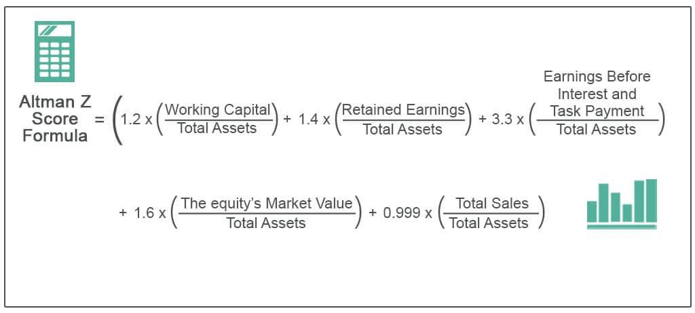

The financial health of a company is a fundamental concern for a wide array of stakeholders, including investors, creditors, and management teams. Understanding and evaluating this health is paramount as it can significantly influence investment decisions, credit assessments, and strategic planning. One of the pivotal facets of assessing financial health is predicting the likelihood of bankruptcy, a scenario with profound implications for all associated parties.

The Altman Z-Score is a notable tool utilized in such evaluations. Developed by Edward Altman in 1968, this financial model has become renowned for its ability to predict corporate bankruptcy with a degree of accuracy that has made it a staple in financial analysis. It consolidates multiple financial ratios into a singular score, thereby providing a streamlined method to gauge a company's financial status and overall health. Stakeholders in the financial market have relied on this model as it delivers a quantitative analysis of various factors affecting a company's stability and continuity.



Furthermore, the Altman Z-Score's applicability has extended into modern investment strategies, particularly in algorithmic trading. Algorithmic traders seek to refine their tactics by integrating various quantitative measures to bolster portfolio performance. The Z-Score offers an additional layer of risk assessment, aiding in the identification of potentially unstable investments and allowing traders to make more informed decisions to enhance their returns.

This article investigates into a comprehensive analysis of the Altman Z-Score, examining its creation, methodology, and the multifaceted benefits it offers in evaluating the fiscal robustness of a company. It also explores how integrating this tool with algorithmic trading strategies can provide substantial advantages in crafting effective investment strategies. Through this analysis, we aim to uncover the continued relevance of the Altman Z-Score and its efficacy in current and evolving financial environments.

## Table of Contents

## What is the Altman Z-Score?

The Altman Z-Score, conceptualized by Edward Altman in 1968, is a predictive model designed to evaluate the likelihood of bankruptcy for publicly traded manufacturing companies. This financial metric leverages a combination of five essential financial ratios extracted from a company's income statement and balance sheet, which collectively assess the organization's profitability, leverage, liquidity, solvency, and activity. Consequently, it offers a comprehensive snapshot of the financial health of a company.

The five key financial ratios incorporated into the Altman Z-Score are:

1. **X1 (Working Capital/Total Assets):** This ratio gauges liquidity by comparing the company's working capital with its total assets. A higher ratio indicates a greater ability to cover short-term liabilities with available resources.

2. **X2 (Retained Earnings/Total Assets):** This measures leverage and profitability by examining how much of the company's assets are financed by retained earnings. It reflects the company's ability to reinvest earnings and generate growth without incurring additional debts.

3. **X3 (Earnings Before Interest and Taxes/Total Assets):** Often referred to as the return on assets, this ratio serves as an indicator of a firm's operational efficiency and profitability. A higher value typically suggests better asset utilization to generate earnings.

4. **X4 (Market Value of Equity/Total Liabilities):** This solvency ratio assesses the company's capacity to cover its liabilities through its equity. A higher ratio indicates more substantial equity backing relative to the company's debts.

5. **X5 (Sales/Total Assets):** Known as the asset turnover ratio, this provides insights into the company's ability to generate sales from its assets. A high ratio implies effective asset utilization in generating revenue.

The formula for the Altman Z-Score is as follows:
$$
Z = 1.2X1 + 1.4X2 + 3.3X3 + 0.6X4 + 1.0X5
$$

The Z-Score categorizes firms into three distinct zones based on the derived value:

- **Safe Zone:** A Z-Score above 3 indicates strong financial health, suggesting a low probability of bankruptcy.
- **Grey Zone:** A Z-Score between 1.8 and 3 signals an ambiguous area where financial stability may be uncertain.
- **Distress Zone:** A score below 1.8 reflects a high risk of bankruptcy, indicating potential financial instability.

Originally devised for manufacturing firms, the Altman Z-Score model has undergone adaptations to cater to various company types, including non-manufacturing entities and those in emerging markets, enhancing its applicability and relevance across diverse industrial sectors.

## Calculation of the Altman Z-Score

The Altman Z-Score, introduced by Edward Altman in 1968, is calculated using a specific formula that combines five financial ratios. These ratios provide a quantitative assessment of a company's financial health, assisting in the evaluation of its bankruptcy risk. The original formula is expressed as:

$$
Z = 1.2X_1 + 1.4X_2 + 3.3X_3 + 0.6X_4 + 1.0X_5
$$

Where:
- $X_1$ = Working Capital / Total Assets
- $X_2$ = Retained Earnings / Total Assets
- $X_3$ = Earnings Before Interest and Taxes (EBIT) / Total Assets
- $X_4$ = Market Value of Equity / Total Liabilities
- $X_5$ = Sales / Total Assets

These components measure different dimensions of financial performance: [liquidity](/wiki/liquidity-risk-premium), profitability, leverage, solvency, and activity efficiency. Utilizing these ratios, the model assigns a Z-Score that indicates the likelihood of bankruptcy. A Z-Score less than 1.8 typically signals a high risk of bankruptcy, while a score above 3 suggests the company is financially stable and poses low bankruptcy risk.

Over time, adaptations to this original model have been developed to suit different types of firms, especially non-manufacturing and private companies. For example, in models like the Z-Score', the Market Value of Equity ($X_4$) is substituted with the Book Value to better accommodate private entities where market valuations are not readily available.

Advancements in financial modeling have enabled further customization of the Altman Z-Score for specific industries, enhancing its applicability. These adaptations ensure that the model remains relevant in assessing financial health across diverse sectors, reflecting ongoing improvements in its predictive capabilities.

## Applications of the Altman Z-Score

The Altman Z-Score is a versatile tool used by various stakeholders in the financial market to evaluate a company's financial health and predict bankruptcy risk. For investors, the Z-Score offers a quantitative approach to assess a firm's financial well-being. By analyzing a company's score before making investment decisions, investors can avoid companies that are likely to face financial distress, thereby reducing the risk in their investment portfolio.

Banks and financial institutions also utilize the Altman Z-Score as a measure to determine the creditworthiness of potential borrowers. The score provides insights into a company's financial structure and risk level, aiding lending institutions in making informed decisions about issuing credit. A lower Z-Score may signal heightened risk, prompting banks to adjust interest rates or reconsider loan terms.

Auditors and regulators benefit from the Z-Score model by using it to spot potential red flags in a company's financial statements. This function is crucial for maintaining transparency and reliability in financial reporting. By identifying anomalies or signs of financial instability early, auditors can take preventive measures, ensuring regulatory compliance and protecting stakeholders' interests.

The incorporation of the Altman Z-Score in [algorithmic trading](/wiki/algorithmic-trading) strategies allows traders to mitigate risks associated with corporate insolvency. By integrating the Z-Score into trading algorithms, quantitative analysts can filter out stocks with high bankruptcy risk, focusing instead on more stable investments. This application enhances the robustness and profitability of trading strategies.

Furthermore, the Z-Score is instrumental in strategic business planning and corporate governance. Corporate leaders can use the score to ensure financial stability and long-term viability, making informed decisions that align with the organization's financial health objectives. The Altman Z-Score thus remains a pivotal component in the toolbox of investors, financial institutions, auditors, and corporate managers.

## The Altman Z-Score in Algo Trading

Algorithmic trading employs automated systems to execute trades, optimizing decisions through pre-set quantitative criteria. The integration of the Altman Z-Score into these algorithms offers traders a valuable method to assess and manage financial risks associated with corporate solvency. By implementing the Z-Score, traders can effectively filter out financially distressed companies from their portfolios, thereby reducing exposure to potential bankruptcies and enhancing overall portfolio stability.

To incorporate the Altman Z-Score in trading algorithms, quantitative analysts can develop scripts that automatically calculate the Z-Score for a given set of stocks. This can be achieved using Python, a preferred language in quantitative finance, leveraging libraries such as pandas and numpy for data manipulation and computation. For example, the Z-Score calculation algorithm can be scripted as follows:

```python
import pandas as pd

def calculate_z_score(data):
    X1 = data['Working Capital'] / data['Total Assets']
    X2 = data['Retained Earnings'] / data['Total Assets']
    X3 = data['EBIT'] / data['Total Assets']
    X4 = data['Market Value of Equity'] / data['Total Liabilities']
    X5 = data['Sales'] / data['Total Assets']

    z_score = 1.2 * X1 + 1.4 * X2 + 3.3 * X3 + 0.6 * X4 + 1.0 * X5
    return z_score

# Example data
financial_data = {
    'Working Capital': 1000000,
    'Total Assets': 5000000,
    'Retained Earnings': 2000000,
    'EBIT': 300000,
    'Market Value of Equity': 4000000,
    'Total Liabilities': 2500000,
    'Sales': 6000000
}

z_score = calculate_z_score(financial_data)
print("Z-Score:", z_score)
```

The primary advantage of integrating Z-Score into trading systems is the dynamic adjustment it allows concerning market conditions. As financial data inputs change, the Z-Score calculation updates, enabling real-time decision-making that can effectively adapt to evolving financial landscapes. This adaptability ensures the robustness of trading strategies, improving profit margins by anticipating financial distress and reallocating resources to healthier investments.

Moreover, when combined with advanced technical analysis tools, the Altman Z-Score enhances the precision of trading algorithms. Techniques such as moving averages, [momentum](/wiki/momentum) indicators, and other financial ratios can complement Z-Score analysis, facilitating a more comprehensive evaluation of asset viability. This multifaceted approach not only bolsters the strategy’s efficiency but also its capacity for risk management, ultimately optimizing investment outcomes.

## Limitations of the Altman Z-Score

The Altman Z-Score, while a pivotal tool in assessing bankruptcy risks, has its limitations that necessitate careful consideration by its users. Originally designed for publicly traded manufacturing firms, the model’s applicability across diverse industries can be limited. Significant adjustments may be required to adapt the Z-Score formula to non-manufacturing sectors such as technology, services, or finance, which often exhibit fundamentally different financial structures and risk profiles. 

Furthermore, the Z-Score primarily leverages quantitative financial metrics, thereby excluding qualitative factors that can critically influence a company’s performance. Variables such as market dynamics, managerial expertise, and the potential for innovation or disruption can be pivotal in determining a firm's long-term viability, yet are not captured by the Z-Score. For instance, a company with robust leadership and innovative capabilities may navigate financial challenges better than one ranking similarly purely on quantitative grounds.

Another limitation is the model’s reliance on historical financial data, which might not accurately reflect a company’s current or future conditions. Financial performance metrics are inherently retrospective and may not anticipate sudden market shifts, economic downturns, or fortuitous developments that could markedly alter a company’s financial outlook.

Given these limitations, the Altman Z-Score should be utilized as part of a broader analytical framework. Combining it with other financial models and analyses, such as cash flow projections, competitive analysis, or market trend evaluations, can provide a more comprehensive view of a company's financial health. This integrative approach ensures that decision-makers account for both quantitative measures and qualitative insights, resulting in a more holistic assessment of financial risk and stability.

## Conclusion

The Altman Z-Score continues to be an essential instrument for evaluating the risk of corporate bankruptcy, offering precise insights into a company's financial state through key quantitative metrics. This model serves as a pivotal tool for a broad spectrum of stakeholders, including investors, creditors, and traders, who require reliable information to make strategic decisions regarding investment and risk management. Its quantitative nature allows for an objective assessment of financial health, which is particularly beneficial when qualitative assessments are not feasible.

Despite certain limitations—such as its original design tailored for manufacturing firms and an inability to account for qualitative factors like leadership quality or technological innovation—the Altman Z-Score’s robustness in financial analysis remains evident. It efficiently complements other analytical tools, providing a comprehensive overview that any stakeholder would find invaluable.

The incorporation of the Altman Z-Score in algorithmic trading strategies is another area where its utility is increasingly recognized. By filtering out potentially distressed securities, traders can optimize their portfolios, minimizing risks associated with insolvency while leveraging the stability offered by financially sound companies. When used alongside advanced technical analysis, it strengthens the robustness and profitability of trading strategies by allowing dynamic adaptation to changing market conditions.

In constantly evolving financial markets, the Z-Score’s adaptability ensures it maintains relevance. This adaptability comes from continued modifications and enhancements, extending its applicability across diverse industries and markets. As researchers and financial analysts develop more refined versions of the Z-Score, its applicability in assessing financial health across various economic environments will likely increase. This ongoing evolution ensures that the Altman Z-Score remains an effective tool for accurately gauging financial distress and informing strategic decisions that cater to both immediate and long-term financial objectives.

## References & Further Reading

[1]: Altman, E. I. (1968). "Financial Ratios, Discriminant Analysis and the Prediction of Corporate Bankruptcy." *The Journal of Finance*, 23(4), 589-609. [JSTOR Link](https://www.calctopia.com/papers/Altman1968.pdf)

[2]: Altman, E. I., & Hotchkiss, E. (2006). ["Corporate Financial Distress and Bankruptcy: Predict and Avoid Bankruptcy, Analyze and Invest in Distressed Debt"](https://onlinelibrary.wiley.com/doi/book/10.1002/9781118267806). 3rd Edition. John Wiley & Sons.

[3]: Jones, S., & Hensher, D. A. (2004). "Predicting Firm Financial Distress: A Mixed Logit Model." *The Accounting Review*, 79(4), 1011-1038. [JSTOR Link](https://www.jstor.org/stable/4093084)

[4]: López de Prado, M. (2018). ["Advances in Financial Machine Learning"](https://www.amazon.com/Advances-Financial-Machine-Learning-Marcos/dp/1119482089). Wiley.

[5]: Chan, E. P. (2009). ["Quantitative Trading: How to Build Your Own Algorithmic Trading Business"](https://github.com/ftvision/quant_trading_echan_book). Wiley Trading.

[6]: Aronson, D. R. (2007). ["Evidence-Based Technical Analysis: Applying the Scientific Method and Statistical Inference to Trading Signals"](https://onlinelibrary.wiley.com/doi/book/10.1002/9781118268315). Wiley.

[7]: Miller, M. H. (2003). "The Modigliani-Miller Theorems After 40 Years." *The Journal of Economic Perspectives*, 17(4), 99-120. [JSTOR Link](https://en.wikipedia.org/wiki/Presidency_of_Ronald_Reagan)