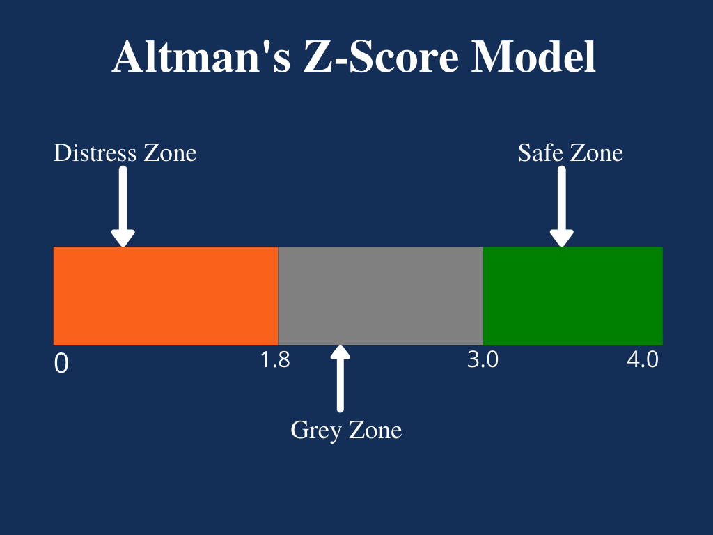

## Table of Contents

## What is the Altman Z-Score and why is it important?

The Altman Z-Score is a financial tool that helps predict if a company might go bankrupt. It was created by Edward Altman in the 1960s. The score uses five different financial ratios from a company's financial statements to calculate a single number. If the number is high, it means the company is probably safe and not likely to go bankrupt soon. If the number is low, it means the company could be in trouble and might go bankrupt.

The Altman Z-Score is important because it gives investors and business owners a way to check the health of a company quickly. By using this score, people can make better decisions about whether to invest in a company or lend it money. It helps them avoid companies that are at risk of failing, which can save them a lot of money and trouble. Even though it's not perfect and should be used with other information, the Altman Z-Score is a useful tool for understanding a company's financial stability.

## Who developed the Altman Z-Score and when was it introduced?

Edward Altman developed the Altman Z-Score. He is a professor at New York University's Stern School of Business. Altman created this tool to help predict if a company might go bankrupt.

The Altman Z-Score was introduced in 1968. Altman published his findings in a paper called "Financial Ratios, Discriminant Analysis and the Prediction of Corporate Bankruptcy". Since then, the Z-Score has become a popular way for investors and analysts to check a company's financial health.

## What are the five financial ratios used in the Altman Z-Score formula?

The Altman Z-Score uses five financial ratios to predict if a company might go bankrupt. The first ratio is the working capital to total assets ratio. This looks at how well a company can pay off its short-term debts with its short-term assets. The second ratio is the retained earnings to total assets ratio, which shows how much money the company has kept over time compared to what it owns. The third ratio is the earnings before interest and taxes (EBIT) to total assets ratio. This tells us how good the company is at making money from the things it owns.

The fourth ratio is the market value of equity to total liabilities ratio. This shows how much the company's stock is worth compared to what it owes. It's a way to see if the company's value is enough to cover its debts. The last ratio is the sales to total assets ratio, which measures how well the company uses its assets to make sales. By combining these five ratios into one score, the Altman Z-Score helps people understand a company's financial health quickly and easily.

## How is the Altman Z-Score calculated?

The Altman Z-Score is calculated by adding up five different financial ratios, each with its own special number in front of it. The first ratio is working capital divided by total assets, and it gets multiplied by 1.2. The second ratio is retained earnings divided by total assets, and it gets multiplied by 1.4. The third ratio is earnings before interest and taxes (EBIT) divided by total assets, and it gets multiplied by 3.3. The fourth ratio is the market value of equity divided by total liabilities, and it gets multiplied by 0.6. The last ratio is sales divided by total assets, and it gets multiplied by 1.0. You add all these numbers together to get the Z-Score.

The formula looks like this: Z-Score = 1.2 * (Working Capital / Total Assets) + 1.4 * (Retained Earnings / Total Assets) + 3.3 * (EBIT / Total Assets) + 0.6 * (Market Value of Equity / Total Liabilities) + 1.0 * (Sales / Total Assets). If the Z-Score is high, like above 3.0, the company is probably safe and not likely to go bankrupt soon. If it's low, like below 1.8, the company might be in trouble and could go bankrupt. Anything in between is kind of a gray area, and you might need to look at other things to decide if the company is doing okay.

## What do the different Z-Score values indicate about a company's financial health?

The Altman Z-Score helps us understand if a company is likely to go bankrupt or not. If the Z-Score is above 3.0, it means the company is in good shape and probably won't go bankrupt anytime soon. This is like a green light for investors and business owners, showing that the company is financially stable and healthy.

On the other hand, if the Z-Score is below 1.8, it's a warning sign. It means the company might be in trouble and could go bankrupt. This is like a red light, telling people to be careful and maybe not invest in or lend money to this company. If the Z-Score is between 1.8 and 3.0, it's a bit unclear. It's a gray area where the company might be okay, but you should look at other things too before deciding if it's safe.

## Can the Altman Z-Score be applied to all types of companies?

The Altman Z-Score works well for many companies, especially big ones that are traded on the stock market. It's most accurate for companies in manufacturing and industrial sectors because that's what it was first made for. If you use it for these kinds of companies, you can get a good idea of whether they might go bankrupt or not.

However, the Altman Z-Score might not work as well for all types of companies. For example, it can be harder to use for companies that don't have a lot of physical stuff or for new companies that haven't been around long. Also, it might not be as good for companies in sectors like banking or insurance, because they have different ways of making money and managing their finances. So, while it's a helpful tool, you should be careful when using it for companies outside of manufacturing and industry.

## How does the Altman Z-Score differ for public and private companies?

The Altman Z-Score was originally made for public companies that are traded on the stock market. For these companies, the formula uses a ratio called the market value of equity to total liabilities. This part of the formula works well for public companies because their stock prices are easy to find. If a public company has a Z-Score above 3.0, it's usually in good financial health. If it's below 1.8, it might be at risk of going bankrupt.

For private companies, things are a bit different. Because private companies don't have stock prices that everyone can see, we can't use the market value of equity in the same way. Instead, we use a different version of the Z-Score called the Altman Z'-Score. This version replaces the market value of equity ratio with a ratio called book value of equity to total liabilities. The Z'-Score is good for private companies, but it might not be as accurate as the original Z-Score for public companies. If a private company has a Z'-Score above 2.6, it's likely doing well financially. If it's below 1.1, it might be in trouble.

## What are the limitations of using the Altman Z-Score for financial analysis?

The Altman Z-Score is a helpful tool, but it has some limits. One big limit is that it works best for big companies in manufacturing and industry. If you use it for other types of companies, like banks or new startups, it might not be as accurate. Also, the Z-Score uses numbers from the past, so it might not catch quick changes in a company's health. If a company's situation changes fast, the Z-Score might not show that right away.

Another limit is that the Z-Score depends on the numbers a company reports. If those numbers are wrong or if the company is hiding problems, the Z-Score won't be right. Also, the Z-Score looks at a company by itself, not compared to others in its industry. So, a company might look healthy with a good Z-Score, but if all its competitors are doing even better, it might still be in trouble. It's good to use the Z-Score with other ways of checking a company's health, not just by itself.

## How has the Altman Z-Score been adapted for different industries?

The Altman Z-Score was first made for big companies in manufacturing and industry. But people found out it didn't work as well for other types of businesses. So, they changed it to fit different industries better. For example, for private companies that don't have stock prices, they made the Altman Z'-Score. This version uses the book value of equity instead of the market value of equity. It helps because private companies don't have public stock prices to use in the original formula.

For non-manufacturing companies like service businesses, they made the Altman Z''-Score. This version changes some of the ratios to fit how these companies make money and manage their finances. For example, it uses different weights for the ratios and might not use some of the original ratios at all. This makes it more useful for companies that don't have a lot of physical stuff or that work in different ways than manufacturing companies. By changing the Z-Score, people can use it to check the financial health of a wider range of companies.

## What are some real-world examples of the Altman Z-Score predicting company failures?

One real-world example of the Altman Z-Score predicting company failure is the case of Enron in the early 2000s. Before Enron went bankrupt, its Z-Score was very low, showing that the company was in big trouble. Even though Enron was hiding a lot of its problems, the Z-Score still showed that it was at risk of going bankrupt. This was a warning sign that people could have used to be careful about investing in or lending money to Enron.

Another example is Lehman Brothers, which went bankrupt in 2008 during the financial crisis. In the years before its collapse, Lehman Brothers' Z-Score was also very low. This showed that the company was not in good financial health and was at risk of failing. Like with Enron, the Z-Score gave a clear warning that Lehman Brothers might go bankrupt, even though many people didn't see it coming until it was too late. These examples show how the Z-Score can help predict company failures, but it's important to use it with other tools and information too.

## How can the Altman Z-Score be used in conjunction with other financial analysis tools?

The Altman Z-Score is a good tool to use with other financial analysis tools because it gives a quick look at a company's health, but it's not perfect by itself. For example, you can use it with ratio analysis, which looks at numbers like debt to equity and return on assets. These ratios give more details about how well a company is doing in different areas. By using the Z-Score with ratio analysis, you get a fuller picture of a company's financial health. You can see if the Z-Score matches what the ratios are saying, or if there are some things the Z-Score might be missing.

Another way to use the Altman Z-Score with other tools is by looking at cash flow analysis. Cash flow analysis shows how much money is coming in and going out of a company. It can help you see if a company is really making money or if it's just showing good numbers on paper. If the Z-Score says a company is at risk, but the cash flow looks good, you might want to look closer to see what's going on. Using the Z-Score with cash flow analysis helps you check if the company's financial health is as good or as bad as the Z-Score says it is.

## What are the latest research developments or modifications to the Altman Z-Score model?

The Altman Z-Score model has been updated over time to work better for different kinds of companies. One big change is the Altman Z'-Score, which was made for private companies that don't have stock prices. Instead of using the market value of equity, it uses the book value of equity. This helps because private companies don't have public stock prices. Another change is the Altman Z''-Score, which is for non-manufacturing companies like service businesses. It changes some of the ratios and weights to fit how these companies make money and manage their finances. These changes make the Z-Score more useful for a wider range of companies.

Recent research has also looked at adding new things to the Z-Score model to make it even better. For example, some researchers have tried using [machine learning](/wiki/machine-learning) to predict company failures more accurately. They use the Z-Score as a starting point and then add other data like stock prices, news articles, and social media posts to see if they can get better results. Other studies have looked at how the Z-Score works in different countries and industries, finding that sometimes the weights of the ratios need to be changed to fit local conditions. These new ideas show that while the Z-Score is still a good tool, it can be improved and used in new ways to help predict company failures even better.

## How is the Altman Z-Score calculated?

The Altman Z-Score, introduced by Edward Altman in 1968, is calculated using a specific formula that combines five financial ratios. These ratios provide a quantitative assessment of a company's financial health, assisting in the evaluation of its bankruptcy risk. The original formula is expressed as:

$$
Z = 1.2X_1 + 1.4X_2 + 3.3X_3 + 0.6X_4 + 1.0X_5
$$

Where:
- $X_1$ = Working Capital / Total Assets
- $X_2$ = Retained Earnings / Total Assets
- $X_3$ = Earnings Before Interest and Taxes (EBIT) / Total Assets
- $X_4$ = Market Value of Equity / Total Liabilities
- $X_5$ = Sales / Total Assets

These components measure different dimensions of financial performance: [liquidity](/wiki/liquidity-risk-premium), profitability, leverage, solvency, and activity efficiency. Utilizing these ratios, the model assigns a Z-Score that indicates the likelihood of bankruptcy. A Z-Score less than 1.8 typically signals a high risk of bankruptcy, while a score above 3 suggests the company is financially stable and poses low bankruptcy risk.

Over time, adaptations to this original model have been developed to suit different types of firms, especially non-manufacturing and private companies. For example, in models like the Z-Score', the Market Value of Equity ($X_4$) is substituted with the Book Value to better accommodate private entities where market valuations are not readily available.

Advancements in financial modeling have enabled further customization of the Altman Z-Score for specific industries, enhancing its applicability. These adaptations ensure that the model remains relevant in assessing financial health across diverse sectors, reflecting ongoing improvements in its predictive capabilities.

## References & Further Reading

[1]: Altman, E. I. (1968). "Financial Ratios, Discriminant Analysis and the Prediction of Corporate Bankruptcy." *The Journal of Finance*, 23(4), 589-609. [JSTOR Link](https://www.calctopia.com/papers/Altman1968.pdf)

[2]: Altman, E. I., & Hotchkiss, E. (2006). ["Corporate Financial Distress and Bankruptcy: Predict and Avoid Bankruptcy, Analyze and Invest in Distressed Debt"](https://onlinelibrary.wiley.com/doi/book/10.1002/9781118267806). 3rd Edition. John Wiley & Sons.

[3]: Jones, S., & Hensher, D. A. (2004). "Predicting Firm Financial Distress: A Mixed Logit Model." *The Accounting Review*, 79(4), 1011-1038. [JSTOR Link](https://www.jstor.org/stable/4093084)

[4]: López de Prado, M. (2018). ["Advances in Financial Machine Learning"](https://www.amazon.com/Advances-Financial-Machine-Learning-Marcos/dp/1119482089). Wiley.

[5]: Chan, E. P. (2009). ["Quantitative Trading: How to Build Your Own Algorithmic Trading Business"](https://github.com/ftvision/quant_trading_echan_book). Wiley Trading.

[6]: Aronson, D. R. (2007). ["Evidence-Based Technical Analysis: Applying the Scientific Method and Statistical Inference to Trading Signals"](https://onlinelibrary.wiley.com/doi/book/10.1002/9781118268315). Wiley.

[7]: Miller, M. H. (2003). "The Modigliani-Miller Theorems After 40 Years." *The Journal of Economic Perspectives*, 17(4), 99-120. [JSTOR Link](https://en.wikipedia.org/wiki/Presidency_of_Ronald_Reagan)