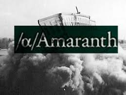

## Table of Contents

## What is Amaranth Advisors?

Amaranth Advisors was a hedge fund that started in 2000. It was based in Greenwich, Connecticut. The fund managed a lot of money for people who wanted to invest. It was known for taking big risks to try to make big profits.

In 2006, Amaranth Advisors lost a huge amount of money. This happened because they made big bets on natural gas prices that did not go their way. The losses were so bad that the fund had to close down. This event showed how risky some investments can be.

## When was Amaranth Advisors founded?

Amaranth Advisors was founded in 2000. It was a hedge fund that started in Greenwich, Connecticut. The fund was set up to help people invest their money. It was known for taking big risks to try to make big profits.

In 2006, Amaranth Advisors faced a big problem. They lost a lot of money because they made big bets on natural gas prices that did not work out. The losses were so big that the fund had to close down. This showed everyone how risky some investments can be.

## Who founded Amaranth Advisors?

Amaranth Advisors was started by Nicholas Maounis. He founded the [hedge fund](/wiki/hedge-fund-trading-strategies) in 2000 in Greenwich, Connecticut. Nicholas wanted to create a place where people could invest their money and possibly make big profits. His idea was to take big risks to try to get big rewards.

In 2006, things went very wrong for Amaranth Advisors. They lost a lot of money because they bet heavily on natural gas prices, and the bets did not pay off. The losses were so huge that the fund had to shut down. This showed everyone how risky some investments can be and how important it is to be careful with money.

## What type of investments did Amaranth Advisors focus on?

Amaranth Advisors mainly focused on investing in energy markets, especially natural gas. They used a strategy called spread trading, where they bet on the price difference between natural gas at different times or places. This was a risky way to try to make money because the prices could change a lot.

The fund also tried other types of investments to spread out their risk. They put money into stocks, bonds, and other commodities. But their big bets on natural gas were what got them into trouble in 2006. The losses from these bets were so big that the fund had to close down.

## What was the peak asset management value of Amaranth Advisors?

Amaranth Advisors had a lot of money to manage at its peak. In 2006, right before it ran into big trouble, the fund was managing about $9.5 billion. That's a huge amount of money, and it shows how much people trusted the fund to help them invest.

But things went wrong very quickly. The fund lost a lot of money because of its big bets on natural gas prices. These losses were so big that Amaranth Advisors had to close down. It's a reminder of how risky some investments can be, even when a fund is managing a lot of money.

## What led to the collapse of Amaranth Advisors?

Amaranth Advisors collapsed because of big bets they made on natural gas prices. In 2006, they thought the price difference between natural gas at different times would stay the same or get bigger. But the prices moved in a way they did not expect. This caused huge losses for the fund. They lost about $6 billion in just a few days in September 2006.

These losses were too big for the fund to handle. Amaranth Advisors had to close down because they could not recover from such a big hit. The collapse showed everyone how risky it can be to bet a lot of money on one thing. It also made people think more carefully about where they put their money and how much risk they are willing to take.

## How did Amaranth Advisors' strategies contribute to its downfall?

Amaranth Advisors made big bets on natural gas prices, which was a risky move. They thought the price difference between natural gas at different times would stay the same or get bigger. But the prices did not go the way they expected. This caused them to lose about $6 billion in just a few days in September 2006. Their strategy of betting heavily on one thing, called spread trading, was too risky. When the bets did not pay off, the losses were too big for the fund to handle.

Because of these huge losses, Amaranth Advisors had to close down. They could not recover from losing so much money so quickly. The fund's strategy of putting a lot of money into one type of investment showed how dangerous it can be to take big risks. It also made people think more carefully about where they put their money and how much risk they are willing to take. The collapse of Amaranth Advisors is a reminder of the importance of being careful with investments.

## What were the key events leading up to Amaranth Advisors' bankruptcy?

Amaranth Advisors made big bets on natural gas prices. They thought the price difference between natural gas at different times would stay the same or get bigger. But in September 2006, the prices moved in a way they did not expect. This caused them to lose a lot of money very quickly. They lost about $6 billion in just a few days. This was a huge problem for the fund because they had bet so much money on one thing.

Because of these big losses, Amaranth Advisors could not keep going. They had to close down because they could not recover from losing so much money so fast. The fund's strategy of betting heavily on natural gas prices was too risky. When the bets did not pay off, it led to their bankruptcy. This showed everyone how important it is to be careful with investments and not to bet too much on one thing.

## What was the impact of Amaranth Advisors' failure on the financial markets?

When Amaranth Advisors failed, it made a lot of people in the financial world worried. The fund lost about $6 billion very quickly, which was a huge amount of money. This big loss made other investors and funds think more carefully about their own investments. They started to be more careful about how much risk they were taking. The failure of Amaranth Advisors showed everyone that even big funds can lose a lot of money if they make risky bets.

The failure also made people talk more about how hedge funds work. It showed that hedge funds can affect the whole market when they lose a lot of money. After Amaranth Advisors went bankrupt, there were more rules and checks put in place to try to stop something like this from happening again. People learned that it's important to watch what hedge funds are doing and to make sure they are not taking too many risks.

## What lessons can be learned from the collapse of Amaranth Advisors?

The collapse of Amaranth Advisors teaches us that it's really important to be careful with money. The fund took big risks by betting a lot on natural gas prices. When those bets did not work out, they lost a huge amount of money very quickly. This shows that putting all your money into one thing can be very dangerous. It's better to spread out your investments so that if one thing goes wrong, you don't lose everything.

Another lesson is that even big funds can fail if they are not careful. Amaranth Advisors was managing a lot of money, but they still made a big mistake. This made other people in the financial world more careful about their own investments. It also led to more rules to make sure hedge funds are not taking too many risks. People learned that it's important to keep an eye on what funds are doing and to make sure they are being smart with their money.

## How did regulatory bodies respond to the Amaranth Advisors incident?

After Amaranth Advisors failed, regulatory bodies paid more attention to hedge funds. They saw that big losses in one fund could affect the whole market. So, they started to make new rules to make sure hedge funds were not taking too many risks. They wanted to protect investors and keep the market safe. The regulators worked to make sure that hedge funds were more open about what they were doing and that they were following the rules.

These new rules helped to make the financial world safer. They made sure that hedge funds had to report more about their investments. This way, if a fund was making risky bets, regulators could see it and step in if needed. The response to Amaranth Advisors' collapse showed everyone that it's important to keep an eye on what hedge funds are doing and to make sure they are being careful with people's money.

## What has been the long-term impact on the hedge fund industry following the Amaranth Advisors collapse?

The collapse of Amaranth Advisors made a big change in the hedge fund industry. It showed everyone that even big funds can lose a lot of money if they take too many risks. After this happened, people started to be more careful about where they put their money. They wanted to know more about what hedge funds were doing and how they were managing their investments. This led to more rules and checks to make sure hedge funds were not taking too many risks. The industry became more focused on being open and honest about what they were doing with people's money.

In the long run, the hedge fund industry learned to be more careful. They started to spread out their investments more, so they were not betting all their money on one thing. This made the industry safer and more stable. The collapse of Amaranth Advisors was a big lesson for everyone. It showed that it's important to watch what hedge funds are doing and to make sure they are being smart with their money. This helped to build more trust in the hedge fund industry over time.

## References & Further Reading

[1]: Lowenstein, R. (2008). ["When Genius Failed: The Rise and Fall of Long-Term Capital Management"](https://www.amazon.com/When-Genius-Failed-Long-Term-Management-ebook/dp/B000FC1KZC) by Roger Lowenstein

[2]: Till, H., & Eagleeye, J. (2006). ["The Amaranth Debacle: A Failure of Risk Measures or the Self-destruction of an Energy Hedge Fund?"](https://eagleeyebooks.com/book/9780061711299) Journal of Alternative Investments, 9(3), 76-83.

[3]: Bookstaber, R. (2007). ["A Demon of Our Own Design: Markets, Hedge Funds, and the Perils of Financial Innovation"](https://rpc.cfainstitute.org/en/research/financial-analysts-journal/2007/a-demon-of-our-own-design-markets) by Richard Bookstaber

[4]: Kolman, J. (2010). ["The History of Amaranth Advisors Collapse"](https://climateimpact.edhec.edu/publications/amaranth-collapse-what-happened-and-what), Quantum Social Science.

[5]: Ritholtz, B. (2006). ["The Lessons of Amaranth Advisors"](https://ludwigbc.com/pubs/pub9.pdf) The Big Picture Blog.