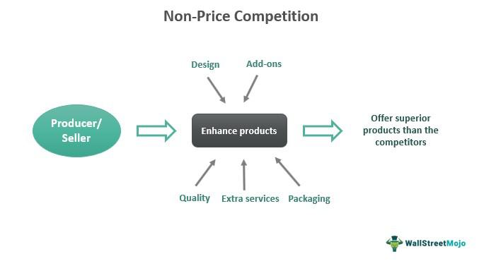

## Table of Contents

## What are the main business areas where Amazon and Google compete?

Amazon and Google mainly compete in the areas of online shopping and cloud computing. In online shopping, Amazon is a big name with its huge online store where people can buy almost anything. Google also wants a piece of this market with its shopping services, helping people find products and compare prices. Both companies try to make shopping easier and more convenient for customers, using technology to improve their shopping experiences.

Another big area where they compete is cloud computing. Amazon has Amazon Web Services (AWS), which is a leader in providing cloud services to businesses. These services help companies store data and run applications online. Google has Google Cloud, which offers similar services. Both companies are trying to get more businesses to use their cloud platforms by offering different tools and technologies.

These two areas are where Amazon and Google often go head-to-head. They both use their technology and resources to try to be the best in online shopping and cloud computing. This competition helps drive innovation and gives customers more choices.

## How does Amazon's e-commerce platform strategy differ from Google's search engine strategy?

Amazon's e-commerce platform strategy focuses on creating a seamless shopping experience for customers. They do this by offering a wide range of products, from [books](/wiki/algo-trading-books) to electronics, and making it easy for people to find and buy what they need. Amazon also uses customer data to personalize the shopping experience, recommending products based on past purchases and searches. They have built a strong logistics network to ensure quick delivery, with services like Amazon Prime offering fast and free shipping. Amazon's goal is to be the first place people think of when they want to buy something online.

Google's search engine strategy, on the other hand, is centered around providing the most relevant and useful information to users. When someone searches for something on Google, the company aims to deliver the best possible results, whether it's a website, an image, or an answer to a question. Google makes money mainly through advertising, with businesses paying to appear in search results. While Google does offer shopping services, its primary focus is on being the best search engine, helping users find information quickly and accurately. Google's strategy is about being the go-to place for information, not just for shopping.

## What role does Amazon's Prime membership play in its competition against Google?

Amazon's Prime membership is a big part of how it competes with Google. Prime makes Amazon stand out by giving members special benefits like free and fast shipping, streaming movies and TV shows, and even discounts on some products. These perks make people want to shop more on Amazon instead of looking elsewhere, including on Google's shopping services. When people think of buying something, they remember the convenience and savings they get with Prime, which can make them choose Amazon over searching on Google.

Prime also helps Amazon keep customers coming back. Once someone signs up for Prime, they are more likely to stay with Amazon because they want to get their money's worth from the membership. This loyalty is important in the competition with Google, where people might just search for products and end up buying from different websites. Amazon's focus on making shopping easy and rewarding with Prime helps it stay ahead in the battle for online shoppers' attention and dollars.

## How does Amazon leverage its AWS (Amazon Web Services) to compete with Google Cloud?

Amazon uses its AWS to compete with Google Cloud by offering a wide range of services that help businesses run their operations online. AWS has been around longer and has more customers than Google Cloud, which gives Amazon an advantage. They keep adding new features and tools to make sure businesses can do more with AWS, like storing data, running applications, and using [artificial intelligence](/wiki/ai-artificial-intelligence). Amazon also focuses on making AWS reliable and easy to use, so companies feel safe and confident when they choose AWS over Google Cloud.

Another way Amazon competes is by offering different pricing options with AWS. They have plans that fit different budgets and needs, which can attract more customers. Amazon also helps businesses move their data and applications to AWS, making the switch from other services, like Google Cloud, easier. By providing strong customer support and resources, Amazon makes sure that companies using AWS get the help they need, which can make them stick with AWS instead of switching to Google Cloud.

## What are Amazon's strategies for digital advertising and how do they compare to Google's?

Amazon's strategies for digital advertising focus on using the data it collects from its huge number of customers. When people shop on Amazon, the company learns about what they like and buy. Amazon uses this information to show ads that are more likely to interest each person. They have ads that show up on their website and also on other websites and apps. Amazon's ads are often about products people can buy right away, making it easy for them to go from seeing an ad to making a purchase.

Google's approach to digital advertising is different because it's based on search and information. Google shows ads to people when they search for something, and these ads can be about anything, not just products for sale. Google uses what it knows about people's searches to show them relevant ads. They also have ads on their other services like YouTube and Gmail. Google makes a lot of money from these ads, and they are good at making sure the ads match what people are looking for.

In comparison, Amazon's ads are very focused on selling things directly, while Google's ads are more about connecting people with information or services. Amazon's ads work well because they are closely tied to shopping, and they use a lot of shopping data. Google's ads are powerful because they reach a huge audience and can be about anything someone might be interested in. Both companies use data to make their ads better, but they do it in different ways to fit their main businesses.

## How does Amazon use data and AI to enhance its competitive edge against Google?

Amazon uses data and AI to make shopping better for its customers, which helps it compete with Google. When people shop on Amazon, the company collects a lot of information about what they buy, what they look at, and what they like. Amazon then uses this data with AI to suggest products that customers might want to buy. For example, if someone often buys books about cooking, Amazon might show them new cookbooks or kitchen gadgets. This makes shopping easier and more personal, which can make people choose Amazon over searching on Google.

Amazon also uses AI to improve its delivery system. AI helps Amazon figure out the best ways to get products to customers quickly. This is important because fast delivery is a big reason why people use Amazon, especially if they have a Prime membership. By using AI to make sure packages arrive faster, Amazon keeps customers happy and coming back. This focus on using data and AI to make shopping and delivery better helps Amazon stay ahead of Google in the race to be the best place for online shopping.

## What are some examples of direct product or service competition between Amazon and Google?

Amazon and Google both offer smart home devices that compete with each other. Amazon has the Echo, which is powered by its AI assistant Alexa. Google has the Google Home, which uses Google Assistant. Both devices let people use voice commands to do things like play music, set alarms, or control smart lights in their homes. People can choose between these devices based on which AI they prefer and how well the device works with other smart home products.

Another area where Amazon and Google compete directly is in streaming services. Amazon has Prime Video, which comes with a Prime membership and offers movies, TV shows, and Amazon's own content. Google has YouTube, which is free with ads, and YouTube Premium, which offers ad-free watching and original shows. Both companies want to be where people go to watch videos and movies online. They try to attract viewers with different shows and by making their services easy to use on different devices.

In the world of smart speakers and streaming, Amazon and Google are always trying to outdo each other. They keep adding new features and content to make their products better. This competition is good for customers because it means they have more choices and better services to pick from.

## How does Amazon's approach to smart home devices like Alexa compare to Google's Nest and Google Home?

Amazon's approach to smart home devices, mainly through its Echo and Alexa, focuses on making things easy and helpful for users. Alexa is good at understanding what people say and can do a lot of things, like playing music, answering questions, and controlling smart home gadgets. Amazon keeps adding new features and skills to Alexa, so it can do more and more. They also make sure Alexa works well with a lot of different smart home products, which makes it easier for people to set up their homes the way they want.

Google's approach with Nest and Google Home is a bit different. Google Home, powered by Google Assistant, is really good at understanding and answering questions because it uses Google's big search engine. It's great for finding information quickly. Nest, on the other hand, is more about making homes safer and more comfortable with things like smart thermostats and security cameras. Google tries to make its devices work well together and with other smart home products, but they focus a lot on using their strong search and information skills to help people.

## In what ways does Amazon's acquisition strategy help it compete with Google?

Amazon uses its acquisition strategy to get better at competing with Google by buying companies that help it grow in new areas. For example, when Amazon bought Whole Foods, it started selling more groceries online. This made Amazon a bigger player in food shopping, which is something Google also wants to do with its own shopping services. By buying companies like this, Amazon can offer more things to its customers and make its services even better, which helps it stay ahead of Google.

Another way Amazon's acquisitions help it compete is by getting new technology and talent. When Amazon bought Ring, a company that makes smart doorbells, it added more smart home products to its lineup. This made Amazon's Echo and Alexa even more useful for people who want to make their homes smarter. Google also has smart home products like Nest, so by buying Ring, Amazon made sure it could keep up with Google in the smart home market. These acquisitions help Amazon keep improving and stay competitive against big companies like Google.

## How do Amazon and Google differ in their approach to global market expansion?

Amazon and Google take different paths when they want to grow in other countries. Amazon focuses a lot on selling things online. They start by setting up websites in new countries and making sure they can deliver products quickly. They also buy local businesses to help them understand the new market better. For example, Amazon bought Souq.com to get into the Middle East market. They want to make sure people in different countries can buy things easily and get them fast, just like in the U.S.

Google, on the other hand, focuses more on making sure people can use their search engine and other services like YouTube around the world. They try to make their services work well in different languages and for different cultures. Google also works on building data centers in many countries to make their services faster for local users. They want to be the go-to place for information and entertainment no matter where you are. This approach helps Google reach more people globally, but it's different from Amazon's focus on selling products.

## What are the key regulatory challenges Amazon faces in its competition with Google?

Amazon faces some big regulatory challenges when it competes with Google. One big issue is about how Amazon uses data. Since Amazon collects a lot of information about what people buy and look at, some governments worry that Amazon might be using this data unfairly to beat other companies. They want to make rules to make sure Amazon plays fair and doesn't use its data in ways that hurt other businesses. This is important because it can affect how Amazon can use its data to make ads or suggest products to people.

Another challenge is about how Amazon runs its marketplace. Some people think Amazon gives its own products an unfair advantage over products sold by other sellers on its website. Governments are looking at this closely and might make new rules to make sure everyone has a fair chance to sell things on Amazon. This could change how Amazon does business and might make it harder for them to compete with Google, especially in areas like online shopping and advertising.

## How might future technological trends influence the competitive dynamics between Amazon and Google?

Future technological trends like artificial intelligence (AI) and the Internet of Things (IoT) could change how Amazon and Google compete. AI is getting better at understanding what people want and helping them. Amazon uses AI in its Alexa to make shopping and home life easier. Google uses AI in its search engine and Google Assistant to give people the information they need quickly. As AI keeps improving, both companies will try to use it to make their services even better. This could mean Amazon's shopping suggestions get even more personal, while Google's search results become even more accurate. The company that uses AI the best might get more customers and do better in the competition.

Another big trend is the Internet of Things, where more and more devices connect to the internet. This could make smart homes even smarter. Amazon's Alexa and Google's Nest both want to be the center of these smart homes. As more devices get connected, Amazon and Google will compete to make sure their products work well with all these new gadgets. They will also try to offer new services that use all this connected data to help people in new ways. The company that can connect the most devices and offer the most useful services might win more customers and have an edge in the competition.

## References & Further Reading

[1]: Bergstra, J., Bardenet, R., Bengio, Y., & Kégl, B. (2011). ["Algorithms for Hyper-Parameter Optimization."](https://dl.acm.org/doi/10.5555/2986459.2986743) Advances in Neural Information Processing Systems 24.

[2]: ["Advances in Financial Machine Learning"](https://www.amazon.com/Advances-Financial-Machine-Learning-Marcos/dp/1119482089) by Marcos Lopez de Prado

[3]: ["Evidence-Based Technical Analysis: Applying the Scientific Method and Statistical Inference to Trading Signals"](https://www.amazon.com/Evidence-Based-Technical-Analysis-Scientific-Statistical/dp/0470008741) by David Aronson

[4]: ["Machine Learning for Algorithmic Trading"](https://github.com/stefan-jansen/machine-learning-for-trading) by Stefan Jansen

[5]: ["Quantitative Trading: How to Build Your Own Algorithmic Trading Business"](https://www.amazon.com/Quantitative-Trading-Build-Algorithmic-Business/dp/1119800064) by Ernest P. Chan