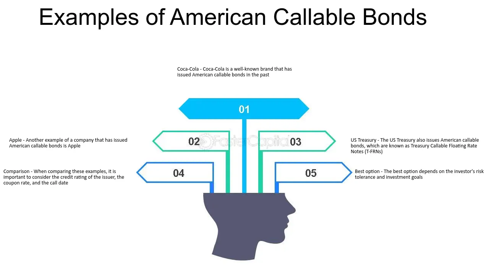

## Table of Contents

## What is an American callable bond?

An American callable bond is a type of bond that can be redeemed by the issuer before it reaches its maturity date. This means the company that issued the bond can choose to pay back the money they borrowed from investors earlier than planned. This feature is useful for the issuer if interest rates drop, because they can then borrow money at a lower rate.

For investors, American callable bonds can be a bit tricky. If the bond is called back early, they might not get as much interest as they expected. However, these bonds often offer higher interest rates to start with, as a way to compensate investors for this risk. So, while they can be called back at any time, the higher initial interest can make them attractive to some investors.

## How does an American callable bond differ from a regular bond?

An American callable bond is different from a regular bond because it can be paid back early by the company that issued it. A regular bond has a set time, called the maturity date, when the company has to pay back the money they borrowed from investors. But with an American callable bond, the company can choose to pay it back anytime before that date. This is helpful for the company if interest rates go down, because they can borrow new money at a cheaper rate.

For people who invest in these bonds, this means they might not get all the interest they were hoping for if the bond gets called back early. To make up for this risk, American callable bonds usually start with higher interest rates than regular bonds. So, while they can be called back at any time, the chance to earn more interest at the beginning can make them a good choice for some investors.

## What are the key features of American callable bonds?

American callable bonds are special because they can be paid back early by the company that issued them. This means that if interest rates go down, the company can choose to pay off the bond and borrow new money at a lower rate. This feature is helpful for the company but can be tricky for investors. If the bond gets called back early, investors might not get all the interest they were expecting.

To make up for this risk, American callable bonds usually offer higher interest rates from the start. This higher rate is meant to attract investors even though there's a chance the bond could be called back early. So, while these bonds can be a bit unpredictable, the chance to earn more interest at the beginning can make them a good choice for some investors.

## Who typically issues American callable bonds?

American callable bonds are usually issued by big companies or the government. These groups use the bonds to borrow money from people who want to invest. Companies might issue these bonds when they need money for things like building new factories or buying equipment. The government might issue them to pay for things like roads or schools.

These bonds are popular with issuers because they give them the option to pay back the money early if it makes financial sense. For example, if interest rates drop, the company or government can call back the bonds and borrow new money at a lower rate. This flexibility is why American callable bonds are often used by issuers who want to manage their borrowing costs carefully.

## What are the benefits of investing in American callable bonds?

Investing in American callable bonds can be good because they usually offer higher interest rates than regular bonds. This means you can earn more money from the interest payments while you own the bond. The higher [interest rate](/wiki/interest-rate-trading-strategies) is there to make up for the risk that the bond might be called back early by the company that issued it.

Even though there's a chance the bond could be called back before it matures, some investors like this risk. If the bond isn't called back, you get to enjoy those higher interest payments for a longer time. Plus, if you think interest rates might stay the same or go up, the bond is less likely to be called, and you can keep [earning](/wiki/earning-announcement) that higher interest.

## What are the risks associated with American callable bonds?

One of the main risks of investing in American callable bonds is that they can be called back early by the issuer. This means you might not get to keep the bond until it matures and could miss out on some of the interest payments you were expecting. If interest rates go down, the company or government that issued the bond might decide to pay it off early and borrow new money at a lower rate, which could leave you with less money than you planned.

Another risk is that if the bond is called back, you might have to find a new place to invest your money. This can be tricky because the new investment might not offer the same high interest rate that the callable bond did. It can be hard to find another investment that gives you the same return, especially if interest rates have gone down since you bought the callable bond.

## How does the call feature work in American callable bonds?

The call feature in American callable bonds lets the company or government that issued the bond pay it back before it reaches its maturity date. This means they can choose to give you your money back early if it makes financial sense for them. They might do this if interest rates drop because then they can borrow new money at a lower rate.

For you as an investor, this feature means there's a risk that you won't get to keep the bond until the end and might miss out on some of the interest you were expecting. The bond can be called back at any time after a certain date, which is set when the bond is issued. If it gets called back, you'll get your money back, but you'll need to find a new place to invest it, which might not offer the same high interest rate.

## What factors influence the issuer's decision to call a bond?

The main thing that makes an issuer decide to call a bond is if interest rates go down. If the rates drop, the company or government can borrow new money at a lower rate than what they're paying on the bond. This saves them money, so it makes sense for them to call the bond and pay it off early. They can then use the money they save to do other things or just keep it.

Another thing that can influence the decision is the company's financial situation. If the company is doing well and has extra money, they might choose to call the bond to get rid of the debt. This can make the company look better to investors and might even help them get loans at better rates in the future. So, the decision to call a bond often depends on both what's happening with interest rates and how the company is doing financially.

## How can investors assess the likelihood of a bond being called?

Investors can figure out how likely it is that a bond will be called by looking at interest rates. If interest rates are going down, there's a bigger chance the bond will be called. This is because the company or government that issued the bond can borrow new money at a lower rate, which saves them money. So, keeping an eye on what's happening with interest rates is a good way to guess if a bond might be called.

Another thing to look at is the company's financial health. If the company is doing well and has extra cash, they might decide to call the bond to pay off their debt early. This can make the company look better to other investors and might help them get better loan deals later. By checking the company's financial reports and news, investors can get a sense of whether the company is in a good position to call the bond.

## What are some strategies for managing the risks of American callable bonds?

One way to manage the risks of American callable bonds is to pay close attention to interest rates. If you think interest rates are going to stay the same or go up, the bond is less likely to be called. This means you can keep earning the higher interest rate for a longer time. Another thing to do is to look at the company's financial health. If the company is doing well and has a lot of cash, they might call the bond early. So, reading financial reports and news about the company can help you guess if they might call the bond.

Another strategy is to spread out your investments. Instead of putting all your money into one callable bond, you can invest in different types of bonds and other investments. This way, if one bond gets called back early, you still have other investments that can keep earning money. It's also a good idea to have a plan for what to do if a bond does get called. Think about where you might want to invest your money next, so you're not caught off guard and can find a new investment quickly.

## Can you provide examples of American callable bonds that have been called?

One example of an American callable bond that was called is when a big company called General Electric (GE) decided to call back some of its bonds early. GE had issued these bonds with a higher interest rate, but when interest rates went down, they chose to pay off the bonds and borrow new money at a lower rate. This saved them money, but the investors who held those bonds didn't get to keep earning the high interest they were expecting.

Another example is when the city of Chicago called back some of its municipal bonds. The city had issued these bonds to help pay for public projects, like building schools and fixing roads. When interest rates dropped, the city decided it was a good time to call the bonds and borrow new money at a cheaper rate. This move helped the city manage its finances better, but it meant that the investors who owned those bonds had to find new places to invest their money.

## How do American callable bonds fit into a diversified investment portfolio?

American callable bonds can be a good part of a diversified investment portfolio because they offer higher interest rates than regular bonds. This means you can earn more money from the interest payments while you own the bond. Even though there's a risk that the bond could be called back early, the higher interest rate can make it worth it for some investors. By including callable bonds in your portfolio, you can balance out other investments that might have lower returns but also lower risks.

Diversifying your investments means spreading your money across different types of investments, like stocks, regular bonds, and callable bonds. This way, if one type of investment doesn't do well, you still have others that can help you earn money. American callable bonds add a bit of risk to your portfolio because they can be called back early, but they also add the chance to earn more interest. So, they can be a useful part of a well-rounded investment strategy, helping you balance risk and reward.

## How can bond risks be mitigated with diversification?

Diversification is a vital strategy for managing risks associated with bond investments, particularly when dealing with American callable bonds. The strategy involves spreading investments across a variety of sectors and maturity ranges. By doing so, investors can minimize the potential impact of early callings, which can disrupt expected income streams and affect overall portfolio stability.

When constructing a diversified portfolio, it's beneficial to include callable bonds alongside other bond types. This inclusion can help stabilize returns, as the variety in bond characteristics—such as different interest rate environments and call protection features—can help mitigate the risk of adverse outcomes from any single economic event.

One effective approach is to balance a portfolio with both callable and non-callable bonds. Callable bonds, though offering higher yields, come with the risk of being redeemed by the issuer prior to maturity, particularly when interest rates decline. Non-callable bonds, conversely, do not [carry](/wiki/carry-trading) this risk, thus providing a steady income stream regardless of interest rate changes. This mix can act as a hedge against market [volatility](/wiki/volatility-trading-strategies), creating a buffer against fluctuations that could trigger callable features.

In mathematical terms, diversification can be expressed through the reduction of portfolio variance, assuming the correlations between various bond instruments are less than perfect. For instance, the portfolio variance of $n$ different assets can be calculated as:

$$
\sigma_p^2 = \sum_{i=1}^{n} \sum_{j=1}^{n} w_i w_j \sigma_i \sigma_j \rho_{ij}
$$

where $w_i$ and $w_j$ are the weights of assets $i$ and $j$ in the portfolio, $\sigma_i$ and $\sigma_j$ are the standard deviations of returns for assets $i$ and $j$, and $\rho_{ij}$ is the correlation coefficient between the returns on assets $i$ and $j$. A strategic choice of weights and asset types can significantly lessen the portfolio's overall risk.

Moreover, diversification across different sectors ensures that the portfolio is not overly exposed to industry-specific risks. Economic downturns can impact sectors indiscriminately, and spreading investments can reduce the impact of such unforeseen conditions. Maturity range diversification also plays a critical role; by mixing short, medium, and long-term bonds, investors can better manage cash flow and [liquidity](/wiki/liquidity-risk-premium) needs while responding to shifts in interest rates.

In summary, by intelligently diversifying their bond investments, incorporating a mix of callable and non-callable bonds, and considering sector and maturity range differences, investors can optimize their portfolio's performance, balancing risk and return in a dynamic financial environment.

## References & Further Reading

[1]: Fabozzi, F. J. (2012). ["Bond Markets, Analysis, and Strategies"](https://books.google.com/books/about/Bond_Markets_Analysis_and_Strategies_ten.html?id=bQpNEAAAQBAJ) (8th Edition). Pearson.

[2]: Sundaresan, S. (2009). ["Fixed Income Markets and Their Derivatives."](https://shop.elsevier.com/books/fixed-income-markets-and-their-derivatives/sundaresan/978-0-12-370471-9) Academic Press.

[3]: ["Advanced Fixed Income Analysis"](https://www.sciencedirect.com/book/9780080999388/advanced-fixed-income-analysis) by Moorad Choudhry

[4]: ["Algorithmic Trading and DMA: An introduction to direct access trading strategies"](https://www.amazon.com/Algorithmic-Trading-DMA-introduction-strategies/dp/0956399207) by Barry Johnson

[5]: ["Options, Futures, and Other Derivatives"](https://www.amazon.com/Options-Futures-Other-Derivatives-9th/dp/0133456315) by John C. Hull