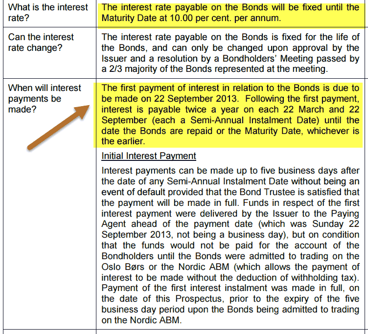

In the world of finance, bonds are attractive to investors looking for stable returns. Among these, American callable bonds present unique opportunities and risks. Callable bonds, in general, are a type of bond that allow the issuer to repay the bond before its maturity date at predetermined call prices. This feature provides issuers with flexibility to manage their debt more efficiently, particularly when interest rates decline, thus enabling them to refinance at lower rates.

American callable bonds are distinguished from other callable bonds by the fact that the issuer can redeem them at any time before the maturity date, as opposed to a specific call date. These bonds typically offer higher yields to investors to compensate for the risk of early redemption, which can disrupt expected cash flows and potential returns. Understanding how American callable bonds work is crucial for investors aiming to enhance their portfolio diversification and improve risk management strategies.



The rapid advancements in technology, particularly in trading algorithms, offer innovative ways to invest in financial products like bonds. Algorithmic trading utilizes complex mathematical models and statistical analyses to identify trading opportunities in the financial markets. By leveraging these technologies, investors can better navigate the complexities of callable bonds, such as predicting interest rate movements or assessing the likelihood of an issuer calling bonds. This capacity for data-driven decision-making proves invaluable in the dynamic landscape of bond investments.

Investors and traders must be well-informed about the intricate details of American callable bonds to make informed decisions. Grasping the nuances of call provisions, along with the impact of market conditions and credit assessments, is essential for constructing a strategic investment approach. Such an understanding not only enhances portfolio diversification but also improves risk management, ultimately leading to a more balanced and stable investment portfolio.

## Table of Contents

## Understanding American Callable Bonds

American callable bonds are a type of debt security that grants the issuer the right to redeem the bonds before their scheduled maturity date. This flexibility is advantageous for issuers looking to refinance debt, especially when interest rates decline, allowing them to replace existing bonds with new ones at lower rates. This feature distinguishes callable bonds from non-callable bonds, where the issuer must make payments until maturity without the option of redemption.

Callable bonds generally offer higher yields than their non-callable counterparts. This is because investors demand compensation for the uncertainty introduced by the call option, which can alter the bond's expected cash flow. The call premium is typically incorporated into the bond yield, making these instruments attractive to investors who can tolerate the associated risks.

Investors in callable bonds need to consider the implications of the embedded call option. The issuer's ability to execute the call during favorable market conditions can impact the bond's total return. Specifically, if the bond is called when interest rates have fallen, investors face reinvestment risk. This risk arises when investors must reinvest returned principal in an environment where prevailing yields are lower than the bond's original yield. The financial loss or diminished return is not preferred by investors seeking fixed income stability.

Key structural elements of American callable bonds include call protection periods. This feature protects investors from early redemption during a specified timeframe after the bond's issuance. For example, a bond may include a ten-year non-callable period, after which it becomes callable. The presence of such protection creates a predictable stream of income for a limited time, reducing reinvestment risk during the protection period.

Despite these built-in features, reinvestment risk remains a significant concern. Investors must assess whether the trade-off between higher yields and the potential for early redemption aligns with their investment goals. The decision to invest in American callable bonds requires careful evaluation of market conditions, [interest rate](/wiki/interest-rate-trading-strategies) forecasts, and the issuer's creditworthiness, ensuring that the embedded call option aligns with the investor's broader portfolio strategy.

## Risks Associated with American Callable Bonds

American callable bonds, while offering potentially higher yields, also come with a set of risks that investors must carefully manage. One of the primary concerns is reinvestment risk. This occurs when bonds are called during periods of declining interest rates, forcing investors to reinvest the returned principal at lower yields. Since issuers tend to redeem callable bonds when interest rates drop, investors might face difficulty in finding new investments offering comparable returns.

Uncertainty risk is another significant [factor](/wiki/factor-investing) where investors are unsure when or if the issuer will call the bonds. This unpredictability can complicate financial planning and strategic decision-making. For instance, if a bond is unexpectedly called, the investor may need to alter their investment strategy sooner than anticipated, impacting overall portfolio stability.

Credit quality risk involves assessing the issuer's financial stability. If an issuer's credit quality deteriorates, the likelihood of the bond being called increases, influencing the expected returns. Investors should scrutinize the issuer’s credit ratings and financial health to better gauge this risk. Bonds from issuers with high credit quality might offer more stability but tend to have lower yields due to reduced risk.

Interest rates fluctuations also present significant risks. They can have a dual effect by altering bond prices and the probability of a call. An increase in interest rates generally leads to a decline in bond prices and might reduce the likelihood of a call, potentially benefiting the investor by maintaining higher coupon payments. Conversely, a decrease in interest rates can result in bond calls, compelling investors to reinvest at uninspiring lower rates.

Managing these risks demands a thorough analysis of market conditions and strategic portfolio adjustments. By incorporating considerations of reinvestment, uncertainty, credit quality, and interest rate fluctuations, investors can make more informed decisions regarding American callable bonds.

## Leveraging Algorithmic Trading in Callable Bonds

Algorithmic trading leverages sophisticated data analysis methods to capitalize on insights in bond markets, particularly in managing the nuanced dynamics of American callable bonds. By employing algorithms, investors can efficiently anticipate and react to shifts in market conditions, most notably changes in interest rates that could prompt issuers to call bonds before maturity.

Algorithms designed for trading are adept at parsing large volumes of financial data swiftly, identifying patterns and trends that are not readily apparent through manual analysis. This capability allows for the timely prediction of market movements, enabling investors to strategically alter their bond portfolios in anticipation of, or reaction to, potential early bond redemptions. For instance, when interest rates decrease, issuers might choose to refinance debt, leading to bond calls. Algorithms can model these scenarios using historical data and probability [statistics](/wiki/bayesian-statistics) to forecast the likelihood of calls.

Investors can employ algorithmic strategies to adjust their bond holdings dynamically. This involves optimizing the timing of transactions to maximize returns while simultaneously mitigating various risks associated with callable bonds, such as reinvestment risk. By rebalancing bond portfolios automatically, algorithms can help maintain desired risk levels and yield objectives in changing market conditions.

Furthermore, the automation afforded by [algorithmic trading](/wiki/algorithmic-trading) systems streamlines the process of tracking bond-related news and market developments. This continuous monitoring provides investors with an edge, as automated systems can swiftly execute trades based on pre-defined criteria triggered by new information. These trading systems typically incorporate [machine learning](/wiki/machine-learning) techniques to improve decision-making processes as they evolve with new data inputs.

For illustration, a simplified Python script might employ machine learning libraries to assess bond market conditions and decide on buy or sell actions. This could involve training a model on historical interest rates and bond call data to predict future events:

```python
import numpy as np
from sklearn.ensemble import RandomForestClassifier

# Sample dataset: X is past interest rates; y is whether a bond was called
X = np.array([[3.5], [3.0], [2.5], [2.0], [1.8]])
y = np.array([0, 0, 1, 1, 1])

# Train the model
model = RandomForestClassifier()
model.fit(X, y)

# Predict bond call based on current interest rate
current_interest_rate = np.array([[2.1]])
prediction = model.predict(current_interest_rate)
print("Bond call prediction:", "Call" if prediction == 1 else "Not Called")
```

This script outlines a basic approach for risk assessment in bond trading, demonstrating the practical application of machine learning in predicting callable bond events based on fluctuating interest rates. Overall, integrating algorithmic trading techniques in bond markets aids in mastering the complexities associated with American callable bonds, allowing investors to enact informed and timely decisions to enhance portfolio performance.

## Mitigating Bond Risks with Diversification

Diversification is a vital strategy for managing risks associated with bond investments, particularly when dealing with American callable bonds. The strategy involves spreading investments across a variety of sectors and maturity ranges. By doing so, investors can minimize the potential impact of early callings, which can disrupt expected income streams and affect overall portfolio stability.

When constructing a diversified portfolio, it's beneficial to include callable bonds alongside other bond types. This inclusion can help stabilize returns, as the variety in bond characteristics—such as different interest rate environments and call protection features—can help mitigate the risk of adverse outcomes from any single economic event.

One effective approach is to balance a portfolio with both callable and non-callable bonds. Callable bonds, though offering higher yields, come with the risk of being redeemed by the issuer prior to maturity, particularly when interest rates decline. Non-callable bonds, conversely, do not [carry](/wiki/carry-trading) this risk, thus providing a steady income stream regardless of interest rate changes. This mix can act as a hedge against market [volatility](/wiki/volatility-trading-strategies), creating a buffer against fluctuations that could trigger callable features.

In mathematical terms, diversification can be expressed through the reduction of portfolio variance, assuming the correlations between various bond instruments are less than perfect. For instance, the portfolio variance of $n$ different assets can be calculated as:

$$
\sigma_p^2 = \sum_{i=1}^{n} \sum_{j=1}^{n} w_i w_j \sigma_i \sigma_j \rho_{ij}
$$

where $w_i$ and $w_j$ are the weights of assets $i$ and $j$ in the portfolio, $\sigma_i$ and $\sigma_j$ are the standard deviations of returns for assets $i$ and $j$, and $\rho_{ij}$ is the correlation coefficient between the returns on assets $i$ and $j$. A strategic choice of weights and asset types can significantly lessen the portfolio's overall risk.

Moreover, diversification across different sectors ensures that the portfolio is not overly exposed to industry-specific risks. Economic downturns can impact sectors indiscriminately, and spreading investments can reduce the impact of such unforeseen conditions. Maturity range diversification also plays a critical role; by mixing short, medium, and long-term bonds, investors can better manage cash flow and [liquidity](/wiki/liquidity-risk-premium) needs while responding to shifts in interest rates.

In summary, by intelligently diversifying their bond investments, incorporating a mix of callable and non-callable bonds, and considering sector and maturity range differences, investors can optimize their portfolio's performance, balancing risk and return in a dynamic financial environment.

## Conclusion: Strategic Approach to Callable Bonds

American callable bonds present unique risks and opportunities for investors seeking higher yields. These financial instruments require a strategic approach to manage the inherent uncertainty and the possibility of early redemption. To navigate this complexity, several key strategies can be employed.

Firstly, diversification remains essential. By spreading investments across a broad range of sectors, maturities, and bond types, investors can mitigate potential losses associated with early bond calls. This approach helps balance the overall portfolio risk, ensuring that the impact of a bond being called is softened by the stable performance of other assets within the portfolio. Combining callable bonds with non-callable and other fixed-income securities provides a cushion against fluctuations in interest rates and market volatility.

Secondly, careful issuer analysis is crucial. Investors must meticulously assess the creditworthiness and financial stability of bond issuers. Understanding the likelihood of an issuer executing an early call requires examining their historical financial performance, projected revenue streams, and market conditions. Financial ratios, such as the debt-to-equity ratio and interest coverage ratio, can offer insights into an issuer’s capacity to meet its obligations.

Incorporating algorithmic trading into the investment strategy can also optimize outcomes. Algorithms can process vast amounts of data and swiftly respond to market changes, including interest rate adjustments that may affect the demand for callable bonds. By using advanced data analysis, investors can dynamically adjust their portfolios, seizing opportunities for higher returns while managing potential risks. For example, Python's libraries like NumPy and pandas can facilitate the development of models to predict interest rate trends or bond call probabilities, enhancing decision-making processes.

Moreover, continuous analysis of market conditions is imperative. Investors should stay informed about economic indicators, interest rate forecasts, and geopolitical developments that might influence bond markets. Regularly updating and refining investment strategies in light of new information ensures that portfolios remain aligned with market realities.

By skillfully balancing risk and potential yield, investors can incorporate American callable bonds into their portfolios effectively. This involves a combination of diversification, thorough issuer analysis, algorithmic trading, and vigilant market monitoring. Such a strategic approach allows investors to harness the attractive yields of callable bonds while safeguarding against the uncertainties they present.

## References & Further Reading

[1]: Fabozzi, F. J. (2012). ["Bond Markets, Analysis, and Strategies"](https://books.google.com/books/about/Bond_Markets_Analysis_and_Strategies_ten.html?id=bQpNEAAAQBAJ) (8th Edition). Pearson.

[2]: Sundaresan, S. (2009). ["Fixed Income Markets and Their Derivatives."](https://shop.elsevier.com/books/fixed-income-markets-and-their-derivatives/sundaresan/978-0-12-370471-9) Academic Press.

[3]: ["Advanced Fixed Income Analysis"](https://www.sciencedirect.com/book/9780080999388/advanced-fixed-income-analysis) by Moorad Choudhry

[4]: ["Algorithmic Trading and DMA: An introduction to direct access trading strategies"](https://www.amazon.com/Algorithmic-Trading-DMA-introduction-strategies/dp/0956399207) by Barry Johnson

[5]: ["Options, Futures, and Other Derivatives"](https://www.amazon.com/Options-Futures-Other-Derivatives-9th/dp/0133456315) by John C. Hull