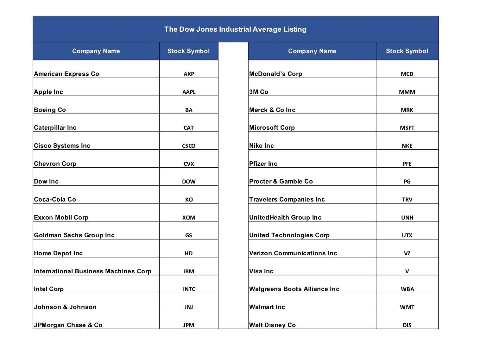

The Dow Jones Industrial Average (DJIA) is a significant stock market index that encompasses 30 leading U.S. companies from various sectors. Since its inception, the DJIA has undergone numerous modifications to its composition to remain responsive to the changing market landscape and economic sectors. This adaptability ensures that the index continues to serve as a reliable benchmark for the stock market, reflecting the health and dynamics of the U.S. economy.

Throughout its history, the DJIA has seen the removal of some of its most iconic constituents, such as General Electric, which was one of the original members, along with notable removals like Sears and AT&T. These changes often symbolized broader economic trends or shifts within industries, emphasizing the index's role in mirroring economic conditions.

In recent years, algorithmic trading has emerged as a significant force in financial markets, influencing stock prices and thereby potentially impacting which companies are included or removed from the DJIA. The rapid execution and efficiency of these algorithms can affect the performance measures of companies, sometimes leading to accelerated changes in the index's lineup.

Understanding the dynamics behind the composition changes of the DJIA and the influence of algorithmic trading is crucial for investors. By comprehending these factors, investors are better equipped to navigate the continuously evolving stock market landscape, making informed decisions to align their portfolios with prevailing economic and technological trends.

## Table of Contents

## What Is the Dow Jones Industrial Average?

The Dow Jones Industrial Average (DJIA) was established in 1896 by Charles Dow, one of the co-founders of Dow Jones & Company, along with statistician Edward Jones. Initially, it included 12 prominent industrial companies reflective of the U.S. economy's industrialized nature. Unlike a simple average calculation, the DJIA employs a price-weighted approach, meaning the index is calculated using the sum of the stock prices of its components divided by a divisor, which adjusts for stock splits and other changes [source: Dow Jones & Company].

As a benchmark for the stock market, the DJIA holds substantial influence, being widely tracked by investors, analysts, and economists globally. Its significance extends beyond the U.S., reflecting broader market trends. Despite the limited number of companies it includes, the DJIA's components are large-cap, blue-chip stocks seen as crucial to the U.S. economy. These companies are well-established, financially sound, and come from various sectors, ensuring a diverse representation of economic activities.

The determination of which companies are included in the DJIA is managed by the S&P Dow Jones Indices committee. This committee reviews and modifies the component list to reflect shifts in the market landscape. Decisions are guided by several criteria, including the company's reputation, sustained growth, and interest from investors. Changes in the index aim to preserve its relevance as a representative gauge for the economic sectors it encompasses.

The process of removing or adding companies to the DJIA adheres to the intention of maintaining its emblematic nature. When a sector gains or loses prominence, the index adjusts accordingly to capture these economic transitions. This selective process ensures that the DJIA remains a pertinent indicator of the U.S. economy's health and direction.

## Iconic Companies Removed from the DJIA

The Dow Jones Industrial Average (DJIA) serves as a barometer of the U.S. economy, reflecting industrial and economic shifts over time. One of the most iconic original components of this index was General Electric (GE). GE was part of the initial lineup when the DJIA was launched in 1896. Over the years, GE's journey with the DJIA includes multiple re-entries, with its last removal occurring in 2018. The company was a stalwart symbol of American industrial might, but as the landscape of business shifted towards technology and services, its representation in the DJIA became less pertinent.

Similarly, companies such as Sears and AT&T illustrate the dynamic nature of the DJIA’s composition. Sears, once the quintessential American retailer, was removed from the DJIA in 1999. This change occurred as the retail environment evolved with the rise of e-commerce, making the traditional department store model less relevant within the index. AT&T, involved in the stock index several times, was most recently removed in 2015, reflective of changing priorities within the telecommunications industry and its evolving competitive landscape.

ExxonMobil and Pfizer's removal from the DJIA in 2020 underscores significant shifts within their respective sectors—energy and pharmaceuticals. ExxonMobil's [exit](/wiki/exit-strategy) followed decades of dominance as a primary representative of the oil and gas industry. Its removal echoes a broader transition towards renewable energy and technology-driven solutions. Pfizer, a leading pharmaceutical company, was likewise replaced in 2020, indicative of the DJIA’s increasing emphasis on high-growth and innovative sectors such as technology and biotechnology.

The removal of these companies from the DJIA is often emblematic of wider economic and market transitions. Such changes underscore the DJIA’s ongoing role in mirroring the most relevant and impactful sectors of the U.S. economy, ensuring its components align with current market conditions and future economic growth potential. Understanding these removals provides insights into broader industry trends and ongoing shifts within global markets.

## Recent Trends and Changes in the DJIA

Nvidia's replacement of Intel in the Dow Jones Industrial Average (DJIA) underscores a significant trend towards technology and [artificial intelligence](/wiki/ai-artificial-intelligence) within the semiconductor industry. This shift reflects broader market dynamics that prioritize companies at the forefront of AI and advanced technology development. Nvidia's prominence in graphics processing and AI accelerators presents it as a critical player in an economy increasingly driven by technological advancements.

The evolution of the DJIA composition is closely tied to emerging technologies and sectoral shifts. Market dynamics, including AI development and the growing demand for semiconductors, substantially influence the index's composition. As the demand for computing power and AI applications expands, companies that lead in these areas have become more representative of economic progress and technological capabilities, necessitating their inclusion in the index.

Moreover, [algorithmic trading](/wiki/algorithmic-trading) plays a crucial role in this context. By using complex algorithms and computational power, algorithmic trading can influence stock prices and [volatility](/wiki/volatility-trading-strategies), potentially affecting a company's performance in the stock market. High-frequency trading systems and other algorithmic strategies can exacerbate shifts in stock prices, thus impacting listing and delisting decisions for indices like the DJIA. The speed and efficiency of algorithmic trading can sometimes create discrepancies between a company's intrinsic value and its market performance, which can influence its standing in the DJIA.

These trends suggest that the DJIA is continually evolving, reflecting changes not only in corporate performance and economic sectors but also in the strategic movements of high-tech and high-paced trading mechanisms. Understanding these forces is crucial for stakeholders to predict and adapt to future shifts in the DJIA's lineup, aligning investment strategies with the prevailing directions of technology and market innovation.

## Algorithmic Trading and Its Influence

Algorithmic trading, commonly known as algo trading, utilizes pre-defined rules to automate the process of executing trades. These algorithms often rely on complex mathematical models and take into account multiple variables such as timing, price, and trading [volume](/wiki/volume-trading-strategy) to determine optimal moments for buying or selling stocks. The widespread adoption of algorithmic trading has led to significant implications for stock price volatility. This is due to the speed at which algorithms can execute orders and react to market changes, often leading to rapid price fluctuations.

The influence of algorithmic trading extends to stock indices like the Dow Jones Industrial Average (DJIA). Companies listed on the DJIA can experience shifts in their performance metrics as a result of algorithm-driven trading activities. For instance, if a trading algorithm detects a trend or a [breakout](/wiki/breakout-trading) in a company's stock, it can trigger a series of automatic buy or sell orders. This increased trading activity can, in turn, elevate the stock's volatility, affecting its average daily volume and potentially its perception in the market.

Algorithmic trading strategies often leverage market trends, which can result in amplified price movements. For example, in [momentum](/wiki/momentum) trading, algorithms are programmed to detect and capitalize on upward or downward trends. Such strategies might increase buying during a bullish trend or selling during a bearish trend, thereby intensifying the trajectory of these trends. Consequently, such amplified movements could lead to shifts in index components if a company’s stock is consistently influenced either positively or negatively by these trends.

Understanding algorithmic trading is crucial for investors aiming to anticipate potential changes in the DJIA. As algorithmic trading continues to grow in sophistication and prevalence, its impact on market dynamics is likely to become even more pronounced. Investors can benefit from insights into how algorithmic trading strategies—whether they involve [market making](/wiki/market-making), [arbitrage](/wiki/arbitrage), or [trend following](/wiki/trend-following)—affect stock performance and, by extension, influence stock indices like the DJIA. Recognizing these influences can provide investors with the analytical tools necessary to make informed decisions about portfolio adjustments in response to emerging market trends.

## The Role of Algorithmic Trading in Dow Removals

Algorithmic trading, also referred to as automated or algo trading, uses pre-determined rules and algorithms to execute trades at high speed and frequency. This modern trading approach has revolutionized the stock market, but it can pose challenges for traditional companies listed on indices such as the Dow Jones Industrial Average (DJIA). The inherent speed and efficiency of algorithmic trading can lead to market conditions that disadvantage companies not keeping pace with technological advancements.

Firstly, stocks of companies that cannot adapt swiftly to technological changes tend to exhibit poorer performance metrics. Algorithmic trading systems can quickly analyze vast quantities of data, making rapid buy or sell decisions based on subtle market shifts. This speed allows them to exploit price discrepancies more effectively than human traders. As a result, companies that lag in innovation may face increased volatility and downward pressure on their stock prices. This pressure can make these companies less attractive to investors and may influence their continued presence on the DJIA.

Moreover, the intensive data analysis conducted by these algorithms spotlights market trends and economic shifts more prominently. If a company's sector is perceived as declining or less relevant due to technological progress, algorithms might reduce positions in those stocks. This could lead to lower market valuations for these companies, accelerating their removal from significant indices like the DJIA.

For example, if a traditional retail company is slow to incorporate online sales platforms, its stock might underperform compared to companies excelling in e-commerce. Algorithmic trading models would likely adjust portfolios by reducing holdings in the underperforming company, contributing to declining stock prices. Such persistent underperformance could trigger the decision to remove the company from the DJIA.

Investors must understand the broader influence of algorithmic trading to make well-informed decisions. Awareness of how algorithms impact stock performance provides insights into potential shifts in the DJIA components. Savvy investors will monitor not only the performance metrics but also the technological adaptability of companies to anticipate changes in the index's composition. By recognizing these influences, investors can strategically adjust their portfolios to align with evolving market dynamics and technological trends.

## The Future of the DJIA and Investment Implications

As technological advancements persist, the Dow Jones Industrial Average (DJIA) will inevitably evolve, introducing new companies and industries into its composition. These changes are driven by the emergence of sectors that reflect current economic priorities, such as renewable energy, artificial intelligence (AI), and biotechnology. As these sectors become more integral to the U.S. economy, they are likely to gain representation within the DJIA, potentially at the cost of industries that lose relevance over time.

Investors must be proactive in monitoring trends like AI development and the increasing role of algorithmic trading. AI has the potential to transform various sectors, leading to shifts in economic power and market capitalization. Algorithmic trading further influences stock behavior by impacting [liquidity](/wiki/liquidity-risk-premium) and volatility, elements crucial for stock indices. This technological progress can alter which companies have the market influence to be considered blue-chip and, consequently, those included in indices like the DJIA.

Remaining informed on changes within the DJIA offers valuable insights for investors looking to maintain a relevant and potentially profitable portfolio. Understanding how these changes signal broader economic transitions can guide strategic investment decisions. Investors should consider aligning their portfolios with emergent economic trends to harness potential growth opportunities and mitigate risks associated with outdated industries.

Ultimately, the future composition of the DJIA will serve as a representation of the shifting economic landscape in the United States. By keeping abreast of these shifts, investors can better anticipate and respond to economic changes, ensuring that their investment strategies remain aligned with the sectors poised for growth and innovation.

## Conclusion

The Dow Jones Industrial Average (DJIA) serves as a barometer for gauging the economic climate of the United States, maintaining its status as a vital economic indicator. This stock market index provides insights into the country's economic health by tracing the performance of 30 major U.S. companies, with changes in its composition mirroring broader market and technological shifts. The removal and addition of companies within the DJIA underscore these shifts, representing deeper transitions within various industries and the economy at large.

Algorithmic trading has taken a prominent role in financial markets, significantly influencing the dynamics of indices such as the DJIA. By automating trading decisions based on pre-set rules, algorithmic trading not only affects stock prices by introducing volatility but also shapes the performance metrics traditionally used to assess a company’s standing within an index. The increased prevalence of algorithmic trading suggests a shift towards market mechanisms that can quickly adapt and respond to real-time data, thereby impacting which companies may be included or removed from indices like the DJIA.

In light of these trends, investors are encouraged to remain flexible and informed, continually adjusting their strategies to align with emerging economic sectors. Staying abreast of technological innovations and market evolutions will allow investors to make strategic choices, ensuring their portfolios reflect the current and anticipated shifts encapsulated by indices like the DJIA. By leveraging comprehensive market information, investors can better navigate the complexities of the stock market and position themselves favorably within the evolving economic landscape.

## References & Further Reading

[1]: Malkiel, B. G. (2003). ["Building Wealth Right Off the Street? Get a Clue Before Taking a Stumble in Downdraft."](https://pubs.aeaweb.org/doi/10.1257/089533003321164958) Wall Street Journal.

[2]: ["Advances in Financial Machine Learning"](https://www.amazon.com/Advances-Financial-Machine-Learning-Marcos/dp/1119482089) by Marcos Lopez de Prado

[3]: "The Dow Jones Industrial Average: Issues and Trends" by CRS (Congressional Research Service), 2012. Available at: [Congressional Research Service Report](https://crsreports.congress.gov/)

[4]: ["Quantitative Trading: How to Build Your Own Algorithmic Trading Business"](https://www.amazon.com/Quantitative-Trading-Build-Algorithmic-Business/dp/1119800064) by Ernest P. Chan

[5]: ["Machine Learning for Algorithmic Trading"](https://github.com/PacktPublishing/Machine-Learning-for-Algorithmic-Trading-Second-Edition) by Stefan Jansen

[6]: ["The Little Book That Still Beats the Market"](https://www.amazon.com/Little-Still-Market-Books-Profits/dp/1119986133). (2005). By Joel Greenblatt.