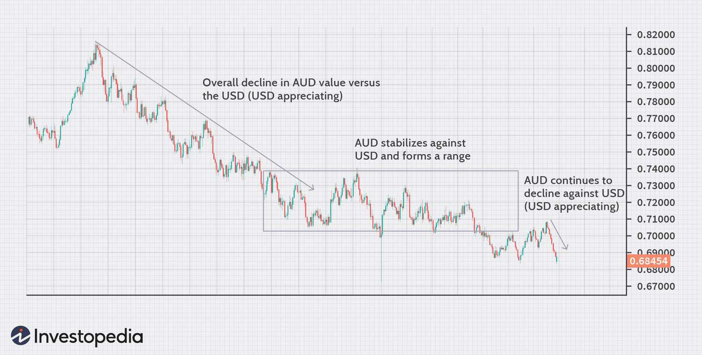

Forex trading, characterized by the buying and selling of currencies, represents one of the most liquid and active markets globally. The dynamics of exchange rates are complex and constantly in flux, influenced by a myriad of economic factors such as interest rates, inflation, and geopolitical events. At the heart of these dynamics is the American dollar, often regarded as a global benchmark due to its widespread use in international trade and finance. Understanding American currency quotations is essential for traders aiming to effectively navigate this landscape. These quotations express the value of foreign currencies in terms of U.S. dollars and form the basis for making informed trading decisions.

In recent years, the emergence of algorithmic trading, often termed "algo trading," has begun to transform the foreign exchange market. This innovative approach utilizes computer algorithms to automate trading decisions, allowing for rapid analysis of market data and high-speed execution of trades. Such automation not only enhances trading efficiency but also reduces transaction costs, offering traders a potent tool in developing and refining their strategies.



This article examines exchange rates involving American currency and the critical role of currency quotes within algorithmic trading. By exploring how these factors influence trading strategies, readers will gain an understanding of their significance in the ever-evolving forex market. As technology continues to advance, the integration of algorithmic systems with traditional trading concepts promises to redefine the boundaries of what is possible within the market. This intersection of American currency quotations and algorithmic trading is poised to offer valuable insights and opportunities for traders worldwide.

## Table of Contents

## Understanding Exchange Rates

Exchange rates are a fundamental aspect of the global financial system, influencing how currencies are valued and traded across the world. At their core, exchange rates determine the price at which one currency can be exchanged for another, providing a critical measure of economic strength and stability. In the forex (foreign exchange) market, these rates are subject to continuous fluctuations, driven by a complex array of economic factors.

One primary factor influencing exchange rates is interest rates. Central banks, such as the Federal Reserve in the United States or the European Central Bank, set benchmark interest rates which directly impact the flow of money. Higher interest rates tend to attract foreign capital, leading to an appreciation of the domestic currency as demand for that currency increases to partake in the higher returns offered domestically.

Geopolitical stability also plays a significant role in determining exchange rates. Countries with stable political climates, transparent governance, and reliable legal systems are often seen as safer investment destinations. This stability tends to bolster investor confidence and demand for the nation's currency, potentially leading to its appreciation. Conversely, political unrest or uncertainty can lead to currency depreciation as investors seek safer havens for their assets.

The American dollar (USD) holds a pivotal position in the [forex](/wiki/forex-system) market, often acting as a global benchmark. It is involved in the majority of forex transactions, reflecting its status as the world's primary reserve currency. The dollar's influence extends beyond the borders of the United States, often dictating trends in exchange rates globally due to its widespread use in international trade and finance.

Understanding the quotation methods for currencies is essential for navigating the complexities of forex trading. Two primary methods are employed: American and European currency quotations. The American currency quotation, also referred to as a direct quote, indicates the amount of USD needed to purchase one unit of a foreign currency. For example, if the EUR/USD rate is 1.18, it means that 1 Euro can be exchanged for 1.18 USD.

Conversely, the European currency quotation, or indirect quote, expresses how many units of a foreign currency are required to purchase one unit of USD. In this manner, a USD/EUR rate of 0.85 would imply that 0.85 Euro is needed to purchase 1 USD.

For traders, understanding both methods is crucial, as the interpretation of these quotes can influence trading decisions and strategies profoundly. Mastery of these concepts enables traders to better predict currency movements and capitalize on market changes, particularly in a market as dynamic as forex.

## Key Concepts: American Currency Quotation

American currency quotation is a pivotal concept in forex trading, indicating how much U.S. dollars (USD) are needed to purchase one unit of a foreign currency. This quotation method is commonly utilized when the USD is not the base currency. Understanding these quotations is crucial for traders who frequently deal with the U.S. dollar in their currency transactions.

In the forex market, exchange rates involving the USD are typically quoted either directly or indirectly. A direct quote expresses the amount of domestic currency—here the USD—required to obtain one unit of a foreign currency. For example, if the EUR/USD rate is 1.20, it indicates that 1.20 USD is necessary to purchase one Euro. Conversely, an indirect quote shows the amount of foreign currency equivalent to one unit of the domestic currency. This means if the GBP/USD is 0.75, it signifies that 0.75 British Pounds are needed for one USD.

These quotations can present conceptual challenges. Distinguishing between direct and indirect quotes is essential since they affect trading strategies and risk assessments differently. Traders proficient in converting and analyzing these quote types can capitalize on [arbitrage](/wiki/arbitrage) opportunities and optimize their exchange strategies.

Math plays a crucial role in understanding currency quotations. Suppose $q$ represents the exchange rate between two currencies, where $	q = \frac{\text{USD}}{\text{Foreign Currency}}$ for direct quotes and $q = \frac{\text{Foreign Currency}}{\text{USD}}$ for indirect quotes. Interpreting these ratios correctly can empower traders to make informed decisions about when to buy or sell currency pairs. 

Moreover, currency traders often employ tools like Python to automate these calculations and analyses. For instance, a simple Python script can be developed to convert between direct and indirect quotations efficiently:

```python
def convert_quote(rate, conversion_type='direct'):
    if conversion_type == 'direct':
        return 1 / rate  # Converts direct quote to indirect
    elif conversion_type == 'indirect':
        return 1 / rate  # Converts indirect quote to direct
    else:
        raise ValueError("Conversion type must be 'direct' or 'indirect'.")

# Example: Convert EUR/USD (direct) to USD/EUR (indirect)
rate = 1.20  # 1 EUR = 1.20 USD
converted_rate = convert_quote(rate, 'direct')
print(f"USD/EUR rate: {converted_rate:.4f}")
```

By leveraging these calculations and understanding the distinction between direct and indirect quotations, traders can achieve a more profound comprehension of forex market dynamics and enhance their decision-making process. Mastery of the American currency quotation system is not just about reading numbers but translating them into actionable insights that can yield a competitive edge in forex trading.

## Algorithmic Trading in Forex

Algorithmic trading, often referred to as algo trading, leverages computer algorithms to automate and optimize trading decisions in the forex market. These algorithms are capable of analyzing vast amounts of currency quotations and market data at speeds unachievable by human traders. The rapid analysis enables the execution of trades in milliseconds, often capturing slight fluctuations in exchange rates for profit.

The primary advantage of [algorithmic trading](/wiki/algorithmic-trading) in forex is the reduction of transaction costs. By optimizing the timing and size of trades, algorithms can minimize the bid-ask spread and other costs associated with manual trading. Furthermore, algo trading increases trading efficiency by allowing simultaneous analysis and execution of trades across multiple currency pairs and markets, thereby increasing the turnover and [liquidity](/wiki/liquidity-risk-premium) in the forex market.

Another benefit is the objectivity and consistency that algorithms bring to trading strategies. Human traders are often swayed by emotions, such as fear and greed, leading to inconsistent decision-making. In contrast, algorithms follow pre-defined rules and logic impartially, eliminating human bias.

Algorithmic trading systems typically employ advanced statistical models and [machine learning](/wiki/machine-learning) techniques. These systems can be designed using programming languages like Python. For example, a simple moving average crossover strategy can be coded to automate trading decisions based on historical price data:

```python
# Sample Python code for a simple moving average crossover strategy
import pandas as pd

# Load historical price data
prices = pd.read_csv('currency_data.csv')

# Calculate short and long-term moving averages
prices['Short_MA'] = prices['Close'].rolling(window=50).mean()
prices['Long_MA'] = prices['Close'].rolling(window=200).mean()

# Generate signals
prices['Signal'] = 0.0
prices['Signal'][prices['Short_MA'] > prices['Long_MA']] = 1.0
prices['Position'] = prices['Signal'].diff()

# Display trade dates
trade_entries = prices[prices['Position'] == 1.0]['Date']
trade_exits = prices[prices['Position'] == -1.0]['Date']
print("Trade Entries:\n", trade_entries)
print("Trade Exits:\n", trade_exits)
```

Despite its advantages, algorithmic trading is not without challenges. Technical risks such as system faults, incorrect algorithm coding, and network outages can lead to unintended trades and financial losses. Therefore, traders must implement robust risk management and continuous system monitoring to mitigate these risks effectively.

## Interpreting Currency Quotations in Algo Trading

Currency quotations are fundamental to the success of algorithmic trading strategies in the foreign exchange (forex) market. They serve as the primary data input for predictive modeling, enabling traders to make informed decisions. In algorithmic trading, one critical aspect is understanding how American currency quotations—specifically how the U.S. dollar (USD)—influence trading strategies.

American quotes express how much USD is needed to acquire a single unit of another currency. This is opposite to indirect quotes, which show how much of the foreign currency is required to purchase one USD. Comprehending these differences is crucial, as they directly affect the algorithms used in trading decisions.

In practical application, algorithms analyze historical currency quotation data to identify patterns and predict future price movements. For example, consider a scenario where an algorithm processes quotes from a USD/EUR trading pair. The system analyzes the pair's historical data, using statistical and machine learning models, to forecast future trends based on past behaviors. The accuracy of these predictions depends heavily on the algorithm’s ability to correctly interpret currency quotations.

For traders leveraging algorithmic strategies, understanding the impact of American quotes can help in optimizing operations. Algorithms rely on this data to perform actions such as identifying arbitrage opportunities, executing trades at optimal prices, and hedging against currency fluctuations. Through precise interpretation, traders can tap into significant trading advantages, including the potential for higher profits and reduced risk exposure.

Moreover, currency quotations are integral to model training. For instance, models like ARIMA or even neural networks such as LSTM can be used to predict future currency rates by learning from past data. Here is a sample Python code snippet for training an LSTM model on exchange rate data:

```python
import numpy as np
import pandas as pd
from keras.models import Sequential
from keras.layers import LSTM, Dense
from sklearn.preprocessing import MinMaxScaler

# Assume `data` is a Pandas DataFrame containing the exchange rate data

# Normalize the dataset
scaler = MinMaxScaler(feature_range=(0, 1))
scaled_data = scaler.fit_transform(data['exchange_rate'].values.reshape(-1, 1))

# Prepare the data for training
def prepare_data(data, time_step=1):
    x, y = [], []
    for i in range(len(data) - time_step - 1):
        x.append(data[i:(i + time_step), 0])
        y.append(data[i + time_step, 0])
    return np.array(x), np.array(y)

time_step = 5
X, y = prepare_data(scaled_data, time_step)

# Reshape input to be [samples, time steps, features]
X = X.reshape(X.shape[0], X.shape[1], 1)

# Build the LSTM model
model = Sequential()
model.add(LSTM(units=50, return_sequences=True, input_shape=(time_step, 1)))
model.add(LSTM(units=50))
model.add(Dense(units=1))
model.compile(optimizer='adam', loss='mean_squared_error')

# Train the model
model.fit(X, y, epochs=50, batch_size=64)

```

This code serves as a foundation for building more complex models tailored to specific trading strategies. By honing the capability to interpret currency quotations accurately, traders can refine their algorithmic strategies to better capitalize on market movements, achieving a competitive edge in the fast-paced forex market.

## Examples and Analysis

When analyzing the AUD/USD currency pair, it is essential to recognize how fluctuations in the value of either currency can impact trading strategies. When the Australian dollar (AUD) appreciates relative to the US dollar (USD), a trader will require more USD to purchase one AUD. This fundamental aspect of forex trading can be exploited through algorithmic trading systems, which are adept at analyzing past price movements to predict future shifts.

Algorithmic trading systems utilize historical data to identify patterns and trends, which can be critical for developing predictive models. By examining data points such as historical exchange rates, market [volume](/wiki/volume-trading-strategy), and economic indicators, these systems apply mathematical models to forecast potential future currency movements. For example, if historical data indicates that an increase in certain Australian economic indicators commonly leads to an appreciation in AUD, this information can be programmed into an algorithm to make buy/sell decisions automatically.

Python, with its robust libraries such as NumPy for numerical calculations and pandas for data manipulation, offers excellent tools for performing such analyses. Below is an example of a basic Python code snippet that uses historical price data to calculate a simple moving average (SMA), a common technique used in trading algorithms:

```python
import pandas as pd

# Load historical price data for AUD/USD
data = pd.read_csv('AUD_USD_Historical_Data.csv')

# Calculate the Simple Moving Average (SMA) over a specified window
window_size = 20
data['SMA'] = data['Close'].rolling(window=window_size).mean()

# Define buy/sell signals based on SMA
data['Signal'] = 0
data['Signal'][window_size:] = np.where(data['Close'][window_size:] > data['SMA'][window_size:], 1, -1)

# Print trading signals
print(data[['Date', 'Close', 'SMA', 'Signal']].tail())
```

In trading, understanding and accurately reading currency quotations, like those of the AUD/USD, allows traders to capitalize on market trends and fluctuations. As algorithms process large volumes of data to create insights, traders can quickly respond to market conditions by executing trades that align with predicted movements. 

While algorithmic trading presents opportunities for leveraging historical trends, it also requires traders to maintain a keen awareness of real-time events and news, ensuring that the algorithms continue to function optimally in dynamic market environments. Maintaining a balance between algorithmic efficiency and human oversight is crucial in optimizing trading strategies for better profit margins.

## Benefits and Challenges of Algo Trading

Algorithmic trading, often referred to as algo trading, epitomizes the sophisticated intersection of technology and foreign exchange trading. This advanced method utilizes algorithms, which are predefined sets of rules or instructions given to computer programs to execute trades. One of the primary benefits of algo trading is its ability to manage massive trading volumes with remarkable precision and speed. This efficiency allows traders to exploit market opportunities that might be fleeting or entirely imperceptible in manual trading environments.

The precision of algo trading stems from its capacity to process vast amounts of market data at lightning speed, identifying and executing trades that conform to specific criteria. This not only enhances the potential for profit but also reduces human error and emotional decision-making, which can heavily impact trading outcomes. Further, algo trading can operate 24/7 in the global forex markets, seizing opportunities across different time zones without the constraints of human fatigue.

However, the implementation of algo trading is not without challenges. System errors, such as bugs in the trading algorithms, can lead to unintended trading behaviors, potentially resulting in significant financial losses. Similarly, network outages can disrupt trading operations, preventing the execution of critical trades. An example of such risk is the "flash crash" phenomenon, where rapid sell-offs occurring due to algorithmic anomalies can temporarily crash market prices.

To mitigate these risks, deploying a robust risk management strategy is essential for traders using algos. This involves rigorous testing and validation of algorithms in various market conditions to ensure reliability and efficacy. Regular maintenance and updates of trading systems are necessary to adapt to market evolutions and technological advancements. Furthermore, implementing backup systems and recovery protocols can safeguard against unexpected technical failures.

In conclusion, while algorithmic trading presents lucrative opportunities through enhanced efficiency and volume handling, it necessitates a comprehensive risk management strategy to navigate the inherent technological challenges effectively. As traders continue to harness this powerful tool, the emphasis on robust algorithms and resilient systems will be paramount in capitalizing on forex market dynamics.

## Conclusion

Exchange rates and currency quotations form the backbone of effective forex trading strategies. They offer traders the crucial data needed to navigate the complexities of currency markets. As algorithmic trading becomes increasingly prevalent, a deep understanding of these concepts is more important than ever. Algorithmic systems rely heavily on precision and speed, qualities that are enhanced through mastery of exchange rates and currency quotations. 

Traders who excel in interpreting American currency quotations and integrating sophisticated algo systems stand to gain a substantial advantage in the competitive world of forex trading. The ability to quickly analyze and act on currency movements can lead to more profitable trades and improved market positioning. Here’s a basic example of how Python can be used to calculate exchange rates involving American currency:

```python
def calculate_exchange_rate(usd_amount, foreign_currency_rate):
    return usd_amount * foreign_currency_rate

usd = 100  # Amount in USD
eu_rate = 0.85  # Example exchange rate USD to EUR

eur_amount = calculate_exchange_rate(usd, eu_rate)
print(f"{usd} USD is equivalent to {eur_amount} EUR")
```

As technology advances, the landscape of forex trading continues to change, bringing with it the promise of greater innovation and efficiency. Algorithmic trading, driven by advancements in technology and data analysis techniques, is set to revolutionize how trading decisions are made. Traders who stay informed and adapt to these technological improvements are likely to lead in the evolving financial markets. Thus, understanding exchange rates and integrating algorithmic solutions is pivotal for future success in forex trading.

## References & Further Reading

[1]: Bergstra, J., Bardenet, R., Bengio, Y., & Kégl, B. (2011). ["Algorithms for Hyper-Parameter Optimization."](https://dl.acm.org/doi/10.5555/2986459.2986743) Advances in Neural Information Processing Systems 24.

[2]: ["Advances in Financial Machine Learning"](https://www.amazon.com/Advances-Financial-Machine-Learning-Marcos/dp/1119482089) by Marcos Lopez de Prado.

[3]: ["Evidence-Based Technical Analysis: Applying the Scientific Method and Statistical Inference to Trading Signals"](https://www.amazon.com/Evidence-Based-Technical-Analysis-Scientific-Statistical/dp/0470008741) by David Aronson.

[4]: ["Machine Learning for Algorithmic Trading"](https://github.com/stefan-jansen/machine-learning-for-trading) by Stefan Jansen.

[5]: ["Quantitative Trading: How to Build Your Own Algorithmic Trading Business"](https://github.com/LucindaYa/quant-resources/blob/master/Quantitative%20Trading%20How%20to%20Build%20Your%20Own%20Algorithmic%20Trading%20Business.pdf) by Ernest P. Chan.