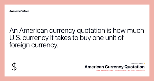

## Table of Contents

## What is American currency quotation?

American currency quotation is how the value of the US dollar is shown compared to other currencies. It tells you how many units of another currency you need to buy one US dollar. For example, if the exchange rate between the US dollar and the Japanese yen is 110, it means you need 110 yen to get one US dollar.

This way of quoting currency is called direct quotation because it directly shows how much foreign currency you get for one US dollar. It's used a lot in countries where the US dollar is the main currency for trade and finance. Knowing the American currency quotation helps people and businesses figure out how much their money is worth in other countries.

## How is the value of the U.S. dollar determined?

The value of the U.S. dollar is determined by how much people and countries want to use it. It's like a popularity contest. If more people want to buy things with dollars or keep dollars in their banks, the value goes up. This can happen if the U.S. economy is doing well, or if other countries think the U.S. is a safe place to keep their money. The value can also change because of what the U.S. government does, like changing interest rates or printing more money.

Another big thing that affects the dollar's value is what's happening with other currencies. If other countries' money is not doing well, people might want to switch to dollars instead. This makes the dollar stronger. Also, big events around the world, like wars or big economic changes, can make people want to use dollars more or less. So, the value of the dollar is always moving because it depends on what's happening in the U.S. and around the world.

## What are the different denominations of U.S. currency?

U.S. currency comes in different sizes called denominations. The paper money, also called banknotes, has these values: $1, $2, $5, $10, $20, $50, and $100. The $1 bill is very common and often used for small purchases. The $2 bill is not seen as much but is still used. The $5, $10, and $20 bills are used a lot for everyday buying. The $50 and $100 bills are used less often but are good for bigger purchases or saving.

Coins are another part of U.S. currency. They come in these amounts: 1 cent (called a penny), 5 cents (called a nickel), 10 cents (called a dime), and 25 cents (called a quarter). There are also less common coins like the 50 cent piece (called a half dollar) and the $1 coin (sometimes called a dollar coin). Coins are handy for small amounts and making exact change.

## What is the difference between a hard and soft currency quote?

A hard currency quote is when the price of something is set in a strong currency, like the U.S. dollar. This means the price doesn't change even if the value of other currencies goes up or down. For example, if you buy something for $100, it will always cost $100 no matter what happens to other currencies. Hard currency quotes are used a lot in international trade because they make it easier for people to plan and budget.

A soft currency quote is different because the price can change based on what's happening with the currency. If you buy something with a soft currency quote, the price might go up or down depending on how the currency is doing. For example, if you buy something for 100 euros and the euro gets weaker, you might end up paying more in your own currency. Soft currency quotes can be riskier because the price isn't fixed, but they can also be good if the currency gets stronger.

## How does the foreign exchange market affect American currency quotation?

The foreign exchange market, or [forex](/wiki/forex-system) market, is where people and businesses trade different currencies. This market affects American currency quotation because it's where the value of the U.S. dollar is compared to other currencies. When lots of people want to buy U.S. dollars, the dollar gets stronger, and the American currency quotation goes up. This means you need more of another currency to buy one U.S. dollar. If fewer people want dollars, the dollar gets weaker, and the quotation goes down.

The forex market is always changing because of things like economic news, interest rates, and big world events. For example, if the U.S. economy is doing well, more people might want to buy dollars, making the quotation higher. But if there's bad news, like a big drop in the stock market, people might sell dollars, making the quotation lower. So, the American currency quotation is always moving based on what's happening in the forex market.

## What are the key factors influencing the exchange rate of the U.S. dollar?

The exchange rate of the U.S. dollar is influenced by many things, like how well the U.S. economy is doing. If the economy is strong, more people and countries want to buy things with dollars, which makes the dollar stronger. Interest rates set by the Federal Reserve also matter a lot. When interest rates go up, it can make the dollar stronger because people want to keep their money in the U.S. to earn more interest. But if the economy is not doing well, or if interest rates go down, the dollar might get weaker because fewer people want to use it.

Another big thing that affects the dollar's exchange rate is what's happening in other countries. If other countries' economies are doing badly, people might want to switch to dollars because they think it's safer. This can make the dollar stronger. Also, big world events like wars or political changes can make people want to use dollars more or less, which changes the exchange rate. So, the value of the dollar depends not just on what's happening in the U.S., but also on what's happening everywhere else.

## How do interest rates impact the valuation of the U.S. dollar?

Interest rates set by the Federal Reserve have a big impact on how much the U.S. dollar is worth. When the Fed raises interest rates, it means people can earn more money by keeping their savings in the U.S. This makes the dollar more attractive to people from other countries who want to invest their money where they can get a good return. As more people want to buy dollars to take advantage of these higher rates, the value of the dollar goes up.

On the other hand, when the Federal Reserve lowers interest rates, it can make the U.S. dollar less appealing. Lower rates mean people earn less from their savings, so investors might look for better opportunities in other countries with higher interest rates. This can lead to a decrease in demand for the U.S. dollar, causing its value to drop. So, changes in interest rates can really move the dollar's value up or down depending on whether they go up or down.

## What role do economic indicators play in American currency quotation?

Economic indicators are like clues that tell us how the U.S. economy is doing. They can show things like how many people have jobs, how much stuff people are buying, and how fast prices are going up. When these indicators show the economy is doing well, like when more people are working and buying things, it makes people want to use U.S. dollars more. This can make the American currency quotation go up because more people need dollars to buy things in the U.S.

On the other hand, if economic indicators show the economy is not doing so well, like if fewer people are working or if prices are going up too fast, it can make people less interested in using U.S. dollars. When this happens, the American currency quotation might go down because fewer people want to buy dollars. So, economic indicators are important because they help everyone understand if the U.S. dollar will be worth more or less compared to other currencies.

## How does inflation affect the U.S. dollar's purchasing power?

Inflation is when the prices of things go up over time. When inflation happens, each U.S. dollar can buy less stuff than before. Imagine if a candy bar costs $1 today, but next year it costs $1.10 because of inflation. That means your dollar doesn't go as far, and you need more dollars to buy the same candy bar. So, inflation makes the U.S. dollar's purchasing power go down because it takes more dollars to buy the same things.

The Federal Reserve, which is like the boss of money in the U.S., tries to keep inflation at a good level, around 2% each year. If inflation gets too high, the Fed might raise interest rates to slow it down. This can help keep the dollar's value from dropping too fast. But if inflation is too low, the Fed might lower interest rates to encourage people to spend more, which can help the economy grow. So, inflation is important because it affects how much your dollars can buy, and the Fed works to keep it balanced.

## What are the implications of currency manipulation on U.S. dollar quotation?

Currency manipulation happens when a country tries to change how much its money is worth compared to other countries' money. If another country wants to make its money weaker so it can sell more stuff to the U.S., it might do things like selling its own money and buying U.S. dollars. This can make the U.S. dollar stronger because more people want it. When the U.S. dollar gets stronger because of this, the American currency quotation goes up, meaning you need more of the other country's money to buy one U.S. dollar.

This can be bad for the U.S. because it makes things from other countries cheaper, but it makes things from the U.S. more expensive for people in other countries. This can hurt U.S. businesses that want to sell things abroad. Also, if the U.S. dollar gets too strong, it can make it harder for the U.S. to sell its own stuff to other countries. So, currency manipulation can mess up trade and make it harder for the U.S. to keep its economy strong.

## How do geopolitical events influence the strength of the U.S. dollar?

Geopolitical events, like wars or big political changes, can make the U.S. dollar stronger or weaker. When there's a lot of uncertainty or trouble in the world, people often think the U.S. is a safe place to keep their money. They might buy more U.S. dollars because they think it's a good way to protect their money. This can make the dollar stronger because more people want it.

But if something bad happens in the U.S., like a big political problem or a natural disaster, it can make the dollar weaker. People might not want to use U.S. dollars as much if they think the U.S. is not a safe place anymore. This can make the dollar less popular and cause its value to go down. So, what happens around the world and in the U.S. can really change how strong the U.S. dollar is.

## What advanced trading strategies can be used to capitalize on fluctuations in American currency quotation?

One advanced trading strategy to take advantage of changes in the American currency quotation is called [carry](/wiki/carry-trading) trading. This is when you borrow money in a country with low interest rates, like Japan, and then use that money to buy U.S. dollars or invest in the U.S. where the interest rates are higher. If the U.S. dollar gets stronger while you're doing this, you can make even more money because you're [earning](/wiki/earning-announcement) interest and the value of your dollars is going up. But it can be risky because if the U.S. dollar gets weaker, you might lose money.

Another strategy is called currency hedging. This is when you try to protect yourself from changes in the American currency quotation. You might use something called a forward contract, which lets you agree on a price for U.S. dollars in the future. This way, even if the dollar's value changes a lot, you know exactly how much you'll pay or get for it. It's like buying insurance for your money. This can be helpful for businesses that need to buy or sell things in U.S. dollars but don't want to worry about the dollar's value going up and down too much.

## References & Further Reading

[1]: Bergstra, J., Bardenet, R., Bengio, Y., & Kégl, B. (2011). ["Algorithms for Hyper-Parameter Optimization."](https://dl.acm.org/doi/10.5555/2986459.2986743) Advances in Neural Information Processing Systems 24.

[2]: ["Advances in Financial Machine Learning"](https://www.amazon.com/Advances-Financial-Machine-Learning-Marcos/dp/1119482089) by Marcos Lopez de Prado.

[3]: ["Evidence-Based Technical Analysis: Applying the Scientific Method and Statistical Inference to Trading Signals"](https://www.amazon.com/Evidence-Based-Technical-Analysis-Scientific-Statistical/dp/0470008741) by David Aronson.

[4]: ["Machine Learning for Algorithmic Trading"](https://github.com/stefan-jansen/machine-learning-for-trading) by Stefan Jansen.

[5]: ["Quantitative Trading: How to Build Your Own Algorithmic Trading Business"](https://github.com/LucindaYa/quant-resources/blob/master/Quantitative%20Trading%20How%20to%20Build%20Your%20Own%20Algorithmic%20Trading%20Business.pdf) by Ernest P. Chan.