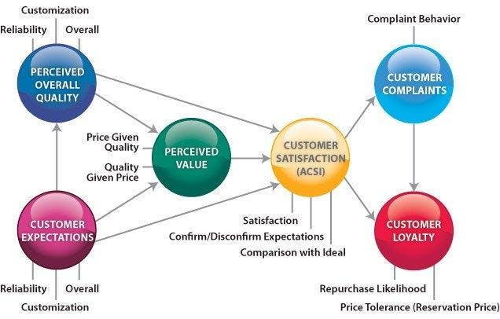

The American Customer Satisfaction Index (ACSI) serves as a critical benchmark in assessing consumer satisfaction within various industries in the United States. As a predictive tool, it captures consumer sentiments through extensive surveys, providing insights that are instrumental in market analysis and corporate strategy development. Accurate measurement of customer satisfaction can reveal significant trends and behaviors influencing both market dynamics and consumer preferences. ACSI's findings guide businesses in enhancing their product offerings and customer service protocols to remain competitive.

Algorithmic trading, or algo trading, refers to the use of computer algorithms to execute trading strategies at speeds and frequencies that human traders cannot achieve. Its capacity to analyze vast datasets and execute trades with precision and speed has revolutionized financial markets. These systems capitalize on market inefficiencies, implementing strategies such as trend following, arbitrage, and market making. Algo trading has seen substantial growth, primarily due to advancements in technology and increased availability of financial data.



This article investigates the intersection between ACSI insights and algorithmic trading. The focus is on understanding how customer satisfaction data, as quantified by ACSI, can be harnessed to refine and enhance trading strategies. ACSI provides a rich dataset that reflects consumer confidence and satisfaction, potentially offering valuable signals for predictive models in trading algorithms. Leveraging this data could yield improved market insights, aiding traders in making informed decisions that align with consumer sentiment.

The topics covered include a comprehensive understanding of the ACSI's methodology and its impact on consumer behavior and corporate performance. Additionally, foundational concepts of algorithmic trading and common strategies will be discussed. Insights into how ACSI data can be integrated into trading models, its potential benefits, challenges, and future implications of this integration are also explored. The article concludes by encouraging traders and businesses to continually adapt and innovate in their strategies by incorporating customer satisfaction metrics, thereby keeping pace with the evolving landscapes of trading and market analysis.

## Table of Contents

## Understanding the American Customer Satisfaction Index (ACSI)

The American Customer Satisfaction Index (ACSI) is a critical tool for evaluating customer satisfaction within various industries, providing insights that are instrumental in assessing company performance and guiding market strategies. Established in 1994, it serves as a national benchmark for customer satisfaction in the United States, covering a wide array of sectors such as retail, telecommunications, and finance.

### Methodology and Scoring

The ACSI utilizes a meticulous methodology that involves data collection through random-sample phone and online surveys. These surveys target customers who have recently used a company's products or services, ensuring the data reflects current consumer experiences. The core of the methodology is an econometric model, which yields a score on a scale from 0 to 100, derived from three key parameters: perceived quality, perceived value, and customer expectations.

Mathematically, the ACSI score $S$ can be represented as:

$$
S = \alpha(Q) + \beta(V) + \gamma(E)
$$

Where:
- $Q$ is the perceived quality,
- $V$ is the perceived value,
- $E$ is customer expectations,
- $\alpha$, $\beta$, and $\gamma$ are weights assigned to each parameter based on their impact on overall satisfaction.

### Impact on Consumer Behavior and Corporate Performance

The data derived from ACSI has substantial impacts on both consumer behavior and corporate performance. A higher ACSI score is often associated with increased customer loyalty, reduced churn rates, and greater word-of-mouth referrals. Conversely, low scores can signal potential issues in service or product offerings, prompting companies to reevaluate their strategies.

For corporations, ACSI serves as a performance measure that can influence investor perceptions and market valuations. Companies with higher ACSI scores tend to report better financial outcomes, as satisfaction is closely linked to increased sales and profitability. Thus, ACSI acts as a predictive indicator for future business success, providing valuable insights that companies use to align their strategic objectives with consumer expectations.

### Influential Industries and Companies

Certain industries and companies are particularly influenced by ACSI results. The telecommunications industry, for instance, frequently uses ACSI data to compete on service quality, as customer satisfaction is a crucial differentiator in an otherwise commoditized market. Similarly, retail giants such as Amazon and Walmart leverage ACSI data to refine their customer experience strategies, maintaining their competitive edge through high satisfaction scores.

Moreover, the automotive sector, including companies like Toyota and Ford, relies heavily on ACSI outcomes to drive product development and marketing strategies. High satisfaction scores can enhance brand reputation and loyalty, which are paramount in an industry where consumer trust and perception are vital.

In summary, the ACSI not only measures customer satisfaction but also brings significant implications for consumer behavior and corporate performance across various sectors. By consistently providing reliable and actionable insights, it remains a critical component in the landscape of market analysis and strategic planning.

## The Basics of Algorithmic Trading

Algorithmic trading, commonly referred to as algo trading, represents a significant innovation in financial markets by leveraging computer algorithms to automate trading decisions and executions. This method of trading has garnered widespread adoption due to its ability to process and analyze vast quantities of data far more efficiently than manual methods, providing traders with substantial advantages.

At its core, [algorithmic trading](/wiki/algorithmic-trading) involves using complex mathematical models and computational algorithms to identify and exploit market trends and inefficiencies. These algorithms can sift through various data sources, including historical price data, trading volumes, and other relevant financial metrics, to make informed trading decisions. The primary advantage here is speed; algorithms can execute trades in milliseconds, far faster than any human could achieve. This speed offers a significant edge in highly volatile markets where moments can define profit or loss.

Additionally, algorithmic trading offers precision and consistency, reducing the emotional and psychological biases that often affect human traders. With predefined criteria and rules, trading algorithms ensure that trades are executed consistently according to a specified strategy, without deviation due to fear or greed.

One of the primary benefits of algorithmic trading is its ability to capitalize on market inefficiencies. For instance, by identifying patterns and anomalies in the market, algorithms can execute trades to profit from these discrepancies before they are corrected. Moreover, algorithms can operate continuously without fatigue, scanning and trading in multiple markets and securities simultaneously.

There are several common strategies employed in algorithmic trading, each designed to leverage different market opportunities:

1. **Trend Following**: This strategy involves identifying and capitalizing on market trends. Algorithms are programmed to identify upward or downward movements in price and execute trades that align with these trends. For example, using a moving average crossover strategy, traders can program their algorithm to buy when a short-term moving average surpasses a long-term moving average, and sell in the opposite scenario.

2. **Arbitrage**: Arbitrage strategies take advantage of price discrepancies between related securities or different markets. Algorithms detect these inefficiencies at lightning speed and execute trades to profit from the price differential, securing risk-free profits. An example is triangular arbitrage in the foreign exchange markets, where discrepancies in the exchange rates between three currencies are exploited.

   ```python
   # A simple pseudo-code example of a triangular arbitrage opportunity
   def triangular_arbitrage(currency1, currency2, currency3, amount):
       rate1 = get_exchange_rate(currency1, currency2)
       rate2 = get_exchange_rate(currency2, currency3)
       rate3 = get_exchange_rate(currency3, currency1)

       triangular_rate = rate1 * rate2 * rate3
       if triangular_rate > 1:
           # Execute arbitrage
           return amount * triangular_rate
       else:
           return 0
   ```

3. **Market Making**: This involves placing simultaneous buy and sell orders to capture the spread between the bid and ask prices. Market making algorithms constantly adjust their buy and sell orders to provide liquidity to the market, profiting from the spreads while managing inventory positions to minimize risk.

In summary, algorithmic trading represents a sophisticated and efficient approach to trading in modern financial markets, leveraging data and technology to enhance decision-making processes. Its ability to execute trades with speed and precision while exploiting market inefficiencies underscores its importance and growing influence in financial market operations.

## Integrating ACSI Data into Algo Trading Strategies

The integration of the American Customer Satisfaction Index (ACSI) data into algorithmic trading strategies presents a promising opportunity to enhance predictive capabilities in financial markets. Utilizing ACSI data as a predictive tool involves analyzing customer satisfaction trends to forecast market movements and consumer behavior changes. This section explores various methods and scenarios through which ACSI data can be effectively incorporated into trading algorithms, examining both the potential benefits and the technical challenges.

### Predictive Uses of ACSI Data

ACSI data provides insights into customer satisfaction across various industries, which can serve as a leading indicator of a company's future financial performance. By integrating ACSI data into trading models, traders can potentially predict stock price movements based on anticipated fluctuations in customer satisfaction levels. For example, a significant increase in customer satisfaction for a tech company may predict higher product sales, impacting the company’s stock positively. Conversely, a decline could forecast potential financial struggles and stock devaluation.

### Case Studies and Hypothetical Scenarios

Consider a scenario where an algorithm trading model includes ACSI data for a retail company. If the quarterly ACSI score showcases a marked improvement, the algorithm may predict a corresponding sales surge and potential stock uptrend, prompting a buy order. Historical data [backtesting](/wiki/backtesting) in such scenarios can reveal patterns and validate the efficacy of incorporating ACSI scores as predictors.

In terms of hypothetical modeling, constructing a linear regression model where ACSI scores are independent variables and stock returns are dependent variables can quantitatively assess the impact. The following simple example in Python demonstrates how such a model might be set up:

```python
import numpy as np
import pandas as pd
from sklearn.linear_model import LinearRegression

# Load historical data
# Assume df contains columns: 'ACSI', 'StockPriceChange'
df = pd.read_csv('historical_data.csv')

# Prepare the dataset
X = df[['ACSI']].values
y = df['StockPriceChange'].values

# Create and train the model
model = LinearRegression()
model.fit(X, y)

# Predict using new ACSI data
new_acsi_score = np.array([[85]])  # Example new ACSI score
predicted_stock_change = model.predict(new_acsi_score)

print(f"Predicted stock change: {predicted_stock_change}")
```

### Technical Considerations

Incorporating ACSI data feeds into algorithmic systems requires robust data integration pipelines. Traders must ensure data accuracy, timely updates, and seamless integration with existing trading platforms. API services can be employed to automate data retrieval, providing real-time updates that feed directly into algorithmic models.

Moreover, ensuring that algorithms account for potential discrepancies in data reporting and timing between ACSI releases and financial market changes is essential. This calls for sophisticated error-checking mechanisms and the ability to update models dynamically in response to new data.

### Advantages and Challenges

The primary advantage of using ACSI data in algo trading is the enriched layer of consumer behavior analytics it adds. This can lead to more informed trading decisions, offering a competitive edge. However, challenges include the variability and potential subjectivity inherent in survey-based data such as ACSI. Data reliability and the need for sophisticated interpretation mechanisms also pose significant challenges.

Furthermore, the integration process can add complexity to existing systems, making them harder to manage and requiring additional computational resources. Balancing these challenges with the potential benefits necessitates strategic planning and continuous model evaluation.

In conclusion, while integrating ACSI data into algorithmic trading strategies holds substantial promise for enhancing predictive accuracy and trading performance, it requires meticulous implementation and ongoing analysis to navigate the inherent challenges effectively.

## Benefits and Challenges

The integration of the American Customer Satisfaction Index (ACSI) data with algorithmic trading strategies offers several potential benefits. Firstly, it enhances market insights by providing a unique perspective on consumer sentiment, which can be a leading indicator of stock performance. ACSI data reflects customer satisfaction levels across various industries and companies, serving as a proxy for consumer confidence and spending behavior. Trading algorithms that incorporate this data can potentially forecast shifts in consumer demand and anticipate stock price movements based on changes in satisfaction levels.

However, there are challenges and limitations to consider. Data reliability is a significant concern, as the accuracy of ACSI scores depends on the survey methodology and sample size. Inconsistencies or biases in the data can lead to erroneous trading signals. Additionally, integrating ACSI data into algorithmic systems adds complexity to trading models, requiring sophisticated algorithms to process and analyze the data effectively. This complexity can increase the computational resources needed and the risk of overfitting, where a model performs well on historical data but fails in real-world scenarios.

Risk analysis is crucial for mitigating these challenges. Traders should employ robust data validation techniques to ensure the reliability of ACSI data. Sensitivity analyses can help identify the impact of data variability on trading outcomes, allowing for the adjustment of algorithm parameters to accommodate changes in satisfaction indices. Diversification of data sources is also recommended, using ACSI data alongside other economic indicators to provide a more comprehensive market view.

A sample Python code snippet to integrate ACSI data into an algorithmic trading strategy might involve using the `pandas` library for data manipulation and `scikit-learn` for modeling:

```python
import pandas as pd
from sklearn.model_selection import train_test_split
from sklearn.ensemble import RandomForestRegressor

# Load ACSI data
acsi_data = pd.read_csv('acsi_data.csv')

# Load financial market data
market_data = pd.read_csv('market_data.csv')

# Merge datasets on the relevant key
data = pd.merge(acsi_data, market_data, on='company_id')

# Feature selection
X = data[['acsi_score', 'other_features']]
y = data['stock_price_movement']

# Split the data
X_train, X_test, y_train, y_test = train_test_split(X, y, test_size=0.2, random_state=42)

# Initialize and train model
model = RandomForestRegressor(n_estimators=100, random_state=42)
model.fit(X_train, y_train)

# Evaluate model performance
score = model.score(X_test, y_test)
print(f'Model R^2 Score: {score:.2f}')
```

This code outlines a basic framework for developing a predictive model that leverages ACSI data. While implementing such strategies can provide enhanced market insights, continuous monitoring and refinement are essential to adapt to changing market conditions and data dynamics.

## Future Trends and Innovations

As financial markets continue to evolve, the integration of customer satisfaction indices like the American Customer Satisfaction Index (ACSI) with algorithmic trading strategies presents new opportunities and challenges. Emerging technologies, particularly [artificial intelligence](/wiki/ai-artificial-intelligence) (AI) and [machine learning](/wiki/machine-learning), are playing a pivotal role in enhancing this synergy. These technologies can process complex datasets and identify patterns that were previously undetectable, enabling traders to make more informed decisions. With AI-driven algorithms, firms can incorporate ACSI data to predict stock movements based on customer sentiment and satisfaction trends.

Machine learning models can be trained to recognize correlations between ACSI scores and a company’s financial performance, allowing for more nuanced trading strategies. Techniques such as natural language processing (NLP) could also be employed to glean insights from textual data related to customer satisfaction, further enriching the data input into trading algorithms. For instance, sentiment analysis on customer reviews or social media mentions can provide real-time feedback on consumer sentiment that may impact stock prices.

Industry adoption of integrating ACSI data with algorithmic trading is expected to increase as businesses recognize the competitive advantage of data-driven decision-making. Companies that successfully leverage these insights can potentially enhance their investment strategies and portfolio management. The growing accessibility of AI tools and platforms is likely to democratize this integration, making it feasible for smaller trading firms and individual investors to harness these innovations.

However, with increasing adoption, traders and businesses must also anticipate regulatory developments that might arise from the use of personal and customer data in trading. As the intersection of customer satisfaction indices and algo trading evolves, the industry may witness the establishment of new ethical standards and data protection regulations.

In conclusion, the future holds promising possibilities for the fusion of ACSI and algorithmic trading. The advancements in AI and machine learning offer a transformative potential for trading strategies, driving the industry towards more sophisticated, data-centric approaches. This evolution could reshape trading dynamics, emphasizing the need for continual adaptation and embracing of technological innovations by market participants.

## Conclusion

The American Customer Satisfaction Index (ACSI) and algorithmic trading (algo trading) represent two distinct yet complementary facets in the landscape of market analysis and trading strategies. Through the exploration of their intersection, the article highlighted the potential of ACSI data as a valuable input for enhancing trading algorithms. By providing insights into consumer satisfaction and corporate performance across industries, ACSI data can serve as a predictive tool, potentially offering traders a competitive edge in identifying market trends and opportunities.

The integration of ACSI data into algo trading strategies exemplifies the synergy between customer satisfaction indices and advanced trading technologies. This fusion enables the creation of trading models that not only capitalize on market inefficiencies but also [factor](/wiki/factor-investing) in consumer sentiment, leading to more informed and adaptive trading decisions. The benefits of this integration, as discussed, include improved market insights, greater precision, and the ability to tailor strategies to evolving consumer behaviors.

However, despite the promise this synergy holds, challenges such as data reliability, integration complexity, and evolving market dynamics pose significant considerations. Traders and businesses are thus encouraged to adopt innovative approaches, taking into account these challenges while leveraging ACSI insights. Such integration requires thoughtful technical implementation and risk management to ensure effective utilization.

As the fields of customer satisfaction measurement and algorithmic trading continue to evolve, so too does the opportunity for continuous learning and adaptation. The rapid advancements in technology, particularly in artificial intelligence and machine learning, present new avenues for enhancing trading strategies. For traders and businesses, the call to action is clear: to consider ACSI data within the broader scope of their analytics toolkit, adapting to changes efficiently and staying ahead in the competitive markets. This continuous adaptation and learning will be pivotal in harnessing the full potential of emerging trends and innovations.

## References & Further Reading

[1]: ["Advances in Financial Machine Learning"](https://www.amazon.com/Advances-Financial-Machine-Learning-Marcos/dp/1119482089) by Marcos Lopez de Prado

[2]: ["Quantitative Trading: How to Build Your Own Algorithmic Trading Business"](https://github.com/LucindaYa/quant-resources/blob/master/Quantitative%20Trading%20How%20to%20Build%20Your%20Own%20Algorithmic%20Trading%20Business.pdf) by Ernest P. Chan

[3]: ["Machine Learning for Algorithmic Trading"](https://github.com/stefan-jansen/machine-learning-for-trading) by Stefan Jansen

[4]: ["Evidence-Based Technical Analysis: Applying the Scientific Method and Statistical Inference to Trading Signals"](https://www.amazon.com/Evidence-Based-Technical-Analysis-Scientific-Statistical/dp/0470008741) by David Aronson

[5]: Anderson, E. W., Fornell, C., & Lehmann, D. R. (1994). ["Customer Satisfaction, Market Share, and Profitability: Findings from Sweden."](https://psycnet.apa.org/record/1995-03819-001) Journal of Marketing, 58(3), 53-66.

[6]: Fornell, C., Mithas, S., Morgeson III, F., & Krishnan, M. (2006). ["Customer Satisfaction and Stock Prices: High Returns, Low Risk."](https://journals.sagepub.com/doi/abs/10.1509/jmkg.70.1.003.qxd) Journal of Marketing, 70(1), 3-14.