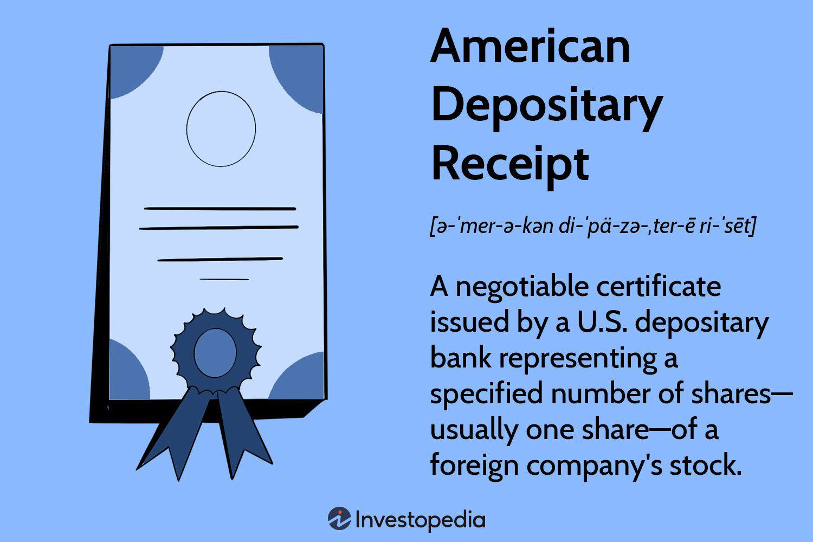

## Table of Contents

## What are American Depositary Receipts (ADRs)?

American Depositary Receipts (ADRs) are a way for Americans to invest in foreign companies. They are certificates issued by U.S. banks that represent shares in a foreign company. This makes it easier for Americans to buy and sell stocks of companies from other countries without dealing with foreign stock exchanges.

ADRs are traded on American stock exchanges, just like regular stocks. This means that investors can buy and sell them during regular trading hours. The price of an ADR is based on the value of the foreign company's stock in its home market, but it's listed in U.S. dollars. This makes it simpler for American investors to understand and manage their investments in foreign companies.

## What are the different types of ADRs?

There are three main types of ADRs: Level I, Level II, and Level III. Level I ADRs are the easiest and cheapest for a foreign company to set up. They are only traded on the over-the-counter market, which is less formal than major stock exchanges. This type is good for companies that want to test the U.S. market without a big commitment.

Level II and Level III ADRs are more involved. Level II ADRs are listed on a major U.S. stock exchange, like the New York Stock Exchange or NASDAQ. This means the foreign company has to meet stricter rules and provide more information to the U.S. regulators. Level III ADRs go even further. They are also listed on a major exchange, but the company can raise money in the U.S. by issuing new shares. This type requires the most effort and cost but can help the company grow by attracting more U.S. investors.

## How are ADRs priced and what factors influence their pricing?

ADRs are priced based on the value of the foreign company's stock in its home market, but the price is shown in U.S. dollars. This means that if the stock price goes up or down in the foreign market, the ADR price will usually follow. The number of ADRs that represent one share of the foreign stock can also affect the price. For example, if one ADR represents two shares of the foreign stock, the ADR price will be twice the price of one share of the foreign stock.

Several factors can influence the pricing of ADRs. Changes in the foreign company's stock price due to its performance, news, or market conditions in its home country are important. Currency exchange rates also play a big role. If the U.S. dollar gets stronger compared to the foreign currency, the ADR price might go down even if the foreign stock price stays the same. On the other hand, if the U.S. dollar weakens, the ADR price might go up. Additionally, general market trends in the U.S., like how investors feel about foreign investments, can affect ADR prices.

## What are the typical fees associated with ADRs?

When you invest in ADRs, you might have to pay some fees. One common fee is the depositary fee. This is charged by the U.S. bank that issues the ADR. The fee helps cover the costs of managing the ADR program. It's usually a small amount, like a few cents per share, and it's often taken out of the dividends you get from the foreign company. If the foreign company doesn't pay dividends, you might get a bill for the fee instead.

Another fee you might see is the conversion fee. This can happen if you want to turn your ADRs back into the foreign company's shares. The fee covers the cost of making this change. Also, when you buy or sell ADRs, you'll pay the usual trading fees and commissions that come with buying and selling stocks. These fees can add up, so it's good to know about them before you start investing in ADRs.

## How are taxes applied to ADRs for U.S. investors?

When U.S. investors buy ADRs, they need to think about taxes. The good news is that ADRs are treated just like regular U.S. stocks for tax purposes. This means you pay capital gains tax on any profit you make when you sell your ADRs. If you hold the ADRs for more than a year, you get the lower long-term capital gains tax rate. If you sell them in less than a year, you pay the higher short-term capital gains tax rate, which is the same as your regular income tax rate.

If the foreign company pays dividends, you'll also have to pay taxes on those. The U.S. has tax treaties with many countries that can help lower the amount of tax you pay on these dividends. Sometimes, the foreign country might also take out a withholding tax on the dividends before they reach you. You can often claim a credit for this on your U.S. tax return, but it can make your taxes a bit more complicated. It's a good idea to talk to a tax professional to make sure you're handling everything correctly.

## What is the difference between sponsored and unsponsored ADRs?

Sponsored ADRs are created when a foreign company works with a U.S. bank to issue the ADRs. The company and the bank have a formal agreement, and the company helps with things like providing financial information and paying some of the costs. Sponsored ADRs can be Level I, II, or III, depending on how much the company wants to be involved in the U.S. market. This type of ADR is more common because it gives the company more control over how its stock is handled in the U.S.

Unsponsored ADRs, on the other hand, are set up by a U.S. bank without any help from the foreign company. The bank does all the work and takes on all the costs. The foreign company doesn't have any say in how the ADRs are managed. Unsponsored ADRs are usually Level I and are only traded on the over-the-counter market. They can be a good way for investors to buy shares in a foreign company that doesn't want to be involved in the U.S. market, but they might not have as much information available as sponsored ADRs.

## How can investors buy and sell ADRs?

Investors can buy and sell ADRs just like they would with any other stock. They can use a regular brokerage account to place orders through their broker or online trading platform. When an investor wants to buy an ADR, they look up the ADR's ticker symbol, decide how many shares they want, and place a buy order. If they want to sell, they place a sell order for the number of ADRs they own. The process is the same as trading stocks of U.S. companies, making it easy for investors to include ADRs in their portfolios.

There are a few things to keep in mind when trading ADRs. First, investors should check if their brokerage account allows trading of ADRs. Most major brokers do, but it's good to confirm. Second, they need to be aware of the trading hours. ADRs are traded during U.S. market hours, but the price can be affected by what happens in the foreign company's home market, which might be open at different times. Lastly, investors should consider any fees or taxes that come with ADRs, as these can affect their overall returns.

## What are the advantages of investing in ADRs?

Investing in ADRs gives U.S. investors a chance to own shares in foreign companies without the hassle of dealing with foreign stock markets. This means you can buy and sell these stocks just like you would with any U.S. company, making it easier to add international stocks to your investment mix. ADRs are listed in U.S. dollars, so you don't have to worry about converting currencies when you buy or sell them. This can be a big help if you want to spread your investments across different countries but don't want to deal with the complexities of foreign markets.

Another advantage of ADRs is that they can help you diversify your portfolio. By investing in companies from different parts of the world, you can reduce the risk that comes from having all your money in one country's market. If the U.S. market goes down, your foreign investments might still do well, balancing out your losses. Plus, you get to invest in some of the biggest and most successful companies around the world, which might not be available on U.S. exchanges otherwise. This can open up new opportunities for growth and income that you might miss out on if you only invest in U.S. companies.

## What are the risks associated with ADR investments?

Investing in ADRs can be risky because they depend on what happens in the foreign company's home country. If the economy there goes down, or if there are problems like political issues or natural disasters, the value of the ADR might drop. Also, the price of an ADR can change a lot because of currency exchange rates. If the U.S. dollar gets stronger compared to the foreign currency, the ADR price might go down, even if the foreign company is doing well. This can make ADRs more unpredictable than regular U.S. stocks.

Another risk is that you might not get as much information about the foreign company as you would with a U.S. company. Some countries have different rules about what companies have to tell investors, so you might not know as much about the company's financial health or future plans. This can make it harder to make good investment choices. Plus, there might be extra fees and taxes with ADRs that you don't see with U.S. stocks, which can eat into your profits.

## How do ADRs impact the foreign company issuing them?

When a foreign company issues ADRs, it can help them reach more investors in the U.S. This means they can raise more money to grow their business. By selling ADRs, the company can get more attention from American investors and maybe even get listed on a big U.S. stock exchange. This can make the company look more important and trustworthy, which can be good for their business.

But there are also some challenges for the foreign company. They have to follow U.S. rules about what they need to tell investors, which can be hard and costly. They might need to spend a lot of money on things like translating their financial reports into English and making sure they meet all the U.S. rules. If the U.S. market goes down or if the exchange rate changes a lot, it can affect the price of their ADRs and make it harder for them to raise money.

## What regulatory requirements must be met for an ADR to be listed on a U.S. exchange?

When a foreign company wants to list its ADRs on a U.S. exchange like the New York Stock Exchange or NASDAQ, it has to follow some strict rules set by the U.S. Securities and Exchange Commission (SEC). The company needs to file a registration statement with the SEC, which includes detailed information about their business, finances, and any risks investors should know about. They also have to keep up with regular reporting, like sending quarterly and yearly financial reports. This makes sure that U.S. investors get all the information they need to make smart choices.

For Level II and Level III ADRs, the rules are even tougher. The company has to meet the listing standards of the exchange they want to be on, which might include things like having a certain amount of money or a minimum number of shareholders. They also have to follow the rules of the exchange about how they act and what they tell investors. All of this can be a lot of work and cost a lot of money, but it helps make sure the ADRs are fair and safe for U.S. investors.

## How do currency fluctuations affect the value of ADRs?

Currency fluctuations can have a big impact on the value of ADRs. When the U.S. dollar gets stronger compared to the foreign currency, the price of the ADR might go down. This is because the value of the foreign company's stock in its home market stays the same, but it's worth less in U.S. dollars. So, if you're an American investor, your ADR might not be worth as much money as before, even if the foreign company is doing well.

On the other hand, if the U.S. dollar gets weaker compared to the foreign currency, the price of the ADR might go up. This happens because the foreign company's stock is now worth more in U.S. dollars. So, even if nothing changes with the foreign company, the value of your ADR can go up just because of the exchange rate. This means that when you invest in ADRs, you need to keep an eye on what's happening with currency exchange rates, as they can make your investment go up or down.

## What are the pricing, costs, and taxation considerations for American Depositary Receipts (ADRs)?

American Depositary Receipts (ADRs) offer investors a method to invest in foreign stocks while enjoying the familiar transaction mechanisms found in the U.S. markets. As such, they present unique pricing, cost structures, and tax implications that differ from domestic investments.

### Pricing of ADRs relative to Underlying Foreign Shares
The pricing of ADRs is directly linked to the value of the underlying foreign shares. Typically, each ADR represents a specific number of shares in the foreign company. The relationship can be described by the equation:

$$
\text{ADR Price} = \left(\text{Price of Foreign Share} \right) \times \text{Exchange Rate} \times \text{Ratio}
$$

Where:
- The **Price of Foreign Share** is the current market price of the share in its home market.
- The **Exchange Rate** adjusts the price based on currency conversion between the foreign currency and the U.S. dollar.
- The **Ratio** indicates the number of foreign shares represented by one ADR.

### Costs Associated with ADRs
Investing in ADRs involves several costs that investors must consider:

1. **Custody Fees**: These are fees levied by banks or custodian institutions to cover the cost of holding the underlying shares. Custody fees are usually deducted from dividends or imposed annually, often ranging from $0.01 to $0.05 per share.

2. **Transaction Fees**: Similar to regular stock transactions, buying or selling ADRs incurs brokerage fees that can vary depending on the trading platform or broker used.

3. **Exchange Fees**: Some exchanges may impose additional fees for dealing with foreign securities.

### Taxation and Double Taxation
ADRs are subject to taxation rules that involve both the host country of the foreign company and the United States. This dual nationality aspect introduces the concept of double taxation, where dividends paid on ADRs may be taxed by both jurisdictions. Here's how it typically unfolds:

- **Foreign Taxes**: The home country of the foreign company often withholds a percentage of dividend payments. The rate varies based on international tax treaties between the home country and the U.S.

- **U.S. Taxes**: Dividends from ADRs are also taxable under U.S. law. However, investors may claim a Foreign Tax Credit to offset taxes paid to the foreign government, reducing the effect of double taxation.

### Navigating Tax Complexities
Investors can employ several strategies to manage the tax complexities of ADRs:

1. **Utilizing Tax Credits**: By claiming a Foreign Tax Credit on their U.S. tax returns, investors can reduce their tax liabilities by the amount already paid as foreign tax.

2. **Understanding Tax Treaties**: It’s crucial for investors to familiarize themselves with the tax treaty between the U.S. and the foreign company’s home country, as this can affect the withholding rate.

3. **Consulting Tax Professionals**: Given the intricacies of international taxation, investors may find it beneficial to work with a tax advisor familiar with foreign investments to ensure compliance and tax efficiency.

These considerations in pricing, costs, and taxation equip investors with the knowledge to effectively evaluate ADR investments, optimizing their approach within the global financial landscape.

## References & Further Reading

[1]: Reilly, F. K., & Brown, K. C. (2011). ["Investment Analysis and Portfolio Management"](https://books.google.com/books/about/Investment_Analysis_and_Portfolio_Manage.html?id=CfB-qTXqRWEC). Cengage Learning.

[2]: Gagnon, L., & Karolyi, G. A. (2004). ["Multi-market trading and arbitrage"](https://www.sciencedirect.com/science/article/pii/S0304405X10000486). Journal of Financial Economics, 73(1), 85-119.

[3]: Lopez de Prado, M. (2018). ["Advances in Financial Machine Learning"](https://www.amazon.com/Advances-Financial-Machine-Learning-Marcos/dp/1119482089). Wiley.

[4]: Shapiro, A. C. (1994). ["Multinational Financial Management"](https://books.google.com/books/about/Multinational_Financial_Management.html?id=gDLDDwAAQBAJ). Wiley.

[5]: Chordia, T., Roll, R., & Subrahmanyam, A. (2008). ["Liquidity and Market Efficiency"](https://www.sciencedirect.com/science/article/pii/S0304405X07001833). Journal of Financial Economics, 87(2), 276-309.