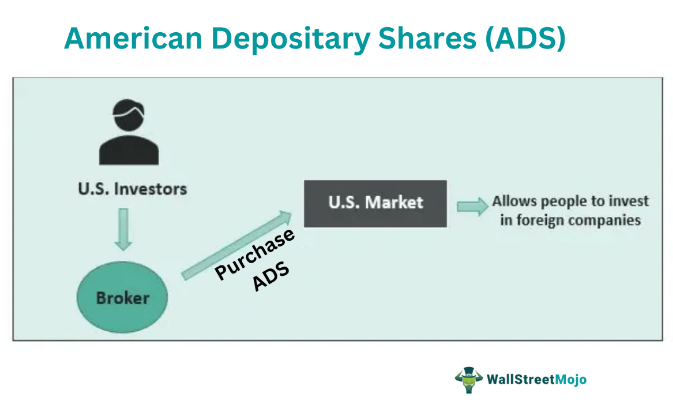

The purpose of this article is to shed light on the mechanisms and significance of American Depositary Shares (ADS) and American Depositary Receipts (ADR). These financial instruments are integral for U.S. investors seeking exposure to international markets without the direct involvement in foreign exchanges. Understanding ADS and ADR is crucial, as they facilitate smoother, more diverse investment strategies, thereby enriching global investment portfolios.

American Depositary Shares and Receipts are pivotal in bridging the gap between various financial markets. By allowing U.S. investors easy access to foreign equities, ADS and ADR expand the possibilities for diversification and risk management. This capability is of paramount importance in today's interconnected global economy, where investment opportunities can arise in any part of the world. Investors, therefore, must grasp the operations and benefits of ADS and ADR to make informed decisions when broadening their investment horizons.

Furthermore, the rise of algorithmic trading has redefined the landscape of financial markets. Algorithmic trading entails the use of computer algorithms to execute trades, often at speeds and frequencies impractical for human traders. Its growing popularity is driven by the potential for increased efficiency, reduced transaction costs, and the capacity to capitalize on market opportunities with precision. Incorporating ADS and ADR into algorithmic trading strategies may offer unique advantages, such as improved liquidity and the ability to execute cross-border trades with ease.

This article covers critical areas, including the nuanced differences between ADS and ADR, how they are structured, and their impact on trading strategies. Additionally, we will explore how these instruments can be leveraged within algorithmic trading frameworks, potentially enhancing the scope and efficacy of such strategies.

The intended audience for this article comprises investors, traders, and finance professionals. Whether you are a seasoned trader looking to refine your algorithmic strategies or an investor seeking to diversify your portfolio with foreign assets, understanding the interplay of ADS, ADR, and algorithmic trading is an essential stepping stone towards achieving your financial objectives.

## Table of Contents

## Understanding American Depositary Shares (ADS)

American Depositary Shares (ADS) represent a financial mechanism that facilitates the trading of foreign equities in the U.S. stock market. They allow U.S. investors to purchase shares of foreign companies without the complexities typically associated with direct investments in overseas entities. ADS are created by U.S. depositary banks that hold a predetermined number of shares of a foreign company in their custody. These shares are issued in the form of ADRs (American Depositary Receipts), which are negotiable certificates representing ownership of ADS.

The creation process of ADS involves several steps. Firstly, a foreign company collaborates with a U.S. depositary bank to deposit its original shares in a foreign bank, chosen by the depositary bank. The U.S. depositary bank then issues ADS in correlation with the deposited shares, making them available for trading on U.S. exchanges such as the New York Stock Exchange (NYSE) or NASDAQ. This arrangement simplifies the process for U.S. investors by eliminating the need to deal with currency conversions, foreign regulations, and other potential barriers inherent in purchasing foreign stocks directly.

One of the primary advantages of ADS is their role in providing American investors access to foreign companies and markets. This ability to diversify beyond domestic investments can enhance portfolio diversification, allowing investors to hedge against domestic market [volatility](/wiki/volatility-trading-strategies). Furthermore, ADS are traded in U.S. dollars, simplifying trading processes and eliminating the need for investors to manage purchases in foreign currencies directly. However, this advantage does not entirely remove currency risk. Since the underlying foreign shares are held in a foreign currency, fluctuations in exchange rates can affect the value of the ADS. Hence, investors are indirectly exposed to currency risks and must consider these potential fluctuations in their investment strategies.

The key features of ADS include their accessibility and the regulatory framework governing their issuance and trading. Being listed on major U.S. exchanges ensures high visibility and [liquidity](/wiki/liquidity-risk-premium), making them an attractive option for U.S. investors seeking to include international equities in their portfolios. Additionally, ADS must comply with U.S. regulatory standards, which adds a layer of protection and transparency not always available when investing directly in foreign securities.

In summary, American Depositary Shares serve as a pivotal bridge for U.S. investors wishing to explore opportunities in foreign companies through the U.S. stock market. They offer significant benefits in terms of market access and trading simplicity while carrying inherent currency risks that investors must manage prudently.

## What Is an American Depositary Receipt (ADR)?

An American Depositary Receipt (ADR) is a financial instrument that allows U.S. investors to invest in foreign companies' securities without the complexities of dealing in international exchanges. Introduced in the 1920s, ADRs are traded on U.S. stock markets in the same way as domestic shares, providing an accessible avenue for domestic investors to participate in global markets.

An ADR is distinct from an American Depositary Share (ADS) in that the ADR is actually a certificate issued by a U.S. depositary bank that represents a specified number of shares—known as ADS—of a foreign company. While the ADS represents the actual foreign shares held on deposit by the depositary bank, the ADR is the certificate that can be traded on U.S. exchanges.

**Issuance Process of ADRs:**

The process begins when a U.S. depositary bank purchases shares of a foreign company in its native country and holds them. For each share held, the bank issues a corresponding ADR, which investors can then trade on American stock exchanges. This process effectively transforms foreign shares into U.S. securities, allowing for easier transactions that follow U.S. securities regulations.

**Types of ADRs:**

ADRs can be classified broadly into two categories:

1. **Sponsored ADRs:** In this arrangement, the foreign company has a formal agreement with the U.S. depositary bank, and the ADRs typically offer additional benefits such as dividend payments and voting rights. Sponsored ADRs are also more likely to be listed on major stock exchanges like the NYSE or NASDAQ, making them more visible and accessible.

2. **Unsponsored ADRs:** These are created without the involvement or consent of the foreign company, which can lead to multiple banks issuing ADRs for the same foreign company. Unsponsored ADRs usually trade over-the-counter (OTC) and may not carry the same rights as sponsored ADRs.

**Benefits to U.S. Investors:**

ADRs provide several advantages to U.S. investors, including:

- **Simplified Transaction Process:** Investors can buy and sell ADRs on U.S. exchanges just as they would any U.S. stock, leading to a more straightforward investment process without learning foreign trading systems.

- **Currency Conversion:** ADRs inherently involve currency conversion, theoretically shielding investors from some of the complexity and transaction costs associated with such conversions directly, although currency risk still exists.

- **Access to International Markets:** ADRs democratize access to international equities, allowing investors to diversify their portfolios across different geographies with relative ease.

**Regulatory Aspects:**

The trading and issuance of ADRs are subject to regulation by the U.S. Securities and Exchange Commission (SEC). Sponsored ADRs must adhere to SEC disclosure requirements, akin to domestic companies, which enhances transparency and protects investors. Unsponsored ADRs, conversely, may not be held to the same stringent reporting standards. The level of regulation ensures a degree of trust and reliability, encouraging more investors to engage with these instruments confidently.

In summary, ADRs bridge the gap between the U.S. markets and foreign companies, enabling investors to diversify internationally while maintaining the convenience of trading on local exchanges. Their strategic design mitigates some complexities of international investments and aligns with regulatory standards to provide a balanced exposure to global equities.

## Differences Between ADS and ADR

American Depositary Shares (ADS) and American Depositary Receipts (ADR) serve as crucial instruments in facilitating access to foreign equities for U.S. investors, yet they play distinct roles in this process. Understanding their relationship is essential for making informed investment decisions.

**ADS as Actual Shares**

American Depositary Shares represent the actual equity shares of a foreign company held by a U.S. depositary bank. These shares are denominated in U.S. dollars and trade on American stock exchanges. When an investor buys an ADS, they are effectively purchasing a specified number of shares in a foreign company, held and managed by the depositary bank.

**ADRs as Certificates**

In contrast, American Depositary Receipts are certificates issued by depositary banks acting as intermediaries. ADRs certify that a certain number of ADSs are held in custody, enabling simplified trading for investors without directly engaging in foreign exchanges. Essentially, ADRs are the negotiable instruments that provide evidence of ownership in the foreign company's shares held by the bank in the form of ADSs.

**Trading Implications**

Both ADS and ADR allow U.S. investors to bypass complications associated with directly purchasing stocks in foreign markets, such as dealing with foreign exchange rates, differing accounting standards, and varying regulatory environments. Trading ADRs on U.S. exchanges offers convenience comparable to domestic stocks, with transactions settled in U.S. dollars. This systemstreamlines investment choices for U.S. investors, who can diversify their portfolios internationally with relative ease.

**Impact on Investment Strategies**

The distinctions between ADS and ADR can create varied implications for investment strategies and portfolio management. While ADSs provide direct exposure to foreign equities, they entail currency risk associated with fluctuations in the value of the foreign currency relative to the U.S. dollar. This can impact returns, necessitating strategic hedging considerations.

ADRs, being certificates, may sometimes offer less liquidity compared to direct foreign shares, impacting trading volumes and price volatility. However, they also provide investors with the benefit of converting foreign dividends to U.S. dollars, reducing the complexity of managing foreign income streams.

In conclusion, comprehending the differences between ADS and ADR is pivotal for investors aiming to capitalize on global opportunities. By leveraging these instruments effectively, investors can make informed choices tailored to their risk tolerance and investment objectives on the international stage.

## The Role of ADS and ADR in Algorithmic Trading

Algorithmic trading, primarily driven by sophisticated mathematical models and powerful computers, has gained prominence in modern financial markets due to its ability to execute high-frequency trading at speeds unattainable by human traders. The success of [algorithmic trading](/wiki/algorithmic-trading) relies on exploiting minute price discrepancies and capturing [arbitrage](/wiki/arbitrage) opportunities, often across different markets or types of securities. American Depositary Shares (ADS) and American Depositary Receipts (ADR) play a significant role in these strategies, offering unique characteristics that appeal to algorithmic traders.

ADS and ADR are attractive to algorithmic trading for several reasons. First, their presence on U.S. exchanges allows access to foreign equities with the convenience of trading in U.S. dollars. This dual-market existence can create arbitrage opportunities between the U.S. and foreign exchanges. For example, price differences between the ADS trading in the U.S. and the underlying foreign shares can be exploited by algorithms designed to execute price-converging trades, effectively leading to risk-free profit opportunities when correctly timed.

An essential aspect of ADS and ADR trading is liquidity, which is critical for algorithmic strategies focused on high-frequency trading. Liquidity ensures that large orders can be executed swiftly without causing significant price disruption. Many ADRs are traded on major U.S. stock exchanges like the NYSE and NASDAQ, providing the liquidity levels necessary for algorithms to operate effectively. This liquidity facilitates the requisite rapid entry and [exit](/wiki/exit-strategy) of positions, thus suiting high-frequency trading strategies.

Volatility, another key driver for algorithmic trading, presents both opportunities and risks. ADS and ADRs can exhibit volatility due to factors such as exchange rate fluctuations and the performance of the underlying foreign companies. Algorithmic traders can capitalize on this volatility by using strategies like [statistical arbitrage](/wiki/statistical-arbitrage) or [momentum](/wiki/momentum) trading. These strategies employ algorithms to identify and exploit short-term price trends or reversion patterns, thus deriving profit from market inefficiencies. 

There are case studies illustrating the role of ADS and ADR in algorithmic trading. One typical example involves pairs trading, a market-neutral strategy that matches a long position in a security with a short position in a related security. For instance, an algorithm could pair trade an ADR with its corresponding foreign share, utilizing real-time data to spot pricing inefficiencies and perform simultaneous buy and sell actions to capture any emergent spread.

Overall, the integration of ADS and ADR into algorithmic trading strategies highlights their importance in achieving global diversification without leaving U.S. equity markets. As financial technology continues to evolve, these instruments provide avenues for sophisticated trading strategies, leveraging the unique qualities of ADS and ADR to enhance profitability and manage risk.

## Challenges and Considerations in ADS and ADR Trading

Investors engaging in American Depositary Shares (ADS) and American Depositary Receipts (ADR) trading face several challenges and considerations that may impact their investment strategies and outcomes. 

One primary challenge is currency risk. Since ADS and ADRs represent shares of foreign companies, fluctuations in exchange rates between the foreign company’s currency and the U.S. dollar can significantly affect the value of these investments. This exchange rate volatility introduces an inherent risk that investors must assess and manage. For example, if the foreign currency depreciates relative to the U.S. dollar, the value of dividends and capital gains in dollar terms may decrease, even if the share price in the local market remains stable.

Tax complexities also arise in ADS and ADR trading. Different countries impose various tax regulations on dividends and capital gains. Investors may encounter issues related to withholding taxes on dividends, which can be levied by the country where the foreign company is based. Navigating these tax implications requires thorough understanding of international tax treaties and regulations to optimize after-tax returns.

Potential arbitrage opportunities in ADS and ADR trading stem from market inefficiencies between U.S. and foreign stock exchanges. Prices of ADS and ADRs may temporarily diverge from the underlying shares’ prices on their native exchanges due to factors such as time zone differences, liquidity constraints, and differences in market sentiment. Traders can exploit these discrepancies for profit by simultaneously executing buy and sell orders across markets. However, this requires sophisticated technology and timing precision, as well as consideration of transaction costs.

Depositary banks play a crucial role in ADS and ADR trading. They are responsible for issuing ADRs, maintaining custody of the foreign shares, and facilitating the conversion of foreign dividends into U.S. dollars. The efficiency and reliability of these banks directly impact the trading process, influencing factors like liquidity, settlement speed, and transparency. Investors should consider the reputation and service quality of depositary banks when evaluating ADRs.

Risk management strategies are vital for successful ADS and ADR trading. Investors may employ hedging techniques using derivatives such as currency futures or options to mitigate currency risk. Diversification across different countries and sectors can also help reduce portfolio volatility. Additionally, monitoring geopolitical and economic developments in the foreign companies’ home countries can provide timely insights to adjust strategies as needed.

In summary, while ADS and ADR trading offer access to global markets, they introduce unique challenges, including currency risk, tax complexities, and reliance on depositary banks. Investors can identify arbitrage opportunities by exploiting market inefficiencies but must implement robust risk management strategies to mitigate potential downsides.

## Conclusion

American Depositary Shares (ADS) and American Depositary Receipts (ADR) play a pivotal role in modern global investing by providing U.S. investors with seamless access to foreign markets. They enable investors to diversify their portfolios geographically, thus spreading risk and potentially enhancing returns. By understanding the structural and regulatory nuances of ADS and ADR, investors can make more informed decisions and leverage these instruments to tap into international equities with relative ease.

The distinction between ADS, representing the actual shares of a foreign entity, and ADR, a certificate representing these shares, is crucial for navigating trading logistics and regulatory compliance. Each offers unique advantages that cater to different investment strategies and risk appetites. For instance, ADRs simplify the complexities of currency conversions and international tax considerations, making them more appealing for some investors compared to directly purchasing foreign stocks.

The integration of ADS and ADR into algorithmic trading strategies highlights their utility in today's high-frequency trading environment. Algorithmic trading capitalizes on the liquidity and volatility these instruments offer, optimizing trade execution and enhancing market efficiency. The use of advanced algorithms and technology in trading these instruments underlines the dynamic nature of financial markets, where technology continuously reshapes how trading and investing are conducted.

Investors are encouraged to consider ADS and ADR as viable options for diversifying their investment portfolios amidst the rapidly evolving landscape of global finance. Embracing these instruments not only provides exposure to international markets but also aligns with modern trading practices where technology and data-driven decision-making are paramount. As financial markets continue to evolve, understanding and harnessing the potential of ADS and ADR will remain increasingly significant in achieving global investment goals.

## Additional Resources

For those interested in expanding their knowledge on American Depositary Shares (ADS), American Depositary Receipts (ADR), and algorithmic trading, several resources are available:

1. **Reading Materials:**
   - **"American Depositary Receipts: A Guide to DRs"** by The Bank of New York Mellon. This comprehensive guide provides detailed information about the structure, benefits, and functioning of ADRs. Available on BNY Mellon's official website.
   - **"Algorithmic Trading and DMA: An Introduction to Direct Access Trading Strategies"** by Barry Johnson. This book is an excellent primer for understanding the concepts and strategies behind algorithmic trading.
   - **Online Databases and Journals**: The Journal of Financial Markets offers numerous articles on the role of financial instruments like ADS and ADR in global markets.

2. **Regulatory Resources:**
   - **U.S. Securities and Exchange Commission (SEC)**: For updates on regulatory changes affecting ADS and ADR, the SEC's website (www.sec.gov) is a crucial resource, providing access to the latest filings and regulatory updates.
   - **Financial Industry Regulatory Authority (FINRA)**: Offers guidance on compliance and regulation, useful for understanding the trading rules that affect ADS and ADR.

3. **Tools and Services:**
   - **Bloomberg Terminal**: An essential tool for investors and traders, providing real-time data, news updates, and analytics for ADS, ADR, and broader financial markets.
   - **Reuters Eikon**: Offers insights and market data, which can facilitate the management and analysis of ADS and ADR investments.
   - **Interactive Brokers Platform**: Known for its comprehensive trading and investment tools, it supports global trading of ADRs and provides resources for algorithmic trading integration.

These resources can offer a well-rounded understanding and assist in navigating the complexities of investing in ADS, ADR, and employing algorithmic trading strategies.

## References & Further Reading

[1]: Bynum, M., Sabol, J., & Weidner, M. (2014). ["Understanding American Depositary Receipts (ADRs)."](https://core.ac.uk/download/pdf/71455557.pdf) Neuberger Berman.

[2]: The Bank of New York Mellon. ["American Depositary Receipts: A guide to DRs."](https://www.bnymellon.com/content/dam/bnymellon/documents/pdf/depositary-receipts-brochure.pdf)

[3]: Lopez de Prado, M. (2018). ["Advances in Financial Machine Learning."](https://www.amazon.com/Advances-Financial-Machine-Learning-Marcos/dp/1119482089) Wiley.

[4]: Johnson, B. (2010). ["Algorithmic Trading & DMA: An introduction to direct access trading strategies."](https://archive.org/details/algorithmictradi0000john) 4Myeloma Press.

[5]: Securities and Exchange Commission. ["American Depositary Receipts."](https://www.sec.gov/investor/alerts/adr-bulletin.pdf) 

[6]: Chan, E. P. (2009). ["Quantitative Trading: How to Build Your Own Algorithmic Trading Business."](https://github.com/ftvision/quant_trading_echan_book) Wiley.