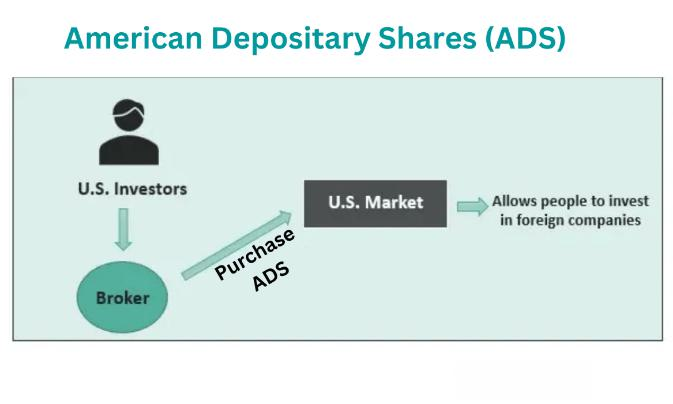

In today's interconnected global economy, investment opportunities are not confined to domestic markets. The advent of American Depositary Shares (ADS) and algorithmic trading has opened new avenues for U.S. investors, allowing them to access foreign equities while optimizing trading strategies. By employing these two financial mechanisms, investors can broaden their investment portfolios and potentially increase their returns by leveraging international market dynamics.

American Depositary Shares (ADS) serve as a bridge for U.S. investors looking to invest in foreign companies. Issued by U.S. banks, these instruments represent equity shares of a foreign company and can be traded on U.S. stock exchanges, offering a more straightforward route for investors seeking international diversification. Similarly, algorithmic trading uses computer algorithms to execute trades, capitalizing on market efficiencies and discrepancies that human traders might overlook. When combined with ADS, algorithmic trading can help optimize the execution of trades involving international securities, thereby enhancing portfolio efficiency and performance.



Importantly, understanding the distinctions between ADS and related instruments like American Depositary Receipts (ADR) is crucial for investors. While both facilitate foreign investment, they operate differently and have unique implications for investor portfolios. Moreover, the integration of these instruments into algorithmic trading frameworks can offer significant advantages, such as exploiting arbitrage opportunities and managing risks effectively in a global trading context.

By exploring how ADS and ADR function, the benefits they offer, and the challenges they pose, this article aims to equip readers with the necessary insights to navigate and capitalize on these sophisticated investment vehicles. As global markets continue to evolve, mastering these instruments will be instrumental in expanding investment strategies and achieving global portfolio diversification.

## Table of Contents

## Understanding American Depositary Shares (ADS)

American Depositary Shares (ADS) provide a mechanism for U.S. investors to access foreign equities through domestic stock exchanges, thereby facilitating international investment without the complexities of dealing with overseas financial markets. These financial instruments are essentially U.S. dollar-denominated equity shares that represent ownership in a foreign corporation, making it possible for U.S. investors to purchase shares of international companies without directly engaging with foreign stock exchanges or handling foreign currencies.

The creation of ADS involves a foreign corporation placing its shares with a U.S. custodian bank. This bank then issues a corresponding number of ADS that can be traded on U.S. exchanges like the New York Stock Exchange (NYSE) or NASDAQ. By handling the listing and trading of foreign shares domestically, ADS allow investors to sidestep issues like currency conversion, differing accounting standards, and unfamiliar regulatory environments that are typically encountered when investing directly in a foreign market.

Investing in ADS offers advantages such as broadening investment opportunities and enhancing portfolio diversity by granting exposure to growth opportunities in international markets. However, owning ADS does come with certain risks, including currency risk. Since the underlying shares are priced in the foreign company’s local currency, fluctuations in exchange rates can affect the value of the ADS in U.S. dollars. For instance, if the foreign currency depreciates against the dollar, the corresponding value of the ADS may decrease, affecting the investor's returns.

The regulatory framework governing ADS is designed to ensure transparency and protect investors. ADS are subject to regulation by the U.S. Securities and Exchange Commission (SEC), which requires that foreign companies provide financial disclosures that are comparable to those required of U.S. companies. This regulation alleviates some of the concerns U.S. investors might have about investing in foreign entities, as it mandates adherence to financial reporting standards that facilitate informed investment decisions.

In summary, American Depositary Shares serve as a bridge for U.S. investors to access and invest in foreign companies with relative ease while navigating the inherent risks and regulatory requirements associated with such investments.

## What Is an American Depositary Receipt (ADR)?

An American Depositary Receipt (ADR) is a financial instrument issued by a U.S. depositary bank. It serves as a certificate representing one or more shares of a foreign company. ADRs significantly simplify the process for U.S. investors wishing to invest in foreign securities, as they trade like regular stocks on U.S. exchanges. This feature allows investors to bypass the complexities of foreign markets, enabling easier access to international opportunities.

ADRs come in two primary forms: sponsored and unsponsored. Sponsored ADRs are established through a formal agreement between the issuing foreign company and the U.S. depositary bank. These agreements generally provide benefits such as voting rights and better alignment with shareholder interests, as the foreign company tends to support and promote the ADR program. Conversely, unsponsored ADRs are initiated without the direct participation of the foreign company, typically trading over-the-counter (OTC). These ADRs might amalgamate shares from multiple depositary banks, which can sometimes result in varied terms for investors.

One notable advantage of ADRs is the simplification of currency-related complications. While ADRs are traded in U.S. dollars and may offer dividends in the same currency, the underlying foreign security's value remains subject to exchange rate fluctuations. Thus, investors are still exposed to currency risk, although they are relieved from directly handling foreign currency transactions.

Regulated by the U.S. Securities and Exchange Commission (SEC), ADRs adhere to stringent disclosure requirements that align with U.S. investor protection standards. This regulatory oversight helps ensure that investors have access to transparent and reliable financial information, mitigating some of the risks associated with investing in foreign entities. By meeting these requirements, ADRs contribute to a secure and accessible pathway for U.S. investors to engage with global markets.

## Differences Between ADS and ADR

American Depositary Shares (ADS) and American Depositary Receipts (ADR) serve distinct yet complementary roles in facilitating U.S. investors' access to foreign equities. These instruments are often perceived interchangeably due to their overlapping purposes, but critical differences distinguish their functionalities.

Firstly, ADS represent the actual equity shares of a foreign company. When a foreign business seeks access to U.S. capital, it deposits its shares with a U.S. custodian bank, which in turn issues ADS. This process allows U.S. investors to acquire direct ownership stakes in foreign entities, with the shares denominated in the foreign currency, thus subjecting investors to any exchange rate variations. This characteristic underscores the intrinsic currency risk associated with ADS holdings, as fluctuations in exchange rates can significantly impact the valuation of these investments.

Contrastingly, ADRs are certificates issued by a U.S. depositary bank, serving as negotiable instruments on American stock exchanges. These receipts do not constitute direct ownership of the foreign company's shares. Importantly, ADRs facilitate investment by converting foreign shares into instruments that pay dividends in U.S. dollars, which mitigates the complexity of currency conversions for investors. This feature simplifies the investment process, enabling investors to receive dividends without the hassle of handling multiple currencies.

While both ADS and ADR remove the barriers of direct foreign market interaction, ADS holders bear the direct consequences of currency exchange risks on their underlying shares. Conversely, ADR investors benefit from a layer of currency conversion that provides stability in income through dollar-denominated dividends.

A nuanced understanding of these differences in operational mechanics is crucial for investors who aim to optimize their international portfolio diversification. Navigating the dual marketplace offered by ADS and ADR requires an awareness of how these vehicles operate within the global financial landscape, ensuring that investors can leverage these instruments effectively in their quest for broader market exposure.

## The Role of ADS and ADR in Algorithmic Trading

Algorithmic trading uses computer algorithms to execute trades with remarkable speed and efficiency, capturing opportunities for profit that might be missed by slower human interventions. American Depositary Shares (ADS) and American Depositary Receipts (ADR) play critical roles in such [algorithmic trading](/wiki/algorithmic-trading) strategies mainly because of their availability in dual markets and inherent [liquidity](/wiki/liquidity-risk-premium). These financial instruments facilitate efficient cross-border trading and enhance potential returns by leveraging price differences across various markets.

ADS and ADR are particularly valuable in algorithmic trading strategies due to their capacity to represent foreign equities on U.S. exchanges. This characteristic provides unique opportunities for [arbitrage](/wiki/arbitrage), which relies on the difference in prices of the same asset in different markets. A typical arbitrage strategy used in this context involves simultaneously buying and selling a security in different markets to take advantage of differing prices for the same asset.

Algorithmic trading strategies exploit these price discrepancies, leading to price convergence trades that can generate substantial profits. This is particularly apparent when trading ADS and ADR, as these instruments often experience price differences between their home exchanges and U.S. markets. Algorithms can be programmed to monitor these discrepancies in real-time and execute trades swiftly, capitalizing on even the smallest margin for profit.

Furthermore, the liquidity and [volatility](/wiki/volatility-trading-strategies) of ADS and ADR contribute to an environment where high-frequency trading and [statistical arbitrage](/wiki/statistical-arbitrage) strategies can thrive. Liquidity ensures that large trade volumes can be executed without significantly affecting the stock price, while volatility offers the price movements necessary to realize profits from algorithmic strategies. In high-frequency trading, computers make thousands of trades per second, benefiting from small price differences that would be irrelevant in slower trading.

By incorporating ADS and ADR into algorithmic trading frameworks, traders can significantly enhance their ability to optimize execution and manage various types of risk effectively. For instance, algorithms can be designed to adjust quickly to changes in market conditions, ensuring prompt responses to geopolitical events or economic announcements that might impact the value of foreign equities.

To better illustrate how algorithmic trading with ADS and ADR is implemented, consider a simple Python algorithm that seeks price arbitrage between two markets:

```python
import yfinance as yf
import time

# Function to fetch current price from two different exchanges
def get_current_prices(stock_ticker_1, stock_ticker_2):
    stock_1 = yf.Ticker(stock_ticker_1)
    stock_2 = yf.Ticker(stock_ticker_2)
    price_1 = stock_1.history(period='1d')["Close"].iloc[-1]
    price_2 = stock_2.history(period='1d')["Close"].iloc[-1]
    return price_1, price_2

# Arbitrage trading logic
def arbitrage(ads_ticker, adr_ticker, threshold):
    price_1, price_2 = get_current_prices(ads_ticker, adr_ticker)
    if abs(price_1 - price_2) > threshold:
        if price_1 > price_2:
            action = f"Buy {adr_ticker} and sell {ads_ticker}"
        else:
            action = f"Buy {ads_ticker} and sell {adr_ticker}"
        return action
    return "No arbitrage opportunity"

# Main loop to continuously check for arbitrage opportunities
while True:
    print(arbitrage('ADS_TICKER', 'ADR_TICKER', 0.05))
    time.sleep(60) # Wait for a minute before next check
```

The above Python script captures stock prices of ADS and ADR, evaluates the price difference, and suggests a trading action if an arbitrage opportunity is detected. While simplified, this example underscores the potential of algorithmic trading with ADS and ADR, enabling high-efficiency trading on a global scale. By strategically using these financial instruments in conjunction with ever-evolving algorithms, traders can place themselves in an advantageous position within the complex interactions of global financial markets.

## Challenges and Considerations in ADS and ADR Trading

Trading in American Depositary Shares (ADS) and American Depositary Receipts (ADR) presents several challenges that investors must navigate to optimize their investment returns. One primary challenge is currency risk, a significant [factor](/wiki/factor-investing) when dealing with foreign equities. Currency exchange rate fluctuations can directly impact the valuation of ADS holdings, because these shares are priced in both the foreign currency of the issuer and the U.S. dollar. Investors are exposed to this risk as the foreign exchange rate between the two currencies varies over time.

Tax implications form another critical challenge for ADS and ADR investors. When dividends are paid out, they may be subject to withholding tax in the issuing company’s home country. This taxation can erode net returns, complicating the investment landscape for U.S. investors. Understanding bilateral tax treaties and foreign tax credits available in the U.S. can be beneficial in mitigating these effects.

Arbitrage opportunities arise from pricing inefficiencies across various markets, given that the same underlying equity can be traded as a local share, an ADS, or an ADR. However, seizing these opportunities necessitates precise execution of trading strategies. Algorithmic trading systems can be deployed to exploit these small discrepancies across global markets, but they require sophisticated software and real-time data to operate effectively.

The efficiency of depositary banks also profoundly influences ADS and ADR trading. These banks are responsible for issuing the ADS or ADR and ensuring accurate financial disclosures, dividend payments, and compliance with regulatory requirements. Ineffective governance or operational inefficiencies on their part can lead to delays or inaccuracies that impact investor confidence and asset pricing.

Moreover, transaction costs and associated fees must be taken into account. These costs can vary depending on the market and the financial institution handling the trades. High transaction costs can diminish the benefits gained from diversifying into international equities through ADS and ADR.

Finally, successful trading in ADS and ADR demands robust risk management strategies. Investors should remain vigilant regarding geopolitical and economic developments in the countries where the foreign companies are headquartered. Changes in political leadership, economic policies, or unforeseen events can have substantial effects on market conditions and, by extension, on ADS and ADR valuations. Employing hedging techniques or diversifying across different regions and sectors may help manage these risks effectively. Thus, a comprehensive understanding of these challenges and considerations is crucial for investors aiming to achieve optimal outcomes in their ADS and ADR trading endeavors.

## Conclusion

American Depositary Shares (ADS) and American Depositary Receipts (ADR) play pivotal roles in allowing U.S. investors to access international equities while maintaining the convenience and regulatory protections of trading on domestic exchanges. These financial instruments bridge the gap between U.S. investors and foreign markets, providing a structured and accessible means of global investment. Recognizing the distinct structural differences between ADS and ADR, as well as their respective trading implications, is crucial. This understanding enables investors to strategically leverage these instruments to unlock broader investment horizons and optimize their portfolios.

The integration of ADS and ADR into algorithmic trading frameworks underlines the dynamic progression of financial markets and highlights how technology facilitates intricate and efficient trading practices. Algorithmic trading capitalizes on these instruments by exploiting price discrepancies and enhancing liquidity, thereby optimizing execution strategies and risk management in global trade environments.

Investors are strongly encouraged to explore the potential of ADS and ADR as effective tools for achieving comprehensive global diversification. These instruments not only provide exposure to a diverse set of international equities but also empower investors to pursue informed trading strategies that align with broader financial goals.

As the complexities and interconnections of global markets continue to evolve, ADS and ADR are poised to remain instrumental in expanding cross-border investment opportunities and enhancing financial planning. By ensuring that investors are well-informed and strategically equipped, these investment vehicles will continue to contribute significantly to the landscape of international finance.

## References & Further Reading

[1]: Karolyi, G. A. (2004). ["The Role of American Depositary Receipts in the Development of Emerging Markets"](https://www.jstor.org/stable/20065416). Review of Economics and Statistics, 86(3), 670-690.

[2]: Gagnon, L. & Karolyi, G. A. (2010). ["Do International Cross-listings Still Matter?"](https://papers.ssrn.com/sol3/papers.cfm?abstract_id=1650205) Emerging Markets Review, 11(2), 167-189.

[3]: Hasbrouck, J. (2003). ["Intraday Price Formation in U.S. Equity Markets"](https://onlinelibrary.wiley.com/doi/10.1046/j.1540-6261.2003.00609.x). Journal of Finance, 58(6), 2375-2405.

[4]: Lopez de Prado, M. (2018). ["Advances in Financial Machine Learning"](https://www.amazon.com/Advances-Financial-Machine-Learning-Marcos/dp/1119482089) by Wiley.

[5]: Jansen, S. (2018). ["Machine Learning for Algorithmic Trading: Predictive Models to Extract Signals from Market and Alternative Data for Systematic Trading Strategies with Python"](https://www.amazon.com/Machine-Learning-Algorithmic-Trading-alternative/dp/1839217715).

[6]: Fernald, J. M., & Rogers, J. H. (2002). ["Puzzles in the Chinese Stock Market"](https://direct.mit.edu/rest/article/84/3/416/57330/Puzzles-in-the-Chinese-Stock-Market). Review of Economics and Statistics, 84(3), 416-432.