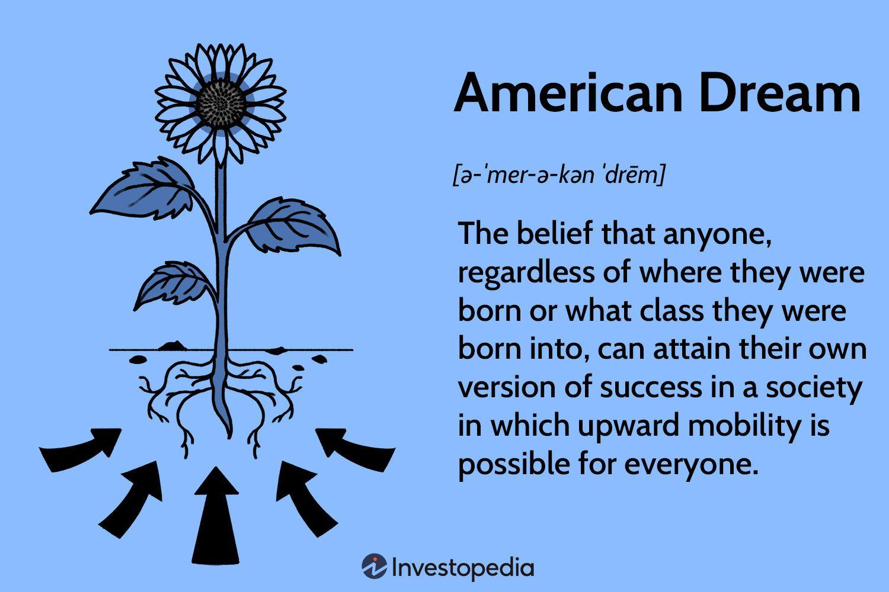

## Table of Contents

## What is the American Dream?

The American Dream is the idea that anyone in the United States can achieve success and happiness through hard work. It means that no matter who you are or where you come from, you can have a good life if you try your best. This dream includes having a nice home, a good job, and a happy family. It's about having the freedom to chase your goals and make your dreams come true.

The idea of the American Dream started a long time ago, when people first came to America hoping for a better life. They believed that in America, they could escape problems like poverty and unfair treatment. Over time, the American Dream has changed, but the main idea is still the same. People still believe that with hard work and determination, they can achieve their goals and live a good life.

## How did the concept of the American Dream originate?

The concept of the American Dream began in the early days of America, when people first came to the country looking for a better life. These early settlers, many of whom came from Europe, were escaping things like poverty, religious persecution, and lack of freedom. They believed that in America, they could start over and build a new life where they could be free and successful. This idea of a fresh start and the possibility of achieving success through hard work became the foundation of the American Dream.

Over time, the American Dream grew and changed. In the 20th century, it became closely linked with the idea of owning a home, having a good job, and raising a family. The term "American Dream" was popularized by historian James Truslow Adams in his 1931 book, "The Epic of America." Adams described it as "that dream of a land in which life should be better and richer and fuller for everyone, with opportunity for each according to ability or achievement." This idea captured the hearts of many Americans and continues to inspire people today, even as the specific goals and dreams of individuals evolve.

## What are some common elements of the American Dream?

The American Dream often includes the idea of having a good job. People dream of working hard and [earning](/wiki/earning-announcement) enough money to support themselves and their families. This job should provide a stable income and maybe even let them save some money for the future. Many people also hope to climb the career ladder and achieve more success over time.

Another common element is owning a home. For many Americans, buying a house is a big part of the dream. A home represents stability and a place to call their own. It's somewhere they can raise a family and build a life. Owning a home is a sign that they have achieved a level of success and security.

Having a happy family is also a key part of the American Dream. People want to spend time with their loved ones and enjoy life together. They dream of giving their children a good education and a bright future. A happy family life is seen as a reward for hard work and a sign that they have achieved the American Dream.

## Can you provide historical examples of the American Dream?

One historical example of the American Dream is the story of Andrew Carnegie. He came to the United States from Scotland when he was just a boy. Carnegie started working in a cotton factory and later became a telegraph messenger. Through hard work and smart investments, he built a huge steel company and became one of the richest men in America. His story shows how someone can come from nothing and achieve great success in the United States.

Another example is the story of Oprah Winfrey. She grew up in poverty in Mississippi and faced many challenges as a child. Despite these difficulties, Oprah worked hard and became a successful television host and media mogul. Her show, "The Oprah Winfrey Show," became very popular, and she used her success to help others. Oprah's story shows that with determination and hard work, anyone can achieve their dreams in America, no matter where they start.

These examples show how the American Dream has inspired people throughout history. Both Carnegie and Oprah started with little and used their hard work and determination to achieve great success. Their stories are powerful examples of what can be possible in the United States.

## How has the perception of the American Dream changed over time?

The idea of the American Dream has changed a lot since it first started. In the beginning, it was all about coming to America to start a new life. People wanted to escape from problems like poverty and unfair treatment. They believed that in America, they could work hard and achieve success. This dream was about having freedom and the chance to make a better life for themselves and their families.

Over time, the American Dream has changed to include things like owning a home, having a good job, and raising a happy family. In the 20th century, many people saw these things as signs of success. But in recent years, the American Dream has become harder for some people to reach. Many people worry about things like high costs of living, student debt, and job security. So, the dream has become more about having financial stability and a good quality of life, rather than just owning a home or having a certain kind of job.

Even though the American Dream has changed, it still means a lot to many people. It's about the idea that anyone can work hard and achieve their goals. The dream might look different for everyone, but the main idea is the same: in America, you can chase your dreams and have the chance to make them come true.

## What are some modern examples of the American Dream?

One modern example of the American Dream is the story of Sundar Pichai. He was born in India and moved to the United States to study. After working hard, he became the CEO of Google. His story shows that with education and hard work, people can achieve great success in America, no matter where they come from.

Another example is the story of Jessica Alba. She grew up in a family that struggled financially. She worked hard and became a successful actress. Later, she started her own business, The Honest Company, which makes safe and eco-friendly products. Her story shows that the American Dream is not just about a good job, but also about starting your own business and making a difference in the world.

These examples show that the American Dream is still alive today. It's about working hard and chasing your goals, whether that means becoming a CEO, starting a business, or something else. The dream might look different for everyone, but the idea that you can achieve success in America through hard work remains the same.

## How do different demographic groups perceive the American Dream?

Different groups of people in America see the American Dream in different ways. For example, many immigrants see it as the chance to start a new life and provide better opportunities for their families. They might dream of owning a small business or getting a good education for their children. For them, the American Dream is about escaping the problems they faced in their home countries and building a better future in America.

Young people often see the American Dream as having a good job that they enjoy and being able to live comfortably. They might worry about things like student loans and finding a job that pays well. For them, the dream is about achieving financial stability and being able to do what they love. They might also see it as having the freedom to travel and experience new things.

Older generations might see the American Dream as owning a home and having a stable job to support their family. They might value things like retirement savings and healthcare. For them, the dream is about security and being able to live a good life after working hard for many years. Each group has its own hopes and dreams, but they all share the belief that hard work can lead to success in America.

## What are the key indicators used to measure the American Dream?

Key indicators used to measure the American Dream include homeownership, income, and education. Homeownership is a big part of the American Dream because it shows that a person has achieved a level of success and stability. People often see owning a home as a sign that they have made it. Income is another important indicator. A good job with a steady income means that a person can support themselves and their family. It's a way to measure how well someone is doing financially. Education is also key because it opens up opportunities for better jobs and a higher income. People believe that a good education can help them achieve their dreams.

Other indicators include job satisfaction and family well-being. Job satisfaction is important because the American Dream is not just about making money, but also about enjoying what you do. If people are happy with their jobs, they feel like they are living the dream. Family well-being is another big part of the American Dream. People want to raise happy, healthy families and give their children a good future. If families are doing well, it's a sign that the American Dream is alive and well. These indicators together show how close people are to achieving their dreams in America.

## How do economic factors influence the attainment of the American Dream?

Economic factors play a big role in whether people can reach the American Dream. Things like the cost of living, job opportunities, and income levels can make it easier or harder for people to achieve their goals. For example, if the cost of living is high, it can be tough for people to save money and buy a home. If there are not many good jobs available, people might struggle to find work that pays well and gives them a sense of satisfaction. These economic challenges can make the American Dream feel out of reach for many people.

On the other hand, a strong economy can help people achieve the American Dream. When there are lots of job opportunities and wages are good, people can earn enough money to support their families and save for the future. A strong economy also means that people can afford things like education, which can open up more opportunities for them. So, economic conditions are really important in determining whether people can live the life they dream of in America.

## What role does government policy play in shaping the American Dream?

Government policies can help or hurt people's chances of reaching the American Dream. For example, policies about taxes and spending can affect how much money people have to save and spend. If taxes are low, people might have more money to buy a home or start a business. But if taxes are high, it might be harder for them to save. Also, government programs like Social Security and Medicare help people feel more secure about their future. These programs can make it easier for people to plan for retirement and take care of their health, which are big parts of the American Dream.

Another way government policies shape the American Dream is through education and job training. If the government invests in good schools and job training programs, more people can get the skills they need to find good jobs. This can help people earn more money and move up in their careers. On the other hand, if the government doesn't support education well, it can be harder for people to get the education they need to achieve their dreams. So, government policies are really important in helping or hurting people's chances of living the American Dream.

## How can the success of the American Dream be quantitatively measured?

The success of the American Dream can be measured by looking at things like how many people own homes, how much money they make, and how well they are doing in school. Homeownership is a big part of the American Dream. If more people are able to buy homes, it shows that they are doing well and achieving their goals. Income is another important measure. If people are earning enough money to support themselves and their families, it means they are closer to living the American Dream. Education is also key because it helps people get better jobs and earn more money. If more people are going to college and getting good jobs, it's a sign that the American Dream is working.

Another way to measure the success of the American Dream is by looking at job satisfaction and family well-being. If people are happy with their jobs, it means they are not just working for money but also enjoying what they do. This is a big part of the American Dream. Family well-being is also important. If families are happy and healthy, and if parents can give their children a good future, it shows that the American Dream is alive and well. By looking at these different measures, we can see how well people are doing in reaching their dreams in America.

## What are the criticisms and challenges facing the American Dream today?

The American Dream faces many challenges today. One big problem is that it's getting harder for people to buy a home. Houses are very expensive, and many people can't afford them. Another challenge is that good jobs are harder to find. Many people have to work several jobs just to make ends meet. Student loans are also a big problem. Many young people start their careers with a lot of debt, which makes it harder for them to save money and reach their goals.

There are also criticisms of the American Dream. Some people say it's not fair because not everyone has the same chances to succeed. Things like where you're born, the color of your skin, and your family's money can make a big difference in your chances of achieving the dream. Others say the American Dream focuses too much on money and owning things. They think people should focus more on being happy and living a good life, not just on getting rich. These challenges and criticisms show that while the American Dream is still important to many people, it's not easy for everyone to reach.

## What is the interplay between modern success metrics and algorithmic trading?

The relationship between [algorithmic trading](/wiki/algorithmic-trading) outcomes and the broader concept of success is increasingly significant as technology advances rapidly. Algorithmic trading, which leverages pre-programmed instructions and models to execute trades, aligns with modern success metrics by emphasizing efficiency, data-driven decision-making, and adaptability—key components of contemporary interpretations of success.

Investors use various data analytics and performance metrics to measure trading success, essential for evaluating algorithmic trading outcomes. Metrics such as Sharpe Ratio, Total Return, and Maximum Drawdown help assess the risk-adjusted performance of trading strategies. The Sharpe Ratio, for instance, evaluates the return of an investment compared to its risk, calculated as:

$$
\text{Sharpe Ratio} = \frac{R_p - R_f}{\sigma_p}
$$

where $R_p$ is the portfolio return, $R_f$ is the risk-free rate, and $\sigma_p$ is the standard deviation of the portfolio's excess return. Such metrics ensure that algorithmic trading strategies align with investors' financial goals, providing quantifiable measures of success.

Artificial intelligence (AI) plays a crucial role in enhancing algorithmic trading strategies. Machine learning algorithms, for instance, can analyze vast amounts of historical data to identify patterns and predict market movements, autonomously adapting strategies to optimize performance. Techniques such as [reinforcement learning](/wiki/reinforcement-learning) allow trading systems to learn from market changes, refining their decision-making processes over time, which amplifies the success potential by reducing human error and capturing intricate market dynamics.

The principles of strategic planning in algorithmic trading extend beyond financial markets, holding lessons for broader career and life success. Strategic planning involves setting clear goals, analyzing data to inform decisions, and adjusting tactics based on feedback—principles applicable across various life domains. Just as algorithmic trading requires constant adaptation and learning from market feedback, individual success also depends on the ability to adapt plans and embrace continuous learning.

Emerging trends and technologies are likely to influence future interpretations of the American Dream and success. Quantum computing, for instance, promises to revolutionize data processing capabilities, offering unprecedented speed and efficiency in algorithmic trading computations. Additionally, blockchain technology has the potential to enhance transparency and security in financial transactions, providing new opportunities for financial innovation. As these technologies mature, they may further redefine success and offer novel pathways to achieving the American Dream by enabling more sophisticated and secure trading strategies.

In conclusion, the alignment of algorithmic trading outcomes with modern success metrics highlights the evolving nature of success in the digital age, emphasizing the importance of leveraging technology, data analytics, and strategic planning not only in financial markets but also in achieving broader life goals.

## References & Further Reading

[1]: Pew Research Center. (2016). [The State of American Jobs](https://www.pewresearch.org/social-trends/2016/10/06/the-state-of-american-jobs/). 

[2]: Gallup. (2021). [Americans Rate Personal Fulfillment, Community Impact as Very Important](https://news.gallup.com/poll/470888/americans-largely-satisfied-personal-life.aspx). 

[3]: Bergstra, J., Bardenet, R., Bengio, Y., & Kégl, B. (2011). ["Algorithms for Hyper-Parameter Optimization."](https://proceedings.neurips.cc/paper/2011/file/86e8f7ab32cfd12577bc2619bc635690-Paper.pdf) Advances in Neural Information Processing Systems 24.

[4]: ["Advances in Financial Machine Learning"](https://www.wiley.com/en-us/Advances+in+Financial+Machine+Learning-p-9781119482086) by Marcos Lopez de Prado

[5]: ["Evidence-Based Technical Analysis: Applying the Scientific Method and Statistical Inference to Trading Signals"](https://www.amazon.com/Evidence-Based-Technical-Analysis-Scientific-Statistical/dp/0470008741) by David Aronson

[6]: ["Machine Learning for Algorithmic Trading"](https://github.com/PacktPublishing/Machine-Learning-for-Algorithmic-Trading-Second-Edition) by Stefan Jansen

[7]: ["Quantitative Trading: How to Build Your Own Algorithmic Trading Business"](https://books.google.com/books/about/Quantitative_Trading.html?id=j70yEAAAQBAJ) by Ernest P. Chan