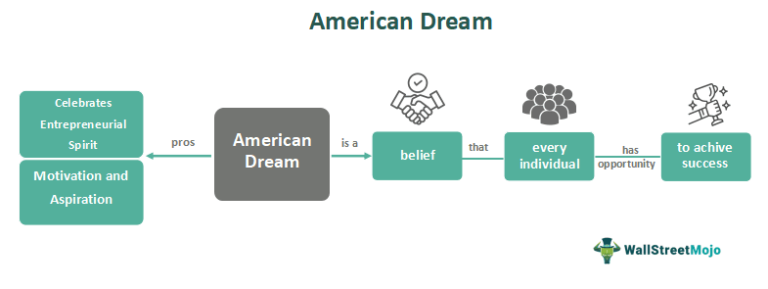

The American Dream has long been a symbol of hope and opportunity, representing the idea that anyone, regardless of their background, can achieve success through hard work and determination. Historically envisioned as a pursuit of prosperity and better living standards, its definition has evolved over generations, shaped by changing societal values and economic landscapes. The traditional markers of the American Dream, such as homeownership and career stability, are increasingly complemented, if not supplanted, by notions of entrepreneurship, financial independence, and personal fulfillment.

In the digital age, technology and innovation have brought about a significant transformation in how the American Dream is envisioned and pursued. The information economy, driven by rapid advancements in technology, has created new avenues for achieving financial success and stability. The advent of the internet and digital platforms has democratized access to information and opportunities, allowing individuals to redefine success in diverse ways, from launching start-ups to exploring new financial instruments.

One such modern avenue is algorithmic trading, which exemplifies the new pathways to achieving financial success. Algorithmic trading involves using computer algorithms to execute trades at speeds and frequencies impossible for human traders. This method leverages big data, artificial intelligence, and advanced analytics to make informed trading decisions, offering an efficient and potentially lucrative route for individuals seeking financial growth. By manifesting the principles of precision and data-driven decision-making, algorithmic trading represents a contemporary interpretation of the American Dream, where technology enables unprecedented opportunities for wealth creation.

The aim of this article is to explore various examples of the American Dream as it stands today, analyzing the methods individuals utilize to measure success in modern pursuits and examining the influence of algorithmic trading as a pathway to financial achievement. In today's context, the pursuit of the American Dream is intricately linked with financial independence, which remains a cornerstone of personal and societal aspirations. As traditional employment landscapes shift, the importance of financial literacy and strategic personal finance planning has never been more critical in achieving the modern American Dream.

## Table of Contents

## The American Dream: Evolving Definitions

The American Dream, a dynamic and evolving concept, has historically been intertwined with the values and aspirations of American society. Initially rooted in the ideals of freedom, equality, and opportunity as envisioned by the Founding Fathers, it has undergone significant transformations in response to economic, cultural, and technological changes.

In the early 20th century, the American Dream was often associated with material wealth, homeownership, and stable employment, reflecting an era of industrial growth and expansion. This period emphasized the possibility of upward mobility through hard work and perseverance, encapsulated in narratives like the rags-to-riches stories popularized by figures such as Horatio Alger.

Economic shifts, including the Great Depression and post-World War II boom, further molded the American Dream. During the 1950s and 1960s, suburbanization and the rise of consumer culture heightened the focus on homeownership and career stability, establishing these as key elements of the dream. According to a study by the Pew Research Center, owning a home remained a primary component of achieving the American Dream for many Americans throughout the latter half of the 20th century.[1]

However, as the economy transitioned towards a service and information-driven model, the definition of the American Dream expanded. The late 20th and early 21st centuries saw a growing emphasis on entrepreneurial success and financial independence, spurred by technological advancements and globalization. This shift reflected a departure from traditional employment paradigms towards innovation and self-directed career paths.

Personal fulfillment and societal impact have become increasingly important metrics of success within the modern interpretation of the American Dream. According to a survey conducted by Gallup, many Americans now prioritize personal satisfaction and the ability to make a positive societal contribution over mere economic gain.[2] This shift suggests a broader understanding of success that incorporates quality of life and individual purpose alongside financial prosperity.

Recent studies indicate varying perceptions of the American Dream among different demographic groups. For instance, younger generations often prioritize flexibility, work-life balance, and meaningful work experiences, whereas older generations may still value traditional markers such as steady employment and property ownership. These variations highlight the evolving nature of the American Dream and underscore the influence of cultural, economic, and technological currents in shaping its definition across generations.

In conclusion, the American Dream has evolved from a focus on material success and stability to include a more nuanced understanding that values personal fulfillment and societal impact. Its current iteration reflects a complex amalgam of traditional values and contemporary aspirations, influenced by ongoing economic and technological advancements.

[1] Pew Research Center. (2016). The State of American Jobs. https://www.pewresearch.org
[2] Gallup. (2021). Americans Rate Personal Fulfillment, Community Impact as Very Important. https://news.gallup.com

## Measuring Success in the Context of the American Dream

Measuring success within the framework of the American Dream requires a multifaceted approach. Traditionally, income levels have been a primary measure of success, symbolizing stability and the ability to provide for oneself and one's family. However, with the evolution of societal values and the digital age, the metrics for assessing success have expanded significantly to include work-life balance and personal fulfillment. This broader view acknowledges that financial prosperity alone does not equate to a fulfilled life.

Key performance indicators (KPIs) serve as vital tools for individuals and businesses to quantify success. In business, KPIs may include metrics such as net profit margin, return on investment (ROI), and customer satisfaction indices. Similarly, personal finance utilizes KPIs like savings rate, debt-to-income ratio, and credit score to evaluate financial health. These indicators help individuals set, track, and achieve their personal and professional goals.

Non-financial achievements also play a significant role in defining success. Community involvement, for instance, reflects an individual's engagement and impact in societal matters, contributing to a sense of purpose beyond monetary gains. Personal growth, encompassing learning new skills, achieving wellness goals, and fostering relationships, is equally crucial. These aspects underscore the notion that a successful life must integrate fulfilling personal experiences alongside financial accomplishments.

Examples abound of individuals and businesses redefining success. Entrepreneurs like Elon Musk have achieved not only substantial financial success but have also impacted global technological innovation, highlighting adaptability and forward-thinking, key tenets of modern success. Small business owners often measure success by their ability to support their community and by creating meaningful, sustainable work environments for their employees.

Adaptability and innovation are increasingly significant in securing present and future success. The dynamic nature of today's global economy demands resilience and a willingness to embrace change. Individuals who continuously adapt by learning new skills and leveraging technology often find better opportunities and satisfaction.

In conclusion, the contemporary understanding of success in the context of the American Dream encompasses diverse metrics beyond traditional financial indicators. It values a blend of economic stability, personal contentment, and societal contribution, while emphasizing adaptability and innovation as critical elements in achieving a fulfilling and balanced life.

## Algorithmic Trading as a Pathway to the American Dream

Algorithmic trading refers to the use of computer algorithms to execute trading orders at speeds and frequencies that human traders cannot achieve. These algorithms follow pre-defined instructions based on various factors, including timing, price, and market conditions, to determine the optimal point for executing a trade. Over recent years, [algorithmic trading](/wiki/algorithmic-trading) has gained significant popularity among investors seeking enhanced financial opportunities. This is partly due to its ability to streamline operations and leverage vast amounts of data for more informed decision-making.

One of the key advantages of algorithmic trading is efficiency. By automating trades, it reduces the potential for human error and can quickly respond to fast-changing market conditions. Algorithms can process real-time data and historical patterns to make decisions in a fraction of a second, well beyond the capability of manual trading. Additionally, algorithmic trading allows for sophisticated risk management strategies. Investors can set specific parameters to limit exposure to market [volatility](/wiki/volatility-trading-strategies), thereby protecting against significant losses. For instance, algorithms might use stop-loss orders, which automatically sell a security when it reaches a certain price, safeguarding against further declines.

Algorithmic trading can also be seen as a contemporary route to achieving the financial aspects of the American Dream by potentially providing significant returns with decreased manual intervention. It enables individual traders to compete with institutional traders by using advanced technology to gain insights and implement strategies that were once only available to large financial entities.

Several individuals have leveraged algorithmic trading to achieve remarkable financial success. Notable examples include individuals who have developed proprietary trading algorithms and founded successful trading firms. These self-taught traders have used powerful computing resources to analyze market trends and develop strategies that achieve consistent profits.

However, there are inherent challenges and potential downsides to algorithmic trading. Markets can be highly volatile, and algorithmic trades can exacerbate these fluctuations, leading to increased market instability. This was notably the case in May 2010 during the "Flash Crash," where rapid, automated selling contributed to a sharp and brief market crash. Furthermore, successful algorithmic trading requires a strong understanding of both financial markets and computer programming. Investors lacking this expertise may face significant risks. Financial literacy and a grasp of the relevant technological skills are crucial to navigating the complexities of algorithmic trading effectively.

Algorithmic trading represents a modern pathway to financial success, embodying a contemporary interpretation of the American Dream characterized by innovation and technology-driven strategies. While it offers numerous advantages, aspiring traders must approach it with caution and diligence to overcome its challenges and achieve their financial objectives.

## Interplay Between Modern Success Metrics and Algorithmic Trading

The relationship between algorithmic trading outcomes and the broader concept of success is increasingly significant as technology advances rapidly. Algorithmic trading, which leverages pre-programmed instructions and models to execute trades, aligns with modern success metrics by emphasizing efficiency, data-driven decision-making, and adaptability—key components of contemporary interpretations of success.

Investors use various data analytics and performance metrics to measure trading success, essential for evaluating algorithmic trading outcomes. Metrics such as Sharpe Ratio, Total Return, and Maximum Drawdown help assess the risk-adjusted performance of trading strategies. The Sharpe Ratio, for instance, evaluates the return of an investment compared to its risk, calculated as:

$$
\text{Sharpe Ratio} = \frac{R_p - R_f}{\sigma_p}
$$

where $R_p$ is the portfolio return, $R_f$ is the risk-free rate, and $\sigma_p$ is the standard deviation of the portfolio's excess return. Such metrics ensure that algorithmic trading strategies align with investors' financial goals, providing quantifiable measures of success.

Artificial intelligence (AI) plays a crucial role in enhancing algorithmic trading strategies. Machine learning algorithms, for instance, can analyze vast amounts of historical data to identify patterns and predict market movements, autonomously adapting strategies to optimize performance. Techniques such as [reinforcement learning](/wiki/reinforcement-learning) allow trading systems to learn from market changes, refining their decision-making processes over time, which amplifies the success potential by reducing human error and capturing intricate market dynamics.

The principles of strategic planning in algorithmic trading extend beyond financial markets, holding lessons for broader career and life success. Strategic planning involves setting clear goals, analyzing data to inform decisions, and adjusting tactics based on feedback—principles applicable across various life domains. Just as algorithmic trading requires constant adaptation and learning from market feedback, individual success also depends on the ability to adapt plans and embrace continuous learning.

Emerging trends and technologies are likely to influence future interpretations of the American Dream and success. Quantum computing, for instance, promises to revolutionize data processing capabilities, offering unprecedented speed and efficiency in algorithmic trading computations. Additionally, blockchain technology has the potential to enhance transparency and security in financial transactions, providing new opportunities for financial innovation. As these technologies mature, they may further redefine success and offer novel pathways to achieving the American Dream by enabling more sophisticated and secure trading strategies.

In conclusion, the alignment of algorithmic trading outcomes with modern success metrics highlights the evolving nature of success in the digital age, emphasizing the importance of leveraging technology, data analytics, and strategic planning not only in financial markets but also in achieving broader life goals.

## Conclusion

The American Dream has undergone significant transformations, evolving from aspirations of homeownership and stable careers to more dynamic definitions that include financial independence, entrepreneurial success, and personal fulfillment. This evolution reflects broader societal changes, encompassing economic shifts, cultural adaptations, and technological advancements. In the modern context, achieving the American Dream involves not only traditional measures of success but also innovative pathways such as algorithmic trading. 

Algorithmic trading offers a contemporary approach to fulfilling financial and personal aspirations associated with the American Dream. By leveraging technology and sophisticated data analysis, individuals can enhance their financial strategies and achieve greater efficiency and risk management in their investment portfolios. This method exemplifies the potential of embracing technological innovation to attain financial goals, aligning with the modern interpretation of the American Dream.

It's essential to recognize that success is multifaceted and subjective. Individuals are encouraged to consider diverse forms of success, whether through financial gains, personal growth, or societal contributions. Embracing innovative avenues like algorithmic trading requires an understanding of both its potential and its limitations. It is vital to align personal values with financial strategies to ensure a balanced and fulfilling pursuit of success, creating a synergy between personal aspirations and financial objectives.

Further exploration and engagement with modern financial tools present new opportunities for achieving one's American Dream. As technology continues to evolve, so too do the methods for securing success. By remaining adaptable and open to innovation, individuals can craft unique and meaningful paths towards their own aspirations, continually redefining what the American Dream means to them.

## References & Further Reading

[1]: Pew Research Center. (2016). [The State of American Jobs](https://www.pewresearch.org/social-trends/2016/10/06/the-state-of-american-jobs/). 

[2]: Gallup. (2021). [Americans Rate Personal Fulfillment, Community Impact as Very Important](https://news.gallup.com/poll/470888/americans-largely-satisfied-personal-life.aspx). 

[3]: Bergstra, J., Bardenet, R., Bengio, Y., & Kégl, B. (2011). ["Algorithms for Hyper-Parameter Optimization."](https://proceedings.neurips.cc/paper/2011/file/86e8f7ab32cfd12577bc2619bc635690-Paper.pdf) Advances in Neural Information Processing Systems 24.

[4]: ["Advances in Financial Machine Learning"](https://www.wiley.com/en-us/Advances+in+Financial+Machine+Learning-p-9781119482086) by Marcos Lopez de Prado

[5]: ["Evidence-Based Technical Analysis: Applying the Scientific Method and Statistical Inference to Trading Signals"](https://www.amazon.com/Evidence-Based-Technical-Analysis-Scientific-Statistical/dp/0470008741) by David Aronson

[6]: ["Machine Learning for Algorithmic Trading"](https://github.com/PacktPublishing/Machine-Learning-for-Algorithmic-Trading-Second-Edition) by Stefan Jansen

[7]: ["Quantitative Trading: How to Build Your Own Algorithmic Trading Business"](https://books.google.com/books/about/Quantitative_Trading.html?id=j70yEAAAQBAJ) by Ernest P. Chan