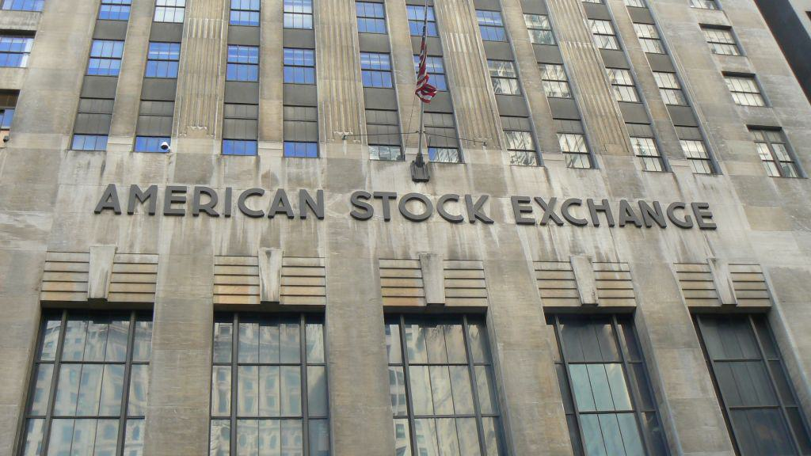

In today's financial landscape, algorithmic trading has fundamentally transformed market operations, particularly in the U.S. financial sector. This development has significantly shifted the dynamics of trading by utilizing advanced computer algorithms to execute trades at speeds and frequencies that are impossible for human traders. The American Financial Exchange (AFX), established in 2015, has played a crucial role in this transformation by providing novel solutions for interbank lending and borrowing.

As a self-regulated electronic marketplace, AFX caters to a wide range of U.S. banks and financial institutions, enabling them to trade short-term funds more efficiently. One of the key advantages of AFX is its use of algorithmic trading to increase transparency and reduce transaction costs, thereby creating a more cost-effective environment for financial transactions.

Algorithmic trading at AFX is characterized by the ability to execute orders at very high speeds. The platform's design allows it to capture real-time data and react almost instantaneously to changes in market conditions. By minimizing human intervention, algorithmic trading enhances the precision and reliability of trade executions, contributing to the overall efficiency of financial markets.

This article explores how AFX's approaches and the broader implementation of algorithmic trading are reshaping U.S. financial markets, with their combined effects resulting in enhanced market transparency and improved interbank trading dynamics. The ongoing integration of technology and finance continues to streamline processes, offering a glimpse into the future direction of financial exchanges.

## Table of Contents

## The American Financial Exchange (AFX) Overview

The American Financial Exchange (AFX) is a self-regulated electronic marketplace headquartered in Chicago, Illinois. Established to promote efficiency in interbank lending and borrowing, the AFX has positioned itself as a significant player in the U.S. financial landscape. The exchange provides a seamless platform for U.S. banks and other financial institutions, enabling them to trade short-term funds directly with one another. This direct trading mechanism helps mitigate the intermediary costs typically associated with traditional interbank transactions.

One of the core features of the AFX is its emphasis on anonymity and transparency. Through the disclosure of bid and ask prices electronically, the exchange facilitates relationships that protect the privacy of the institutions involved while ensuring market transparency. This aspect of the AFX gives participants confidence in the fairness and competitiveness of the interbank market prices they engage with.

Since its launch, the AFX has been proactive in expanding its offerings and adapting to the evolving needs of its users. Among its various products and services are unsecured loans, providing banks with a mechanism to access [liquidity](/wiki/liquidity-risk-premium) without the need for collateral. Additionally, the AFX has developed secured loan markets, offering banks the option of collateralized borrowing, which can present less risk and thereby potentially offer more favorable terms.

A key innovation of the AFX is the Ameribor (American Interbank Offered Rate) benchmark rate. This rate serves as an alternative to the London Interbank Offered Rate (LIBOR) and is particularly tailored to reflect the borrowing costs for small and midsize banks in the U.S. By creating Ameribor, the AFX has provided a more accurate and representative benchmark for these institutions to use in their financial operations, ultimately contributing to a more stable and transparent financial system.

## The Role of Ameribor in U.S. Markets

Ameribor, an offering of the American Financial Exchange (AFX), represents a significant development in the landscape of U.S. financial markets. It serves as a benchmark [interest rate](/wiki/interest-rate-trading-strategies), distinctly reflecting the short-term unsecured interbank borrowing costs within the United States. Unlike the London Interbank Offered Rate (LIBOR), Ameribor is tailored specifically to address the funding needs of small and midsize banks, providing them with a more applicable and customized financial tool.

The necessity for a LIBOR alternative became pronounced as global banking systems moved towards more transparent and reliable benchmarks. Ameribor emerges as a robust option, primarily because of its foundation in actual transactional data. This alignment with real-time market conditions aids in providing a more accurate snapshot of borrowing costs, contrasting with LIBOR’s reliance on estimates that have, at times, been implicated in manipulation scandals.

Ameribor's ascendancy in the market has not gone unnoticed by regulators. Its credibility has been bolstered by recognition from various financial oversight bodies, further enhancing its stature as a trustworthy benchmark within the financial community. Such acceptance underscores its value in delivering an honest reflection of market dynamics and enhances its utility across a range of financial products and services.

The creation of Ameribor marks a pivotal shift towards a more standardized and transparent rate-setting mechanism in U.S. markets. By utilizing a trading platform that meticulously records transactions, the rate provides stakeholders with an accurate and indisputable measure of interbank borrowing costs. This transparent nature of Ameribor fosters confidence among market participants and mitigates risks associated with rate manipulations.

Consequently, the innovation and application of the Ameribor benchmark hold significant implications for the financial landscape. As financial institutions increasingly pivot towards benchmarks that reflect genuine market activities, Ameribor stands at the forefront, offering substantial benefits for banks seeking precision and reliability in their financial dealings. Its role is set to expand as trust in traditional benchmarks like LIBOR diminishes and the demand for transparency continues to shape market behaviors.

## Algorithmic Trading: Transforming Financial Exchanges

Algorithmic trading has become a cornerstone of modern financial exchanges, leveraging advanced technology to enhance the execution of trades. This approach utilizes preset algorithms to automatically manage trading decisions, with the primary aim of optimizing speed, efficiency, and accuracy. By processing vast quantities of data in real time, [algorithmic trading](/wiki/algorithmic-trading) minimizes human error and allows for lightning-fast transactions that were previously inconceivable.

The American Financial Exchange (AFX) has integrated algorithmic trading into its operations to bolster liquidity, reduce [volatility](/wiki/volatility-trading-strategies), and tighten bid-offer spreads. These improvements are particularly significant in high-frequency trading ([HFT](/wiki/high-frequency-trading-strategies)) environments, where minute price changes are exploited for profit within fractions of a second. By using sophisticated algorithms that detect and respond to minor market discrepancies, AFX helps ensure that trades are executed at the best possible prices.

Algorithmic trading extends across various financial instruments, including equities, bonds, futures, and derivatives. By automating the trading process, it supports the efficient management of large volumes of trades, which in turn drives innovation and growth in the U.S. financial markets. The capability to execute complex trading strategies with precision and without manual intervention allows for a more dynamic and competitive trading landscape.

In the context of AFX, the adoption of algorithmic trading methods means financial institutions can benefit from a more efficient marketplace. These tools help to create smoother market operations by allowing for continuous pricing and reducing the risk of market disruptions. As algorithmic trading continues to evolve, it is set to play an increasingly crucial role in shaping the future of financial exchanges, enhancing the robustness and reliability of trading systems.

## AFX's Technological Advancements

Technology is fundamental to the operations of the American Financial Exchange (AFX), with numerous technological innovations ensuring rapid execution times and robust market surveillance. The AFX's reliance on cutting-edge technology was fortified through its association with 7RIDGE, a technology-focused investment company. After AFX's acquisition by 7RIDGE, the exchange migrated to an advanced platform powered by Connamara Systems, a leading provider of exchange technology, and Transaction Network Services (TNS), a global connectivity and data solutions provider. This migration underscores AFX’s commitment to leveraging state-of-the-art technology to improve trading processes.

The partnership with Connamara Systems and TNS has facilitated AFX’s goals of enhancing system performance and reliability. Connamara Systems designs custom trading solutions that accommodate high-frequency trading demands, ensuring that AFX can handle extensive transaction volumes with minimal latency. Meanwhile, TNS contributes to lowering operational risks by providing secure, high-speed connections that are critical for the continuous and seamless operation of algorithmic trading systems.

Benchmark rate verification by Morningstar and network surveillance advancements by RSM Institute are integral components of AFX's technological ecosystem. Morningstar’s role in verifying AFX’s benchmark rates ensures that these rates are precise and trustworthy, an imperative for maintaining market integrity. This transparency builds confidence among market participants, thereby promoting increased activity and liquidity within the AFX marketplace.

Moreover, the development of network surveillance systems by RSM Institute plays a crucial role in ensuring the security and integrity of the trading environment. By constantly monitoring trading activities, these systems can detect irregular patterns indicative of market manipulation or systemic vulnerabilities, thereby preempting potential threats to market operations.

These technological advancements are pivotal in enhancing the performance and reliability of algorithmic trading systems at AFX. Through continuous innovation and improvement, AFX sustains its competitive edge and supports the evolving needs of its financial institution members, ensuring efficient and transparent interbank transactions.

## AFX's Impact on the Financial Ecosystem

Since its establishment, the American Financial Exchange (AFX) has significantly influenced the U.S. financial ecosystem, marked by the execution of nearly $1.7 trillion in interbank loans. This substantial figure reflects the robust growth in both membership and trading [volume](/wiki/volume-trading-strategy), underscoring the AFX's impact and the confidence it has instilled among financial institutions. Serving over 250 financial institutions, AFX represents a considerable segment of the U.S. banking sector.

The AFX's diverse product offerings, such as AMERIBOR futures and various loan markets, are crafted to meet the evolving needs of financial stakeholders. These products provide essential tools for managing liquidity and interest rate risks, particularly for small and mid-sized banks that require a reliable and tailored reference rate. AMERIBOR has proven to be a vital resource for these institutions, aligning closely with their funding requirements and enhancing their operational capabilities.

The strategic acquisition of AFX by 7RIDGE further signifies the growing trust in AFX's model and indicates a promising trajectory of accelerated growth and network expansion. This acquisition incorporates additional resources and expertise, potentially broadening AFX's reach and deepening its technological infrastructure. By enhancing its technological and operational capabilities, AFX is better positioned to meet the dynamic needs of the financial markets and maintain its role as a critical facilitator of interbank trading dynamics.

In summary, AFX's influence extends beyond mere transactional figures, embedding itself as a central component in the strategic planning and risk management efforts of a substantial portion of the U.S. banking sector. As it continues to evolve under the stewardship of 7RIDGE, AFX holds a pivotal role in the ongoing transformation of the algorithmic trading landscape and the broader U.S. financial exchange ecosystem.

## Conclusion

The American Financial Exchange (AFX) plays an essential role in the evolution of U.S. financial markets by leveraging algorithmic trading and cutting-edge technological advancements. Since its inception, AFX has prioritized transparency and efficiency, which has attracted a wide array of financial institutions seeking innovative, cost-effective solutions for interbank lending and borrowing. One of the key components of AFX's success is Ameribor, a benchmark interest rate that serves as an alternative to LIBOR and meets the unique funding needs of small and midsize banks. Ameribor exemplifies AFX's strategic offerings and contributes significantly to reshaping interbank trading dynamics through a more reliable and standardized rate-setting mechanism.

In addition, algorithmic trading has become a cornerstone of AFX's operations, enabling rapid execution, enhanced liquidity, and minimized volatility in financial transactions. These attributes are particularly beneficial in high-frequency trading scenarios where speed and precision are paramount. The integration of advanced technology through partnerships with entities such as Connamara Systems and TNS further underscores AFX's dedication to maintaining its leadership in the financial exchange landscape.

As algorithmic trading continues to advance, AFX is well-positioned to remain at the forefront of the U.S. financial exchange ecosystem. Its ongoing commitment to fostering transparency, efficiency, and technological innovation ensures that it will continue to play a transformative role in modernizing financial markets and meeting the demands of an ever-evolving financial landscape.

## References & Further Reading

[1]: ["Advances in Financial Machine Learning"](https://www.amazon.com/Advances-Financial-Machine-Learning-Marcos/dp/1119482089) by Marcos Lopez de Prado

[2]: ["Machine Learning for Algorithmic Trading"](https://github.com/stefan-jansen/machine-learning-for-trading) by Stefan Jansen

[3]: ["Quantitative Trading: How to Build Your Own Algorithmic Trading Business"](https://github.com/LucindaYa/quant-resources/blob/master/Quantitative%20Trading%20How%20to%20Build%20Your%20Own%20Algorithmic%20Trading%20Business.pdf) by Ernest P. Chan

[4]: ["Algorithmic Trading: Winning Strategies and Their Rationale"](https://www.amazon.com/Algorithmic-Trading-Winning-Strategies-Rationale-ebook/dp/B00CY5HC0U) by Ernest P. Chan

[5]: U.S. Commodity Futures Trading Commission. ["Technology Advisory Committee - 2019 Annual Report"](https://www.reuters.com/technology/gemini-agrees-5-mln-fine-injunction-over-cftc-charges-filing-shows-2025-01-06/)