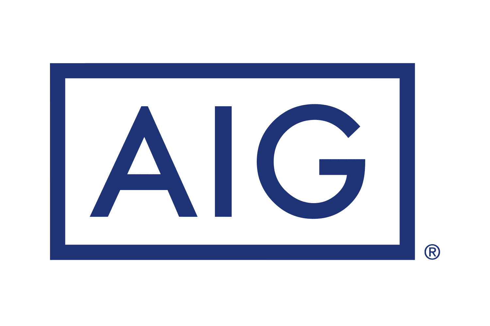

American International Group (AIG) represents a prominent entity in the global insurance landscape, playing a crucial role in shaping industry dynamics. This article examines the interplay between AIG's traditional insurance methodologies and modern algorithmic trading systems, which have transformed financial operations within the industry. Historically, AIG has not only been a key player in insurance but has also wielded considerable market influence, adapting to economic fluctuations and crises over time.

Algorithmic trading has emerged as a pivotal instrument in contemporary finance, fundamentally altering various sectors, including insurance. This sophisticated trading approach employs computer algorithms to execute trades at exceptional speed and efficiency, extending its impact far beyond traditional stock and commodities markets.

Understanding AIG's journey, marked by significant milestones and technological advancements, provides essential insights into the evolving nature of the insurance industry. The company's integration of algorithmic trading into its operations demonstrates a forward-thinking strategy poised to redefine financial practices. This integration not only optimizes risk management and investment strategies but also enhances the responsiveness of insurance operations to dynamic market conditions.

In essence, AIG's historical resilience and innovative strategies reflect broader trends in the insurance sector, where technological adoption is increasingly crucial for maintaining competitiveness and securing future growth. As the industry progresses, the examination of AIG's strategies offers a lens through which the future trajectory of insurance can be envisioned.

## Table of Contents

## The Evolution of American International Group (AIG)

American International Group (AIG) has played a significant role in the global insurance industry since its inception. Once the world's largest insurance company, AIG reached a market value of approximately $239 billion at its peak. However, its journey has been marked by both remarkable successes and significant challenges, notably the 2008 financial crisis.

AIG's critical point of vulnerability during the 2008 crisis stemmed from its extensive exposure to credit-default swaps (CDS). These financial instruments are essentially insurance policies on financial securities, predominantly mortgage-backed securities. When the real estate market collapsed, the market value of these securities plummeted, leading to significant liabilities for AIG. The U.S. government intervened, providing a bailout package that eventually totaled over $180 billion, which allowed AIG to stabilize and restructure.

Following the crisis, AIG undertook comprehensive restructuring measures to restore its financial stability and reputation. The organization divested several of its assets to repay the government bailout and focus on its core insurance operations. This strategic reinvention included selling off its non-core businesses and concentrating resources on strengthening its insurance divisions.

Today, AIG is a streamlined entity that continues to serve a diverse range of clients worldwide. It offers various insurance products, catering to commercial, institutional, and individual needs. This transformation illustrates not only AIG's adaptability but also reflects the dynamic nature of the financial landscape. 

AIG's journey from the brink of collapse during the financial crisis to a position of renewed strength underscores its resilience. The company's ability to navigate monumental challenges and leverage strategic opportunities has positioned it as a formidable player in the insurance sector. Consequently, AIG's evolution stands as a testament to the broader competitive and adaptive landscapes characterizing the modern financial services industry.

## AIG's Integration of Algorithmic Trading

Algorithmic trading involves the employment of computer algorithms to execute trades at speeds and frequencies that are beyond human capability. This approach capitalizes on mathematical models and statistical analyses, aiming to profit from market inefficiencies with minimal human intervention. For American International Group (AIG), integrating [algorithmic trading](/wiki/algorithmic-trading) has become a strategic initiative, enhancing their financial operations and risk management practices.

Incorporating algorithmic trading allows AIG to make more informed and timely decisions about their investment strategies. By employing advanced algorithms, AIG can analyze vast datasets across various asset classes, such as equities, fixed income, and derivatives, to identify and execute optimal trading opportunities. This approach not only accelerates the decision-making process but also improves the precision and accuracy of trades executed by the company.

Algorithmic trading significantly aids in risk management, a critical aspect for an insurance corporation like AIG. By continuously monitoring market conditions, these algorithms can swiftly adjust investment positions in response to fluctuating market dynamics, thereby reducing potential exposure to adverse financial conditions. For instance, if the market shows signs of [volatility](/wiki/volatility-trading-strategies) that might negatively impact their portfolio, AIG’s algorithms can automatically reallocate assets or hedge positions to mitigate risk.

Furthermore, algorithmic trading offers substantial improvements in operational efficiency. Traditional trading relied heavily on human input, leading to higher transaction costs and slower execution times. By automating the trading process, AIG has been able to reduce these costs and improve profit margins. The scalability offered by algorithmic systems also means that AIG can handle larger volumes of transactions without significant additional infrastructure investment.

Through the integration of algorithmic trading, AIG not only optimizes its investment strategies but also positions itself as a technologically advanced player in the industry. This adoption reflects a broader trend among financial institutions seeking to leverage technology for competitive advantage, signaling AIG's commitment to innovation and adaptation in an evolving financial landscape.

## Impact of Algorithmic Trading on Insurance Operations

Algorithmic trading is pivotal for AIG's insurance operations, allowing swift adjustments to investment portfolios, thus ensuring a high degree of responsiveness to volatile market conditions. This aspect is critical in the insurance industry, where the management of large pools of assets is necessary to meet future claim obligations. By employing algorithmic processes, AIG can quickly rebalance its portfolios, optimizing returns while minimizing exposure to unfavorable price movements.

A key component of algorithmic trading is its role in risk management. This approach enables AIG to implement sophisticated hedging strategies that mitigate potential financial risks. By utilizing algorithms that analyze market data in real-time, the company can predict and respond to adverse market developments promptly. For instance, if market indicators suggest an impending downturn, AIG can use algorithmic trades to hedge against losses, thereby stabilizing the value of its investment portfolio. This agility not only shields against losses but also positions the company to capitalize on market opportunities.

Moreover, algorithmic trading contributes significantly to cost efficiency. Automation reduces the need for manual intervention, lowering transaction costs and diminishing the risk of human error. Cost savings are further realized through the precise execution of trades at optimal price points, enhancing the profitability of insurance operations. For an insurer like AIG, with its diverse investment portfolio, even marginal reductions in transaction costs can result in substantial financial benefits.

Overall, the implementation of algorithmic trading by AIG not only strengthens risk management strategies but also enhances operational efficiency. These advantages collectively contribute to increased profit margins, indicating that the strategic use of algorithmic trading represents a considerable competitive edge in the insurance sector.

## AIG's Strategic Market Position

American International Group (AIG) maintains its strategic market position through a combination of global reach and technological innovation. This positioning is a testament to the company’s resilience and adaptive strategies in the insurance sector. AIG, a major player in the global insurance market, has effectively leveraged its expansive network to serve clients worldwide, which ensures its sustained relevance even after financial setbacks in the past.

Central to AIG's market strategy is its commitment to technological advancement. By integrating cutting-edge technologies, AIG enhances its insurance and financial service offerings, maintaining a competitive edge in a rapidly evolving industry. This adoption of technology extends to its financial operations, where algorithmic trading plays a crucial role. This approach enables AIG to efficiently manage investment portfolios and optimize asset allocation, thereby improving its financial performance and risk management.

Algorithmic trading involves the use of complex algorithms and computer programs to execute trades at speeds and frequencies that far exceed human capabilities. For AIG, this means the ability to quickly adapt to market fluctuations, seize investment opportunities, and effectively hedge against potential risks. By embedding these strategies within its broader operational framework, AIG not only streamlines its trading activities but also enhances its financial resilience and profitability.

Through strategic initiatives and technological integration, AIG continuously fortifies its influence in the insurance and financial services sectors. The strategic use of algorithmic trading is indicative of AIG's broader commitment to innovation, allowing the company to lead in both domains. Going forward, AIG's market strategy and technological integration are set to be pivotal as the firm navigates and shapes the future landscape of the insurance industry.

## Challenges and Future Perspectives

Algorithmic trading, while advantageous, presents several challenges for American International Group (AIG). Among these are technology risks, encompassing system failures and cybersecurity threats, which require constant vigilance and updates to maintain system integrity and operational continuity. The rapid pace of technological advancement necessitates continuous adaptation and upgrading of trading algorithms to ensure competitiveness and functionality. Moreover, the reliance on complex algorithms introduces the risk of technical glitches, which could lead to significant financial losses.

In addition to technological challenges, AIG must navigate the complex landscape of regulatory compliance. Financial regulations across different jurisdictions impose stringent requirements on trading operations. Ensuring compliance with these regulations is crucial to avoid legal repercussions and maintain market trust. The evolving regulatory environment requires AIG to remain proactive, adapting to new rules and guidelines, which can be resource-intensive.

Future prospects for AIG include the deeper integration of [artificial intelligence](/wiki/ai-artificial-intelligence) (AI) and [machine learning](/wiki/machine-learning) (ML) into its trading operations. AI and ML have the potential to enhance algorithmic trading by offering advanced predictive analytics, pattern recognition, and data processing capabilities. These technologies can improve decision-making processes, optimize trading strategies, and manage risks more effectively. As AIG explores these avenues, the company positions itself at the forefront of digital transformation in the insurance industry, creating opportunities for increased efficiency and profitability.

Looking forward, the potential impact of AI and ML integration could signal a new era in financial operations. The transformative capacity of these technologies extends beyond algorithmic trading, offering the possibility to revolutionize various aspects of AIG's operations, ultimately leading to improved service delivery and customer satisfaction. As AIG continues to develop and refine these technologies, it aims to strengthen its market position and influence within the global insurance landscape.

## Conclusion

AIG's journey from financial distress during the 2008 crisis to a reinforced presence in the global market underscores the effectiveness of strategic innovation. By integrating algorithmic trading into its operations, AIG has significantly enhanced its risk management capabilities and investment strategies. This adoption of technology not only facilitates rapid adjustments and hedging in volatile markets but also boosts cost efficiency and profit margins. The leveraging of algorithmic trading by AIG suggests a promising trajectory for insurance companies that can successfully integrate advanced technologies into their business models.

As AIG progresses, its commitment to evolving and adopting tech-driven solutions is likely to continue setting industry benchmarks. The future may see an even deeper integration of artificial intelligence and machine learning, adding more sophistication to trading operations. By paving the way in this digital transformation, AIG is poised to remain a key player in both the insurance and financial services sectors, providing a blueprint for other firms aiming to harness technology for competitive advantage.

## References & Further Reading

[1]: Crotty, J. (2009). ["Structural Causes of the Global Financial Crisis: A Critical Assessment of the 'New Financial Architecture.'"](https://papers.ssrn.com/sol3/papers.cfm?abstract_id=1433942) Cambridge Journal of Economics.

[2]: Lopez de Prado, M. (2018). ["Advances in Financial Machine Learning."](https://www.amazon.com/Advances-Financial-Machine-Learning-Marcos/dp/1119482089) Wiley.

[3]: Markose, S. (2011). ["Systemic Risk from Global Financial Derivatives: A Network Analysis of Contagion and its Mitigation with Super-Spreader Tax."](https://www.imf.org/external/pubs/ft/wp/2012/wp12282.pdf) IMF Working Papers.

[4]: Hull, J. C. (2018). ["Options, Futures, and Other Derivatives"](https://www.semanticscholar.org/paper/Options%2C-Futures%2C-and-Other-Derivatives-Hull/89bdee500c8623864fc9eb7a471546aa713acc44) (10th Edition). Pearson.

[5]: Aronson, D. R. (2007). ["Evidence-Based Technical Analysis: Applying the Scientific Method and Statistical Inference to Trading Signals."](https://onlinelibrary.wiley.com/doi/book/10.1002/9781118268315) Wiley.

[6]: Jansen, S. (2020). ["Machine Learning for Algorithmic Trading: Predictive Models to Extract Signals from Market and Alternative Data for Systematic Trading Strategies with Python."](https://github.com/stefan-jansen/machine-learning-for-trading) Packt Publishing.

[7]: Chan, E. P. (2009). ["Quantitative Trading: How to Build Your Own Algorithmic Trading Business."](https://github.com/ftvision/quant_trading_echan_book) Wiley.