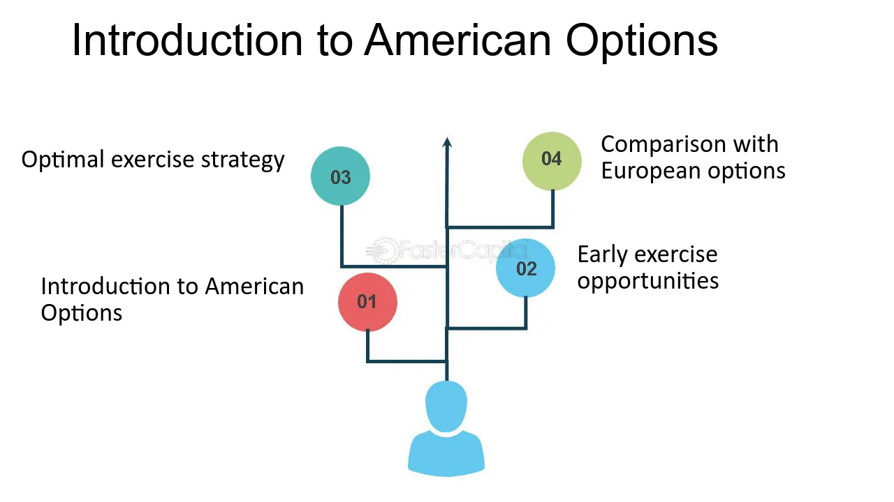

Derivatives trading is fundamental to modern financial markets, providing instruments to manage risk, engage in speculation, and enhance leverage. Among the myriad of financial derivatives, American options stand out due to their unique characteristic of execution flexibility. Unlike European options, which are restricted to being exercised only at expiration, American options allow traders to exercise their contractual rights at any point up to the expiration date. This feature offers a strategic advantage, allowing traders to respond dynamically to market conditions and optimize their trading outcomes.

The flexibility of American options is particularly beneficial for those looking to capitalize on short-term market movements or hedge against adverse market conditions. Traders can better manage risks and seize profit opportunities by exercising these options when they deem fit.



Adding a layer of sophistication to the trading of financial derivatives is algorithmic trading. This technique employs automated software systems to execute trades based on pre-set criteria and market signals, significantly enhancing the speed and accuracy of trading activities. The integration of algorithmic trading with options trading transforms how market participants manage and execute trades. It minimizes human error, allows for real-time data analysis, and facilitates the execution of complex options strategies that can react swiftly to market changes.

In this exploration, we're focusing on the intricate interactions between American options and algorithmic trading. The discussion will encompass the foundational aspects of American options, delve into their pricing mechanisms, examine execution strategies, and analyze how algorithmic systems complement and enhance options trading. The synergy between these two powerful components of financial markets provides traders with unprecedented capabilities to optimize their trading strategies and manage risks effectively.

## Table of Contents

## Understanding American Options

An American option is a versatile financial contract that grants the holder the right, but not the obligation, to buy or sell an underlying asset at a predetermined price at any time before the option's expiration date. This flexibility contrasts sharply with European options, which restrict exercise to the expiration date alone. The main advantage of American options lies in their strategic flexibility, allowing traders to respond dynamically to market fluctuations and capitalize on favorable conditions.

**Characteristics of American Options:**

1. **Exercise Flexibility**: The hallmark feature of American options is their ability to be exercised at any point before expiration. This allows option holders to take advantage of market movements to secure profits or mitigate losses when favorable opportunities arise.

2. **Types of Options**: American options are categorized into two types: calls and puts. A call option gives the holder the right to purchase the underlying asset, while a put option grants the right to sell it. This bifurcation allows traders to develop strategies that cater to both bullish and bearish market forecasts.

3. **Premium and Strike Price**: The holder pays a premium to acquire an American option, with the price set at the option's inception. The strike price, another critical element, determines the price at which the underlying asset can be bought or sold, establishing a benchmark for the option's profit potential.

4. **Intrinsic and Extrinsic Value**: The value of an American option consists of intrinsic and extrinsic components. Intrinsic value reflects the payoff if the option were exercised immediately, while extrinsic value accounts for the potential of future price movements and includes time value and volatility.

**Practical Benefits:**

The ability to exercise American options at any time grants traders substantial strategic leverage. For instance, if an investor holds an American call option on a stock and the stock's price surges substantially, they can exercise the option to purchase the stock at the lower strike price, securing immediate profit. Conversely, holders of put options can exercise their rights when a stock's market price dips below the strike price, thus profiting from the decline.

**Real-World Scenarios and Examples:**

Consider a trader who acquires an American call option on a company poised for significant regulatory approval. If the news breaks earlier than expected and propels the stock price upward, the trader can quickly exercise the option to capitalize on the sudden price increase—something unattainable with a European option. Similarly, in declining markets, traders holding American put options benefit from the ability to execute their trades as soon as a downward trend manifests, thus maximizing the financial outcomes.

In summary, American options embody a strategic tool that equips traders with the ability to harness market dynamics effectively. Their flexible nature allows for the pursuit of diverse trading strategies tailored to complex and fluid market conditions, making them an invaluable asset in robust trading frameworks.

## How American Options are Priced

Pricing American options presents a unique challenge due to their flexibility, permitting exercise at any point before expiration. This flexibility disrupts the closed-form solutions applicable to European options and necessitates the adoption of more intricate pricing models. Noteworthy approaches include the Binomial Option Pricing Model and modified versions of the Black-Scholes-Merton model. Monte Carlo simulations complement these methods by enabling traders to evaluate a multitude of potential market scenarios.

### Binomial Option Pricing Model

The Binomial Option Pricing Model is a popular method due to its intuitive approach and adaptable framework. This model segments the time to expiration into discrete intervals, constructing a binary tree where each node represents a potential price movement. At every step, the model assumes the underlying asset's price can either increase or decrease by a specific [factor](/wiki/factor-investing) until expiration. The value of the option at each node is computed using a backward induction process. This involves calculating the potential payout at expiration, followed by systematically determining the present value of those payouts at each preceding node, factoring in the risk-free rate and probabilities of price changes.

### Adjusted Black-Scholes-Merton Model

While the original Black-Scholes-Merton model provides a closed-form solution for European options, its assumptions are less applicable to American options. To adapt, several adjustments are made to accommodate early exercise opportunities. These adjustments often involve incorporating optimal stopping theory to determine when it is advantageous to exercise the option before expiration. This typically necessitates numerical methods like finite difference methods, which approximate the differential equations governing American options.

### Monte Carlo Simulations

Monte Carlo simulations are instrumental in quantifying the potential outcomes of American options. By generating a large number of random paths for the underlying asset's price, Monte Carlo methods can estimate the possible exercise and market scenarios. This computational approach assesses the average payoff of the option across these simulated paths, discounting them back to present value to draw inferences about the option's fair price. Python code for a simplified Monte Carlo method might look like this:

```python
import numpy as np

def monte_carlo_american_option(S0, K, T, r, sigma, N, M):
    dt = T / N
    option_values = np.zeros(M)

    for path in range(M):
        S = S0
        option_value = 0
        for step in range(N):
            dW = np.random.normal(0, np.sqrt(dt))
            S *= np.exp((r - 0.5 * sigma**2) * dt + sigma * dW)
            option_value = max(option_value, np.exp(-r * (step + 1) * dt) * max(S - K, 0))

        option_values[path] = option_value

    return np.mean(option_values)

# Example parameters
S0 = 100    # Initial price
K = 110     # Strike price
T = 1.0     # Time to expiration
r = 0.05    # Risk-free rate
sigma = 0.2 # Volatility
N = 100     # Time steps
M = 10000   # Number of simulations

price = monte_carlo_american_option(S0, K, T, r, sigma, N, M)
print(f"Estimated American option price: {price:.2f}")
```

### Conclusions on Pricing Methodologies

Mastering these pricing techniques is essential for traders aiming to execute precise and profitable trades. Each method provides a unique lens through which the complexities of American option pricing can be viewed and managed, allowing traders to make informed decisions tailored to dynamic market conditions.

## Algorithmic Trading: A Game Changer in Options Trading

Algorithmic trading has transformed options trading by harnessing advanced computational techniques to implement trades based on predefined criteria and immediate market signals. This methodology enables traders to execute orders with minimal latency and enhanced precision, thereby reducing the susceptibility to human errors. One of the critical advantages of [algorithmic trading](/wiki/algorithmic-trading) in the options market is its ability to rapidly process vast quantities of data and react instantaneously to market fluctuations, facilitating data-driven decision-making. 

The fusion of algorithmic trading with options trading materializes several pivotal benefits. Speed is paramount, as algorithms can process and respond to market data in milliseconds, significantly outperforming human capabilities. Efficiency increases because algorithms can operate 24/7 without fatigue, executing trades consistently according to the programmed strategies.

In risk management, algorithmic systems can incorporate complex statistical models to predict market trends and potential risks, enabling the implementation of dynamic hedging strategies. For instance, options traders can employ delta-neutral strategies, which involve balancing the sensitivity of an option portfolio to small changes in the price of the underlying asset. In practice, an algorithmic trading system might continuously adjust holdings of the underlying asset and options to maintain a delta-neutral position.

One particularly effective application of algorithmic systems is in complex strategy execution. Algorithms can seamlessly execute multi-leg options strategies, such as straddles or strangles, which involve simultaneous buying or selling of multiple options to capture [volatility](/wiki/volatility-trading-strategies). The precision of algorithmic platforms ensures that such intricate trades are executed without slipping.

Real-time market analysis constitutes another robust feature of algorithmic trading. These systems can analyze streaming market data to identify and exploit short-lived trading opportunities. The capability to react in real-time provides an edge in highly volatile markets, allowing traders to capture incremental profits from small price movements. 

Algorithmic trading systems can be customized to enhance the execution of options strategies. Tailoring involves setting parameters and conditions that align with the trader’s specific objectives and risk tolerance. For example, a Python script might be used to test various algorithms through historical data [backtesting](/wiki/backtesting), optimizing parameters for the best achievable outcomes. 

Here’s a basic illustration of using Python to backtest a simple moving average crossover strategy on options data:

```python
import numpy as np
import pandas as pd

# Load options data
data = pd.read_csv('options_data.csv')
data['SMA_20'] = data['Close'].rolling(window=20).mean()
data['SMA_50'] = data['Close'].rolling(window=50).mean()

# Generate signals
data['Signal'] = 0
data['Signal'][data['SMA_20'] > data['SMA_50']] = 1
data['Signal'][data['SMA_20'] < data['SMA_50']] = -1

# Calculate returns
data['Returns'] = data['Close'].pct_change() * data['Signal'].shift(1)

# Performance metrics
cumulative_returns = (1 + data['Returns']).cumprod() - 1
print(f"Cumulative Returns: {cumulative_returns[-1]:.2%}")
```

In conclusion, the adoption of algorithmic trading systems in options trading marks a transformative advancement, offering enhanced speed, accuracy, and strategic capability. As technology continues to evolve, further integration and sophistication of algorithmic approaches are anticipated, underscoring their growing importance in modern financial markets.

## Strategies for Algorithmic Options Trading

Combining the flexibility of American options with algorithmic precision allows traders to develop advanced strategies such as statistical [arbitrage](/wiki/arbitrage), [market making](/wiki/market-making), and volatility trading. These strategies leverage the computational power of algorithmic systems to execute trades efficiently and with minimal human intervention.

### Statistical Arbitrage

Statistical arbitrage involves using mathematical models to profit from price inefficiencies between correlated securities. In the context of American options, algorithms can be programmed to detect deviations in option pricing relative to the expected value derived from underlying assets. By exploiting these discrepancies, traders can execute buy or sell orders to capture profits before the market corrects itself.

For example, in a pairs trading strategy, an algorithm may identify two related asset options whose implied volatilities are differing more than statistically expected. The algorithm would then execute trades to capitalize on this temporary imbalance. Python libraries like `pandas` and `numpy` can be used to perform the statistical calculations required for such strategies.

```python
import pandas as pd
import numpy as np

# Example to demonstrate pairs trading algorithm setup
historical_data = pd.DataFrame({'option_A': np.random.randn(1000), 'option_B': np.random.randn(1000)})
spread = historical_data['option_A'] - historical_data['option_B']
spread_mean = spread.mean()
spread_std = spread.std()

# Trigger a trade when the spread deviates beyond standard deviation threshold
z_score_threshold = 2
signal = (spread - spread_mean) / spread_std

buy_signal = signal < -z_score_threshold
sell_signal = signal > z_score_threshold
```

### Market Making

Market making provides [liquidity](/wiki/liquidity-risk-premium) to the market by continuously quoting bid and ask prices for American options. Algorithmic systems improve this strategy by rapidly updating quotes in response to market changes, minimizing the risk of adverse selection. Algorithms use real-time data from market feeds to adjust prices based on factors such as order flow and changes in implied volatility.

Algorithms can be designed to substitute human judgment with execution accuracy, offering benefits like reduced transaction costs and enhanced market depth.

### Volatility Trading

Volatility trading focuses on predicting and profiting from changes in the volatility of underlying securities. American options are particularly well-suited for this strategy because of their flexibility in execution timing. Algorithms can employ advanced models to measure historical and implied volatility, executing trades such as long straddles or strangles when volatility is expected to increase.

Dynamic hedging, implemented through algorithmic trading, allows portfolios to adjust to volatility changes in real-time, managing risks associated with unexpected market movements. Monte Carlo simulations can be applied to estimate the range of possible outcomes for these trades.

### Adaptive Strategies and Risk Mitigation

Automated systems are robust tools for adapting to changing market conditions. They can execute multi-leg strategies that involve combinations of buying and selling different options based on sophisticated criteria. Algorithms execute these trades efficiently, ensuring that positions are adjusted with optimal timing.

Moreover, algorithmic systems excel at risk mitigation by employing stop-loss orders and other risk management techniques. These tools continually monitor market conditions, automatically triggering trades to close positions or adjust hedges when adverse price movements occur.

### Case Studies and Real-World Implementations

Successful implementations of algorithmic options trading systems are exemplified in various institutional contexts. For instance, high-frequency trading firms deploy algorithms for real-time options pricing and execution, allowing them to maintain a competitive edge through speed and precision. Case studies often highlight the integration of [machine learning](/wiki/machine-learning) models that enhance predictive accuracy, boosting the overall efficacy of trading strategies.

In summary, combining American options with algorithmic trading enables the execution of sophisticated strategies that harness the strengths of both flexibility and speed. As technology evolves, these systems will continue to unlock new trading opportunities and efficiencies.

## Risk Management and Regulatory Considerations

Risk management is a fundamental aspect of both options trading and algorithmic strategies, as it helps mitigate the risks inherent in financial markets. A key technique utilized in options trading is dynamic hedging, which involves continuously adjusting the positions in option contracts to offset the risk of price movements in the underlying assets. This approach often employs Greek parameters like delta, gamma, theta, and vega to gauge sensitivity to various risk factors. For instance, delta hedging seeks to neutralize the directional risk associated with price changes, while gamma hedging focuses on mitigating the risk associated with the rate of change in delta.

In addition to dynamic hedging, utilizing stop-loss orders can be an effective risk management tool. Stop-loss orders automatically trigger a sell or buy command when the price of the underlying asset reaches a certain level, helping to curtail potential losses. For options traders, setting strict stop-loss levels can prevent excessive drawdowns, given the leveraged nature of options trading. Monitoring implied volatility—the expected volatility of a security's price—also plays a significant role in risk management. Implied volatility can impact option pricing significantly, and understanding its fluctuations enables traders to anticipate changes in option values and adjust positions accordingly.

Regulatory environments and compliance are critical in maintaining both legal and ethical trading practices. Algorithmic trading, in particular, requires adherence to high standards set by regulatory bodies to ensure transparency and fairness in the market. Algorithmic systems must be programmed to comply with regulations regarding trade reporting, order execution, and data handling to prevent any risk of market manipulation or breaches of security.

Moreover, traders need to be aware of the tax implications linked with options trading. Recognizing the tax treatment of options, including aspects like expiration, exercise, and assignment, can significantly affect a trader's net profits. The Internal Revenue Service (IRS) and various tax authorities have specific rules governing the taxation of option gains and losses, which can differ based on whether options are classified as capital assets or part of regular trading income. Strategic planning around such regulations is essential not only to optimize financial outcomes but also to ensure adherence to tax obligations.

In conclusion, effective risk management strategies and an understanding of the regulatory landscape are indispensable for traders in both options and algorithmic trading. These elements help preserve capital, enhance trading resilience, and ensure operations are conducted within the legal frameworks, thereby safeguarding market integrity.

## Conclusion and Future Outlook

American options, due to their inherent flexibility, provide traders with unique opportunities for profit and risk management. Unlike European options, which can only be exercised at expiration, American options allow execution at any point before expiry, enabling traders to capitalize on beneficial market conditions. This adaptability can be crucial, particularly in volatile markets where price movements are unpredictable. As traders evaluate their positions continuously, American options offer a strategic edge in managing risk while maximizing profit potential.

The evolution of algorithmic trading has significantly enhanced these opportunities by improving the speed and precision of trade execution. Algorithms can swiftly process vast amounts of data to make real-time trading decisions, minimizing human error and emotional biases. This computational power allows for the execution of sophisticated strategies that might be otherwise impractical. For instance, implementing dynamic hedging strategies or engaging in [statistical arbitrage](/wiki/statistical-arbitrage) becomes more feasible with algorithmic systems, which can adjust positions based on continuous market inputs.

As technology continues to advance, we can anticipate more comprehensive integration between options strategies and algorithmic systems. Machine learning and [artificial intelligence](/wiki/ai-artificial-intelligence) are poised to play an increasingly significant role in trading by providing predictive insights and optimizing decision-making processes. These technologies can potentially lead to the development of even more advanced trading algorithms capable of adapting to market conditions effortlessly.

For traders seeking to leverage these tools to their fullest potential, staying informed and educated on technological advancements and market developments is crucial. Understanding the implications of new technologies and regulatory changes will be key in maintaining a competitive edge. Moreover, as the industry evolves, ongoing education and adaptation will enable traders to effectively harness the power of American options and algorithmic trading to maximize their trading success.

## References & Further Reading

[1]: Cox, J. C., Ross, S. A., & Rubinstein, M. (1979). ["Option pricing: A simplified approach."](https://www.sciencedirect.com/science/article/pii/0304405X79900151) Journal of Financial Economics, 7(3), 229-263.

[2]: Hull, J. C. (2018). ["Options, Futures, and Other Derivatives,"](https://www.semanticscholar.org/paper/Options%2C-Futures%2C-and-Other-Derivatives-Hull/89bdee500c8623864fc9eb7a471546aa713acc44) 10th Edition, Pearson.

[3]: Black, F. & Scholes, M. (1973). ["The Pricing of Options and Corporate Liabilities."](https://www.cs.princeton.edu/courses/archive/fall09/cos323/papers/black_scholes73.pdf) The Journal of Political Economy, 81(3), 637-654.

[4]: Liu, J., & Xin, X. (2018). ["Pricing American options with a stochastic volatility model using the method of lines."](https://www.csie.ntu.edu.tw/~lyuu/theses/thesis_r93723061.pdf) Journal of Computational and Applied Mathematics, 330, 315-331.

[5]: Chan, E. P. (2013). ["Algorithmic Trading: Winning Strategies and Their Rationale."](https://github.com/ftvision/quant_trading_echan_book) John Wiley & Sons.