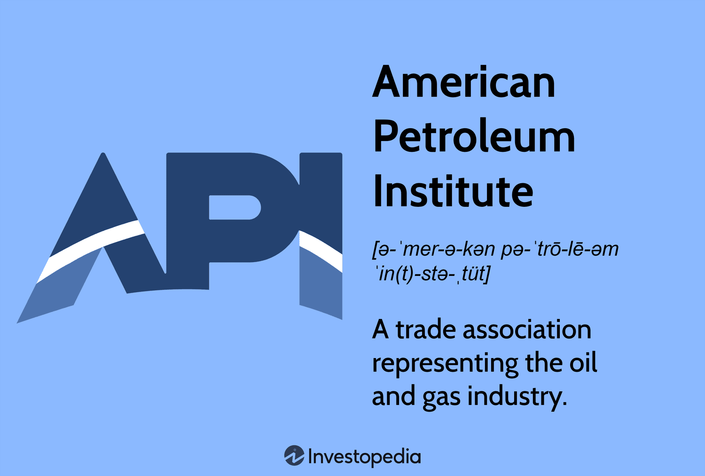

## Table of Contents

## What is the American Petroleum Institute (API)?

The American Petroleum Institute (API) is a trade group for the oil and natural gas industry in the United States. It was started in 1919 and helps companies that work with oil and gas. API works to make sure that the oil and gas industry follows good practices and standards. This helps keep workers safe and the environment protected.

API also helps its members by giving them information and doing research. They talk to the government about laws and rules that affect the oil and gas industry. This way, they can help make sure the laws are fair and help the industry grow. API also runs programs to teach people about the importance of oil and gas in our daily lives.

## When was the American Petroleum Institute founded?

The American Petroleum Institute, or API, was founded in 1919. This was a time when the oil and gas industry was growing a lot in the United States.

API is a group that helps companies in the oil and gas business. They work to make sure that the industry follows good rules and practices. This helps keep workers safe and protects the environment.

## What are the primary goals of the API?

The American Petroleum Institute, or API, has some main goals that it works towards. One big goal is to make sure that the oil and gas industry follows good practices and standards. This helps keep workers safe and protects the environment. API makes rules and guidelines that companies should follow to do things the right way.

Another goal of API is to help its members by giving them information and doing research. They also talk to the government about laws and rules that affect the oil and gas industry. This way, they can help make sure the laws are fair and help the industry grow. API wants to make sure that the oil and gas business can keep working well and safely.

API also runs programs to teach people about the importance of oil and gas in our daily lives. They want people to understand how these resources help us every day. By educating the public, API hopes to get more support for the oil and gas industry.

## How does the API influence the petroleum industry?

The American Petroleum Institute, or API, has a big impact on the petroleum industry. They set rules and standards that companies should follow. These rules help keep workers safe and protect the environment. When companies follow API's guidelines, it makes the whole industry better and more responsible. API also does research and gives information to its members. This helps companies know the best ways to do things and stay up to date with new technology.

API also talks to the government about laws and rules that affect the oil and gas industry. They want to make sure these laws are fair and help the industry grow. By working with the government, API can help shape policies that are good for the petroleum business. They also run programs to teach people about how important oil and gas are in our daily lives. This helps get more support from the public for the industry.

## What types of standards does the API develop?

The American Petroleum Institute, or API, develops many different types of standards for the oil and gas industry. These standards cover things like how to safely drill for oil and gas, how to build and maintain pipelines, and how to handle and store petroleum products. They also have standards for equipment like valves, pumps, and tanks. These standards help make sure that everything in the industry is done safely and correctly.

API also has standards for environmental protection. These rules help companies reduce pollution and protect the environment while they work. For example, there are standards on how to manage waste and how to clean up spills. API's standards help make sure that the oil and gas industry can operate in a way that is good for both the workers and the planet.

## How does the API advocate for the petroleum industry?

The American Petroleum Institute, or API, works hard to help the oil and gas industry. They talk to the government to make sure the laws and rules are fair for the industry. API wants to make sure that the oil and gas business can grow and do well. They meet with lawmakers and explain how the industry works and what it needs. This way, they can help shape policies that are good for the petroleum business.

API also runs programs to teach people about how important oil and gas are in our daily lives. They want people to understand how these resources help us every day. By educating the public, API hopes to get more support for the oil and gas industry. They use simple language and clear messages to explain why oil and gas are important. This helps people see the value of the industry and support it more.

## What role does the API play in environmental policy?

The American Petroleum Institute, or API, works on environmental policy to help the oil and gas industry follow good rules. They talk to the government about laws that affect the environment. API wants to make sure these laws are fair and help the industry grow while also protecting the environment. They help create rules that companies can follow to reduce pollution and keep the environment safe.

API also makes standards that help companies in the oil and gas business know how to handle waste and clean up spills. These standards make sure that the industry can work in a way that is good for the environment. By setting these rules, API helps the oil and gas industry be more responsible and protect nature while they work.

## How does the API support research and development in the petroleum sector?

The American Petroleum Institute, or API, helps the oil and gas industry by supporting research and development. They do this by giving money to studies and projects that can help the industry grow and be more efficient. API works with universities, research groups, and companies to find new ways to explore, produce, and use oil and gas. By funding these projects, API helps the industry stay up to date with the latest technology and ideas.

API also shares the results of this research with its members. This helps companies in the oil and gas business learn about new methods and technologies that can make their work better and safer. By supporting research and development, API makes sure that the petroleum sector can keep improving and finding better ways to do things. This is important for the industry to keep growing and meeting the world's energy needs.

## What are some key publications or resources provided by the API?

The American Petroleum Institute, or API, puts out many important publications and resources that help the oil and gas industry. One key resource is the API standards, which are like rulebooks that tell companies how to do things safely and correctly. These standards cover everything from drilling oil wells to building pipelines and handling petroleum products. They help make sure that the industry follows good practices and keeps workers safe and the environment protected.

Another important resource from API is their research reports. These reports share the results of studies that API funds. They cover topics like new ways to explore for oil and gas, better methods for producing energy, and ways to reduce pollution. By sharing this research, API helps companies in the industry learn about the latest technology and ideas. This can help them work better and be more efficient.

API also publishes educational materials to teach people about the importance of oil and gas. These materials explain how oil and gas are used in our daily lives and why they are important. By sharing this information, API hopes to get more support from the public for the oil and gas industry. These resources help people understand the value of the industry and how it helps meet our energy needs.

## How does the API engage with the public and stakeholders?

The American Petroleum Institute, or API, talks to the public and stakeholders to share information about the oil and gas industry. They use simple language and clear messages to explain why oil and gas are important in our daily lives. API runs programs and campaigns to teach people about how these resources help us. They also use social media, websites, and events to reach out to the public. By doing this, API hopes to get more support from people for the oil and gas industry.

API also works with stakeholders like government officials, industry partners, and environmental groups. They meet with lawmakers to talk about laws and rules that affect the oil and gas business. API wants to make sure these laws are fair and help the industry grow while also protecting the environment. They also work with other groups to find common goals and work together on projects that benefit everyone. By engaging with these stakeholders, API helps shape policies and practices that are good for the industry and the community.

## What are the criticisms faced by the API regarding its influence and activities?

Some people criticize the American Petroleum Institute, or API, because they think it focuses too much on helping the oil and gas industry and not enough on the environment. Critics say that API tries to stop laws that would make the industry cleaner and safer. They argue that API spends a lot of money to influence politicians and make rules that are good for oil and gas companies but bad for the planet. These critics believe that API should do more to help protect the environment instead of just protecting the industry's profits.

Others criticize API for not being honest about the effects of oil and gas on climate change. They say that API sometimes shares information that makes the industry look better than it is. Critics think that API should be more open about the risks and problems that come with using oil and gas. They believe that API should work harder to find and promote cleaner energy options instead of just defending the current way of doing things.

## How has the API adapted to the global shift towards renewable energy sources?

The American Petroleum Institute, or API, has been working to adapt to the global shift towards renewable energy. They know that the world is looking for cleaner ways to get energy, so API is trying to find ways to make the oil and gas industry more sustainable. They support research into new technologies that can make oil and gas production cleaner and more efficient. API also works with companies to help them use more renewable energy in their operations. This way, they can keep the oil and gas industry strong while also helping the environment.

API also talks to the government about laws that affect renewable energy. They want to make sure these laws are fair and help the oil and gas industry move towards cleaner energy sources. API is trying to find a balance between using oil and gas and using renewable energy. They believe that both can work together to meet the world's energy needs. By supporting research and working with the government, API is trying to help the oil and gas industry adapt to the changes happening in the energy world.

## References & Further Reading

[1]: ["American Petroleum Institute (API)"](https://www.api.org/) - Official website of the American Petroleum Institute providing information on standards and policy initiatives.

[2]: Lopez de Prado, M. (2018). ["Advances in Financial Machine Learning"](https://www.amazon.com/Advances-Financial-Machine-Learning-Marcos/dp/1119482089). Wiley. - A comprehensive guide on integrating machine learning into trading systems.

[3]: Aronson, D. R. (2007). ["Evidence-Based Technical Analysis: Applying the Scientific Method and Statistical Inference to Trading Signals"](https://onlinelibrary.wiley.com/doi/book/10.1002/9781118268315). Wiley.

[4]: Jansen, S. (2020). ["Machine Learning for Algorithmic Trading"](https://github.com/stefan-jansen/machine-learning-for-trading). Packt Publishing. - A practical guide on utilizing machine learning techniques in trading.

[5]: Chan, E. (2009). ["Quantitative Trading: How to Build Your Own Algorithmic Trading Business"](https://github.com/ftvision/quant_trading_echan_book). John Wiley & Sons.

[6]: ["Standardization and API Specifications"](https://liblab.com/blog/api-standardization) - API documentation on industry-wide standards for operational safety and efficiency. 

[7]: Aldridge, I. (2013). ["High-Frequency Trading: A Practical Guide to Algorithmic Strategies and Trading Systems"](https://www.amazon.com/High-Frequency-Trading-Practical-Algorithmic-Strategies/dp/1118343506). Wiley.