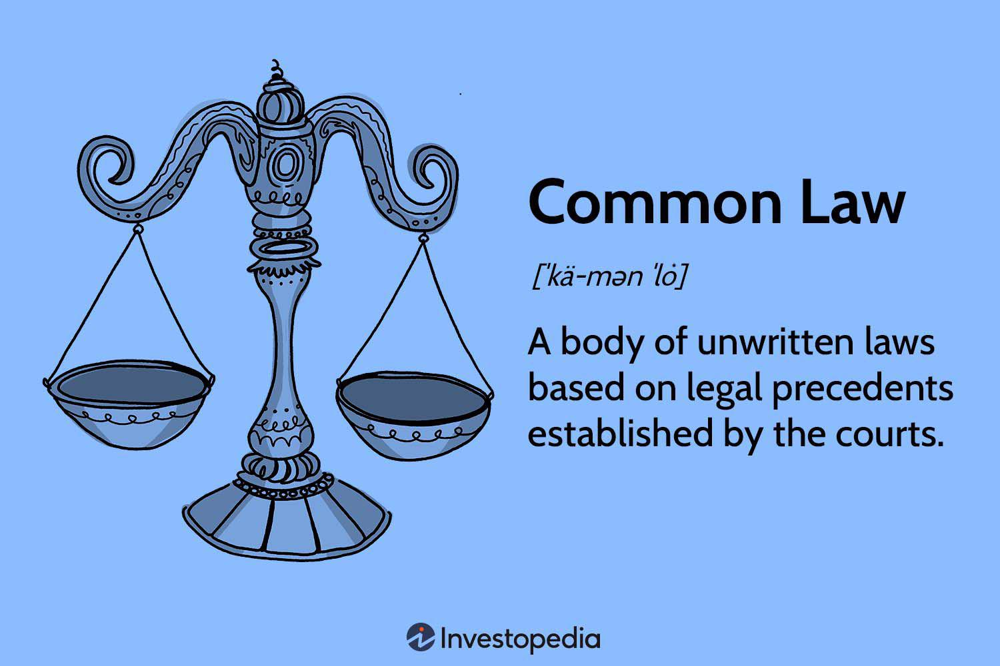

The American Rule is a fundamental principle of the U.S. legal system that dictates each party involved in litigation is responsible for paying their own legal fees, irrespective of the outcome of the case. This principle is rooted in the belief that each individual should have equal access to seek justice without the fear of prohibitive costs if they do not prevail in their case. By minimizing the financial risks associated with litigation, the American Rule aims to encourage individuals and businesses to pursue legitimate legal actions.

Despite its broad application, there are notable exceptions to the American Rule. Certain circumstances, defined by statutory and judicial precedents, allow for legal fees to be awarded to the prevailing party. These exceptions are significant in ensuring that justice is not only accessible but also administered fairly and efficiently.

In the context of modern financial markets, algorithmic trading presents unique legal challenges. As algorithmic trading grows in complexity and prevalence, disputes may arise that require legal intervention. Understanding how the American Rule and its exceptions apply to such cases is crucial for traders and financial institutions. This article will explore the intersection of the American Rule and algorithmic trading, examining how these legal principles impact modern trading environments and the potential for future legislative adaptations to accommodate technological advancements in trading mechanisms.

## Table of Contents

## Understanding the American Rule

The American Rule is a fundamental pillar of the U.S. legal system, dictating that each party involved in litigation is responsible for their own attorney fees, irrespective of the outcome of the case. This principle stands in contrast to the English Rule, under which the losing party is required to bear the legal costs of both parties. The American Rule is underpinned by the rationale of enhancing access to justice, ensuring that the fear of potentially crippling legal costs does not deter individuals or businesses from pursuing legitimate claims. 

The primary advantage of the American Rule is its fostering of an equitable litigation environment, where the financial burden of losing a case is somewhat mitigated. This rule is designed to democratize access to the courts, allowing individuals and companies to seek redress without the looming threat of exorbitant legal fees if they are unsuccessful. As a result, it lowers the threshold for entry into the legal system, providing assurance that the fear of additional financial liability does not overshadow the pursuit of just claims.

For businesses, particularly smaller enterprises, the American Rule serves to encourage the resolution of disputes without undue financial pressure. It enables companies to defend their interests or challenge unlawful practices without the deterrent of an enforced financial penalty should their case not prevail. For individuals, particularly those without substantial financial means, the rule acts as a safeguard, allowing legal recourse without the overwhelming risk of being liable for the opposing party's legal fees.

The distinction between the American Rule and the English Rule is significant in shaping litigation strategies and anticipating potential financial outcomes. Under the English Rule, parties to a dispute must weigh their potential legal costs with more caution, as losing the case could result in a substantial financial obligation beyond their own attorney fees. Conversely, the American Rule provides a more predictable financial landscape, where the costs incurred are primarily those of one's own legal representation, thus promoting a more open and accessible justice system.

In essence, the American Rule reflects an ethos that prioritizes access to legal processes over punitive financial consequences. By doing so, it reinforces the principle that justice should be available to all, regardless of financial standing. The significance of this rule is substantial, influencing not only the likelihood of parties engaging in litigation but also shaping the broader landscape in which the U.S. legal system operates.

## Exceptions to the American Rule

The American Rule, which is a cornerstone of the U.S. legal system, asserts that each party bears their own legal expenses, regardless of the lawsuit's outcome. However, there are notable exceptions to this principle, both statutory and contractual, which reflect the complexity of legal processes and the diverse nature of cases encountered in U.S. courts.

Statutory exceptions are perhaps the most codified deviations from the American Rule. One prominent example is the Magnuson-Moss Warranty Act, a federal law designed to enhance consumer protection by allowing prevailing consumers to recover legal fees in warranty disputes. This statutory exception aims to empower consumers, mitigating financial barriers to pursuing legitimate claims against manufacturers who breach warranties. Similarly, many civil rights statutes permit fee-shifting to encourage the enforcement of crucial rights, ensuring that the potential burden of attorney fees does not deter victims from seeking justice.

Contractual exceptions arise when parties in a contract mutually agree to include a clause that shifts attorney fees to the losing party. Such provisions are often found in commercial agreements and leases. These clauses are enforceable in courts, provided they are clear and agreed upon by the parties involved, showcasing the flexibility within the legal system to adapt to the specific needs of contractual parties.

Additionally, exceptions exist in scenarios characterized by bad faith litigation, frivolous claims, and suits that serve the public interest. In cases of bad faith, where one party engages in legally unscrupulous behavior, courts may order fee-shifting to penalize the offending party and compensate the wronged party for unnecessary legal expenses. Similarly, frivolous claims, which lack any substantial legal basis, can lead courts to impose attorney fees on the initiating party, discouraging the misuse of judicial resources. Public interest cases frequently involve fee-shifting to enable parties to address issues that serve a greater societal good, ensuring that public policy objectives aren't thwarted by the financial burden of legal fees.

State-specific laws and precedents also contribute to the exceptions under the American Rule. Various states have enacted statutes that allow for fee recovery in particular circumstances, such as anti-SLAPP (Strategic Lawsuit Against Public Participation) laws. These laws are designed to expedite the dismissal of meritless suits filed against individuals or organizations for exercising their right to free speech, often with an accompanying provision for the recovery of legal fees to deter such litigations.

In summary, while the American Rule provides the default framework governing attorney fees in the United States, the myriad of statutory, contractual, and judicial exceptions ensures that the rule is both adaptable and responsive to varying legal landscapes. These exceptions play a crucial role in maintaining fairness and accessibility within the justice system.

## Statutory Exceptions to the American Rule

Statutory exceptions to the American Rule permit the recovery of legal fees under specific circumstances, diverging from the general principle where each party is responsible for their own costs. Such exceptions are established through legislation and usually aim to incentivize certain types of legal actions or to ensure fairness when significant power imbalances exist.

Consumer protection laws often provide for statutory exceptions to the American Rule. Legislation like the Fair Debt Collection Practices Act (FDCPA) and the Truth in Lending Act (TILA) allows prevailing consumers to recover attorney fees. This legal framework is designed to empower consumers to seek redress against more powerful corporate entities without the fear of crippling legal costs. For example, if a consumer brings a successful lawsuit against a lender for violating TILA regulations, the court may grant attorney fees, thus relieving the financial burden associated with the litigation process. This provision levels the playing field, encouraging consumers to assert their rights without being deterred by the potential cost of litigation.

Civil rights cases also frequently feature statutory exceptions. Laws such as the Civil Rights Attorney's Fees Awards Act of 1976 enable prevailing plaintiffs to recover legal fees in civil rights litigation. The intent is to facilitate access to justice for individuals whose civil rights have been violated, thereby promoting enforcement of fundamental rights. These exceptions are especially critical when plaintiffs face financially and resourcefully superior defendants, such as government bodies or large corporations.

In the context of financial markets and trading scenarios, statutory exceptions can greatly impact legal disputes arising from [algorithmic trading](/wiki/algorithmic-trading) issues. Securities laws, such as the Securities Exchange Act of 1934, incorporate provisions allowing for the recovery of legal fees in cases of securities fraud. This is pertinent in scenarios where investors are misled by trading algorithms, highlighting the need for robust legal avenues to address grievances. As algorithmic trading involves complex technology that can obscure fraudulent activities, these statutory exceptions play a pivotal role in maintaining market integrity by enabling affected parties to seek redress without prohibitive legal expenses.

Thus, statutory exceptions to the American Rule serve to address power imbalances and ensure equitable access to the justice system, extending crucial support in consumer protection and civil rights, as well as in financial markets disputes. These provisions are particularly relevant as algorithmic trading continues to evolve, presenting new challenges and potential for disputes within the financial sector.

## American Rule and Algorithmic Trading

Algorithmic trading represents a paradigm shift in the way financial markets operate, which leverages computer algorithms to execute orders at speeds and frequencies hypersensitive to market changes. This form of trading is particularly significant due to its ability to increase [liquidity](/wiki/liquidity-risk-premium), narrow spreads, and execute tasks far beyond human capabilities, making it a substantial component of modern financial ecosystems.

Legal disputes in algorithmic trading often emerge from issues such as technology failures, market manipulation, and the complexities inherent to high-frequency trading. These disputes can arise from scenarios where algorithms behave unpredictably, resulting in significant financial losses or unfair market advantages. Notable cases have involved "flash crashes," where rapid sell-offs followed by recoveries have occurred due to algorithmic anomalies. Another area of concern is the intentional manipulation of markets, known as spoofing, where traders place large orders that they never intend to execute to create false impressions of demand or supply.

The application of the American Rule, which dictates that each party bears their own legal costs irrespective of the outcome, is particularly relevant in algorithmic trading disputes. In these cases, the substantial costs associated with litigation can serve as a barrier to pursuing legal action, especially against well-funded financial entities. However, exceptions to the American Rule may facilitate fee-shifting in certain circumstances, such as when litigation is considered frivolous or conducted in bad faith. These exceptions could potentially apply if an algorithmic trading case involves egregious behavior warranting punitive measures. 

In practice, technology-induced actions in trading algorithms may prompt legal scrutiny under specific legislative frameworks designed to protect market integrity. For example, if an algorithm creates a situation that fits within the confines of statutory provisions designed to prevent unfair trading practices, exceptions might allow fee recovery. Furthermore, the complex, data-driven nature of such cases may necessitate expert testimonies, leading to increased litigation costs which could pressure parties to settle outside of court, especially when the American Rule applies without exception. 

In conclusion, while algorithmic trading contributes to the efficiency and dynamism of financial markets, it also introduces unique legal challenges. The American Rule and its exceptions play a critical role in determining whether the burden of legal costs will inhibit or encourage the pursuit of justice in disputes arising from technological advances in trading.

## Implications and Challenges

The American Rule holds significant implications for traders and financial entities engaged in algorithmic trading, primarily because it dictates that each party bears its own legal costs. This aspect becomes crucial in legal disputes stemming from algorithmic trading activities, where complexities can arise due to technicalities and the advanced nature of the technology involved.

One of the critical challenges presented by exceptions to the American Rule is the potential for certain parties to have legal fees awarded against them, particularly when exceptions such as bad faith litigation or frivolous claims come into play. This possibility introduces an element of financial risk that traders and financial entities must consider, as the unpredictability in the recovery of legal costs can impact their financial stability and willingness to pursue or defend against legal actions.

Balancing the need to encourage trading activities with the necessity of ensuring that legal costs do not obstruct justice is another pressing concern. In a highly competitive and rapidly evolving field like algorithmic trading, participants must remain vigilant of the legal frameworks governing their operations. The presence of statutory exceptions, such as those applicable under consumer protection laws, means traders must carefully navigate legal landscapes to avoid incurring substantial legal expenses that could deter legitimate trading practices.

From a societal and economic perspective, the principles enshrined by the American Rule influence how algorithmic trading evolves. On one hand, allowing parties to bear their own legal costs supports a level playing field, encouraging innovation and competition in the financial markets. On the other hand, the potential for exceptions to lead to disproportionate financial burdens poses a challenge, particularly for smaller entities that may lack the extensive resources needed to handle complex disputes.

The impact of these legal principles extends beyond individual entities, affecting market dynamics. As algorithmic trading becomes more prevalent, the ability of financial markets to function efficiently relies heavily on clear and fair legal directives that account for technological advancements. Therefore, continuous assessment and adjustment of legal approaches are essential to ensure a conducive environment for both innovation and justice in algorithmic trading.

## Conclusion

The American Rule, a cornerstone of the U.S. legal system, establishes that each party in a lawsuit is responsible for their own attorney's fees, regardless of the outcome. This principle is designed to ensure access to justice by preventing the financial deterrent that could arise from the threat of paying the opposing party's legal fees. However, several exceptions exist, allowing for the recovery of legal fees under certain circumstances, such as statutory provisions, contractual agreements, and cases involving bad faith or frivolous claims.

Understanding these nuances is crucial in the context of algorithmic trading, a field marked by rapid technological changes and complex legal landscapes. As disputes involving algorithmic trading can arise, knowledge of when exceptions to the American Rule apply becomes vital for traders and financial entities. This knowledge can influence strategies and risk assessments, ensuring these players are prepared for potential legal challenges.

As the trading environment continues to evolve, there is a growing need for discourse on how legal principles like the American Rule can adapt to emerging technologies. Such discussions can guide the development of more finely-tuned legal frameworks that balance the interests of innovation with fair and accessible justice. The legal landscape must evolve to accommodate these advancements, ensuring it remains relevant and effective amid continuous technological progress in trading mechanisms.

## References & Further Reading

[1]: Bickel, A. (1983). ["The American Rule and How it Affects Lawsuits."](https://www.researchgate.net/publication/330133068_Does_the_American_Rule_Promote_Access_to_Justice_Was_that_Why_it_was_Adopted) Yale Law Journal, 92(2), 417-444.

[2]: ["Fee Shifting—In Litigation Today."](https://papers.ssrn.com/sol3/papers.cfm?abstract_id=3841084) American Bar Association

[3]: ["Handbook on Algorithmic Trading"](https://www.amazon.com/Algorithmic-Trading-Practitioners-Jeffrey-Bacidore/dp/0578715236) by Greg N. Gregoriou

[4]: Miller, G. P. (1987). ["Legal Realism and the American Rule: Owners, Losers, and Other Readers in Northwestern Constitutional Law."](https://en.wikipedia.org/wiki/List_of_Howard_University_people) Northwestern University Law Review.

[5]: Hasbrouck, J. (2007). ["Empirical Market Microstructure: The Institutions, Economics, and Econometrics of Securities Trading."](https://academic.oup.com/book/52241) Oxford University Press.

[6]: Wyner, A. J. (2010). ["Algorithmic Trading Strategies"](https://fsc.stevens.edu/fe670-algorithmic-trading-strategies/) in Encyclopedia of Quantitative Finance.

[7]: Painter, R. W. (1996). ["Behind the American Rule: An Empirical Analysis of Fee Shifting."](https://www.jstor.org/stable/1372495) Harvard Law & Economics Discussion Paper No. 204.