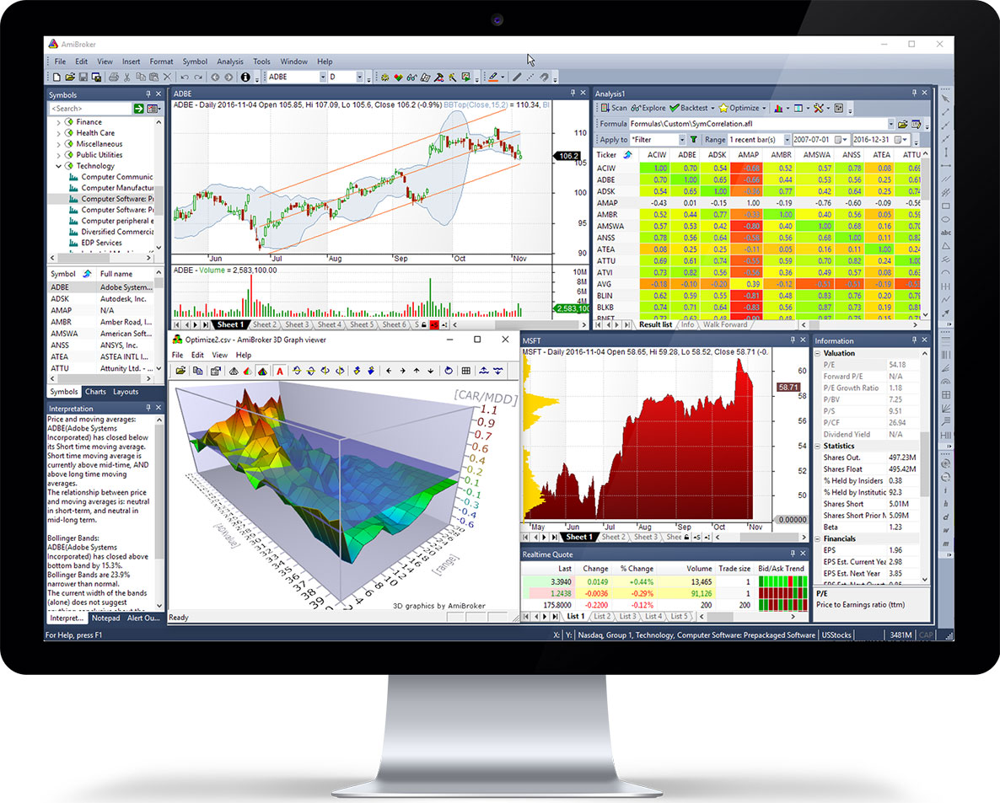

## Table of Contents

## What is AmiBroker and what is it used for?

AmiBroker is a software tool that helps people who invest in the stock market. It is used to analyze data about stocks and make decisions about buying or selling them. People who use AmiBroker can create charts and graphs to see how stocks are doing over time. They can also set up rules, called trading systems, to help them decide when to buy or sell a stock automatically.

The software is popular among traders because it can handle a lot of data quickly and has many tools to help with analysis. AmiBroker allows users to write their own formulas and programs, called AFL (AmiBroker Formula Language), to customize how they analyze the market. This makes it very flexible for different trading strategies. Whether someone is just starting out or has been trading for years, AmiBroker can be a useful tool for managing investments.

## How easy is it to install and set up AmiBroker for a beginner?

Installing and setting up AmiBroker is pretty straightforward, even if you're new to it. You start by downloading the software from the AmiBroker website. Once you've downloaded it, you run the installer and follow the on-screen instructions. It's a lot like installing any other program on your computer. After the installation, you'll need to enter your license key to activate the software. This part is easy because the key is usually sent to you by email when you buy AmiBroker.

After you've got AmiBroker installed and activated, setting it up for the first time might take a little more effort. You'll need to connect it to a data feed, which is a service that provides stock market data. AmiBroker works with many different data providers, so you can choose one that fits your needs. Once you've set up the data feed, you'll need to import some data to start analyzing. This might sound tricky, but AmiBroker has guides and tutorials to help you through each step. Overall, while there's a bit of a learning curve, AmiBroker is designed to be user-friendly, even for beginners.

## What are the key features of AmiBroker that make it stand out from other trading software?

AmiBroker stands out from other trading software because it is very fast and can handle a lot of data at once. This is important for traders who need to look at lots of information quickly. The software also lets users write their own formulas and programs using the AmiBroker Formula Language (AFL). This means people can make the software work the way they want it to, which is not always possible with other programs. It's like being able to build your own tools to help you trade better.

Another key feature is how easy it is to set up and use, even if you're new to trading. AmiBroker comes with guides and tutorials that help you connect it to different data feeds and start analyzing stocks right away. It also has a lot of tools for making charts and graphs, which can help you understand the market better. This mix of being powerful yet user-friendly makes AmiBroker a favorite among both beginner and experienced traders.

## Can you explain the basic interface and navigation of AmiBroker?

When you open AmiBroker, you'll see a main window that's divided into different parts. At the top, there's a menu bar where you can click on things like "File," "Edit," and "Tools" to do different tasks. Below that, there's a toolbar with buttons that help you quickly do common actions, like opening charts or running your trading formulas. On the left side, there's a panel called the "Workspace" where you can see your charts, lists of stocks, and other important information. You can click on different tabs in the Workspace to switch between what you want to look at.

The main part of the screen is where you'll see your charts. You can zoom in and out, move around, and add different lines or indicators to help you understand the stock's performance. If you want to change settings or add new data, you can use the menus or the toolbar. At the bottom, there's a status bar that shows you helpful information like the current price of a stock or the date range you're looking at on the chart. Overall, AmiBroker's interface is designed to be easy to use, so you can focus on analyzing the market without getting lost in the software.

## How does AmiBroker support backtesting of trading strategies?

AmiBroker makes it easy for you to test your trading ideas before you use them with real money. This is called [backtesting](/wiki/backtesting). You can write your trading rules using AmiBroker's special language called AFL. Then, you tell AmiBroker to use old stock data to see how your rules would have worked in the past. It's like playing a game where you see if your strategy could have made money or lost money over time.

AmiBroker is fast at doing these backtests, even if you have a lot of data to look at. You can see detailed reports that show how well your strategy did, like how much money it could have made or lost, and how often it would have made trades. This helps you understand if your trading idea is good or if you need to change it. By using backtesting, you can feel more confident about your trading plan before you start using it for real.

## What types of charts and technical analysis tools does AmiBroker offer?

AmiBroker offers many types of charts to help you see how stocks are doing. You can use line charts, bar charts, or candlestick charts. These charts can show you the price of a stock over different times, like days, weeks, or even years. You can also add different lines or indicators on the charts, like moving averages or trend lines, to help you understand the stock's movement better. This makes it easier for you to see patterns and make decisions about buying or selling.

The software also has many tools for technical analysis. You can use these tools to look at things like the stock's [momentum](/wiki/momentum), how much it's moving up or down, and other important signs that can help you predict what might happen next. AmiBroker lets you create your own formulas to analyze the data in ways that work best for you. This means you can set up the software to show you the information you need to make smart trading choices.

## How can users customize indicators and trading systems in AmiBroker?

In AmiBroker, users can customize indicators and trading systems by using the AmiBroker Formula Language (AFL). This special language lets you write your own rules and formulas to analyze the stock market. For example, if you want to create a new indicator, you can write a formula that tells AmiBroker how to calculate it based on the stock's price and other data. Once you've written your formula, you can add it to your charts and use it to make trading decisions. This means you can create tools that are just right for your own trading style.

You can also customize trading systems in AmiBroker by writing AFL code to set up your buying and selling rules. For instance, you might want to buy a stock when its price goes above a certain moving average and sell it when it drops below another. By writing these rules in AFL, you can tell AmiBroker exactly when to make trades based on your strategy. This flexibility lets you test different ideas and find the best way to trade for you. Whether you're looking to create new indicators or set up a whole trading system, AmiBroker gives you the tools to make it happen.

## What are the system requirements for running AmiBroker effectively?

To run AmiBroker effectively, you need a computer with a good amount of power. You'll need at least a 1 GHz processor, but a faster one is better if you want to work with a lot of data quickly. You should have at least 1 GB of RAM, but more RAM is better for handling big datasets. Also, you need about 100 MB of free space on your hard drive to install the software. AmiBroker works on Windows, so you need a Windows computer to use it. If you have a newer computer, it should be able to run AmiBroker without any problems.

AmiBroker can work with different types of data feeds, so you need to make sure your internet connection is good enough to get the data you need. The software is fast, but having a strong computer helps it run even faster. If you're going to be backtesting a lot or working with a lot of charts at the same time, a more powerful computer will make your work smoother. Overall, as long as your computer meets these basic requirements, you should be able to use AmiBroker well.

## How does AmiBroker handle real-time data feeds and what are the costs associated?

AmiBroker can connect to many different services that give you real-time stock market information. These services are called data feeds. When you set up AmiBroker, you choose a data feed that you like, and then the software talks to that service to get the latest prices and other details about stocks. This way, you can see what's happening in the market right now and make quick decisions. AmiBroker works well with these feeds, making sure the information comes in fast and smoothly.

The cost of using real-time data feeds with AmiBroker depends on which service you pick. Different data feed providers charge different amounts. Some might charge you a monthly fee, while others might have a yearly subscription. You'll need to check with the data feed provider to see how much it costs. Remember, the cost of AmiBroker itself is separate from the cost of the data feed. So, you'll need to think about both when planning your budget for trading.

## Can you discuss the AFL (AmiBroker Formula Language) and its capabilities for advanced users?

AFL, or AmiBroker Formula Language, is a special tool that lets advanced users do a lot of cool things in AmiBroker. It's like a language that you can use to tell the software exactly what to do. With AFL, you can make your own indicators, which are tools that help you see what's happening with a stock. You can also set up your own trading rules, so AmiBroker knows when to buy or sell based on what you think is best. This means you can make the software work just the way you want, which is great for people who have their own special way of trading.

AFL is also really good for backtesting, which is when you test your trading ideas on old data to see if they would have worked. Advanced users can write AFL code to run these tests quickly and see detailed reports on how well their ideas did. This helps them understand if their strategies are good or if they need to change them. Plus, AFL lets you do all sorts of math and calculations, so you can really dig deep into the numbers and find the best ways to trade. It's a powerful tool that gives you a lot of control over how you use AmiBroker.

## What kind of community and support resources are available for AmiBroker users?

AmiBroker has a big community of users who help each other out. There are lots of places online where you can ask questions and get answers. The AmiBroker website has a forum where people share tips, tricks, and their own AFL codes. You can also find blogs and websites made by other AmiBroker users that have helpful information and examples. If you're stuck or want to learn more, you can always find someone in the community who is ready to help.

There are also official support resources from AmiBroker. They have a help file that comes with the software, which explains how to use everything. If you need more help, you can send an email to their support team. They are good at answering questions and solving problems. AmiBroker also offers webinars and tutorials that can teach you more about using the software and trading in general. So, whether you're a beginner or an expert, there are plenty of ways to get the help you need.

## How does AmiBroker compare to other popular trading platforms in terms of functionality and price?

AmiBroker is known for being fast and able to handle a lot of data, which is great for traders who need to look at lots of information quickly. It also lets you write your own formulas and trading rules using AFL, which makes it very flexible. Compared to other popular trading platforms like MetaTrader or TradingView, AmiBroker stands out because of its speed and customization options. MetaTrader is also good for writing custom indicators and trading robots, but it might not be as fast as AmiBroker. TradingView is user-friendly and has a lot of built-in tools, but it doesn't let you customize as much as AmiBroker does.

When it comes to price, AmiBroker costs around $279 for a one-time purchase, which can be a good deal if you plan to use it for a long time. MetaTrader is usually free to download, but you often need to use it with a specific broker, and some advanced features might cost extra. TradingView has different plans that range from free to around $59.95 per month, depending on what features you need. So, while AmiBroker might seem more expensive at first, it could save you money over time compared to monthly subscription models like TradingView.

## References & Further Reading

[1]: Bergstra, J., Bardenet, R., Bengio, Y., & Kégl, B. (2011). ["Algorithms for Hyper-Parameter Optimization."](https://papers.nips.cc/paper/4443-algorithms-for-hyper-parameter-optimization) Advances in Neural Information Processing Systems 24.

[2]: ["Advances in Financial Machine Learning"](https://www.amazon.com/Advances-Financial-Machine-Learning-Marcos/dp/1119482089) by Marcos Lopez de Prado

[3]: ["Evidence-Based Technical Analysis: Applying the Scientific Method and Statistical Inference to Trading Signals"](https://www.amazon.com/Evidence-Based-Technical-Analysis-Scientific-Statistical/dp/0470008741) by David Aronson

[4]: ["Machine Learning for Algorithmic Trading"](https://github.com/stefan-jansen/machine-learning-for-trading) by Stefan Jansen

[5]: ["Quantitative Trading: How to Build Your Own Algorithmic Trading Business"](https://books.google.com/books/about/Quantitative_Trading.html?id=j70yEAAAQBAJ) by Ernest P. Chan