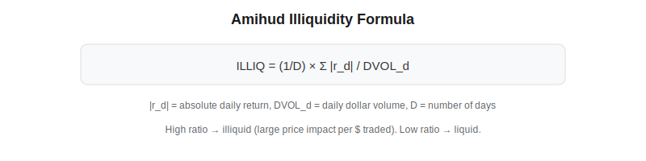
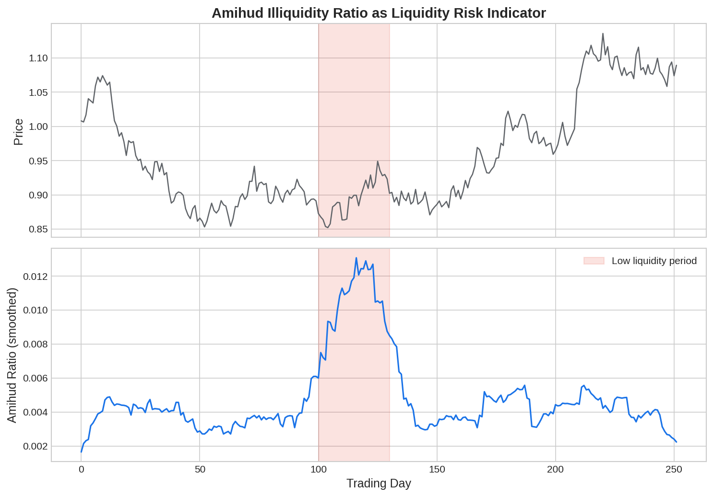

The Amihud illiquidity ratio, introduced by Yakov Amihud (2002), is one of the most widely used measures of market liquidity in academic finance and quantitative trading. It estimates the daily price impact of trading by dividing the absolute daily return by the daily dollar trading volume. A high Amihud ratio indicates an illiquid asset where each dollar traded moves the price significantly — critical information for [algorithmic trading](https://paperswithbacktest.com/wiki/systematic-trading-strategies) strategies that need to manage execution costs.

## What Is the Amihud Illiquidity Ratio?

$$\text{ILLIQ}_i = \frac{1}{D} \sum_{d=1}^{D} \frac{|r_{i,d}|}{\text{DVOL}_{i,d}}$$

where $|r_{i,d}|$ is the absolute return of asset $i$ on day $d$, $\text{DVOL}_{i,d}$ is the dollar trading volume, and $D$ is the number of trading days in the measurement period. The ratio captures how much "bang" (price movement) you get per "buck" (dollar traded). Higher values mean less liquidity.



## How to Interpret ILLIQ

The Amihud ratio is measured in units of (return per dollar), which makes cross-sectional comparisons straightforward:

| ILLIQ Level | Interpretation | Examples |
|---|---|---|
| Very low (< 1e-10) | Highly liquid | AAPL, SPY, major FX pairs |
| Moderate (1e-10 to 1e-8) | Average liquidity | Mid-cap equities |
| High (> 1e-8) | Illiquid | Small-caps, emerging markets |

The ratio increases during market stress as volumes drop and volatility spikes — making it a useful indicator of liquidity risk.



## Python Implementation

```python
import numpy as np
import pandas as pd

def amihud_illiquidity(returns, dollar_volume, window=20):
    illiq = returns.abs() / dollar_volume
    illiq = illiq.replace([np.inf, -np.inf], np.nan)
    return illiq.rolling(window).mean()

def amihud_ratio_annual(returns, dollar_volume):
    daily_illiq = returns.abs() / dollar_volume
    daily_illiq = daily_illiq.replace([np.inf, -np.inf], np.nan)
    return daily_illiq.mean()

# Example
np.random.seed(42)
n = 252
close = pd.Series(100 * np.cumprod(1 + np.random.normal(0.0005, 0.015, n)))
returns = close.pct_change().dropna()
volume = pd.Series(np.random.lognormal(15, 0.5, n-1))
dollar_vol = close.iloc[1:].values * volume.values
dollar_vol = pd.Series(dollar_vol, index=returns.index)

illiq = amihud_illiquidity(returns, dollar_vol)
print(f"Mean Amihud ILLIQ: {illiq.mean():.2e}")
```

## Applications in Trading

The Amihud ratio has several practical uses for quant traders. As a **liquidity screen**, traders filter out assets with ILLIQ above a threshold to avoid excessive market impact. As a **risk factor**, the illiquidity premium is a well-documented cross-sectional return predictor — illiquid stocks earn higher expected returns as compensation for bearing liquidity risk. As a **regime indicator**, a rising aggregate Amihud ratio signals deteriorating market-wide liquidity, which can trigger defensive positioning. Finally, combined with [Kyle's Lambda](https://paperswithbacktest.com/wiki/kyles-lambda) and [VPIN](https://paperswithbacktest.com/wiki/vpin-volume-synchronized-probability-informed-trading), it forms a comprehensive microstructure toolkit for monitoring market quality.

## Limitations and Risks

The Amihud ratio uses daily data, which misses intraday liquidity dynamics. It also conflates volatility with illiquidity — a stock with high return volatility and high volume will have a similar ILLIQ to a stock with low volatility and low volume, even though their liquidity profiles differ markedly. For high-frequency applications, [Kyle's Lambda](https://paperswithbacktest.com/wiki/kyles-lambda) or bid-ask spread measures are more precise.

## Conclusion

The Amihud illiquidity ratio is a simple, data-efficient measure of price impact that belongs in every quant's toolkit. Despite its limitations, it remains the most widely cited liquidity metric in both academic research and practical portfolio construction. For algo traders managing execution risk or building liquidity-factor strategies, it provides the foundation for smarter trade sizing and universe selection.

---

**Explore further on PapersWithBacktest:**
- Browse [backtested strategies](https://paperswithbacktest.com/strategies) with Python code and performance metrics
- Access [clean historical market data](https://paperswithbacktest.com/datasets) for equities, crypto, and futures
- Take the [algo trading course](https://paperswithbacktest.com/course) — 60+ video lessons and notebooks
- Related wiki pages: [Kyle's Lambda](https://paperswithbacktest.com/wiki/kyles-lambda) · [VPIN](https://paperswithbacktest.com/wiki/vpin-volume-synchronized-probability-informed-trading) · [Bid-Ask Spread](https://paperswithbacktest.com/wiki/bid-ask-spread)
