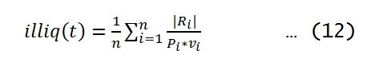

Quantifying liquidity and understanding market dynamics are essential components in algorithmic trading. One notable measure that has gained recognition is Amihud’s Lambda. This metric is specifically designed to assess market illiquidity, offering valuable insights into how market orders impact asset prices. By examining the relationship between price changes and trading volume, Amihud's Lambda provides a quantitative basis for evaluating the cost of executing trades in less liquid markets.

In this article, we will explore the concept of Amihud’s Lambda, its significance within the field of quantitative finance, and its practical application in algorithmic trading strategies. Understanding Amihud’s Lambda can enhance the development of robust trading algorithms, improving performance through better liquidity risk management. The metric empowers traders to optimize the execution of trades by considering how trade sizes might influence market prices.



The upcoming sections will outline the methods for calculating Amihud’s Lambda, interpreting its values, and applying these insights to real-world examples within algorithmic trading contexts. By integrating Amihud’s Lambda into their analytical toolkit, traders can achieve more efficient execution and strategically manage liquidity risks, thus enhancing the overall efficacy of their trading strategies.

## Table of Contents

## Understanding Amihud's Lambda

Amihud’s Lambda is a key metric used to quantify the price impact of trades, thereby offering insights into market [liquidity](/wiki/liquidity-risk-premium). Developed by Yakov Amihud, this measure assesses the extent to which an asset's price changes as a result of trading [volume](/wiki/volume-trading-strategy). It provides traders and market participants with a better understanding of liquidity dynamics, which is crucial for optimizing trade execution and managing liquidity risks.

The fundamental concept behind Amihud’s Lambda is the relationship between price movement and trading volume. Specifically, it calculates the average ratio of the absolute price change to the trading volume over a given period. A lower Lambda value indicates a more liquid asset, suggesting that a significant trade volume is necessary to cause a substantial price movement. In contrast, a higher Lambda implies less liquidity, meaning that even a small volume of trades can lead to noticeable price changes.

Mathematically, Amihud's Lambda ($\lambda$) can be expressed as:

$$
\lambda = \frac{|R_t|}{V_t}
$$

where $R_t$ represents the absolute return of the asset at time $t$, and $V_t$ is the trading volume during that period. This formula is typically averaged over a specific time frame to smooth out anomalies caused by isolated large trades or sudden market volatility.

Several underlying assumptions are crucial in interpreting Amihud’s Lambda:

1. **Linear Impact**: The model assumes a linear relationship between price changes and trade volumes. However, this may not hold in highly volatile or illiquid markets where non-linear effects can be more pronounced.

2. **Market Efficiency**: It presumes that markets are mainly efficient, and the observed prices reflect all available information. In cases where markets are inefficient or prone to manipulation, Lambda might not accurately reflect the true liquidity situation.

3. **Stable Conditions**: Amihud's Lambda is most reliable under stable market conditions. Sudden changes in investor sentiment or macroeconomic factors can lead to significant deviations.

Despite these assumptions, Amihud’s Lambda remains a widely used tool for assessing liquidity. Traders often use it to gauge the sensitivity of asset prices to their activities, help plan trade execution strategies, and manage the liquidity risks associated with large trades. As liquidity conditions can vary significantly across different assets and market environments, leveraging such metrics is imperative for achieving better trading outcomes.

## The Importance of Liquidity in Algorithmic Trading

Liquidity is a central element in trading, greatly impacting the capacity to execute sizable trades without triggering considerable price disturbances. In financial markets, liquidity refers to the ease with which an asset can be bought or sold without causing substantial impact on its price. High liquidity suggests that an asset can be traded quickly, with minimal price changes, while low liquidity indicates the opposite, implying potential difficulties and increased costs in transaction placements.

Algorithmic traders focus intensely on optimizing trade execution processes, aiming to minimize costs and slippage. Slippage occurs when there is a difference between the expected price of a trade and the actual price at which it executes. This discrepancy often arises due to insufficient market liquidity, leading to higher execution costs and potential loss in trading efficiency. Therefore, understanding liquidity dynamics is vital for traders seeking to ensure optimal trade execution and risk management.

Amihud’s Lambda is a key instrument providing algorithmic traders with the means to assess and incorporate liquidity information into their trading frameworks. This metric allows traders to quantify the impact of trade volumes on asset price changes, effectively encapsulating the liquidity condition of a market or asset. By evaluating Amihud's Lambda, traders can gain insights into how trading activities might influence market prices, which in turn aids in crafting strategies that consider potential liquidity constraints.

Utilizing Lambda, traders can make strategic decisions concerning the timing and size of their trades to enhance execution efficiency. When Lambda denotes high liquidity, traders may opt for larger order sizes, knowing that such trades are less likely to cause undesirable price movements. Conversely, in conditions of lower liquidity characterized by higher Lambda values, traders might reduce order sizes or employ limit orders, ensuring that trades are executed only within predefined price bounds to avoid unfavorable price shifts.

The significance of liquidity in [algorithmic trading](/wiki/algorithmic-trading) extends to its role in managing systematic risks and ensuring smooth operation within financial markets. For instance, high-frequency trading largely relies on rapid order execution and immediate liquidity provision. In such scenarios, understanding liquidity fluctuations becomes indispensable, affecting the success and profitability of trading activities.

In conclusion, liquidity is a pivotal [factor](/wiki/factor-investing) in the algorithmic trading landscape. Without comprehensive insights into liquidity conditions, traders expose themselves to heightened risks of slippage and inefficient trade execution. Amihud's Lambda stands as a robust tool, empowering traders to navigate complex liquidity environments and make informed decisions, fostering more effective and resilient trading strategies.

## Calculating Amihud’s Lambda in Practice

Calculating Amihud’s Lambda involves leveraging historical price and volume data for the asset in question. This metric provides crucial insights into an asset's liquidity conditions over a specified time period. The computation is typically conducted as follows:

### Data Requirements

To compute Amihud’s Lambda, first gather historical data that includes:
- Daily closing prices of the asset
- Trading volume for each corresponding day

### Formula

Amihud’s Lambda is calculated using the following formula:

$$
\lambda_t = \frac{1}{D} \sum_{d=1}^{D} \frac{|R_{d,t}|}{V_{d,t}}
$$

Where:
- $\lambda_t$ is the Amihud's Lambda for period $t$
- $D$ is the total number of days in the period $t$
- $|R_{d,t}|$ represents the absolute return for day $d$ during period $t$
- $V_{d,t}$ denotes the trading volume on day $d$ during period $t$

### Step-by-Step Guide Using Python

To illustrate this process, you can use Python with libraries such as Pandas for data manipulation and analysis. Here’s a simple guide:

1. **Import Required Libraries**
   ```python
   import pandas as pd
   ```

2. **Load Historical Data**
   Load your data that should ideally be in a CSV or from an API that provides daily prices and volumes.

   ```python
   data = pd.read_csv('historical_data.csv')
   ```

3. **Calculate Daily Returns**
   Compute the daily returns from the closing prices.

   ```python
   data['Return'] = data['Close'].pct_change().abs()
   ```

4. **Compute Amihud’s Lambda**
   Apply the formula by dividing the absolute returns by the volume, and averaging over the desired time period.

   ```python
   data['Amihud_Lambda'] = data['Return'] / data['Volume']
   amihud_lambda = data['Amihud_Lambda'].mean()
   ```

5. **Interpret Results**
   Once computed, the Lambda value reflects the average price impact per unit of trading volume. A lower Lambda indicates higher liquidity (less price movement per trade volume), while a higher Lambda suggests lower liquidity (more sensitive to trade volumes).

### Practical Implications

By implementing this calculation:
- Traders can incorporate these insights into their trading models.
- This data provides a snapshot of market liquidity conditions which can guide decisions for trade execution strategies and help in managing liquidity risk effectively.

This systematic approach allows traders to efficiently assess the liquidity conditions of their target assets and adjust trading strategies accordingly.

## Incorporating Amihud’s Lambda into Trading Strategies

Integrating Amihud’s Lambda into trading strategies offers traders a powerful mechanism to manage liquidity risk effectively. By examining the Lambda value, traders can obtain a quantitative measure of an asset's price sensitivity to trading volume changes, providing essential insights for trade execution decisions.

### Adjusting Order Sizes and Timing

One practical application of Amihud's Lambda is the adjustment of order sizes and execution timing. For assets presenting higher Lambda values, indicative of lower liquidity, traders should consider reducing order sizes or opting for strategic timing to minimize the adverse impact on market prices. Conversely, for assets with lower Lambda values, larger order sizes can be accommodated without significant price disruption. This adjustment is crucial in high-frequency trading environments where rapid transactions are executed based on real-time market data.

### Utilizing Limit Orders

In scenarios where Amihud’s Lambda indicates potential illiquidity with high values, traders might favor the use of limit orders over market orders. Limit orders allow traders to specify a desired price, thereby reducing the risk of executing trades at unfavorable prices during episodes of low liquidity. This strategy is beneficial in managing slippage, which is the difference between the expected and actual transaction price.

### Algorithmic Application

Amihud's Lambda can be effectively integrated into various algorithmic trading models. For instance, in [market making](/wiki/market-making) strategies, where liquidity provision is a core objective, incorporating Lambda provides a metric to adjust the bid-ask spread dynamically. A higher Lambda might lead to wider spreads to compensate for increased risk, while a lower Lambda could narrow spreads, facilitating more competitive pricing.

In portfolio management, algorithms can use Lambda to rebalance portfolios more effectively by timing trades in more liquid periods. This timing reduces transaction costs associated with executing large-scale trades.

### Dynamic Strategy Adaptation

The dynamic nature of market conditions necessitates trading strategies that can adapt swiftly. Python, with its rich set of libraries for financial analysis like pandas for handling time series data, can be used to create algorithms that monitor Lambda continuously. Below is a sample Python snippet illustrating the calculation and application of Lambda in an adaptive trading strategy:

```python
import pandas as pd

# Assuming df is a DataFrame with columns 'price', 'volume'
def calculate_lambda(df):
    df['return'] = df['price'].pct_change()
    df['impact'] = abs(df['return']) / df['volume']
    lambda_value = df['impact'].mean()
    return lambda_value

# Example data
data = {'price': [100, 101, 102, 100, 99], 'volume': [200, 180, 220, 210, 205]}
df = pd.DataFrame(data)

lambda_value = calculate_lambda(df)

# Dynamic order size adjustment
if lambda_value > 0.0005:
    order_size = 'Small'
else:
    order_size = 'Large'

print(f'Lambda: {lambda_value}, Suggested Order Size: {order_size}')
```

This script calculates the Lambda value and suggests an order size based on the asset's estimated liquidity.

### Conclusion

Incorporating Amihud’s Lambda into trading strategies equips traders with a critical tool for managing liquidity risk, optimizing trade execution, and enhancing overall trading performance. By dynamically adapting to market liquidity conditions, traders can significantly mitigate risks associated with market impact and slippage.

## Case Studies and Real-World Applications

In examining real-world applications of Amihud's Lambda, several cases highlight its utility in professional trading strategies such as high-frequency trading ([HFT](/wiki/high-frequency-trading-strategies)), portfolio rebalancing, and market making, all of which hinge on precise liquidity assessment.

High-frequency trading is one domain where Amihud's Lambda proves advantageous. Given the need for rapid trade execution with minimal market impact, HFT firms employ Lambda to gauge liquidity conditions and adjust trading algorithms accordingly. By evaluating Lambda, traders can dynamically alter order sizes and execution times, minimizing adverse price movements and optimizing fill rates. A firm like Virtu Financial, known for its HFT prowess, exemplifies the effective use of liquidity measurement tools akin to Lambda for sustaining competitive advantages.

Portfolio rebalancing strategies also benefit from Amihud's Lambda. During large-scale repositioning, fund managers need to execute trades that align with target allocations while minimizing market disruption costs. Lambda facilitates this by providing insights into the liquidity landscape, guiding the timing and scaling of trade orders to achieve efficient execution. For instance, BlackRock, with its massive assets under management, uses liquidity metrics to inform its algorithm-driven rebalancing operations, enhancing execution quality and reducing slippage.

In market making, Amihud's Lambda aids in setting bid-ask spreads and managing inventory risk. Market makers, such as Citadel Securities, leverage Lambda to adjust their quotes based on the prevailing liquidity conditions. A higher Lambda, indicating lower liquidity, might lead to wider spreads to compensate for the increased risk of holding positions. Conversely, a lower Lambda often results in tighter spreads, enhancing profitability while maintaining competitive pricing.

The implementation of Amihud's Lambda in these contexts demonstrates several tangible outcomes. A significant reduction in slippage—a common challenge in large or rapid trade executions—illustrates the efficacy of integrating Lambda into trading systems. By proactively adjusting strategies in response to liquidity conditions, traders can optimize execution costs, thereby improving the overall performance of their strategies.

Traders and firms utilizing these insights can adapt their algorithms to better navigate liquidity constraints, ultimately enhancing trading performance. Employing Amihud’s Lambda as a core component of a trading strategy facilitates more informed decision-making processes, leading to improved market interactions and financial outcomes. Such real-world applications underscore the value of Lambda in sophisticated trading environments.

## Challenges and Limitations of Using Amihud’s Lambda

Amihud’s Lambda is a widely used metric in quantitative finance for assessing market liquidity, yet its application is not without significant challenges and limitations. One primary challenge is its inherent reliance on historical data to forecast liquidity, which may not provide an accurate guide to future market conditions. Financial markets are inherently dynamic and subject to abrupt changes due to macroeconomic events, policy shifts, or unexpected market shocks, making past data sometimes an unreliable predictor of future liquidity.

Moreover, Amihud’s Lambda's sensitivity to extreme values of price changes or trading volumes can skew results. Such extreme market events, though infrequent, can unduly influence the Lambda calculation, leading to insights that might not truly reflect regular market liquidity. This sensitivity can result in misleading liquidity assessments, especially in volatile markets where such extreme variations are more common.

To mitigate these issues, traders need to adopt a cautious approach when using Amihud’s Lambda. One method involves complementing Lambda with other liquidity measures thereby gaining a more robust understanding of liquidity conditions. Measures such as the bid-ask spread, trading volume, or turnover rate offer additional insights into market liquidity that can counterbalance Lambda’s shortcomings.

Furthermore, statistical techniques such as outlier detection and removal can be implemented to reduce the impact of extreme values on the Lambda calculation. For instance, applying a trimmed mean or median rather than a simple average in the computation may provide a more stable and representative measure of liquidity.

In scenarios where Amihud’s Lambda might be less effective—such as during periods of irregular market activity or in emerging markets with less trading data—traders might benefit from using alternative liquidity metrics more attuned to those specific market environments. The choice of liquidity measure could thus be adapted based on the asset class, market conditions, and trading strategy, allowing for a more tailored and accurate liquidity assessment.

In conclusion, while Amihud’s Lambda is a powerful tool for evaluating market liquidity, its effective use requires careful consideration of its limitations. By integrating complementary measures and employing robust statistical techniques, traders can enhance the reliability of their liquidity assessments, ultimately improving the accuracy and efficacy of their trading strategies.

## Conclusion

Amihud’s Lambda provides invaluable insights into market liquidity and serves as a critical tool for algorithmic traders aiming to optimize their trading strategies. By quantifying the price impact per unit of trading volume, Lambda enables traders to better understand the liquidity conditions of the assets they are dealing with. This understanding can significantly improve execution efficiency, minimize transaction costs, and manage liquidity risks more effectively. A pivotal aspect of utilizing Amihud’s Lambda is its implementation in adaptive trading strategies that align with these liquidity dynamics.

Incorporating Lambda into algorithmic models allows traders to make informed decisions regarding trade timing and order sizes, thus reducing market impact and enhancing execution precision. Furthermore, Lambda equips traders with the ability to anticipate periods of low liquidity, facilitating the strategic adjustment of trading approaches to mitigate potential adverse effects on asset prices. However, the practical application of Lambda necessitates a cautious approach due to its limitations. The metric's reliance on historical data means that while it is helpful for past analyses, it may not always predict future liquidity conditions with absolute accuracy.

Additionally, Lambda's sensitivity to extreme price changes or volumes can sometimes obscure true liquidity insights. Therefore, continuous monitoring and adjustment of trading strategies are essential for leveraging Lambda effectively in the face of evolving market conditions. Traders are encouraged to rigorously test and iterate their models in real-world scenarios to gain a comprehensive understanding of Lambda's practical utility. By moving beyond theoretical applications and engaging in active experimentation, practitioners can harness the full potential of Amihud's Lambda, driving enhanced trading performance and robust risk management.

## References & Further Reading

[1]: Amihud, Y. (2002). "Illiquidity and Stock Returns: Cross-Section and Time-Series Effects." *Journal of Financial Markets*, 5(1), 31-56. [Available here](https://www.sciencedirect.com/science/article/pii/S1386418101000246).

[2]: Goyenko, R. Y., Holden, C. W., & Trzcinka, C. A. (2009). "Do Liquidity Measures Measure Liquidity?" *Journal of Financial Economics*, 92(2), 153-181. [Available here](https://www.sciencedirect.com/science/article/pii/S0304405X09000099).

[3]: Hasbrouck, J. (2009). "Trading Costs and Returns for U.S. Equities: Estimating Effective Costs and Component Costs." *Journal of Finance*, 64(3), 1445-1477. [Available here](https://numerique.banq.qc.ca/patrimoine/details/52327/2492948?docref=vGYfR6s6cKhnytpK63Acig).

[4]: [Amihud, Y. & Mendelson, H. (1986). "Asset Pricing and the Bid-Ask Spread." *Journal of Financial Economics*, 17(2), 223-249.](https://www.sciencedirect.com/science/article/pii/0304405X86900656)

[5]: ["Quantitative Finance for Dummies"](https://www.amazon.com/Quantitative-Finance-Dummies-Steve-DPhil/dp/1118769465) by Stephen Blyth

[6]: [Fabozzi, F. J., Focardi, S. M., & Kolm, P. N. (2010). "Quantitative Equity Investing: Techniques and Strategies."](https://www.semanticscholar.org/paper/Quantitative-Equity-Investing%3A-Techniques-and-Fabozzi-Focardi/1c49a2a53919f7e65cb96f16691b8ff726fd3cd7)