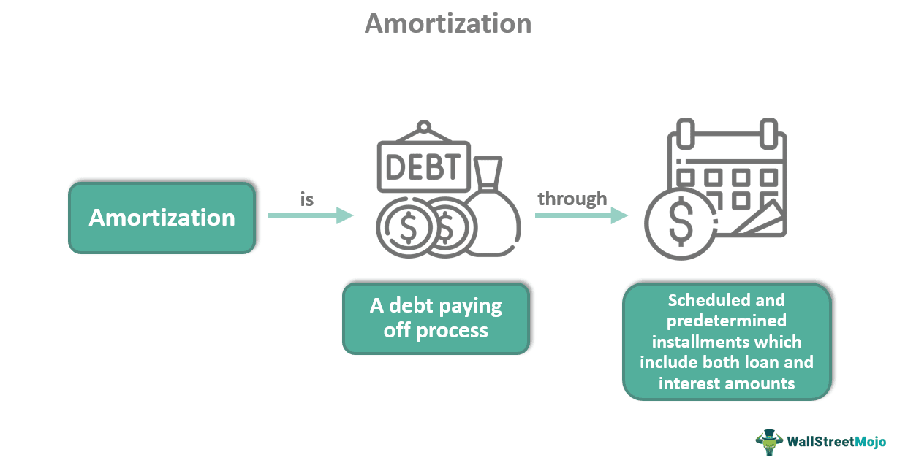

Finance, amortisation, loan repayment, and algorithmic trading are critical components in today's financial landscape. Each of these elements plays a vital role in personal and business finance management, optimizing strategies for better economic outcomes. As the financial world continues to evolve, understanding these elements becomes increasingly important for individuals and businesses aiming to make informed financial decisions.

Amortisation is essential for spreading out loan payments over time, allowing borrowers to manage debt efficiently while meeting specific loan terms. It not only involves regular instalments but also incorporates interest payments, making it a critical factor in financial planning and risk management.



Loan repayment strategies further inform financial decision-making, requiring borrowers to select plans that align with their financial capabilities and goals. Understanding how interest rates influence the cost of loan repayment over time enables more efficient financial planning and can contribute to improving creditworthiness.

Algorithmic trading, or algo trading, introduces technology-driven precision and efficiency to financial markets. By automating trading processes with pre-defined strategies and mathematical models, algorithmic trading can handle trades at high speed and accuracy, often surpassing manual techniques. This approach revolutionizes how financial markets operate, providing new opportunities for profit while supporting enhanced risk management.

These elements—finance, amortisation, loan repayment, and algorithmic trading—interconnect to create a robust framework for financial management in the modern era. The automation and data-driven analysis offered by algorithmic trading can complement traditional finance functions, such as loan amortisation and repayment, elevating financial strategies and risk assessment practices.

This article examines the intricate relationships among these components and highlights their significance in contemporary financial practices, underscoring the importance for individuals and businesses to adapt to and embrace technological advancements within the financial industry.

## Table of Contents

## What is Finance Amortisation?

Amortisation in finance refers to the process of spreading repayment of a loan across a period through regular, scheduled instalments. This technique is fundamental to managing debt strategically, as it allows borrowers to satisfy loan requirements steadily over time. Amortisation involves both principal and interest payments, ensuring that the borrower gradually reduces their debt while compensating the lender for the credit risk.

An understanding of amortisation is vital for borrowers aiming to plan their finances. By knowing the breakdown of each payment into interest and principal portions, borrowers can foresee how much of their money is allocated to reducing the debt versus covering interest costs. This planning capability is crucial when considering refinancing options or preparing for early loan payoff.

Financial institutions benefit from using amortisation schedules as well. These schedules provide valuable insights into expected cash flows, repayment patterns, and risk management. They map out each payment against the timeline of the loan, allowing banks to project earnings and ensure sufficient funds are available to cover lending commitments.

The calculation of amortisation typically involves creating a schedule that details each payment's division into interest and principal components. The formula to determine each payment amount $A$ is derived from the loan principal $P$, the [interest rate](/wiki/interest-rate-trading-strategies) per period $r$, and the total number of payments $n$. The formula is expressed as:

$$

A = P \times \frac{r(1 + r)^n}{(1 + r)^n - 1}
$$

Here, $r$ is the interest rate for the period expressed as a decimal, and $n$ is the number of payments over the term of the loan. Software and spreadsheet programs often utilize this formula to automate amortisation schedule production.

Amortisation's impact on personal finance involves enabling borrowers to anticipate monthly cash flow needs, helping maintain financial stability. For businesses, proper amortisation planning affects budgeting and financial projections, offering insights into future financial obligations and aiding in decision-making regarding investments and cash reserves.

Both individuals and corporations must understand amortisation to strategically manage loans. This planning minimizes financial stress and places borrowers in a better position to optimize their expenditure against financial goals and constraints. Through efficient amortisation, a balanced approach to debt management can be achieved, benefiting the financial health of both personal and corporate entities.

## Loan Repayment Strategies

Repaying loans effectively requires a comprehensive understanding of various repayment strategies. Among the primary approaches are lump-sum payments and regular installments. Choosing between these approaches depends on the financial situation and goals of the borrower. Key considerations include interest rates, which significantly influence the overall cost of loan repayment.

**Lump-Sum Payments vs. Regular Installments**

Lump-sum payments involve paying a substantial amount of the loan principal at once, thereby reducing the outstanding balance immediately. This method can substantially decrease the amount of interest paid over the life of the loan, assuming the lender allows penalty-free prepayments. For instance, if the interest calculation is based on the reducing balance method, paying a portion of the principal early can result in significant savings.

Regular installments, on the other hand, are fixed payments made at scheduled intervals. This approach suits borrowers who prefer stability and predictability in their financial planning, allowing for consistent budgeting over the loan term. The installment amount usually covers both principal and interest, the allocation of which changes over time. Initially, the majority of the installment covers interest, but this shifts towards the principal as the loan approaches maturity.

**Interest Rates and Loan Costs**

Interest rates play a crucial role in determining the total cost of a loan. Fixed interest rates provide certainty, as the rate remains unchanged throughout the loan term, offering predictable payment schedules. Variable interest rates, while potentially lower initially, can fluctuate based on market conditions, posing risks of higher costs over time.

Consider the formula for calculating the monthly installment for a fixed-rate loan:

$$
M = \frac{P \times r \times (1 + r)^n}{(1 + r)^n - 1}
$$

where $M$ is the monthly installment, $P$ is the principal loan amount, $r$ is the monthly interest rate, and $n$ is the number of payments.

**Strategies to Minimize Total Interest Paid**

Borrowers can adopt several strategies to minimize the total interest paid over the duration of a loan:

1. **Extra Payments**: Making additional payments towards the principal can dramatically reduce the interest burden. Even small extra payments can significantly shorten the loan term and decrease the total interest paid.

2. **Refinancing**: Borrowers may consider refinancing their loans if they can secure a lower interest rate. This approach involves taking a new loan to pay off the existing one, thus potentially reducing monthly payments and overall interest.

3. **Bi-Weekly Payments**: Switching from monthly to bi-weekly payments results in an extra month's worth of payments each year, helping to decrease the loan principal faster.

By carefully selecting a repayment strategy that aligns with their financial situation, borrowers can maintain financial stability and improve their creditworthiness. Managing loans responsibly involves balancing payment capability with the goal of reducing overall costs, fostering long-term economic health.

## Algorithmic Trading: Revolutionizing Financial Markets

Algorithmic trading, or algo trading, represents a significant advancement in financial markets, as it automates trading processes using pre-defined strategies and mathematical models. This approach is distinguished by its ability to execute trades at extremely high speeds with remarkable precision, often surpassing the capabilities of manual trading. Algorithmic trading primarily relies on data analysis and real-time market information, allowing traders to make informed decisions in a fraction of the time it would take a human trader.

One of the key components of [algorithmic trading](/wiki/algorithmic-trading) is data analysis. Traders use large datasets to identify patterns, trends, and opportunities in the market. These datasets include historical price data, trading volumes, and other relevant financial metrics. The analysis helps develop algorithms that can predict market movements and execute trades accordingly. Common tools utilized for data analysis in algorithmic trading include statistical models and [machine learning](/wiki/machine-learning) techniques. For example, traders might use a linear regression model to forecast future stock prices based on historical data.

The second foundational component is order execution. In algo trading, speed is crucial, as the ability to execute trades in milliseconds can determine the success of a strategy. High-frequency trading ([HFT](/wiki/high-frequency-trading-strategies)) is a subset of algorithmic trading that focuses on achieving the fastest execution times, often leveraging ultra-low latency connections and co-location services near stock exchange servers. Algo trading systems use complex order types and strategies to minimize market impact and maximize execution efficiency.

Backtesting is another essential aspect of algorithmic trading. This process involves testing trading strategies on historical data to evaluate their potential effectiveness. By simulating trades using past market conditions, traders can assess the viability and performance of their algorithms before deploying them in live markets. Backtesting helps refine strategies by highlighting areas of improvement and potential risks. For instance, a trader might use Python's library, such as Backtrader or PyAlgoTrade, to implement and test their strategy over historical data.

The transformation of financial markets through algorithmic trading is profound, offering new opportunities for profit and risk management. By automating trading decisions, financial entities can react swiftly to market changes, optimizing their trading positions and risk exposure. This technology-driven approach is also democratizing access to sophisticated trading strategies, enabling a broader range of market participants to engage in trading activities once dominated by large financial institutions.

In certain scenarios, algorithms can enhance market [liquidity](/wiki/liquidity-risk-premium) and price discovery, although concerns about their role in market [volatility](/wiki/volatility-trading-strategies) persist. Nonetheless, the benefits of algorithmic trading in terms of efficiency, speed, and data-driven decision-making make it a pivotal innovation in modern financial markets. As technology continues to advance, the integration of [artificial intelligence](/wiki/ai-artificial-intelligence) and machine learning into algo trading systems is expected to create even more sophisticated and adaptive trading strategies.

## Integrating Algo Trading with Traditional Finance

Algorithmic trading has revolutionized financial markets by leveraging automation and advanced computational techniques. When integrated with traditional finance practices, such as loan repayment and amortisation, it offers substantial enhancements in financial efficiency. Algorithms can play a crucial role in optimizing repayment schedules and predicting financial trends, which are pivotal for effective financial planning.

### Optimizing Repayment Schedules

Using algorithms to optimize repayment schedules can ensure that borrowers achieve the most financially advantageous outcomes. By analyzing vast amounts of data, algorithms can determine the optimal timing and amount of payments to reduce overall interest costs. An exemplary approach might involve the use of linear programming or machine learning models to suggest ideal repayment strategies.

For instance, an algorithm could be developed in Python using libraries such as NumPy and SciPy to calculate the minimum cost pathways in repayment schedules. This computational approach can identify how extra payments at specific intervals can effectively shorten the loan term and decrease total interest paid.

```python
import numpy as np
from scipy.optimize import linprog

# Objective: Minimize the total interest cost
# Example variables and constraints for repayment scheduling
coefficients = [...] # Coefficients representing interest rates
constraints = [...]  # Constraints representing payment limits and timings

result = linprog(coefficients, A_ub=constraints["A_ub"], b_ub=constraints["b_ub"])
```

### Predicting Financial Trends

Algorithmic trading's reliance on data analysis extends to predicting market trends and assessing risk effectively. Algorithms can digest market data rapidly, providing insights into macroeconomic indicators and shifts that could impact repayment conditions. This predictive capability aids in planning for volatile markets, ensuring that financial decisions remain proactive rather than reactive.

### Improved Risk Assessment and Management

Incorporating algorithmic techniques into traditional finance allows for better risk assessment and management. By using statistical models, financial institutions can evaluate the risk attached to specific repayment plans or amortization schedules. This is particularly beneficial in fluctuating economic conditions, where dynamic adjustments are necessary to maintain financial health.

### Case Studies in Algorithmic Applications

Several case studies highlight the successful integration of algorithmic trading methods with traditional finance activities. Financial institutions leveraging high-frequency trading strategies, for example, have managed to automate loan portfolio assessments, enhancing their ability to manage risk and allocate resources efficiently.

These case studies demonstrate how blending traditional finance with advanced algorithmic methods can streamline operational procedures and drive superior financial performance.

### Harnessing Technology for Superior Outcomes

By melding traditional finance methods with algorithmic trading's prowess, financial entities can achieve substantial efficiencies. This integration not only enhances the precision of financial planning but also opens avenues for innovation in managing loans and investments. Embracing such technology enables institutions to stay competitive, utilizing advanced tools to predict changes and adapt strategies accordingly.

In conclusion, the fusion of algorithmic trading techniques with traditional financial functions such as loan amortisation and repayment enables more informed, strategic decision-making, leading to improved financial outcomes. By capitalizing on these technological advancements, individuals and businesses alike can navigate the complexities of modern finance more effectively.

## Conclusion

The financial landscape is undergoing a significant transformation driven by technological advancements. In particular, finance amortisation, loan repayment, and algorithmic trading are becoming increasingly interconnected, leading to a comprehensive understanding of financial optimization. As these domains continue to converge, opportunities for enhanced financial strategies and robust risk management methods are on the rise.

Finance amortisation enables borrowers to effectively manage debt by spreading loan repayments over time, allowing for predictable financial planning. Loan repayment strategies focused on aligning with borrowers' fiscal capacities further enhance the ability to manage debt. Meanwhile, algorithmic trading has brought about a revolution in how financial trades are executed, relying on mathematical models and real-time data analysis for high-speed, precise decision-making. 

The fusion of algorithmic trading with traditional finance practices, such as amortisation and loan repayment, augments financial efficiency. Algorithms can optimize repayment schedules, predict market trends, and improve risk assessment. For both individual and corporate actors, adapting to these advancements is essential. Embracing the integration of technology with traditional financial practices affords a competitive edge in a dynamic financial environment.

Ultimately, the synergy between these elements equips individuals and businesses with tools for superior financial planning and execution. Staying informed and adaptable to technological developments ensures resilience and success in today's competitive markets. As the financial world relentlessly evolves, embracing these innovations will be key to maintaining and advancing personal and enterprise-level financial well-being.

## References & Further Reading

[1]: ["Advances in Financial Machine Learning"](https://www.amazon.com/Advances-Financial-Machine-Learning-Marcos/dp/1119482089) by Marcos Lopez de Prado

[2]: Bergstra, J., Bardenet, R., Bengio, Y., & Kégl, B. (2011). ["Algorithms for Hyper-Parameter Optimization."](https://dl.acm.org/doi/10.5555/2986459.2986743) Advances in Neural Information Processing Systems 24.

[3]: ["Machine Learning for Algorithmic Trading"](https://github.com/PacktPublishing/Machine-Learning-for-Algorithmic-Trading-Second-Edition) by Stefan Jansen

[4]: ["Quantitative Trading: How to Build Your Own Algorithmic Trading Business"](https://books.google.com/books/about/Quantitative_Trading.html?id=j70yEAAAQBAJ) by Ernest P. Chan

[5]: ["Evidence-Based Technical Analysis: Applying the Scientific Method and Statistical Inference to Trading Signals"](https://www.amazon.com/Evidence-Based-Technical-Analysis-Scientific-Statistical/dp/0470008741) by David Aronson