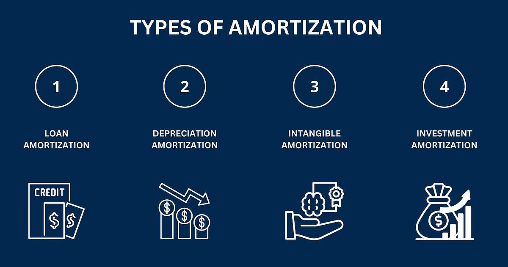

## Table of Contents

## What is amortization and why is it important?

Amortization is a way to spread out the cost of something expensive over time. It's like paying a little bit each month instead of a big amount all at once. This is often used for things like loans or big purchases, where you pay off the total cost gradually. For example, if you buy a car with a loan, you might pay it off over several years instead of all at once.

Amortization is important because it makes big purchases more affordable. Instead of needing to save up a huge amount of money, you can start using the thing you bought right away and pay for it slowly. This helps people and businesses manage their money better. It also helps companies keep track of the value of their assets over time, making sure they don't overstate their worth on financial statements.

## How does amortization differ from depreciation?

Amortization and depreciation are both ways to spread out the cost of something over time, but they are used for different things. Amortization is usually used for things that don't have a physical form, like a patent or a loan. When you amortize something, you're slowly paying off the cost over time. For example, if you take out a loan to buy a house, you'll pay it back little by little with each mortgage payment.

Depreciation, on the other hand, is used for things that you can touch, like a car or a machine. It's a way to show how the value of these things goes down over time because they get old or wear out. For example, if a company buys a new truck, they might depreciate its value over several years to reflect that it's not worth as much as it gets older. Both amortization and depreciation help businesses keep their financial records accurate, but they apply to different types of assets.

## Can you explain the basic formula used in amortization?

The basic formula for amortization helps you figure out how much you need to pay each month to pay off a loan or the cost of an intangible asset over time. The formula is: Payment = (Principal x (Interest Rate / Number of Payments per Year)) / (1 - (1 + (Interest Rate / Number of Payments per Year))^(-Number of Payments)). Here, 'Principal' is the total amount of money you borrowed or the cost of the asset, 'Interest Rate' is the rate you're charged for borrowing the money, and 'Number of Payments' is how many payments you'll make to pay it off.

Let's break it down simply. If you borrow $10,000 at an annual interest rate of 5% and you want to pay it back over 5 years with monthly payments, you'd use this formula. First, you'd figure out the monthly interest rate, which is 5% divided by 12 (months in a year), which equals about 0.4167%. Then, you'd calculate the number of payments, which is 5 years times 12 months, which equals 60 payments. Plugging these numbers into the formula would give you the amount you need to pay each month to pay off the loan over that time.

## What types of assets are typically amortized?

Amortization is used for things that don't have a physical form, like ideas or rights. These are called intangible assets. Common examples include patents, which give you the right to make or sell a new invention, and copyrights, which protect things like books or music. Another example is a trademark, which is a symbol or name that helps people recognize a brand. When a company buys one of these, they spread out the cost over the time they expect to use it.

Another type of asset that is often amortized is a loan. When you take out a loan, like a mortgage for a house or a car loan, you don't pay it all back at once. Instead, you make payments over time until the loan is paid off. This process of paying off the loan in regular amounts is called amortization. It helps make big purchases more manageable by breaking down the total cost into smaller, regular payments.

## How do you calculate monthly payments on an amortizing loan?

To calculate the monthly payments on an amortizing loan, you need to know three things: the total amount you borrowed (the principal), the annual interest rate, and the total number of payments you'll make. The formula to figure out your monthly payment is: Payment = (Principal x (Interest Rate / Number of Payments per Year)) / (1 - (1 + (Interest Rate / Number of Payments per Year))^(-Number of Payments)). For example, if you borrow $10,000 at a 5% annual interest rate and want to pay it back over 5 years, you first convert the annual interest rate to a monthly rate by dividing it by 12, which gives you about 0.4167%. Then, you multiply the number of years by 12 to get the total number of payments, which is 60. Plugging these numbers into the formula will tell you how much you need to pay each month.

Let's say you've done the math and found out your monthly payment. Each payment you make goes towards paying off the interest and a little bit of the principal. Over time, as you pay down the principal, the amount of interest you owe each month gets smaller. This means that with each payment, more of your money goes towards paying off the principal. By the end of the loan term, you'll have paid off the entire amount you borrowed, plus the interest. This is how amortization helps you manage big loans by spreading out the cost over time.

## What is an amortization schedule and how is it used?

An amortization schedule is a table that shows you how each payment on a loan is split up between paying off the interest and paying off the part you borrowed, which is called the principal. It also shows you how much you still owe after each payment. This schedule helps you see how your loan balance goes down over time as you make your payments.

People use an amortization schedule to understand how their loan works and to plan their finances. It's really helpful because it shows you exactly when you'll be done paying off the loan and how much of each payment goes towards the interest and how much goes towards the principal. This can help you decide if you want to pay off the loan faster by making extra payments, which can save you money on interest in the long run.

## How does the interest rate affect the amortization process?

The interest rate is a big part of how amortization works. When you take out a loan, the interest rate is how much it costs you to borrow the money. If the interest rate is high, more of your monthly payment goes towards paying the interest instead of the actual amount you borrowed, which is called the principal. This means it takes longer to pay off the loan because less of your money is going towards the principal each month. On the other hand, if the interest rate is low, more of your payment goes towards the principal, so you can pay off the loan faster and pay less interest overall.

Understanding how the interest rate affects your payments can help you make smart choices about loans. If you have a choice between loans with different interest rates, picking the one with the lower rate can save you a lot of money over time. Also, if you can, paying extra on your loan can help you pay it off faster, especially if the interest rate is high. This way, you can reduce the total amount of interest you end up paying.

## What are the tax implications of amortization for businesses?

Amortization can help businesses save on taxes. When a business buys something that doesn't have a physical form, like a patent or a trademark, they can spread out the cost of it over time. This is called amortizing the asset. By doing this, the business can claim a part of the cost as an expense each year on their taxes. This lowers their taxable income, which means they pay less in taxes. It's like getting a little tax break every year instead of all at once.

The way amortization affects taxes is important for businesses to understand. For example, if a company spends $100,000 on a patent that lasts for 10 years, they can claim $10,000 as an expense each year. This reduces their income by $10,000 each year, which in turn reduces the amount of taxes they have to pay. This can make a big difference, especially for businesses that invest a lot in intangible assets. It helps them manage their money better and plan for the future.

## How can amortization strategies be optimized for financial planning?

Amortization strategies can be optimized for better financial planning by understanding how to manage loan payments and asset costs. For loans, one way to optimize is by making extra payments. When you pay more than the required monthly amount, you reduce the principal faster. This means less interest over time, and you can pay off the loan quicker. It's like saving money on the cost of borrowing. Another way is to choose loans with lower interest rates, which also helps you pay less in interest and get out of debt faster.

For businesses, optimizing amortization involves managing the costs of intangible assets like patents or trademarks. By spreading out these costs over time, businesses can lower their taxable income each year, which helps with tax planning. It's important for a business to plan when to buy these assets and how long they will last. This way, they can time their expenses to match their income and reduce their tax bill. Good planning can make a big difference in how much money a business keeps at the end of the year.

## What are the differences between straight-line and effective interest methods of amortization?

The straight-line method and the effective interest method are two ways to spread out the cost of a loan or an asset over time, but they work differently. The straight-line method is simple. It means you pay the same amount of the cost each time. If you have a loan, you pay the same amount of the principal every month. If you have an asset, you divide the total cost by how many years you'll use it, and that's how much you write off each year. It's easy to understand and calculate, but it doesn't take into account how the interest on a loan changes over time.

The effective interest method, on the other hand, is more complex but can be more accurate. It takes into account that the interest on a loan changes as you pay it down. At the start, you pay more interest because the loan amount is bigger. As you pay off the loan, the interest goes down because the amount you owe gets smaller. This method means your payments change over time, with more of your money going towards the principal as the loan gets smaller. It's often used for bonds and some types of loans where the interest rate is important.

## How do changes in payment frequency impact the amortization of a loan?

Changing how often you make payments on a loan can affect how quickly you pay it off and how much interest you pay. If you pay more often, like weekly instead of monthly, more of your money goes towards the principal each time. This is because the interest is calculated less often, so less of your payment goes towards interest. Over time, this can mean you pay off the loan faster and pay less in interest overall.

On the other hand, if you pay less often, like every other month instead of monthly, more of your payment goes towards interest each time. This happens because the interest adds up over a longer period before you make a payment. This means it takes longer to pay off the loan and you end up paying more in interest. So, making payments more often can be a smart way to save money and get out of debt quicker.

## What advanced techniques can be used to model and predict amortization outcomes for complex financial instruments?

To model and predict amortization outcomes for complex financial instruments, you can use advanced techniques like Monte Carlo simulations. This method uses random numbers to run many different scenarios of how a loan or an asset might perform over time. By doing this, you can see all the possible ways the amortization could go, including best-case and worst-case scenarios. This helps you understand the risks and plan for different outcomes. For example, if you're dealing with a bond that has variable interest rates, a Monte Carlo simulation can show you how changes in interest rates might affect your payments and how long it might take to pay off the bond.

Another technique is using financial software that can handle complex calculations. Programs like Excel or specialized financial modeling software can be set up to calculate amortization schedules for different kinds of loans or assets. These tools let you input different variables, like interest rates or payment frequencies, and see how they change the outcome. This is really helpful for things like mortgage-backed securities, where many loans are bundled together, and you need to predict how they'll all pay off over time. By using these tools, you can make better decisions and plan for the future more accurately.

## What is Finance Amortisation?

Amortisation in finance refers to the process of spreading repayment of a loan across a period through regular, scheduled instalments. This technique is fundamental to managing debt strategically, as it allows borrowers to satisfy loan requirements steadily over time. Amortisation involves both principal and interest payments, ensuring that the borrower gradually reduces their debt while compensating the lender for the credit risk.

An understanding of amortisation is vital for borrowers aiming to plan their finances. By knowing the breakdown of each payment into interest and principal portions, borrowers can foresee how much of their money is allocated to reducing the debt versus covering interest costs. This planning capability is crucial when considering refinancing options or preparing for early loan payoff.

Financial institutions benefit from using amortisation schedules as well. These schedules provide valuable insights into expected cash flows, repayment patterns, and risk management. They map out each payment against the timeline of the loan, allowing banks to project earnings and ensure sufficient funds are available to cover lending commitments.

The calculation of amortisation typically involves creating a schedule that details each payment's division into interest and principal components. The formula to determine each payment amount $A$ is derived from the loan principal $P$, the [interest rate](/wiki/interest-rate-trading-strategies) per period $r$, and the total number of payments $n$. The formula is expressed as:

$$

A = P \times \frac{r(1 + r)^n}{(1 + r)^n - 1}
$$

Here, $r$ is the interest rate for the period expressed as a decimal, and $n$ is the number of payments over the term of the loan. Software and spreadsheet programs often utilize this formula to automate amortisation schedule production.

Amortisation's impact on personal finance involves enabling borrowers to anticipate monthly cash flow needs, helping maintain financial stability. For businesses, proper amortisation planning affects budgeting and financial projections, offering insights into future financial obligations and aiding in decision-making regarding investments and cash reserves.

Both individuals and corporations must understand amortisation to strategically manage loans. This planning minimizes financial stress and places borrowers in a better position to optimize their expenditure against financial goals and constraints. Through efficient amortisation, a balanced approach to debt management can be achieved, benefiting the financial health of both personal and corporate entities.

## What are some effective Loan Repayment Strategies?

Repaying loans effectively requires a comprehensive understanding of various repayment strategies. Among the primary approaches are lump-sum payments and regular installments. Choosing between these approaches depends on the financial situation and goals of the borrower. Key considerations include interest rates, which significantly influence the overall cost of loan repayment.

**Lump-Sum Payments vs. Regular Installments**

Lump-sum payments involve paying a substantial amount of the loan principal at once, thereby reducing the outstanding balance immediately. This method can substantially decrease the amount of interest paid over the life of the loan, assuming the lender allows penalty-free prepayments. For instance, if the interest calculation is based on the reducing balance method, paying a portion of the principal early can result in significant savings.

Regular installments, on the other hand, are fixed payments made at scheduled intervals. This approach suits borrowers who prefer stability and predictability in their financial planning, allowing for consistent budgeting over the loan term. The installment amount usually covers both principal and interest, the allocation of which changes over time. Initially, the majority of the installment covers interest, but this shifts towards the principal as the loan approaches maturity.

**Interest Rates and Loan Costs**

Interest rates play a crucial role in determining the total cost of a loan. Fixed interest rates provide certainty, as the rate remains unchanged throughout the loan term, offering predictable payment schedules. Variable interest rates, while potentially lower initially, can fluctuate based on market conditions, posing risks of higher costs over time.

Consider the formula for calculating the monthly installment for a fixed-rate loan:

$$
M = \frac{P \times r \times (1 + r)^n}{(1 + r)^n - 1}
$$

where $M$ is the monthly installment, $P$ is the principal loan amount, $r$ is the monthly interest rate, and $n$ is the number of payments.

**Strategies to Minimize Total Interest Paid**

Borrowers can adopt several strategies to minimize the total interest paid over the duration of a loan:

1. **Extra Payments**: Making additional payments towards the principal can dramatically reduce the interest burden. Even small extra payments can significantly shorten the loan term and decrease the total interest paid.

2. **Refinancing**: Borrowers may consider refinancing their loans if they can secure a lower interest rate. This approach involves taking a new loan to pay off the existing one, thus potentially reducing monthly payments and overall interest.

3. **Bi-Weekly Payments**: Switching from monthly to bi-weekly payments results in an extra month's worth of payments each year, helping to decrease the loan principal faster.

By carefully selecting a repayment strategy that aligns with their financial situation, borrowers can maintain financial stability and improve their creditworthiness. Managing loans responsibly involves balancing payment capability with the goal of reducing overall costs, fostering long-term economic health.

## References & Further Reading

[1]: ["Advances in Financial Machine Learning"](https://www.amazon.com/Advances-Financial-Machine-Learning-Marcos/dp/1119482089) by Marcos Lopez de Prado

[2]: Bergstra, J., Bardenet, R., Bengio, Y., & Kégl, B. (2011). ["Algorithms for Hyper-Parameter Optimization."](https://dl.acm.org/doi/10.5555/2986459.2986743) Advances in Neural Information Processing Systems 24.

[3]: ["Machine Learning for Algorithmic Trading"](https://github.com/PacktPublishing/Machine-Learning-for-Algorithmic-Trading-Second-Edition) by Stefan Jansen

[4]: ["Quantitative Trading: How to Build Your Own Algorithmic Trading Business"](https://books.google.com/books/about/Quantitative_Trading.html?id=j70yEAAAQBAJ) by Ernest P. Chan

[5]: ["Evidence-Based Technical Analysis: Applying the Scientific Method and Statistical Inference to Trading Signals"](https://www.amazon.com/Evidence-Based-Technical-Analysis-Scientific-Statistical/dp/0470008741) by David Aronson