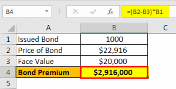

Navigating the intricate landscape of bond finance is an indispensable skill for investors and traders aiming to maximize returns and manage risks effectively. A critical concept within this domain is the amortizable bond premium, which significantly influences tax deductions and the valuation of bonds. When a bond is purchased at a price higher than its face value, the difference constitutes this premium. This excess can be amortized over the life of the bond, providing tax advantages by reducing taxable income associated with interest payments.

In tandem with understanding bond premium amortization, the role of algorithmic trading in modern finance cannot be overstated. Algorithmic trading leverages advanced computer programs to execute trading strategies with remarkable speed and accuracy, crucial in today's fast-paced bond markets. By incorporating precise financial calculations, algorithmic trading enhances the management of bond portfolios, optimizing both execution costs and investment outcomes.



This article explores the intersection of these elements—bond premium amortization and algorithmic trading—offering insights into how they collectively shape finance strategies. The synergy of these disciplines not only refines the approach to bond valuation but also reinforces the strategic arsenal available to market participants. Through effective integration, traders and investors are better equipped to navigate market complexities and achieve superior financial performance.

## Table of Contents

## Understanding Amortizable Bond Premium

The amortizable bond premium represents the surplus amount that an investor pays over the bond’s face value. This excess arises when a bond is purchased at a price higher than its par value. From a financial perspective, understanding this premium is vital for maximizing the bond's tax efficiency and for accurate financial reporting.

Purchasing a bond at a premium indicates that the investor is willing to pay extra for the bond's features, such as its higher-than-market coupon rate. The concept of amortizing this premium over the bond’s lifetime offers strategic tax advantages. By systematically reducing the bond premium, an investor is allowed to decrease taxable interest income annually. This process effectively spreads the cost of the premium across each interest payment date, thus aligning the premium amortization with the bond interest income, contributing to an optimized tax strategy.

The Internal Revenue Service (IRS) mandates the use of the constant yield method, alternatively known as the yield to maturity method, for the calculation of bond premium amortization. This method requires the use of the bond’s yield at purchase to determine the amount of amortized premium annually. It's inherently more accurate than other methods, like straight-line amortization, because it considers the time value of money.

To compute the amortizable bond premium using the constant yield method, the following formula applies:

$$
A_n = (C \times F) - (T_n \times P)
$$

Where:
- $A_n$ is the amortized premium for the period.
- $C$ is the coupon rate.
- $F$ is the face value of the bond.
- $T_n$ is the yield to maturity at purchase.
- $P$ is the number of periods (years or months depending on the bond structure).

Investors typically align this tax-deductible component against the bond's interest income, thereby effectively reducing their overall taxable income over the life of the bond. This strategic alignment makes understanding bond premiums crucial, affording investors opportunities for tax optimization and effective financial management. 

By adhering to these taxation guidelines, investors can maintain compliance with tax laws while also effectively leveraging bond premium amortization to enhance their portfolio's after-tax returns. This approach ensures that the cost of purchasing bonds at a premium is systematically recouped, aligning long-term investment strategies with tax-effective financial practices.

## Effective Interest Method in Bond Amortization

The effective interest method is a pivotal approach to bond amortization, crucial for aligning financial reporting with actual economic activities. This method allocates interest expenses proportionally across the life of a bond, offering a more precise depiction of financial activity compared to the straight-line method. 

At its core, the effective interest method takes into account the time value of money, a fundamental financial concept indicating that a dollar received today is worth more than a dollar received in the future. Unlike the straight-line method, which spreads out the bond premium or discount evenly over the bond's life, the effective interest method adjusts these allocations based on the interest-bearing capacity of the bond in each period.

In practical terms, the effective interest method requires calculating the interest expense for each period by multiplying the carrying amount of the bond at the beginning of the period by the effective [interest rate](/wiki/interest-rate-trading-strategies). The formula is represented as:

$$
\text{Interest Expense} = \text{Carrying Amount} \times \text{Effective Interest Rate}
$$

This calculated interest expense reflects the bond's actual cost and is recorded in financial statements, providing a realistic view of an organization's financial costs associated with bond issuance.

The adoption of this approach ensures that the bond's economic cost is accurately reflected, enhancing the relevance and reliability of financial reports. Investors and stakeholders gain a clearer understanding of an entity's interest obligations and financial health, essential for making informed investment decisions. By incorporating the time value of money, the effective interest method offers a refined and accurate accounting technique that aligns closely with real-world financial activities.

## The Role of Interest Rates in Bond Finance

Interest rates play a pivotal role in bond finance, primarily due to their inverse relationship with bond prices. When interest rates rise, the price of existing bonds typically falls. This occurs because new bonds are issued with higher coupon rates, making existing bonds with lower coupons less attractive unless their prices decrease. Consequently, bondholders may face market valuation changes in their bond portfolios, which necessitates vigilant interest rate monitoring.

The mathematical relationship between interest rates and bond prices can be expressed through the bond pricing formula:

$$
P = \frac{C}{(1 + r)^1} + \frac{C}{(1 + r)^2} + \ldots + \frac{C + F}{(1 + r)^n}
$$

Where $P$ is the bond price, $C$ is the periodic coupon payment, $r$ is the market interest rate, $F$ is the face value of the bond, and $n$ is the number of periods to maturity. This formula illustrates that as $r$ increases, $P$ decreases, reflecting the inverse relationship.

Accurate interest rate predictions are crucial for effective bond pricing and amortization. To forecast interest rate movements, financial analysts often rely on macroeconomic indicators, central bank communications, and historical interest rate trends. These predictions are integral to bond valuation models, which facilitate informed decision-making regarding bond trades and investment strategies.

Interest rate risk management is a cornerstone of bond portfolio strategies. Investors employ various techniques to mitigate such risks, including duration analysis, immunization strategies, and interest rate swaps. Duration measures a bond's sensitivity to interest rate changes, while immunization seeks to balance the duration of assets and liabilities to protect against rate fluctuations. Interest rate swaps allow investors to exchange fixed-rate interest payments for floating-rate ones, providing a hedge against interest rate changes.

In summary, understanding interest rates' effect on bond prices and implementing effective risk management strategies are fundamental to optimizing bond investment outcomes.

## Algorithmic Trading in Bond Markets

Algorithmic trading in bond markets leverages sophisticated algorithms to execute trading strategies with unparalleled speed and precision. This technology-driven approach revolutionizes bond trading by allowing for quick adaptation to market fluctuations, resulting in optimized trading outcomes and cost efficiency.

At the core of [algorithmic trading](/wiki/algorithmic-trading) is the ability to process vast datasets rapidly, identifying market trends and opportunities faster than manual trading methods. Algorithms can execute trades in milliseconds, capitalizing on price differences and market inefficiencies that are imperceptible to human traders. This speed not only reduces transaction costs but also minimizes the bid-ask spread, benefiting investors through improved execution prices.

Integrating effective interest calculations into trading algorithms further enhances their precision. Accurate interest rate modeling is crucial, as interest rates significantly influence bond prices. By incorporating these calculations, algorithms can better predict price movements and assess yield curves, improving the accuracy of trading decisions. This is especially important in managing portfolios of mortgage-backed securities and corporate bonds, where interest rate [volatility](/wiki/volatility-trading-strategies) can have substantial impacts on bond valuation.

Moreover, algorithmic trading supports risk management and diversification strategies in bond portfolios. Through advanced statistical models and [machine learning](/wiki/machine-learning) techniques, algorithms can evaluate credit risk, identify correlations between different bonds, and rebalance portfolios dynamically. This flexibility ensures that portfolios are optimized for both performance and risk factors, aligning with specific investment objectives.

The employment of programming languages such as Python facilitates the development of these trading algorithms. Python's libraries, like NumPy and Pandas, provide robust tools for handling numerical data and performing complex financial calculations, making them indispensable for implementing effective interest rate models.

In summary, algorithmic trading transforms bond markets by enabling swift, cost-effective, and precise trading strategies. The integration of effective interest rate calculations amplifies the accuracy of these algorithms, while their ability to manage risk and diversify portfolios enhances overall investment returns.

## Integrating Bond Amortization with Algo Trading

Integrating bond amortization with algorithmic trading enhances the strategic management of bond investments by allowing traders to make informed and timely decisions. Algorithmic trading efficiently incorporates amortization data to optimize calculations for yield and interest expenses. By automating the process of adjusting for the amortization of bond premiums or discounts, traders can maintain an accurate assessment of bond yields over time, which is crucial for making strategic investment decisions.

Algorithmic systems can be configured to account for amortization in the calculation of yields. This typically involves the use of the effective interest method, a mechanism that allocates interest expense across the bond's life in relation to its carrying amount. Utilizing algorithmic models facilitates the continuous adjustment of yield calculations, ensuring alignment with current market conditions and reducing the manual workload for traders.

In practice, trading algorithms can be enhanced by introducing code that considers the amortization of bond premiums or discounts. For example, Python's financial libraries can assist in these computations. A simple Python function leveraging libraries such as NumPy for yield calculation might look as follows:

```python
import numpy as np

def calculate_effective_yield(face_value, market_price, coupon_rate, years_to_maturity):
    amortization = (market_price - face_value) / years_to_maturity
    annual_interest = (face_value * coupon_rate)
    effective_yield = (annual_interest + amortization) / market_price
    return effective_yield

# Example usage
face_value = 1000
market_price = 1050  # Bond purchased at a premium
coupon_rate = 0.05
years_to_maturity = 10

yield_rate = calculate_effective_yield(face_value, market_price, coupon_rate, years_to_maturity)
print(f"Effective Yield: {yield_rate:.2%}")
```

Case studies have demonstrated the successful integration of bond amortization with algorithmic trading, highlighting improvements in returns and risk management. These algorithms efficiently react to shifts in the market caused by changes in interest rates or economic conditions, timely recalculating yields when amortization adjustments occur. This ensures that the strategy remains economically sound and aligns with an investor's risk tolerance profile.

However, challenges exist, notably the precision of interest rate predictions which can significantly affect bond pricing and yield estimations. Accurate forecasting of these rates is vital, as errors can lead to mispricing and unexpected volatility in portfolio performance. Additionally, the computational demands of continuously processing and integrating new bond amortization data with real-time market shifts can be substantial. This necessitates robust computational resources and efficient algorithms to ensure timely execution and analysis.

In summary, merging bond amortization practices with algorithmic trading magnifies the potential for strategic bond investment success, but also requires attention to computational efficiency and market forecasting accuracy.

## Conclusion

Understanding the interplay between bond amortization and algorithmic trading can significantly enhance market strategies for investors and traders. The application of the effective interest method in bond amortization provides a more precise reflection of the bond’s true economic cost, as it aligns interest expenses proportionately across the bond's tenure. This accuracy in financial reporting allows investors to better assess the profitability and viability of their bond investments, making it an indispensable tool in bond valuation.

Moreover, the careful management of interest rates and their fluctuations is fundamental, as they directly influence bond prices and yields. Interest rates inversely impact bond prices; thus, accurate predictions and strategic responses can lead to optimized trading decisions. Incorporating these insights with modern trading systems, such as algorithmic trading, empowers traders to execute strategies swiftly and efficiently. Algorithmic trading not only improves trade execution by responding to market dynamics in real-time but also enhances risk management through diversified bond portfolios.

Investors aiming to optimize returns and mitigate risks must harness the insights from the nuanced interaction between effective bond amortization methods and cutting-edge algorithmic trading practices. By integrating these strategies, traders can better navigate the complexities of the bond market, achieving both accurate financial reporting and robust financial performance.

## Additional Resources

Books, courses, and tools provide expanded opportunities for understanding bond markets and algorithmic trading. Among highly recommended resources, "Principles of Corporate Finance" offers comprehensive insights into corporate finance, including bond valuation and strategies, making it a valuable resource for finance professionals and students. Coursera offers courses specifically focused on bonds that cater to varying levels of expertise, aiding learners in grasping the complexities of the bond market and trading strategies.

Bloomberg Terminal stands out as an indispensable tool for professionals engaged in bond trading. It provides real-time data analysis, analytics, and insights into market trends, enabling traders to make informed decisions. The platform's extensive data sets are crucial for executing trades informed by current market dynamics.

For those interested in computational tools, Python libraries such as Pandas and NumPy offer substantial utility in financial calculations. They facilitate the precise computation of bond amortization schedules and other complex financial models. Below is an example of how one might use Python to calculate bond amortization using these libraries:

```python
import numpy as np
import pandas as pd

# Constants
face_value = 1000  # Face value of the bond
coupon_rate = 0.05  # Annual coupon rate
market_rate = 0.04  # Market interest rate
years = 10  # Years until maturity

# Calculate the annual coupon payment
annual_coupon = face_value * coupon_rate

# Create a time array
time = np.arange(1, years + 1)

# Calculate the present value of the bond
cash_flows = np.full(years, annual_coupon)
cash_flows[-1] += face_value  # Add face value to the last cash flow
discount_factors = (1 + market_rate) ** -time
present_value = np.sum(cash_flows * discount_factors)

# Amortization schedule
amortization_schedule = pd.DataFrame({
    'Year': time,
    'Cash Flow': cash_flows,
    'Discount Factor': discount_factors,
    'Present Value of Cash Flows': cash_flows * discount_factors
})

# Display the present value and amortization schedule
print(f"Present Value of the Bond: {present_value:.2f}")
print(amortization_schedule)
```

This code snippet helps in determining the present value of a bond based on its cash flows, as well as constructing an amortization schedule. Utilizing these tools and resources equips investors and analysts to better engage with the bond market, refine their trading strategies, and improve their understanding of bond amortization techniques.

## References & Further Reading

[1]: ["Principles of Corporate Finance"](https://en.wikipedia.org/wiki/Principles_of_Corporate_Finance) by Richard A. Brealey, Stewart C. Myers, and Franklin Allen.

[2]: ["Fixed Income Securities: Tools for Today's Markets"](https://www.amazon.com/Fixed-Income-Securities-Markets-Finance/dp/1119835550) by Bruce Tuckman and Angel Serrat.

[3]: ["Bond Markets, Analysis, and Strategies"](https://www.amazon.com/Bond-Markets-Analysis-Strategies-tenth/dp/026204627X) by Frank J. Fabozzi.

[4]: ["Algorithmic Trading: Winning Strategies and Their Rationale"](https://www.wiley.com/en-us/Algorithmic+Trading%3A+Winning+Strategies+and+Their+Rationale-p-9781118746912) by Ernest P. Chan.

[5]: ["Econometric Analysis of Cross Section and Panel Data"](https://ipcig.org/evaluation/apoio/Wooldridge%20-%20Cross-section%20and%20Panel%20Data.pdf) by Jeffrey M. Wooldridge.

[6]: ["Python for Finance: Mastering Data-Driven Finance"](https://www.amazon.com/Python-Finance-Mastering-Data-Driven/dp/1492024333) by Yves Hilpisch.