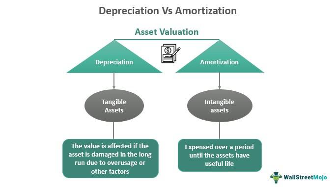

## Table of Contents

## What is amortization?

Amortization is a financial term that means spreading out the cost of an expensive item over time. It's often used for big purchases like houses or cars. Instead of paying the full price at once, you pay smaller amounts regularly. This helps make the cost more manageable and easier to budget for.

For example, when you take out a mortgage to buy a house, the bank doesn't expect you to pay back the entire loan right away. Instead, you make monthly payments over many years. Each payment includes a part that goes toward the loan and a part that covers the interest. Over time, the loan gets smaller and smaller until it's fully paid off. This process of gradually paying off the loan is called amortization.

## What is depreciation?

Depreciation is when something loses value over time. It's common with things like cars, machines, and buildings. Imagine you buy a new car. The moment you drive it off the lot, it's worth less than what you paid. That's depreciation happening right away. Over the years, as the car gets older and maybe needs repairs, it keeps losing value.

Businesses use depreciation to figure out the cost of using an asset over its life. They spread out the cost of the asset over several years on their financial statements. This helps them match the expense of the asset with the income it helps generate. For example, if a company buys a machine for $10,000 and expects it to last 5 years, they might record $2,000 as an expense each year. This way, they can see how much the machine is really costing them each year.

## How do amortization and depreciation differ in their basic definitions?

Amortization is about spreading out the cost of something over time, usually for big purchases like a house or a loan. It's a way to make paying for expensive things easier by breaking the total cost into smaller, regular payments. For example, when you get a mortgage, you pay it off little by little every month until the whole loan is gone. This process of gradually paying off the cost is called amortization.

Depreciation, on the other hand, is about something losing value as time goes by. This happens a lot with things like cars, machines, or buildings. For instance, if you buy a new car, it starts losing value the moment you drive it away. Over time, as the car gets older, it keeps losing more value. Businesses use depreciation to figure out how much an asset is costing them each year by spreading out its cost over its useful life.

## What types of assets are typically amortized?

Amortization is usually used for intangible assets. These are things you can't touch, like patents, copyrights, and trademarks. For example, if a company buys a patent, they might spread out the cost of the patent over the years they expect to use it. This helps them match the cost of the patent with the income it brings in.

Sometimes, amortization is also used for loans, like mortgages or car loans. When you take out a loan to buy a house or a car, you don't pay it all back at once. Instead, you make regular payments over time. Each payment includes part of the loan and part of the interest. This process of paying off the loan little by little is called amortization.

## What types of assets are typically depreciated?

Depreciation is usually used for tangible assets. These are things you can touch, like cars, machines, and buildings. When a business buys a new car for work, it starts losing value as soon as it's driven off the lot. Over time, as the car gets older and maybe needs repairs, it keeps losing more value. This loss of value is what we call depreciation.

Businesses also depreciate things like office furniture, computers, and manufacturing equipment. For example, if a company buys a new computer, it will start losing value right away. The company will spread out the cost of the computer over the years they expect to use it. This helps them match the cost of the computer with the income it helps generate. By doing this, they can see how much the computer is really costing them each year.

## How is the amortization expense calculated?

Amortization expense is calculated by spreading out the cost of an intangible asset over its useful life. Imagine a company buys a patent for $10,000 and expects to use it for 10 years. To find the yearly amortization expense, they divide the total cost of the patent by the number of years they expect to use it. In this case, $10,000 divided by 10 years equals $1,000 per year. So, the company would record $1,000 as an expense each year for 10 years.

For loans, like a mortgage or car loan, the amortization expense is a bit different. When you take out a loan, you make regular payments that include both the principal (the amount you borrowed) and the interest (the cost of borrowing). The amortization schedule shows how much of each payment goes toward the principal and how much goes toward the interest. Over time, more of your payment goes toward the principal and less toward the interest. This way, the loan gets smaller and smaller until it's fully paid off.

## How is the depreciation expense calculated?

Depreciation expense is calculated by spreading out the cost of a tangible asset over its useful life. For example, if a company buys a machine for $5,000 and expects it to last 5 years, they divide the total cost by the number of years. In this case, $5,000 divided by 5 years equals $1,000 per year. So, the company records $1,000 as an expense each year for 5 years. This method is called the straight-line method, which is the simplest way to calculate depreciation.

There are other methods to calculate depreciation, like the declining balance method and the units of production method. The declining balance method uses a fixed rate to calculate depreciation, which means the expense is higher in the early years and lower in the later years. The units of production method bases depreciation on how much the asset is used. If a machine is expected to produce 10,000 units over its life, and it costs $5,000, the company would calculate the depreciation per unit by dividing $5,000 by 10,000 units. Then, they would multiply the depreciation per unit by the number of units produced each year to find the yearly depreciation expense.

## What are the common methods used for calculating depreciation?

There are three common methods for calculating depreciation: the straight-line method, the declining balance method, and the units of production method. The straight-line method is the simplest. You take the total cost of the asset and divide it by the number of years you expect to use it. For example, if a machine costs $5,000 and you expect it to last 5 years, you divide $5,000 by 5 years to get $1,000 per year. This means you record $1,000 as an expense each year.

The declining balance method uses a fixed rate to calculate depreciation. This rate is usually higher than the straight-line method, so the expense is bigger in the early years and smaller in the later years. For example, if you use a 20% rate on a $5,000 machine, the first year's depreciation would be $1,000 (20% of $5,000). The next year, you apply the 20% rate to the remaining value of the machine, which is now $4,000, so the depreciation for the second year would be $800 (20% of $4,000). This continues until the asset is fully depreciated.

The units of production method bases depreciation on how much the asset is used. You figure out the total number of units the asset is expected to produce over its life, then divide the total cost by that number to get the depreciation per unit. For example, if a machine costs $5,000 and is expected to produce 10,000 units, the depreciation per unit is $0.50 ($5,000 divided by 10,000 units). If the machine produces 2,000 units in a year, the depreciation expense for that year would be $1,000 (2,000 units times $0.50 per unit).

## What are the common methods used for calculating amortization?

Amortization is usually calculated using the straight-line method, which is the simplest way. Imagine a company buys a patent for $10,000 and expects to use it for 10 years. To figure out the yearly amortization expense, they divide the total cost of the patent by the number of years they expect to use it. In this case, $10,000 divided by 10 years equals $1,000 per year. So, the company records $1,000 as an expense each year for 10 years. This method spreads out the cost evenly over the useful life of the intangible asset.

For loans like mortgages or car loans, amortization is calculated differently. When you take out a loan, you make regular payments that include both the principal (the amount you borrowed) and the interest (the cost of borrowing). An amortization schedule shows how much of each payment goes toward the principal and how much goes toward the interest. Over time, more of your payment goes toward the principal and less toward the interest. This way, the loan gets smaller and smaller until it's fully paid off. This method helps you see how the loan is being paid off over time.

## How do amortization and depreciation affect financial statements?

Amortization and depreciation both affect financial statements by reducing the value of assets over time and spreading out their costs. When a company uses amortization, it's usually for things you can't touch, like patents or trademarks. They record an expense each year, which lowers their net income on the income statement. On the balance sheet, the value of the intangible asset goes down by the same amount each year until it reaches zero. This helps the company match the cost of the asset with the income it brings in, making their financial statements more accurate.

Depreciation works the same way but for things you can touch, like machines or buildings. Each year, a company records a depreciation expense on the income statement, which reduces their net income. On the balance sheet, the value of the tangible asset decreases by the amount of the depreciation expense. This process helps the company see how much the asset is really costing them each year. By spreading out the cost of the asset over its useful life, depreciation helps give a clearer picture of the company's financial health.

## What are the tax implications of amortization versus depreciation?

Amortization and depreciation both help businesses save on taxes by letting them deduct the cost of their assets over time. When a company uses amortization for things like patents or trademarks, they can claim a part of the cost as an expense each year. This lowers their taxable income, which means they pay less in taxes. For example, if a company buys a patent for $10,000 and amortizes it over 10 years, they can deduct $1,000 each year from their income, reducing their tax bill.

Depreciation works the same way but for things like machines or buildings. By depreciating these assets, a company can also claim a part of the cost as an expense each year. This reduces their taxable income and, in turn, their taxes. For instance, if a company buys a machine for $5,000 and depreciates it over 5 years, they can deduct $1,000 each year. Both amortization and depreciation help businesses manage their tax liabilities by spreading out the cost of their assets.

## How do international accounting standards treat amortization and depreciation differently?

International accounting standards, like those set by the International Accounting Standards Board (IASB), have rules for both amortization and depreciation. For amortization, the IASB's standard IAS 38 says that intangible assets should be spread out over their useful life. This means a company has to figure out how long they will use an intangible asset, like a patent or trademark, and divide the cost evenly over that time. This is usually done using the straight-line method, where the same amount is taken as an expense each year. The goal is to match the cost of the asset with the income it helps generate.

For depreciation, the IASB's standard IAS 16 deals with tangible assets like machines and buildings. It says that these assets should be depreciated over their useful life, too. But there's more flexibility in how to do it. Companies can use the straight-line method, where the cost is spread out evenly, or they can use methods like the declining balance method, where more depreciation is taken in the early years. The choice depends on how the asset is used and how it loses value over time. The main idea is to show a fair picture of the asset's cost and value on the company's financial statements.

## What is Amortization and How Does it Involve Spreading Intangible Costs?

Amortization is a key financial concept that involves the systematic allocation of the cost of an intangible asset over its estimated useful life. Intangible assets, unlike their tangible counterparts such as machinery or buildings, do not have physical substance yet can hold significant value for a business. Common examples of intangible assets include patents, which grant exclusive rights to an invention; trademarks, which protect brand identity; and goodwill, which often represents the premium paid over the fair value of acquired identifiable assets and liabilities in a business acquisition.

In practice, the purpose of amortization is to match an intangible asset's cost with the revenue it generates over time, ensuring that financial statements reflect a true and fair view of a company's financial performance. One of the most widely used methods in amortization is the straight-line method. This approach involves dividing the initial cost of the intangible asset by its useful life, providing a consistent expense amount for each accounting period. The formula for the straight-line amortization is straightforward:

$$
\text{Amortization\ Expense\ Per\ Period} = \frac{\text{Cost\ of\ Intangible\ Asset} - \text{Residual\ Value}}{\text{Useful\ Life\ of\ Asset}}
$$

Where:
- Cost of Intangible Asset is the initial purchase or development cost.
- Residual Value is generally zero for most intangible assets since they lack physical substance.
- Useful Life of Asset is the period over which the asset is expected to provide economic benefits, often determined by legal, contractual, or competitive factors.

By employing this method, businesses are able to evenly distribute the cost of an intangible asset across its useful life, thereby ensuring that financial statements align with the accrual basis of accounting. This alignment is crucial for stakeholders, including investors and management, who rely on accurate financial data for decision-making.

Overall, amortization plays an essential role in both financial reporting and strategic business planning, enabling companies to manage their intangible resources effectively while maintaining compliance with financial regulations.

## What is Depreciation and How Does it Account for Wear and Tear?

Depreciation is a fundamental accounting concept that involves allocating the cost of a tangible asset over its productive lifespan. This allocation reflects the gradual decline in the asset's value due to wear and tear, usage, and technological obsolescence. The primary goal of depreciation is to match the cost of an asset with the revenue it generates, ensuring that expenses are recognized in the same period as the related income. This practice supports the accrual basis of accounting, which provides a more accurate representation of a company's financial health.

Depreciation is calculated using several methods, each with its own approach to expense recognition. The three most common methods are:

1. **Straight-Line Depreciation**: This method spreads the cost of the asset evenly across its useful life. The formula for calculating straight-line depreciation is:
$$
   \text{Depreciation Expense} = \frac{\text{Cost of Asset} - \text{Residual Value}}{\text{Useful Life of the Asset}}

$$

   Here, the residual value is the expected salvage value of the asset at the end of its useful life. Straight-line depreciation is simple and widely used due to its consistency and ease of application.

2. **Declining Balance Method**: This accelerated depreciation method applies a constant rate to the reducing book value of the asset, resulting in higher depreciation expenses in the earlier years. The formula for the double-declining balance method, a common variation, is:
$$
   \text{Depreciation Expense} = 2 \times \left(\frac{1}{\text{Useful Life}}\right) \times \text{Book Value at Beginning of Year}

$$

   This method is preferred for assets that lose value quickly early in their lifecycle, providing tax benefits by deferring tax liabilities.

3. **Units of Production Method**: This method bases depreciation on an asset's usage, activity, or output rather than the passage of time. The formula is:
$$
   \text{Depreciation Expense} = \left(\frac{\text{Cost of Asset} - \text{Residual Value}}{\text{Total Expected Units}}\right) \times \text{Units Produced in the Period}

$$

   It provides a more accurate expense allocation for assets whose wear and tear correlate directly with their use, such as machinery.

Understanding and implementing the appropriate depreciation method is crucial for businesses to reflect the true value of their assets on financial statements. Proper depreciation accounting not only ensures compliance with financial reporting standards but also influences taxation, as depreciation is often deductible for tax purposes. By accurately accounting for depreciation, companies can better manage their resources, forecast future asset needs, and make informed investment decisions.

## References & Further Reading

[1]: ["Advances in Financial Machine Learning"](https://www.amazon.com/Advances-Financial-Machine-Learning-Marcos/dp/1119482089) by Marcos Lopez de Prado

[2]: ["Evidence-Based Technical Analysis: Applying the Scientific Method and Statistical Inference to Trading Signals"](https://www.amazon.com/Evidence-Based-Technical-Analysis-Scientific-Statistical/dp/0470008741) by David Aronson

[3]: ["Machine Learning for Algorithmic Trading"](https://github.com/stefan-jansen/machine-learning-for-trading) by Stefan Jansen

[4]: ["Quantitative Trading: How to Build Your Own Algorithmic Trading Business"](https://books.google.com/books/about/Quantitative_Trading.html?id=j70yEAAAQBAJ) by Ernest P. Chan

[5]: ["International Financial Reporting Standards (IFRS)"](https://www.investopedia.com/terms/i/ifrs.asp)

[6]: ["Concepts Statement No. 8—Conceptual Framework for Financial Reporting"](https://fasb.org/page/PageContent?pageId=/standards/concepts-statements.html) by the Financial Accounting Standards Board

[7]: ["Amortization vs. Depreciation: A Comparison"](https://www.investopedia.com/ask/answers/06/amortizationvsdepreciation.asp) on Investopedia

[8]: ["The Impact of Machine Learning on Economics"](https://projects.iq.harvard.edu/files/pegroup/files/athey2018.pdf) by Athey, S., & Imbens, G. W. 