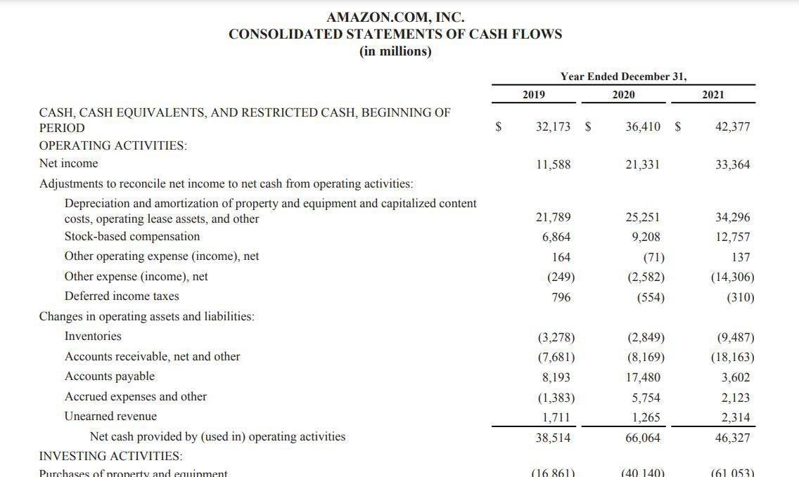

## Table of Contents

## What is amortization and why is it important in accounting?

Amortization is a way of spreading out the cost of an intangible asset over its useful life. Intangible assets are things you can't touch, like patents or trademarks. Instead of paying for the whole cost at once, you divide it into smaller amounts and record those amounts as expenses over time. This helps match the cost of the asset with the income it helps to generate.

Amortization is important in accounting because it helps businesses show a more accurate picture of their financial health. By spreading out the cost of an intangible asset, a company can avoid big swings in its profits from year to year. This makes it easier for people to understand how well the business is doing. It also follows the matching principle, which says that expenses should be recorded in the same period as the revenues they help to create. This helps keep the financial statements fair and useful for making decisions.

## How does amortization differ from depreciation?

Amortization and depreciation are both ways to spread out the cost of an asset over time, but they apply to different types of assets. Amortization is used for intangible assets, like patents or copyrights. These are things you can't touch but have value to a business. When you amortize an intangible asset, you divide its cost over the years it will be useful, and you record a bit of that cost as an expense each year.

Depreciation, on the other hand, is used for tangible assets, like machines or buildings. These are physical things that a business owns and uses. Just like with amortization, you spread the cost of these assets over their useful life. But instead of calling it amortization, you call it depreciation. Each year, you record a part of the asset's cost as an expense, reflecting how the asset wears out or becomes less useful over time.

Both amortization and depreciation help businesses show a more accurate picture of their financial performance. They follow the matching principle, which means the cost of an asset should be matched with the income it helps to generate. This helps keep financial statements fair and useful for making decisions about the business.

## What types of assets are typically amortized?

Amortization is used for intangible assets. These are things that you can't touch but still have value to a business. Some common examples of intangible assets that get amortized are patents, copyrights, and trademarks. A patent might help a company make a special product, and a copyright might protect a book or a song. These assets help the business make money over time, so their cost is spread out over the years they are useful.

Another type of intangible asset that is often amortized is goodwill. Goodwill can come up when one company buys another company for more than the value of its tangible assets. The extra amount paid is called goodwill, and it represents things like the value of the other company's brand or customer relationships. Like other intangible assets, the cost of goodwill is spread out over time through amortization.

Some businesses also amortize things like software and licenses. If a company buys special software to help run its business, or if it pays for a license to use someone else's technology, these costs can be spread out over the time the software or license is useful. This helps match the cost with the income the software or license helps to generate.

## How is amortization calculated and recorded in the balance sheet?

To calculate amortization, you first need to know the cost of the intangible asset and how long it will be useful. Let's say a company buys a patent for $10,000 and it will be useful for 10 years. To find out how much to amortize each year, you divide the cost by the useful life. In this case, that's $10,000 divided by 10 years, which equals $1,000 per year. Each year, you record $1,000 as an expense on the income statement, and you also record $1,000 as a reduction in the value of the asset on the balance sheet.

On the balance sheet, the intangible asset starts off at its full cost. Using our example, the patent would be listed at $10,000 when it's first bought. As you amortize it over time, you reduce its value on the balance sheet. So, after one year, the patent would be shown as $9,000 ($10,000 minus the $1,000 that was amortized). After two years, it would be $8,000, and so on. This way, the balance sheet shows a more accurate value of the asset as it gets used up over time.

## What is the impact of amortization on a company's financial statements?

Amortization affects a company's financial statements in a few important ways. On the income statement, amortization is recorded as an expense each year. This means it reduces the company's profits for that year. For example, if a company has a patent that it's amortizing, the cost of that patent gets spread out over several years, and a bit of it is shown as an expense each year. This helps match the cost of the patent with the money it helps the company make, which gives a fairer picture of the company's profits.

On the balance sheet, amortization changes the value of the intangible asset. When the company first buys the asset, like a patent or a trademark, it's shown at its full cost. But as the company amortizes it over time, the value of the asset on the balance sheet goes down. This shows that the asset is being used up and becoming less valuable over time. By reducing the value of the asset, the balance sheet gives a more accurate picture of what the company owns.

Overall, amortization helps keep the financial statements honest and useful. It spreads out the cost of intangible assets over time, so the company's profits and the value of its assets are shown in a way that matches how they're being used. This makes it easier for people to understand how well the company is doing and make good decisions about it.

## Can you explain the straight-line method of amortization?

The straight-line method of amortization is a simple way to spread out the cost of an intangible asset over its useful life. It's called "straight-line" because you divide the cost of the asset evenly over the years it will be useful. For example, if a company buys a patent for $10,000 and it will be useful for 10 years, they would divide $10,000 by 10 years. This means they would record $1,000 as an expense each year.

Using the straight-line method helps keep things simple and fair. Each year, the same amount is recorded as an expense on the income statement, and the value of the asset on the balance sheet goes down by the same amount. This way, the cost of the asset is matched with the income it helps to generate over time. It's a common method because it's easy to understand and apply, making it easier for people to see how the company's financial health is changing.

## What are the tax implications of amortization?

Amortization can have important tax effects for a business. When a company amortizes an intangible asset, like a patent or trademark, it can claim the yearly amortization expense as a deduction on its taxes. This means the company can reduce its taxable income by the amount of the amortization expense each year. For example, if a company has a $1,000 amortization expense, it can subtract that $1,000 from its income before figuring out how much tax it owes. This can help the company pay less in taxes each year.

The tax rules for amortization can be a bit different from the accounting rules. For tax purposes, the government might set specific rules about how long an asset can be amortized. In the United States, for example, the Internal Revenue Service (IRS) has rules that say certain intangible assets must be amortized over 15 years, no matter how long the company thinks the asset will be useful. This means a company might have to use different amortization periods for its tax returns than it uses for its financial statements. It's important for businesses to understand these rules so they can plan their taxes and keep their financial records in order.

## How does amortization affect a company's cash flow?

Amortization is a way to spread out the cost of an intangible asset over time. It's important to know that amortization itself doesn't directly affect a company's cash flow. When a company buys an intangible asset, like a patent or a trademark, it pays for it right away, and that's when the cash goes out. After that, the company records the cost of the asset as an expense over several years through amortization, but no more cash leaves the company because of it.

Even though amortization doesn't change the amount of cash a company has, it can still affect how the company's cash flow looks on paper. On a cash flow statement, amortization is added back to the company's net income. This is because amortization was subtracted as an expense on the income statement, but it didn't actually use any cash. So, when you're looking at a cash flow statement, adding back the amortization expense gives a clearer picture of how much cash the company really has coming in and going out.

## What are the differences between amortization schedules for loans versus intangible assets?

An amortization schedule for a loan is a plan that shows how each payment is split between paying off the interest and the principal of the loan over time. When you make a loan payment, part of it goes to the interest you owe, and the rest goes to the principal, which is the amount you borrowed. Over time, as you pay down the principal, the interest part of your payment gets smaller, and more of your payment goes toward the principal. This schedule helps you see how much you'll owe at any point and how much of your payment goes to interest and principal.

On the other hand, an amortization schedule for intangible assets like patents or trademarks is about spreading out the cost of the asset over its useful life. When a company buys an intangible asset, it doesn't pay for it bit by bit like a loan. Instead, the company pays the full cost upfront. Then, it records a part of that cost as an expense each year over the life of the asset. This schedule helps the company match the cost of the asset with the income it generates, showing a more accurate picture of the company's financial health.

So, while a loan amortization schedule is about paying off a debt over time, an intangible asset amortization schedule is about spreading out the cost of an asset. Both schedules help with planning and understanding financial impacts, but they work in different ways and serve different purposes.

## How do changes in accounting standards affect the treatment of amortization on the balance sheet?

Changes in accounting standards can affect how companies show amortization on their balance sheets. When new rules come out, they might change how long a company can spread out the cost of an intangible asset. For example, if a new standard says that a certain type of asset should be amortized over a shorter time, the company would have to record a bigger expense each year. This means the value of the asset on the balance sheet would go down faster than before.

These changes can also affect how companies report their financial health. If the new rules make the yearly amortization expense bigger, the company's profits might look smaller. But if the rules let companies spread out the cost over a longer time, the yearly expense would be smaller, and profits might look bigger. It's important for companies to keep up with these changes so they can show their financial situation in a way that follows the rules and gives a true picture of their health.

## What are some common errors in amortization accounting and how can they be avoided?

One common mistake in amortization accounting is getting the useful life of an intangible asset wrong. If a company thinks an asset will last longer than it really does, they might spread out the cost too slowly. This means they would record too small an expense each year, making their profits look bigger than they should. To avoid this, companies should do careful research to figure out how long an asset will really be useful and update their estimates if they find out they were wrong.

Another error is forgetting to start amortizing an asset right away. Sometimes, a company might buy an asset but forget to start recording the expense until later. This can make the financial statements look wrong because the cost of the asset isn't matched with the income it helps to generate. To prevent this, companies should set up a system to make sure they start amortizing new assets as soon as they're bought.

Lastly, companies can make mistakes by not following the latest accounting rules. If the rules change and a company doesn't update how they do amortization, their financial statements might not be right. To avoid this, companies should keep up with the latest accounting standards and make sure their accounting practices match the rules. This helps keep their financial reports accurate and fair.

## How can advanced analytical tools be used to optimize amortization strategies for financial reporting?

Advanced analytical tools can help companies make better decisions about how they spread out the cost of their intangible assets. These tools can look at a lot of data and find patterns that might not be easy to see otherwise. For example, they can help a company figure out how long an asset will really be useful by looking at past data and industry trends. This can help the company decide on the best way to spread out the cost of the asset over time, so their financial reports show a fair picture of their profits and the value of their assets.

These tools can also help companies keep up with changes in accounting rules. They can run different scenarios to see how new rules might change the company's financial statements. This can help the company plan ahead and make sure they're following the rules correctly. By using advanced analytics, companies can make sure their amortization strategies are smart and up-to-date, which helps them give a clear and honest picture of their financial health to investors and other people who look at their reports.

## What is the understanding of a Balance Sheet and Amortization?

The balance sheet is one of the central financial statements used in financial reporting and analysis. It provides a snapshot of an entity’s financial position at a specific point in time, detailing assets, liabilities, and equity. Assets on the balance sheet are categorized as either current or non-current, representing resources that the company owns or controls with the potential to provide future economic benefits. Liabilities, conversely, are obligations that the company must settle in the future, while equity represents the residual interest in the company's assets after deducting liabilities.

Mathematically, the balance sheet can be expressed as:

$$
\text{Assets} = \text{Liabilities} + \text{Equity}
$$

This equation reflects the accounting principle of double-entry bookkeeping, ensuring that the balance sheet remains balanced.

Amortization is an accounting technique used to gradually reduce the value of an intangible asset or spread out the cost of a liability over time. For intangible assets, such as patents or trademarks, amortization allocates the cost over its useful life, reflecting the consumption of economic benefits from the asset. Similarly, amortizing a liability, such as a loan, involves spreading out payments over a specified period, which includes both principal and interest components.

In financial reporting, the significance of balance sheets and amortization is manifold, acting as fundamental tools for understanding a company’s financial health. For stakeholders, analyzing a balance sheet alongside amortization schedules can provide insights into a company’s capital structure, [liquidity](/wiki/liquidity-risk-premium), and long-term solvency. Amortization affects a company's income statement through periodic amortization expenses, reducing taxable income and affecting net profitability.

For example, when a company purchases a patent for $\$100,000$ with a useful life of 10 years, it will record $\$10,000$ as an amortization expense each year, assuming a straight-line amortization method. This practice not only aligns costs with revenues generated by the patent but also provides a clearer depiction of financial performance over time.

The application of these concepts is crucial for various stakeholders. Investors use balance sheets to assess whether a company is efficiently utilizing its resources, while creditors evaluate the firm’s ability to meet financial obligations. Accurate amortization practices ensure that financial statements depict a realistic picture of profitability and asset valuation, promoting informed investment decisions.

In summary, understanding how balance sheets and amortization work is essential for analyzing a company's financial health. These concepts enable stakeholders to make informed decisions by providing a transparent and systematic view of financial performance and position.

## What is the relationship between Algorithmic Trading and Financial Data?

Algorithmic trading has fundamentally transformed the securities trading landscape by employing sophisticated computer algorithms to execute trades at speeds unimaginable in manual trading. This innovation leverages vast amounts of financial data to make split-second trading decisions, enabling the execution of trades with a precision and speed that maximizes profit and minimizes risk. 

At its core, algorithmic trading involves the use of predefined, complex mathematical models to determine the sequence and timing of trades. These algorithms operate based on conditions such as price, [volume](/wiki/volume-trading-strategy), and timing, among others. For instance, a basic example would be a moving average crossover strategy, which buys when a short-term moving average crosses above a long-term moving average and sells in the opposite scenario.

$$
\text{Buy Signal: } \text{SMA}_{\text{short}} > \text{SMA}_{\text{long}}
$$
$$
\text{Sell Signal: } \text{SMA}_{\text{short}} < \text{SMA}_{\text{long}}
$$

Financial data is central to the operation of these algorithms. Accurate and timely information such as market prices, balance sheets, and amortization schedules are essential inputs that inform trading strategies. Balance sheets, for example, provide insights into a company's overall financial position, including assets, liabilities, and equity at a specific point in time. Amortization schedules customarily break down how a debtor intends to pay off a liability over time, thus offering forecasts that may influence long-term trading strategies.

Algorithmic trading systems aggregate this information and can include elements of [artificial intelligence](/wiki/ai-artificial-intelligence) to dynamically adapt trading models based on changing market conditions. Financial accounting data's precision and reliability directly enhance these algorithms' effectiveness, contributing to increased efficiency, liquidity, and price accuracy in financial markets. Yet, the integration of financial accounting data into algorithmic systems also presents certain challenges.

One such challenge is ensuring data security and integrity. With vast volumes of sensitive financial data being processed, issues such as data breaches or inaccuracies can significantly affect trading outcomes. Additionally, the rapid nature of algorithmic trading can result in systemic risks and market disruptions, exemplified by phenomena like the "flash crash." 

However, these challenges also present ample opportunities. Continuous advancements in technology, big data analytics, and [machine learning](/wiki/machine-learning) propel further sophistication and efficacy in algorithmic trading systems. They enable traders and firms to handle complex computations efficiently, explore new trading strategies, and develop comprehensive risk management tools.

In conclusion, algorithmic trading exemplifies the intersection of technology and finance, where leveraging high-quality financial data is crucial. This synergy optimizes trading performance and adaptively evolves with market dynamics, highlighting the ongoing impact and potential of integrating technological advancements with traditional financial frameworks.

## References & Further Reading

[1]: ["Advances in Financial Machine Learning"](https://www.amazon.com/Advances-Financial-Machine-Learning-Marcos/dp/1119482089) by Marcos Lopez de Prado

[2]: ["Algorithms for Hyper-Parameter Optimization"](https://dl.acm.org/doi/10.5555/2986459.2986743) by Bergstra, J., Bardenet, R., Bengio, Y., & Kégl, B.

[3]: ["Evidence-Based Technical Analysis: Applying the Scientific Method and Statistical Inference to Trading Signals"](https://www.amazon.com/Evidence-Based-Technical-Analysis-Scientific-Statistical/dp/0470008741) by David Aronson

[4]: ["Machine Learning for Algorithmic Trading"](https://github.com/stefan-jansen/machine-learning-for-trading) by Stefan Jansen

[5]: ["Quantitative Trading: How to Build Your Own Algorithmic Trading Business"](https://www.amazon.com/Quantitative-Trading-Build-Algorithmic-Business/dp/1119800064) by Ernest P. Chan