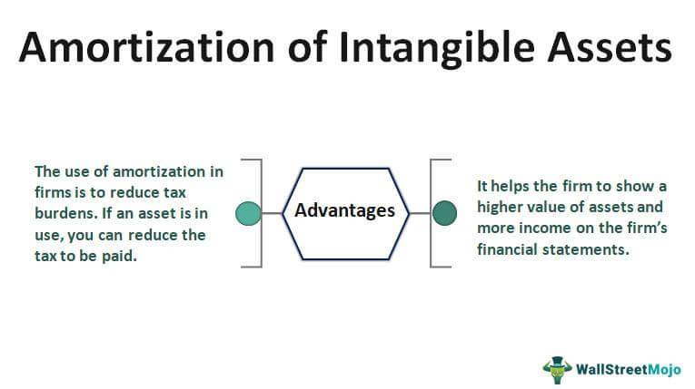

## Table of Contents

## What are intangible assets?

Intangible assets are things that a company owns that you can't touch or see. They are different from things like buildings or machines, which you can touch. Instead, intangible assets include things like a company's brand name, its logo, or special knowledge that helps it make products or provide services. These assets are important because they can help a company make money, even if they aren't physical.

For example, a famous brand like Coca-Cola has a lot of value in its name and logo. People recognize and trust the brand, which helps the company sell more drinks. Another example is a patent, which is a special right that lets a company be the only one to make or sell a new invention. These intangible assets can be very valuable, but they can also be hard to measure because they don't have a clear price tag like a physical item does.

## What is amortization and how does it apply to intangible assets?

Amortization is a way of spreading out the cost of an intangible asset over the time it's useful to a company. Instead of paying for the whole asset at once, the company records a smaller expense each year. This helps match the cost of the asset with the money it helps the company make over time. For example, if a company buys a patent for $10,000 and it's useful for 10 years, they might record an expense of $1,000 each year.

This process is similar to depreciation, which is used for physical assets like machines or buildings. But with intangible assets, you can't see or touch them, so you use amortization instead. It's important for keeping a company's financial records accurate and showing how much value the intangible asset still has. Over time, as the asset is amortized, its value on the company's books goes down until it reaches zero at the end of its useful life.

## How is the amortization period for intangible assets determined?

The amortization period for intangible assets is decided based on how long the asset will be useful to the company. This can be different for each type of intangible asset. For example, a patent might have a legal life of 20 years, so the company might choose to amortize it over that time. But if the company thinks the patent will only help them make money for 10 years, they might use a shorter period instead.

Sometimes, the law or accounting rules can tell a company how long to amortize an asset. But often, the company has to guess based on how long they think the asset will help them make money. They might look at things like how long similar assets have lasted in the past or how long they expect their product to be popular. It's important to get this right because it affects the company's financial reports and how much profit they show each year.

## What is impairment of intangible assets?

Impairment of intangible assets happens when an asset loses value and is worth less than what's written down in the company's books. This can happen for many reasons, like if a brand becomes less popular, or if new technology makes an old patent less useful. When a company thinks an asset might be impaired, they do a test to see if its value has really gone down. If it has, they have to lower the value of the asset on their books to match its new, lower value.

This process is important because it helps keep a company's financial reports honest and accurate. If an asset is impaired, the company has to record a loss, which means their profits for that year will be lower. This can affect how investors and others see the company. But it's better to be honest about the value of assets, even if it means showing a loss, because it gives a clearer picture of the company's true financial health.

## What are the indicators that an intangible asset may be impaired?

There are several signs that an intangible asset might be losing value. One big sign is if the market changes and the asset isn't as useful anymore. For example, if a new technology comes out that makes an old patent less important, that's a sign of impairment. Another sign is if the company's financial performance gets worse. If the company is making less money and the asset isn't helping as much as it used to, that could mean the asset is impaired.

Another indicator is if there are changes in how people see the company or its products. If a brand becomes less popular or if customers start to trust it less, that can lower the value of the brand. Legal problems can also be a sign of impairment. If a company loses a lawsuit that affects its rights to use an asset, like a trademark, that can make the asset worth less. Companies need to watch out for these signs so they can test for impairment and adjust the value of their assets if needed.

## How is the impairment loss of an intangible asset calculated?

To figure out the impairment loss of an intangible asset, a company first needs to find out how much the asset is worth now. They do this by looking at how much money the asset will make in the future and then figuring out what that money is worth today. This is called the recoverable amount. If the recoverable amount is less than what the asset is worth on the company's books, then the asset is impaired.

Once they know the asset is impaired, the company calculates the impairment loss by subtracting the recoverable amount from the book value of the asset. For example, if an asset is worth $10,000 on the books but its recoverable amount is only $7,000, the impairment loss is $3,000. The company then records this loss in their financial statements, which lowers the value of the asset on their books and also reduces their profits for that year.

## What are the differences between amortization and impairment of intangible assets?

Amortization and impairment are two different ways that a company can lower the value of its intangible assets, but they work in different ways. Amortization is a regular process where a company spreads out the cost of an intangible asset over the time it's useful. For example, if a company buys a patent for $10,000 and it will help them make money for 10 years, they might record an expense of $1,000 each year. This helps match the cost of the asset with the money it helps the company make over time.

Impairment, on the other hand, happens when an intangible asset suddenly loses value. This can happen if the market changes, the company's financial performance gets worse, or if the asset becomes less popular. When a company thinks an asset might be impaired, they do a test to see if its value has really gone down. If it has, they have to lower the value of the asset on their books to match its new, lower value, and record an impairment loss. This is different from amortization because it's not a regular process, and it happens when something unexpected affects the value of the asset.

## How do companies account for amortization and impairment in their financial statements?

When a company amortizes an intangible asset, it records a small expense each year in its income statement. This expense is called amortization expense, and it's listed under operating expenses. At the same time, the value of the intangible asset on the balance sheet goes down by the same amount. This process continues until the asset's value reaches zero at the end of its useful life. By doing this, the company matches the cost of the asset with the money it helps the company make over time, which gives a clearer picture of the company's profits each year.

Impairment is different because it's not a regular process. If a company thinks an intangible asset has lost value, it does an impairment test. If the test shows the asset is worth less than what's on the books, the company records an impairment loss on its income statement. This loss is also listed under operating expenses, but it's a one-time hit to the company's profits. On the balance sheet, the company lowers the value of the asset to match its new, lower value. This makes the financial statements more accurate by showing the true value of the company's assets.

## What are the tax implications of amortizing and impairing intangible assets?

When a company amortizes an intangible asset, it can lower its taxable income. This is because the amortization expense is taken off the company's profits before taxes are calculated. So, if a company has to pay taxes on its profits, a higher amortization expense means it will pay less in taxes each year. But, the rules for what can be amortized and how long it can be spread out can be different depending on the country and the type of asset. Companies need to follow these rules to make sure they are doing their taxes right.

Impairment of an intangible asset can also affect a company's taxes. When a company records an impairment loss, it lowers its profits for that year. This means the company will have less taxable income, which can lead to paying less in taxes. But, like with amortization, the rules for impairment can be different in different places. Companies need to check the tax laws where they are to make sure they are following them correctly. It's important to get this right because it can make a big difference in how much tax a company has to pay.

## How does the treatment of intangible assets vary under different accounting standards (e.g., IFRS vs. GAAP)?

The treatment of intangible assets can be different under International Financial Reporting Standards (IFRS) and Generally Accepted Accounting Principles (GAAP). Under IFRS, companies can choose to value their intangible assets at either cost or fair value, if there's an active market for the asset. This means they can keep the value of the asset up to date if its market value changes. On the other hand, under GAAP, companies can only use the cost method, which means they have to stick with the original cost of the asset and can't change it to fair value.

When it comes to amortization, both IFRS and GAAP say that intangible assets with a definite useful life should be amortized over that time. But, under IFRS, intangible assets with an indefinite useful life, like some brands or trademarks, don't have to be amortized. Instead, they need to be tested for impairment every year. Under GAAP, all intangible assets except for goodwill have to be amortized, even if they have an indefinite life. This can make a big difference in how a company's profits look on paper.

For impairment, both IFRS and GAAP require companies to test for impairment when there are signs that an asset's value has gone down. But the way they do the test and how they record the loss can be different. Under IFRS, the impairment loss can be reversed if the asset's value goes back up later. But under GAAP, once an impairment loss is recorded, it can't be reversed, even if the asset's value recovers. These differences can affect how a company's financial health is shown in its reports.

## What are the strategic considerations for managing amortization and impairment of intangible assets?

Managing amortization and impairment of intangible assets is important for a company's strategy. When a company decides how to spread out the cost of an intangible asset over time, it needs to think about how long the asset will be useful. This can affect how much profit the company shows each year. If the company chooses a shorter time, it will have higher expenses and lower profits early on. But if it chooses a longer time, the expenses will be lower each year, and the profits will look better. The company needs to balance these choices to show its financial health in the best way while still following the rules.

Impairment is another big thing to think about. If a company thinks an intangible asset has lost value, it needs to test for impairment and record a loss if the value has really gone down. This can make the company's profits for that year look worse, which might not be good for investors or the company's reputation. But it's important to be honest about the value of assets. If the company waits too long to record an impairment loss, it could look like it's hiding problems. So, the company needs to keep a close eye on its intangible assets and be ready to record an impairment loss if needed, even if it's not the best news for that year's profits.

## How can advanced analytics and forecasting models be used to better manage the amortization and impairment of intangible assets?

Advanced analytics and forecasting models can help companies make better decisions about how long to amortize their intangible assets. These models can look at data from the past and make predictions about how long an asset will be useful in the future. For example, they can study how long similar assets have lasted or how market trends might change. By using this information, a company can choose a more accurate amortization period. This means they can spread out the cost of the asset in a way that matches how long it will help them make money, which makes their financial reports more accurate and helps them plan better.

Forecasting models can also be useful for spotting signs that an intangible asset might be losing value. These models can look at things like changes in the market, how well the company is doing financially, or how popular the company's products are. If the models predict that an asset's value might go down, the company can do an impairment test sooner. This helps them record any impairment loss at the right time, which keeps their financial reports honest and avoids surprises later on. By using advanced analytics and forecasting, companies can manage their intangible assets more carefully and make smarter decisions about their financial health.

## What is the Amortization of Intangible Assets?

Amortization of intangible assets is a critical accounting process that involves the systematic reduction of the asset's book value over its estimated useful life. This practice ensures that the costs associated with intangible assets, such as patents, trademarks, and copyrights, are expensed in alignment with the revenues they help generate. This matching principle supports a more truthful representation of the asset's diminishing value and its impact on financial performance.

The straight-line method is the predominant approach for amortizing intangible assets. This method divides the initial cost of the asset evenly over its useful life, resulting in consistent amortization expenses each accounting period. The formula for the straight-line method is as follows:

$$
\text{Amortization Expense} = \frac{\text{Cost of the Intangible Asset} - \text{Residual Value}}{\text{Useful Life}}
$$

Here, the residual value is typically zero for most intangible assets, except in cases where the asset is expected to retain a measurable end-of-life value.

Accurate amortization necessitates a precise estimation of the intangible asset's useful life. This estimate is influenced by various factors, including legal or contractual limitations, changes in market conditions, and historical experience with similar assets. Overestimating or underestimating the useful life can lead to significant misstatements in financial reporting, potentially affecting investor perceptions and business decisions.

An illustrative example using Python could demonstrate how to calculate amortization over a series of periods for an intangible asset:

```python
def calculate_straight_line_amortization(cost, residual_value, useful_life):
    return (cost - residual_value) / useful_life

def amortization_schedule(cost, useful_life):
    amortization_expense = calculate_straight_line_amortization(cost, 0, useful_life)
    return [amortization_expense for _ in range(useful_life)]

# Example: cost of $100,000, useful life of 10 years
cost = 100000
useful_life = 10
schedule = amortization_schedule(cost, useful_life)

print("Amortization Schedule:", schedule)
```

Careful consideration of these factors is vital to avoid either an excessive burden or an understated amortization on the financial statements. Effective management of amortization can enhance transparency and reliability in financial reporting, subsequently aiding investors and stakeholders in making informed decisions.

## References & Further Reading

[1]: ["IFRS 3 — Business Combinations"](https://www.ifrs.org/content/dam/ifrs/publications/pdf-standards/english/2021/issued/part-a/ifrs-3-business-combinations.pdf) by International Financial Reporting Standards

[2]: ["IFRS 9 — Financial Instruments"](https://www.ifrs.org/content/dam/ifrs/publications/pdf-standards/english/2021/issued/part-a/ifrs-9-financial-instruments.pdf) by International Financial Reporting Standards

[3]: ["Valuation: Measuring and Managing the Value of Companies"](https://books.google.com/books/about/Valuation.html?id=fGXjDwAAQBAJ) by McKinsey & Company, Inc.

[4]: ["Financial Statement Analysis and Security Valuation"](https://www.mheducation.com/highered/product/financial-statement-analysis-security-valuation-penman/M9780078025310.html) by Stephen H. Penman

[5]: ["The Essentials of Financial Trading: From Investment Theory to Trading Practice"](https://books.google.com/books/about/The_Essentials_of_Trading.html?id=UBfo0TojOn0C) by Nicola Segre

[6]: Rees, W. (1998). ["Intangible Assets Accounting and Accounting Policy Choices."](https://onlinelibrary.wiley.com/doi/abs/10.1111/j.1467-6281.2009.00291.x) Abacus, 34(1), 119-135.

[7]: Goodwin, J., Ahmed, K., & Heaney, R. (2009). ["The Effects of International Convergence on the Information Content of Intangible Asset Disclosures."](https://pmc.ncbi.nlm.nih.gov/articles/PMC9091380/) Journal of Contemporary Accounting & Economics, 5(1), 1-17.