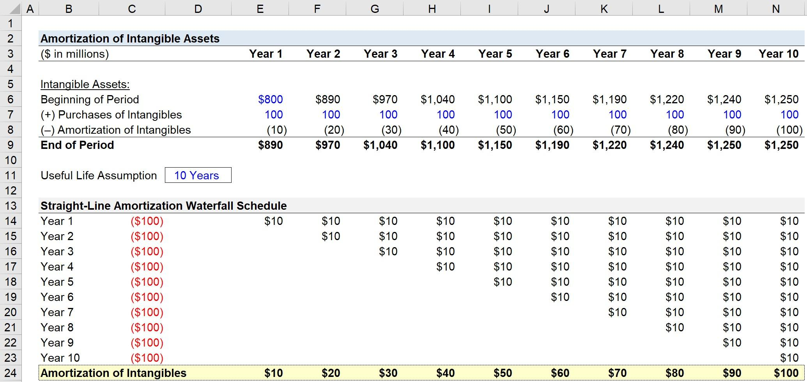

Understanding financial concepts such as amortization, intangible assets, financial accounting, and algorithmic trading has become increasingly vital for modern investors. These elements form the backbone of informed financial decision-making and crafting effective trading strategies. Amortization allows investors to comprehend how charges associated with intangible assets are systematically allocated over time, ensuring accurate reflection of an asset's value. A thorough grasp of intangible assets, such as patents or trademarks, enables investors to appreciate their potential impact on a company's valuation and revenue-generating capabilities.

Financial accounting acts as the cornerstone of financial transparency and discipline, facilitating the organized recording, summarization, and presentation of financial transactions. It underpins the creation of crucial financial statements, which are indispensable tools for stakeholders to make informed decisions. Key accounting practices like amortization and depreciation help in assessing the true financial position of a business by revealing the value of assets over time.



The landscape of trading has been revolutionized by algorithmic trading, which utilizes pre-defined algorithms to execute orders at speeds far beyond human capability. By integrating complex data analysis with trading strategies, algorithmic trading allows investors to optimize profits while managing risks effectively.

This article aims to link these diverse concepts to highlight their significance in business finance and trading strategies. By gaining insight into these areas, investors can better navigate the complex and dynamic financial markets, optimizing their investment decisions and strategic trading initiatives.

## Table of Contents

## Financial Accounting: The Foundation

Financial accounting is the systematic process of identifying, recording, and reporting the economic transactions of a business. Its primary aim is to provide stakeholders, such as investors, creditors, and management, with essential information to facilitate informed decision-making. The structured process ensures transparency and accountability by adhering to standardized accounting principles, such as Generally Accepted Accounting Principles (GAAP) or International Financial Reporting Standards (IFRS). These frameworks enable comparability and consistency across financial statements.

The production of core financial statements—comprising the income statement, balance sheet, and cash flow statement—is central to financial accounting. The income statement details a company's revenues and expenses over a specific period, culminating in net profit or loss. The balance sheet presents a snapshot of the company's financial position at a given point in time, listing assets, liabilities, and shareholders' equity. The cash flow statement records the cash inflows and outflows, categorized into operating, investing, and financing activities, reflecting the company’s liquidity and financial flexibility.

One of the essential aspects of financial accounting is the understanding of core accounting principles, such as amortization. Amortization is the process of expensing the cost of intangible assets over a specific period, aligning the cost of an asset with the revenue it generates. For instance, if a company acquires a patent for $100,000 with a useful life of 10 years, the amortization expense would be $10,000 per year:

$$
\text{Amortization Expense} = \frac{\text{Cost of Patent}}{\text{Useful Life}} = \frac{100,000}{10} = 10,000
$$

Recognizing amortization is vital for assessing an entity's financial position as it influences the asset valuation on the balance sheet and impacts the reported earnings on the income statement. Properly accounting for such expenses ensures that financial statements accurately represent the economic reality of the entity’s operations, aiding stakeholders in assessing profitability, financial health, and risk.

In summary, financial accounting forms the foundational layer of financial transparency and integrity, enabling stakeholders to make well-informed judgments about a business’s past performance and future potential. Understanding and applying these principles, including amortization, enhances the interpretation of a company's financial position and supports strategic decision-making.

## Amortization: Spreading Intangible Costs

Amortization is a crucial accounting technique that systematically allocates the cost of intangible assets, such as patents, trademarks, copyrights, and goodwill, over their useful lives. The objective of amortization is to align these costs with the revenue they help generate, thereby offering a more accurate picture of an organization's financial performance.

Typically, the straight-line method is the most common approach used in amortization. This method evenly divides the cost of an intangible asset over its useful life. For example, if a company acquires a patent for $100,000 and estimates its useful life to be ten years, the annual amortization expense would be:

$$
\text{Annual Amortization Expense} = \frac{\text{Cost of Intangible Asset}}{\text{Useful Life}} = \frac{\$100,000}{10} = \$10,000
$$

By using the straight-line method, businesses can systematically record $10,000 as an expense each year, thereby reducing the asset's book value incrementally. This precise method allows companies to maintain their financial statements' integrity by accurately reflecting the diminishing value of intangible assets over time.

Amortization is essential for compliance with accounting principles, ensuring that financial reports accurately depict an entity's financial health. It helps investors, creditors, and other stakeholders evaluate an organization's profitability and future [earning](/wiki/earning-announcement) potential by considering the impact of non-physical assets on financial outcomes. Accurate amortization practices also aid management in making well-informed decisions regarding asset acquisitions, investments, and resource allocations.

## Depreciation: Accounting for Wear and Tear

Depreciation is a fundamental accounting process used to allocate the cost of tangible assets over their useful lives. This allocation compensates for the wear and tear, deterioration, and obsolescence that occur with the passage of time. Depreciation ensures that financial statements accurately reflect the value of an asset at any given point, aiding in informed decision-making by stakeholders.

Several methods are commonly employed to calculate depreciation, each offering a unique pattern of expense recognition:

1. **Straight-Line Depreciation**: This method spreads the cost of an asset evenly across its useful life. The formula for annual depreciation expense is given by:
$$
   \text{Annual Depreciation Expense} = \frac{\text{Cost of the Asset} - \text{Residual Value}}{\text{Useful Life of the Asset}}

$$

   For example, if a machine costs $100,000, has a residual value of $10,000, and a useful life of 10 years, the annual depreciation would be:
$$
   \text{Annual Depreciation Expense} = \frac{100,000 - 10,000}{10} = 9,000

$$

2. **Declining Balance Method**: This method accelerates depreciation, recognizing higher expenses in the earlier years of an asset’s life. The Double Declining Balance (DDB) method, a common variant, calculates depreciation using the formula:
$$
   \text{Depreciation Expense} = 2 \times \text{Straight-Line Rate} \times \text{Book Value at Beginning of Year}

$$

   Using the machine from the previous example and a straight-line rate of 10%, the first-year depreciation would be:
$$
   \text{Depreciation Expense} = 2 \times 0.10 \times 100,000 = 20,000

$$

3. **Units of Production Method**: This method ties depreciation expense to the asset's output or usage rather than the passage of time. The formula is:
$$
   \text{Depreciation Expense} = \left( \frac{\text{Cost of the Asset} - \text{Residual Value}}{\text{Total Estimated Production}} \right) \times \text{Units Produced in the Period}

$$

Choosing the appropriate depreciation method is pivotal in financial reporting and tax strategy. It impacts how an asset's cost is matched against the revenue it helps generate, thereby affecting an entity's financial health portrayal and tax burden. Different jurisdictions may have specific regulations that guide depreciation practices for tax purposes, and businesses must align their accounting policies accordingly to achieve optimal financial outcomes.

## Key Differences Between Amortization and Depreciation

Amortization and depreciation are important accounting concepts used to allocate the cost of an asset over its useful life. Each serves a specific purpose in representing the financial health of a company, though they apply to different types of assets. Understanding the differences between these two processes is key to accurate financial reporting.

Amortization relates to intangible assets, such as patents, trademarks, and goodwill. It involves gradually writing off the initial cost of an intangible asset over the period it is expected to benefits the business. The purpose of this process is to match the expense with the revenue generated by the asset over time, providing a more accurate picture of financial performance. Typically, the straight-line method is used for amortization, distributing the asset cost evenly over its useful life. The formula for the straight-line amortization method is:

$$

\text{Amortization Expense} = \frac{\text{Cost of Intangible Asset} - \text{Residual Value}}{\text{Useful Life}} 
$$

Depreciation, on the other hand, pertains to tangible assets, such as machinery, buildings, and vehicles. It accounts for the reduction in value of these physical assets due to wear and tear, usage, and obsolescence. There are several methods for calculating depreciation, including straight-line, declining balance, and units of production. Each method varies in how expenses are allocated, thereby impacting tax strategies and financial reporting. The straight-line depreciation formula is similar to that of amortization:

$$

\text{Depreciation Expense} = \frac{\text{Cost of Tangible Asset} - \text{Salvage Value}}{\text{Useful Life}} 
$$

The choice of method, whether for amortization or depreciation, plays a significant role in portraying the financial status of a company. While both amortization and depreciation aim to allocate asset costs across time, they highlight distinct processes within financial statements. Amortization provides insights into the consumption of intangible assets, whereas depreciation sheds light on the physical deterioration of tangible assets.

Both are critical for illustrating the true cost and remaining value of a company's assets, which aids stakeholders and investors in making informed decisions. Furthermore, by reducing the book value of assets systematically, these processes help in ensuring that a company's financial statements faithfully represent its financial position.

## Algorithmic Trading: Harnessing the Power of Data

Algorithmic trading is a technology-driven methodology that leverages pre-defined instructions for making trading decisions at speeds and frequencies that human traders cannot achieve. These algorithms are built on complex data analysis and mathematical models, designed to exploit market opportunities systematically.

Understanding financial accounting plays a crucial role in [algorithmic trading](/wiki/algorithmic-trading), particularly when integrating cost management principles into trading algorithms. It allows traders to account for operational costs, like depreciation and amortization, ensuring that profit calculations reflect true economic value. By considering these accounting elements, traders can optimize profitability and manage resources more effectively.

To implement these accounting concepts programmatically, Python offers a robust environment for developing trading algorithms that account for depreciation and amortization. Below is a basic Python example demonstrating how to compute straight-line depreciation and amortization for assets:

```python
def straight_line_amortization(cost, residual_value, useful_life):
    return (cost - residual_value) / useful_life

def straight_line_depreciation(cost, residual_value, useful_life):
    return (cost - residual_value) / useful_life

# Sample values
initial_cost = 10000
residual_value = 2000
useful_life_years = 5

amortization_expense = straight_line_amortization(initial_cost, residual_value, useful_life_years)
depreciation_expense = straight_line_depreciation(initial_cost, residual_value, useful_life_years)

print(f"Amortization Expense per year: ${amortization_expense}")
print(f"Depreciation Expense per year: ${depreciation_expense}")
```

This script calculates the annual amortization and depreciation expenses of an asset using the straight-line method, which is the most basic form of expense calculation. Such calculations can be integrated into more complex algorithms that assess the economic impact of trading decisions, manage financial risks, and ensure regulatory compliance.

Incorporating accounting practices into trading algorithms not only provides greater accuracy in evaluating asset value but also enhances strategic decision-making. By aligning trading strategies with sound financial accounting principles, traders can design more resilient and effective trading systems, ultimately leading to improved market performance and profitability.

## The Interplay of Accounting Concepts in Algorithmic Trading

Integrating accounting principles such as amortization and depreciation into algorithmic trading strategies enriches the analytical framework by providing a deeper understanding of asset values. Amortization, relating to intangible assets, and depreciation, concerning tangible assets, contribute to precise asset valuations, which are crucial for making informed trading decisions. These accounting practices enable traders to assess the true value of assets over time, aligning the financial strategies with actual market conditions.

In algorithmic trading, accurate assessment of asset values is essential to optimize trading algorithms and decision-making processes. Incorporating amortization and depreciation calculations allows algorithms to reflect a more accurate financial picture, enhancing the reliability and profitability of trading operations. For instance, an algorithm can dynamically adjust trading strategies based on the evaluated asset values post-accounting adjustments, ensuring that trade executions are timely and in line with current valuations.

Moreover, aligning trading algorithms with accounting principles ensures regulatory compliance and robust risk management. Financial regulations often require comprehensive reporting and transparent valuation methods. By embedding accounting principles within trading systems, traders can meet stringent regulatory standards, mitigate compliance risks, and foster trust with stakeholders. These integrations are crucial in environments with strict financial oversight, where deviations can lead to significant penalties.

In terms of risk management, understanding the financial position of an entity through proper accounting assessments aids in evaluating the potential risks associated with trading certain assets. For example, an algorithm equipped with accurate amortization and depreciation data can better forecast market fluctuations and adjust positions to minimize potential losses. Python can facilitate this integration through libraries such as NumPy and Pandas, which allow for the manipulation and analysis of financial data with ease.

```python
import numpy as np
import pandas as pd

# Example of calculating depreciation using the straight-line method
def calculate_depreciation(cost, salvage_value, useful_life):
    return (cost - salvage_value) / useful_life

# Example asset
cost = 10000  # initial cost of the asset
salvage_value = 2000  # residual value at end of life
useful_life = 5  # useful life in years

depreciation_expense = calculate_depreciation(cost, salvage_value, useful_life)
print(f"Annual Depreciation Expense: {depreciation_expense}")

# Incorporate amortization into financial models
def calculate_amortization(cost, useful_life):
    return cost / useful_life

# Example intangible asset
intangible_cost = 5000
intangible_life = 10

amortization_expense = calculate_amortization(intangible_cost, intangible_life)
print(f"Annual Amortization Expense: {amortization_expense}")
```

This example illustrates the straightforward calculation of depreciation and amortization, which can be integrated within an algorithmic trading framework to enhance financial decision-making processes and risk management strategies. Such integrations ensure that trading systems operate with a complete and accurate view of financial health, promoting long-term success in dynamic financial markets.

## Conclusion

Understanding accounting principles such as amortization and depreciation is essential for successful algorithmic trading. These concepts provide a comprehensive framework for evaluating asset values, which is fundamental in designing effective trading strategies. Accounting for the costs associated with intangible and tangible assets allows traders to accurately assess the financial health of entities involved in their transactions. 

Amortization involves systematically allocating the costs of intangible assets over their useful life, ensuring revenue and costs are matched appropriately, while depreciation deals with the allocation of tangible asset costs over time. These practices result in more precise representations of an entity's financial status, aiding algorithmic models in making more informed trading decisions.

For algorithmic trading systems, integrating these accounting principles enhances the robustness and accuracy of financial models. Algorithms can incorporate asset valuation formulas derived from these principles, thereby improving strategic trading decisions. For instance, Python algorithms can use libraries like NumPy or pandas to calculate amortization and depreciation, simulating real-time asset valuation adjustments. An example would be:

```python
import pandas as pd

def calculate_straight_line_amortization(cost, salvage_value, useful_life):
    annual_amortization = (cost - salvage_value) / useful_life
    return annual_amortization

cost = 10000
salvage_value = 2000
useful_life = 5
annual_amortization = calculate_straight_line_amortization(cost, salvage_value, useful_life)
```

As financial technologies and markets continue to evolve, maintaining an updated knowledge of accounting principles becomes increasingly significant. This understanding not only supports compliance with financial regulations but also bolsters risk management practices within algorithmic trading systems. Continuous learning and adaptation ensure traders and systems can respond adeptly to changing market dynamics, positioning them for sustained success in the competitive financial landscape.

## References & Further Reading

[1]: Kieso, D. E., Weygandt, J. J., & Warfield, T. D. (2019). ["Intermediate Accounting"](https://books.google.com/books/about/Intermediate_Accounting_IFRS.html?id=3XntDwAAQBAJ). Wiley.

[2]: Bodie, Z., Kane, A., & Marcus, A. J. (2018). ["Investments"](https://www.scirp.org/reference/ReferencesPapers?ReferenceID=1510963). McGraw-Hill Education.

[3]: "Financial Accounting and Reporting," 18th Edition by Barry Elliott and Jamie Elliott. Pearson, 2017.

[4]: Hull, J. C. (2017). ["Options, Futures, and Other Derivatives"](https://elibrary.pearson.de/book/99.150005/9781292212920). Pearson.

[5]: ["Algorithmic and High-Frequency Trading"](https://www.amazon.com/Algorithmic-High-Frequency-Trading-Mathematics-Finance/dp/1107091144) by Álvaro Cartea, Sebastian Jaimungal, and José Penalva.

[6]: ["Python for Finance: Analyze Big Financial Data"](https://github.com/yhilpisch/py4fi) by Yves Hilpisch