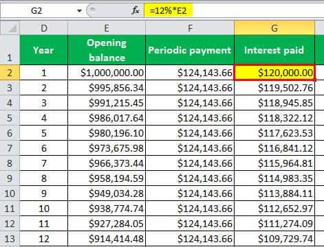

## Table of Contents

## What is an amortization schedule?

An amortization schedule is a table that shows how loan payments are divided between interest and principal over time. It helps you see how much of each payment goes toward paying off the loan amount (principal) and how much goes toward the cost of borrowing the money (interest). As you make payments, the amount of interest decreases because the loan balance gets smaller, and more of your payment goes toward the principal.

This schedule is useful for people who want to understand their loan better and plan their finances. For example, if you have a mortgage, an amortization schedule can show you how much you will pay each month and how the balance of your loan changes with each payment. It can also help you see the total interest you will pay over the life of the loan, which can be important for deciding if a loan is a good choice for you.

## Why is an amortization schedule important?

An amortization schedule is important because it helps you understand how your loan works. It shows you how each payment is split between paying off the loan itself (the principal) and the cost of borrowing the money (the interest). By looking at the schedule, you can see that at the start of the loan, most of your payment goes toward interest. As you keep paying, more of your money goes toward the principal. This helps you see how your loan balance goes down over time.

It's also useful for planning your finances. With an amortization schedule, you can see how much you need to pay each month and how long it will take to pay off the loan completely. This can help you decide if you can afford the loan or if you should look for a different one. Plus, it shows you the total interest you will pay over the life of the loan, which can help you understand the true cost of borrowing money.

## How does an amortization schedule work?

An amortization schedule is a table that shows how each payment on a loan is divided between the principal and the interest. When you start paying back a loan, most of your monthly payment goes towards the interest. This is because the interest is calculated on the full amount you borrowed. As you make more payments, the loan balance (the principal) starts to go down. Since the interest is calculated on a smaller amount each time, less of your payment goes to interest and more goes to the principal.

This schedule helps you see how your loan balance decreases over time. Each row in the table represents a payment, showing you how much of that payment is interest, how much is principal, and what your new loan balance is after the payment. By looking at the schedule, you can also see the total interest you will pay over the life of the loan. This can help you understand the true cost of borrowing and plan your finances better.

## What are the key components of an amortization schedule?

An amortization schedule is made up of several important parts that help you understand your loan payments. The first key part is the payment number, which tells you which payment you are looking at. Each payment has a date, so you know when it is due. The payment amount is another important part, showing how much money you need to pay each time. This amount stays the same for most loans.

The next parts are the principal and interest. The principal is the amount of your payment that goes toward paying off the loan itself. The interest is the cost of borrowing the money, and it is what you pay to the lender for letting you use their money. At the start, most of your payment goes to interest, but as you pay more, more of your payment goes to the principal. The schedule also shows you the remaining balance after each payment, so you can see how much you still owe.

The last parts are the total interest paid and the total payments made. These help you see the total cost of the loan over time. By looking at these parts, you can understand how your loan works and plan your finances better.

## How do you calculate monthly payments in an amortization schedule?

To calculate the monthly payments in an amortization schedule, you need to know the loan amount, the interest rate, and the loan term in years. First, you convert the annual interest rate to a monthly rate by dividing it by 12. Then, you figure out the total number of payments by multiplying the number of years by 12. You use a formula to find the monthly payment that will pay off the loan over that time.

The formula for the monthly payment is: Payment = (Loan Amount * Monthly Interest Rate) / (1 - (1 + Monthly Interest Rate)^(-Total Number of Payments)). This formula might look hard, but it helps make sure that each payment covers some of the interest and some of the loan amount. Over time, as you pay off the loan, more of each payment goes to the loan amount and less goes to interest. This way, you can see how your loan balance goes down with each payment on the amortization schedule.

## What is the difference between amortization and depreciation?

Amortization and depreciation are two ways to spread out the cost of something over time, but they are used for different things. Amortization is usually about loans. It's how you pay off a loan in small amounts over time. Each payment you make includes both the money you borrowed (the principal) and the cost of borrowing (the interest). An amortization schedule shows you how much of each payment goes to the principal and how much goes to the interest.

Depreciation, on the other hand, is about the value of things like machines, buildings, or vehicles going down over time. It's used in accounting to show how the value of these things gets smaller as they get older or used more. There are different ways to calculate depreciation, but they all help businesses figure out how much their stuff is worth as it gets older. While amortization helps you see how a loan gets paid off, depreciation helps businesses understand how their things lose value.

## How does the interest rate affect an amortization schedule?

The interest rate is a big deal when it comes to an amortization schedule. It decides how much of your monthly payment goes to the cost of borrowing the money, which we call interest. If the interest rate is high, more of your payment goes to interest, especially at the start of the loan. This means you pay less toward the actual loan amount, or principal, and it takes longer to pay off the loan. A lower interest rate means less of your payment goes to interest, so more goes to the principal right away. This helps you pay off the loan faster and saves you money on interest over time.

When the interest rate changes, it changes the whole amortization schedule. If you have a fixed interest rate, your payments stay the same, but if you have a variable interest rate, your payments can go up or down. A higher interest rate makes your monthly payments bigger because you're paying more interest. On the other hand, a lower interest rate makes your monthly payments smaller. By looking at the amortization schedule, you can see how different interest rates affect how much you pay each month and how long it takes to pay off the loan.

## Can you explain the formula used to calculate amortization?

The formula to calculate the monthly payment for an amortization schedule is pretty important. It helps you figure out how much you need to pay each month to pay off your loan over time. The formula is: Payment = (Loan Amount * Monthly Interest Rate) / (1 - (1 + Monthly Interest Rate)^(-Total Number of Payments)). This might look hard, but it's just a way to make sure each payment covers some of the loan and some of the interest. You need to know the loan amount, the interest rate, and how long the loan will last to use this formula.

When you use this formula, you start by turning the annual interest rate into a monthly rate by dividing it by 12. Then, you find out how many payments you'll make by multiplying the number of years by 12. The formula then helps you see how much of each payment goes to the interest and how much goes to paying off the loan. Over time, as you keep making payments, more of your money goes to the loan and less goes to the interest. This way, you can see how your loan balance goes down with each payment on the amortization schedule.

## What are the different types of amortization methods?

There are a few different ways to do amortization, but the most common ones are straight-line amortization and declining balance amortization. Straight-line amortization is simple. It means you pay the same amount of the loan off every month. If you have a loan for $12,000 over a year, you'd pay off $1,000 each month. This method is easy to understand and works well for some types of loans, like car loans.

Declining balance amortization is a bit different. It means you pay more toward the interest at the start and more toward the loan itself as time goes on. This is the usual way for mortgages and other long-term loans. Each payment you make has part that goes to interest and part that goes to the loan amount. At first, most of your payment is interest, but as you pay more, the loan gets smaller, so you pay less interest and more of the loan itself. This method can be harder to understand, but it's common for big loans that last a long time.

## How does an amortization schedule change with different loan terms?

The length of a loan, or the loan term, really changes how an amortization schedule looks. If you pick a shorter loan term, like 15 years instead of 30 years for a mortgage, your monthly payments will be higher. But, you'll pay off the loan faster and end up paying less interest over time. On the other hand, if you go for a longer loan term, your monthly payments will be smaller, but you'll be paying the loan off for a longer time and will end up paying more in interest.

When the loan term changes, it affects how much of each payment goes to the interest and how much goes to the loan itself. With a shorter term, more of your payment goes to the loan right away because you're trying to pay it off faster. This means you'll see the loan balance go down quicker on the amortization schedule. With a longer term, more of your early payments go to interest, and it takes longer for the loan balance to start going down a lot. So, the loan term you choose can make a big difference in how your amortization schedule looks and how much you end up paying in total.

## What are the tax implications of amortization?

Amortization can help you save on taxes, especially if you're a business. When you take out a loan for your business, the interest you pay on that loan can sometimes be taken off your taxes. This means you don't have to pay taxes on that part of your money. So, if you're paying a lot of interest on a loan, it can lower the amount of taxes you owe. This is why it's good to look at the amortization schedule to see how much interest you're paying over time.

For personal loans, like a mortgage, the tax rules can be different. In some places, you might be able to take off the interest you pay on your mortgage from your taxes, but this isn't true everywhere. It's important to check the tax laws where you live to see if you can do this. Either way, understanding how amortization works can help you plan better and maybe save some money on taxes.

## How can software tools help in creating and managing an amortization schedule?

Software tools make it a lot easier to create and manage an amortization schedule. They do all the math for you, so you don't have to figure out the monthly payments or how much interest you're paying by hand. You just put in the loan amount, the interest rate, and how long the loan will last, and the software does the rest. It makes a table that shows you each payment, how much goes to interest, how much goes to the loan itself, and what your new balance is after each payment. This can save you a lot of time and help you understand your loan better.

These tools also let you play around with different numbers. You can see what happens if you change the interest rate or the length of the loan. This can help you decide which loan is best for you. Plus, many software tools let you keep track of your payments over time. You can see how much you've paid, how much you still owe, and how much interest you've paid so far. This can be really helpful for planning your money and making sure you're on track to pay off your loan.

## What is Loan Amortization and How Does it Work?

Loan amortization is a critical financial concept that refers to the process of gradually paying off a loan over time through regular payments. These payments are typically made monthly and are designed to cover both the interest and a portion of the principal amount borrowed. Understanding loan amortization is essential for effective financial planning, as it allows borrowers to anticipate and manage their financial obligations systematically.

The significance of loan amortization lies in its ability to distribute the cost of a loan across its term, thereby helping borrowers manage expenses and maintain financial stability. Rather than paying the entire loan principal and interest upfront, amortization allows for smaller, more manageable payments over the loan's duration. This systematic payment approach is particularly beneficial in providing predictability in financial planning, as borrowers know in advance how much they will pay each period.

Amortization schedules break down each loan payment into two components: interest and principal repayment. During the early stages of a loan, a significant portion of the payment is allocated towards interest. Over time, as the outstanding principal decreases, the interest component of the payment diminishes, and a larger portion is applied to reduce the principal. This shift in the payment structure is due to the fact that interest is calculated based on the outstanding principal balance, which decreases with each payment made. 

Mathematically, the monthly payment on an amortized loan can be calculated using the formula:

$$

M = \frac{P \times r \times (1 + r)^n}{(1 + r)^n - 1} 
$$

Where:
- $M$ is the total monthly mortgage payment.
- $P$ is the principal loan amount.
- $r$ is the monthly interest rate (annual interest rate divided by 12).
- $n$ is the number of payments over the life of the loan.

The formula helps in determining the exact monthly payment that will ensure the loan is paid off in full over the specified term.

By understanding the nuances of an amortization schedule, borrowers can better strategize their repayment approach, potentially opting for additional payments to reduce the principal faster and save on interest costs over time. Accelerated payments can significantly decrease the total interest paid over the life of the loan, reinforcing the importance of amortization in strategic financial planning.

## What are the components of an amortization schedule?

An amortization schedule is a comprehensive table outlining each periodic loan payment's detailed breakdown over the life of a loan. This schedule provides essential insights into the debt repayment process and assists borrowers in strategizing their finances efficiently.

At the core of an amortization schedule are several key components:

1. **Payment Number**: This simply represents the sequence of payments made. For a loan with monthly payments over a 5-year term, there would be 60 payment numbers, reflecting each monthly installment.

2. **Date**: Each payment corresponds to a specific date, helping borrowers keep track of due dates and avoid late fees, which can adversely affect their credit scores and financial standing.

3. **Amount**: The total payment amount for each period remains constant for fixed-rate loans and represents the sum that the borrower has agreed to pay back to the lender regularly.

4. **Interest**: This part of the payment serves as the cost of borrowing money. Interest is generally calculated based on the remaining loan balance, ensuring that it diminishes over time as the principal is paid down.

5. **Principal**: This is the portion of each payment that goes towards reducing the actual loan balance. Initially, a smaller portion of each payment goes to the principal while most goes towards interest. As the loan progresses, more of the payment is applied to the principal.

6. **Remaining Balance**: Following each payment, the outstanding loan balance decreases. The amortization schedule will clearly display this dwindling balance over time, offering a transparent view of how much is left to be paid.

These elements of an amortization schedule provide a roadmap for borrowers, allowing them to see exactly how each payment is allocated between interest and principal. This not only assists in tracking repayment progress but also aids in financial planning, enabling borrowers to anticipate future cash flow needs.

To illustrate, consider a simplified example for a $10,000 loan with an annual [interest rate](/wiki/interest-rate-trading-strategies) of 5%, spread over 2 years with monthly payments. Using the formula for monthly payment calculations:

$$

M = \frac{P \times r(1+r)^n}{(1+r)^n-1} 
$$

where:
- $M$ is the total monthly payment
- $P$ is the principal amount ($10,000)
- $r$ is the monthly interest rate (annual rate / 12 months = 0.05 / 12)
- $n$ is the total number of payments (2 years × 12 months/year = 24)

The monthly payment $M$ can be calculated, and the schedule would then provide the breakdown for each month as explained above.

Here's a simple script to generate the first few entries of such a schedule for clarity:

```python
import numpy as np

def amortization_schedule(principal, annual_rate, years):
    monthly_rate = annual_rate / 12
    payments = years * 12
    M = principal * monthly_rate / (1 - (1 + monthly_rate) ** -payments)

    balance = principal
    schedule = []

    for payment_number in range(1, payments + 1):
        interest_payment = balance * monthly_rate
        principal_payment = M - interest_payment
        balance -= principal_payment
        schedule.append((payment_number, M, interest_payment, principal_payment, balance))

    return schedule

# Example usage
schedule = amortization_schedule(10000, 0.05, 2)

for (num, amt, interest, principal, balance) in schedule[:5]:  # displaying first 5 rows for brevity
    print(f"Payment {num}: Total: ${amt:.2f}, Interest: ${interest:.2f}, Principal: ${principal:.2f}, Remaining Balance: ${balance:.2f}")
```

This schedule enables borrowers to visualize how quickly they are progressing towards paying off their loans and decide if additional payments might hasten this process to their advantage.

## What are the financial formulas used for loan calculation?

Calculating monthly loan payments involves understanding the interplay between three primary components: the principal, interest rate, and loan term. The principal refers to the original sum of money borrowed that needs to be repaid over a specified duration known as the loan term, while the interest rate determines the cost of borrowing this money as a percentage of the principal.

One of the most common methods for calculating monthly payments is through the formula for amortizing loans, often used for fixed-rate mortgages and car loans. The formula is expressed as:

$$

M = \frac{P \cdot r \cdot (1 + r)^n}{(1 + r)^n - 1} 
$$

where:
- $M$ represents the monthly payment,
- $P$ is the principal loan amount,
- $r$ is the monthly interest rate (annual rate divided by 12 months),
- $n$ equals the total number of payments over the loan term.

To further illustrate, consider a loan with a principal of $100,000, an annual interest rate of 5%, and a loan term of 15 years. First, convert the annual interest rate to a monthly rate by dividing by 12, which results in approximately 0.004167. The total number of payments over 15 years is 180 (15 years × 12 months).

Substituting these values into the formula gives:

$$

M = \frac{100,000 \cdot 0.004167 \cdot (1 + 0.004167)^{180}}{(1 + 0.004167)^{180} - 1} 
$$

Calculating the above expression results in a monthly payment of approximately $790.79.

In Python, the calculation can be automated using the following script:

```python
def calculate_monthly_payment(principal, annual_rate, years):
    monthly_rate = annual_rate / 12 / 100
    total_payments = years * 12
    monthly_payment = (principal * monthly_rate * (1 + monthly_rate) ** total_payments) / ((1 + monthly_rate) ** total_payments - 1)
    return monthly_payment

principal = 100000
annual_rate = 5
years = 15

monthly_payment = calculate_monthly_payment(principal, annual_rate, years)
print(f"The monthly payment is: ${monthly_payment:.2f}")
```

This Python code adopts the mathematical formula to compute monthly payments swiftly, providing a practical tool for financial planning and analysis. By comprehending the role of each element in the formula, individuals and financial professionals can assess loan options more thoroughly, tailoring payment schedules to their financial capabilities and goals.

## What are the benefits of using amortization schedules?

Amortization schedules play a crucial role in enhancing the transparency of financial obligations, offering a clear and detailed view of each loan payment's breakdown. By delineating each installment into principal and interest components, borrowers gain insight into how their payments are structured over the life of the loan. This transparency allows individuals and businesses to understand their financial commitments comprehensively, aiding in effective planning and budgeting.

The use of amortization schedules facilitates improved financial planning and predictability. By providing a structured timeline of payments, borrowers can anticipate their future financial position, making it easier to align their expenses and savings. An amortization schedule enables the mapping of cash flows, which is essential for both short-term and long-term financial strategies. This foresight helps in avoiding potential financial pitfalls and allows for strategic allocation of resources.

Accelerated payments can be integrated into amortization schedules to achieve significant savings in interest payments. By making additional payments towards the principal, borrowers can reduce the loan's outstanding balance more quickly, which in turn decreases the total interest paid over the loan's term. For example, consider a loan with a principal amount $P$, annual interest rate $r$, and a loan term of $n$ years. The monthly payment $M$ can be calculated using the formula:

$$
M = \frac{P \times \frac{r}{12}}{1 - (1 + \frac{r}{12})^{-12n}}
$$

When an additional amount is paid towards the principal, the outstanding balance is reduced at a faster rate, effectively shortening the loan term and reducing the interest burden. Borrowers can strategically plan accelerated payments by using digital tools to update their amortization schedules, enabling them to visualize the impact of these payments on their financial outlook.

Overall, the utility of amortization schedules extends beyond just tracking payments; they serve as a powerful tool for enhancing transparency, financial planning, and enabling borrowers to optimize their repayment strategy through accelerated payments.

## What are the differences between manual and tool-based calculation of amortization?

Calculating loan amortization can be executed manually or through various digital tools, each approach having its distinct advantages and disadvantages. Traditionally, manual calculations require an understanding of financial formulas such as the one for calculating monthly payments:

$$
M = \frac{P \cdot r \cdot (1 + r)^n}{(1 + r)^n - 1}
$$

where $M$ is the monthly payment, $P$ is the principal amount, $r$ is the monthly interest rate, and $n$ is the number of payments. Manual computations offer a deep insights into the underlying processes and enhance one's understanding of financial mechanics. However, they are time-consuming and prone to human error, especially for long-term loans or complex financial arrangements.

The advent of digital tools such as online calculators and spreadsheet software like Microsoft Excel or Google Sheets streamlines the process significantly. These tools provide instant, accurate calculations and the ability to easily adjust variables for different scenarios, thus saving time and reducing error. For example, in Excel, the PMT function automates the calculation of monthly payments with inputs for interest rate, loan term, and principal, requiring minimal effort:

```python
=PMT(interest_rate/12, number_of_months, -principal)
```

Pros of using these tools include increased efficiency, reduced risk of error, and the ability to visualize data and trends over time via built-in graphing functionalities. They also allow for the quick integration of changes to terms and immediate visualization of the results. On the downside, digital tools require a certain level of technological proficiency and access to appropriate software, which might not be universally available.

For instance, online calculators offer convenience and accessibility, but they might not offer the same level of customization as spreadsheet programs. Meanwhile, spreadsheets offer comprehensive functionalities and are ideal for users who need to perform extensive analysis or integrate amortization schedules into broader financial plans.

In conclusion, while manual calculations provide foundational skills and understanding, digital tools undeniably enhance efficiency and accuracy, making them invaluable for financial tasks. As such, leveraging technology in the form of online calculators and spreadsheets is increasingly essential for effective financial management.

## References & Further Reading

[1]: Bergstra, J., Bardenet, R., Bengio, Y., & Kégl, B. (2011). ["Algorithms for Hyper-Parameter Optimization."](https://proceedings.neurips.cc/paper/2011/file/86e8f7ab32cfd12577bc2619bc635690-Paper.pdf) Advances in Neural Information Processing Systems 24.

[2]: ["Advances in Financial Machine Learning"](https://www.amazon.com/Advances-Financial-Machine-Learning-Marcos/dp/1119482089) by Marcos Lopez de Prado

[3]: Aronson, D. (2007). ["Evidence-Based Technical Analysis: Applying the Scientific Method and Statistical Inference to Trading Signals."](https://www.amazon.com/Evidence-Based-Technical-Analysis-Scientific-Statistical/dp/0470008741) John Wiley & Sons.

[4]: Jansen, S. (2020). ["Machine Learning for Algorithmic Trading: Predictive models to extract signals from market and alternative data for systematic trading strategies with Python."](https://www.amazon.com/Machine-Learning-Algorithmic-Trading-alternative/dp/1839217715) Packt Publishing.

[5]: Chan, E. P. (2009). ["Quantitative Trading: How to Build Your Own Algorithmic Trading Business."](https://github.com/ftvision/quant_trading_echan_book) John Wiley & Sons.