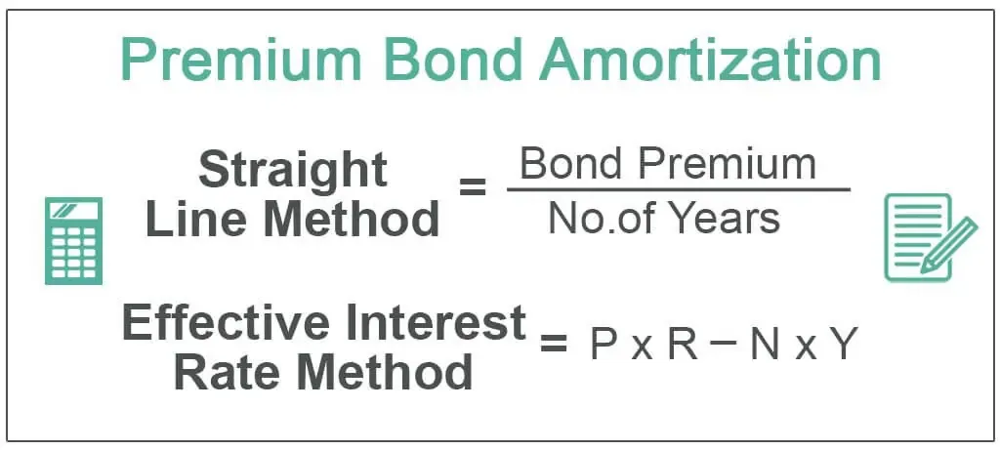

In finance, understanding bonds and how they are amortized is vital for investors and traders. Bonds represent a critical component of the global financial system, offering a mechanism for raising capital and managing debt. Amortization of these bonds refers to the gradual repayment of their principal amount over the bond's life, along with scheduled interest payments. This structured repayment process offers advantages for both issuers and investors, ensuring predictable cash flows and reducing the risk of default associated with large, lump-sum payments at maturity.

This article aims to provide a comprehensive exploration of bond amortization, focusing on its operation, advantages, and disadvantages, and its application in the financial markets. We will present a clear example demonstrating how amortized bonds function, along with examining their role in financial planning for both investors and issuers. Companies, municipalities, and other organizations utilize amortized bonds to finance significant projects while managing their cash flow efficiently. For investors, these bonds provide a consistent stream of income, which can be influential in constructing fixed-income portfolios.



Moreover, we will discuss the implications of bond amortization in the context of algorithmic trading, where technology and automation play increasingly prominent roles. By analyzing amortization schedules, algorithmic trading systems can predict cash flows and interest income, dynamically adjusting portfolios in response to these financial parameters. The structured nature of amortized bonds makes them particularly suitable for algorithmic trading, where predictability and risk management are key.

Understanding the different methods of amortization, such as straight-line and effective-interest methods, further enriches the comprehension of financial reporting and tax considerations. This knowledge is crucial as it impacts how issuers report financial results and manage their fiscal responsibilities. In conclusion, as the financial landscape continues to evolve, a thorough grasp of bond amortization offers investors and traders a strategic tool for optimizing trading strategies and enhancing portfolio management.

## Table of Contents

## What is Bond Amortization?

Bond amortization refers to the systematic repayment of a bond's principal amount, alongside interest, distributed over the bond's lifespan. This process essentially breaks down the repayment obligations into manageable increments, ensuring that both the principal and the interest are settled over time, unlike balloon loans, where the entire principal is paid at maturity.

In amortized bonds, each payment includes a portion directed towards interest and another towards reducing the principal balance. This allocation between principal and interest is predetermined and structured in an amortization schedule. Such schedules are crucial as they provide transparency and predictability for both issuers and investors regarding cash flows. 

The predictable nature of the amortization schedule simplifies financial planning for both parties. For issuers, it allows for smoother cash flow management, avoiding large lump-sum payments at the end of the bond's term. For investors, it provides a clear outline of expected payments, assisting in the forecasting of future income streams. Mathematical formulae or computational models can determine the specific payment values. For example, a basic formula used is:

$$

PMT = \frac{P \cdot r}{1 - (1 + r)^{-n}} 
$$

where $PMT$ is the annual payment, $P$ is the principal value of the bond, $r$ is the interest rate per period, and $n$ is the total number of payments.

Amortization schedules demonstrate how each payment progressively allocates less to interest and more towards paying down the principal. This results from the decreasing principal balance upon which interest is calculated. Consequently, understanding bond amortization's mechanisms and effects is essential for effective financial management and planning.

## Example of Amortized Bond

Consider a $1,000 bond with a 5% annual [interest rate](/wiki/interest-rate-trading-strategies) and a 5-year duration as an example of an amortized bond. Unlike a bond with a single repayment at maturity, an amortized bond involves regular payments that reduce the principal amount over time, as well as cover the interest.

**Amortization Formula**

To determine the annual payment for such a bond, the following formula is generally used: 

$$
A = \frac{P \times \frac{r}{n}}{1 - (1+\frac{r}{n})^{-nt}}
$$

Where:
- $A$ is the annual payment,
- $P$ is the principal amount ($1,000 in this example),
- $r$ is the annual interest rate (0.05 for 5%),
- $n$ is the number of payments per year (1 for annual payments),
- $t$ is the number of years (5 years here).

Substituting the given values into the formula, we calculate:

$$
A = \frac{1000 \times 0.05}{1 - (1+0.05)^{-5}}
$$

This calculation yields an approximate annual payment of $230.97.

**Amortization Schedule**

The amortization schedule illustrates how each payment is split between interest and principal. Initially, a larger portion of each payment is allocated to interest, with the remainder applied to reduce the principal. Over time, the interest component decreases while the principal repayment increases.

Here's a simple Python script to generate such a schedule:

```python
def amortization_schedule(principal, rate, years):
    n = 1  # annual payments
    total_payments = years * n
    rate_per_period = rate / n

    # Annual payment calculation
    payment = (principal * rate_per_period) / (1 - (1 + rate_per_period) ** -total_payments)

    balance = principal

    for period in range(1, total_payments + 1):
        interest_payment = balance * rate_per_period
        principal_payment = payment - interest_payment
        balance -= principal_payment
        print(f"Year {period}: Interest={interest_payment:.2f}, Principal={principal_payment:.2f}, Balance={balance:.2f}")

amortization_schedule(1000, 0.05, 5)
```

This script will produce a breakdown showing that in the initial year, more interest is paid compared to principal, whereas in the final year, the principal constitutes most of the payment.

By understanding this example, investors and issuers can appreciate how an amortized bond functions, ensuring predictable financial outcomes over the bond's tenure.

## Role of Amortized Bonds in Financial Planning

Amortized bonds are integral in financial planning due to their structured cash flow management, benefiting both issuers and investors. For issuers, such as municipalities and corporations, amortized bonds provide a mechanism to manage cash flow efficiently. Instead of having to repay a substantial principal amount at maturity, issuers can distribute these payments over the bond's lifetime. This structured repayment process mitigates the risk of default since payments are smaller and more regular, enabling better financial predictability and planning. 

For investors, amortized bonds offer steady and predictable income streams. The fixed nature of payment schedules allows these bonds to fit seamlessly into fixed-income portfolios. This predictability is particularly attractive to risk-averse investors seeking consistent returns, as it facilitates easier forecasting and integration into broader investment strategies. The scheduled nature of payments contributes to overall financial stability and supports long-term income generation goals.

Municipalities and corporations often utilize amortized bonds to finance large capital-intensive projects, such as infrastructure development or expansion initiatives. By opting for amortized bonds, these organizations align their investment needs with a sustainable repayment plan, ensuring that the generated cash flow can adequately cover both interest and principal payments over time. This alignment not only aids in budget planning but also helps in maintaining fiscal responsibility and credibility with investors.

In summary, amortized bonds play a crucial role in financial planning by offering predictable cash flows, reducing large payment risks at maturity, and supporting the financing of large projects. These features make them an attractive option for both issuers and investors seeking stability and structured financial management.

## Impact on Algorithmic Trading

Algorithmic trading significantly benefits from the integration of amortization schedules, particularly in the management of fixed-income portfolios. The predictable nature of cash flows from amortized bonds provides a solid framework for optimizing trading strategies, allowing algorithms to make informed adjustments based on the expected changes in interest income and principal repayment.

The regularity of cash flows associated with amortized bonds serves as a reliable input for algorithmic models, facilitating the prediction of future cash inflows. This predictability is particularly advantageous in crafting trading strategies that depend on cash flow scheduling, such as those focused on yield optimization and risk management.

Algorithms can dynamically adjust portfolios by calculating changes in interest payments over time. For example, consider a scenario where an algorithm needs to forecast cash flows from an amortized bond. Using a Python approach, the future cash flows can be predicted as follows:

```python
def calculate_amortization_schedule(principal, annual_rate, years):
    num_payments = years
    rate = annual_rate
    payment = (principal * rate) / (1 - (1 + rate)**-num_payments)
    schedule = []

    for i in range(num_payments):
        interest_payment = principal * rate
        principal_payment = payment - interest_payment
        principal -= principal_payment
        schedule.append((interest_payment, principal_payment, principal))

    return schedule

# Example of usage
principal = 1000
annual_rate = 0.05
years = 5
schedule = calculate_amortization_schedule(principal, annual_rate, years)
```

This script calculates the amortization schedule for a bond by determining the annual payment, decomposing it into interest and principal components, and tracking the remaining principal over time. Algorithmic trading systems can use this data to forecast cash flows, adjust portfolio allocations, and enhance decision-making.

Integrating amortization information into trading algorithms aids in mitigating risks associated with interest rate fluctuations by restructuring portfolios in response to shifts in expected cash flows. Such strategic adjustments can improve returns and ensure a balance between income generation and risk exposure.

In conclusion, the use of amortization schedules in [algorithmic trading](/wiki/algorithmic-trading) promotes efficiency and accuracy in risk management and return optimization. As financial markets evolve, leveraging detailed cash flow analysis from amortized bonds will remain pivotal for traders seeking to refine their strategies and enhance their performance in fixed-income markets.

## Amortization Methods: Straight-Line vs. Effective-Interest

In bond accounting, the selection of an amortization method can significantly influence the financial statements and tax obligations of an issuer. Two primary methods utilized are the straight-line and the effective-interest methods.

The straight-line method is the simpler of the two. Here, the bond discount or premium is distributed evenly across each period over the bond’s life. This means that the amount amortized each period is constant, resulting in equal interest expense or revenue across each payment interval. This method is straightforward to calculate and understand, which can make it appealing for companies seeking to simplify their accounting processes.

For example, if a bond is issued at a discount of $1000 over a ten-year period, the annual amortization under the straight-line method would be:

$$

\text{Annual Amortization} = \frac{\text{Total Discount or Premium}}{\text{Number of Periods}} = \frac{1000}{10} = 100 
$$

The effective-interest method, on the other hand, provides a more precise reflection of the bond’s interest cost by aligning the periodic interest expense with the bond's actual yield. This approach adjusts the amortization amount in each period based on the bond's carrying amount and the market interest rate at issuance, resulting in varying amortization amounts over different periods. 

The calculation for the effective-interest method involves recalculating the bond’s carrying amount each period, multiplying it by the market rate, and adjusting for any cash interest paid:

$$

\text{Interest Expense}_{t} = \text{Carrying Amount}_{t-1} \times \text{Effective Interest Rate}
$$

Python can be employed to automate these calculations, which is particularly useful for complex securities with multiple cash flows or interest rate environments:

```python
def calculate_effective_interest_schedule(face_value, coupon_rate, market_rate, periods):
    schedule = []
    carrying_amount = face_value
    for _ in range(periods):
        interest_expense = carrying_amount * market_rate
        coupon_payment = face_value * coupon_rate
        amortization = coupon_payment - interest_expense
        carrying_amount -= amortization
        schedule.append({
            'Interest Expense': interest_expense,
            'Coupon Payment': coupon_payment,
            'Amortization': amortization,
            'Carrying Amount': carrying_amount
        })
    return schedule
```

Choosing the appropriate amortization method has far-reaching implications for financial statements and tax liabilities. The straight-line method may underestimate or overestimate interest expense early or later in the bond term if interest rates are volatile. Conversely, the effective-interest method, while more accurate, requires more complex calculations and can lead to varied interest expense, complicating year-to-year financial comparisons. Each method’s impact varies, and issuers must consider their financial reporting goals and tax strategy when deciding on an amortization method.

## Advantages and Disadvantages of Amortized Bonds

Amortized bonds present several advantages that make them an attractive option for both issuers and investors. One of the primary benefits is the predictability of cash flows. As the repayment of principal is spread over the life of the bond, both parties can anticipate the outlays and inflows accurately. This predictability is especially valuable in financial planning and portfolio management, as it provides a stable income stream through regular interest payments. Additionally, the regular reduction of principal over time lowers the risk of defaulting on a large payment at maturity, a significant advantage for issuers managing large projects or debts.

Another benefit is the alignment of interest expenses over time, which becomes more manageable for issuers. Instead of facing balloon payments at maturity, the issuer has dispersed liabilities, improving cash flow management. This structure also makes these bonds appealing for fixed income investors seeking steady returns without the [volatility](/wiki/volatility-trading-strategies) associated with other bond types.

However, amortized bonds also come with disadvantages that must be considered. A notable drawback is the potential for lower overall interest payments. As the principal decreases with each payment, the interest computed on the outstanding principal similarly reduces over time, translating to declining interest income. For investors expecting higher returns, this characteristic might be less attractive.

The accounting processes involved in bond amortization can also be complex. Calculating the division between principal and interest in each payment and maintaining accurate amortization schedules require meticulous financial management. For issuers, these accounting requirements might lead to increased overhead and resource allocation.

Lastly, reduced investor income expectations can affect the desirability of amortized bonds. As the interest component diminishes over time, investors may find the bond less competitive compared to other options offering higher yields throughout their term.

Understanding these trade-offs—predictability and risk reduction against declining interest income and accounting complexity—is crucial for investors and issuers. Balancing these elements can help in managing risk and optimizing the return on investments, ensuring informed decision-making in financial strategies.

## Conclusion

Amortized bonds serve as a valuable instrument for both issuers and investors by providing a structured approach to managing financial obligations. For issuers, these bonds enable the distribution of cash flows over time, reducing the risk of default associated with a single, large repayment at maturity. This gradual repayment structure is particularly advantageous for municipalities and corporations undertaking substantial projects, allowing for more predictable budgeting and financial planning.

For investors, the predictable income stream generated by amortized bonds offers a stable addition to fixed-income portfolios. This stability can be crucial for individuals and institutional investors seeking to manage risk while ensuring a steady return on investment. The regularity of interest and principal payments helps investors plan with greater accuracy and confidence.

Incorporating amortized bonds into algorithmic trading showcases their potential to improve portfolio management strategies. The predictability of cash flows allows for enhanced algorithmic models that can dynamically adjust portfolios based on anticipated interest rate changes and cash income. This incorporation can lead to more informed decision-making and risk management, ultimately improving the overall return on portfolios.

As financial markets evolve, understanding the nuances of bond amortization becomes increasingly critical for market participants. Mastery of this knowledge allows for more effective navigation of the complexities of modern financial markets, ensuring that both issuers and investors can optimize their financial strategies. The balanced approach offered by amortized bonds thus remains a fundamental aspect of sophisticated financial and investment planning.

## References & Further Reading

[1]: Fabozzi, F. J. (2005). ["The Handbook of Fixed Income Securities"](https://www.amazon.com/Handbook-Fixed-Income-Securities-Ninth/dp/1260473899). McGraw-Hill Education.

[2]: Antti Ilmanen. (2011). ["Expected Returns: An Investor's Guide to Harvesting Market Rewards"](https://onlinelibrary.wiley.com/doi/book/10.1002/9781118467190). Wiley.

[3]: Gitman, L. J., & Joehnk, M. D. (2002). ["Fundamentals of Investing"](https://archive.org/details/fundamentalsofin2002gitm) (8th ed.). Addison Wesley.

[4]: ["Fixed Income Analysis"](https://en.wikipedia.org/wiki/Fixed_income_analysis) by CFA Institute.

[5]: Feldstein, M. S. (1976). ["The Effect of Government Regulation on Personal Investment"](https://en.wikipedia.org/wiki/Martin_Feldstein). National Bureau of Economic Research.

[6]: ["Algorithmic Trading and DMA: An Introduction to Direct Access Trading Strategies"](https://www.amazon.com/Algorithmic-Trading-DMA-introduction-strategies/dp/0956399207) by Barry Johnson.

[7]: ["Bond Markets, Analysis, and Strategies"](https://www.amazon.com/Bond-Markets-Analysis-Strategies-tenth/dp/026204627X) by Frank J. Fabozzi.

[8]: ["Algorithmic Trading: Winning Strategies and Their Rationale"](https://www.amazon.com/Algorithmic-Trading-Winning-Strategies-Rationale-ebook/dp/B00CY5HC0U) by Ernie Chan.