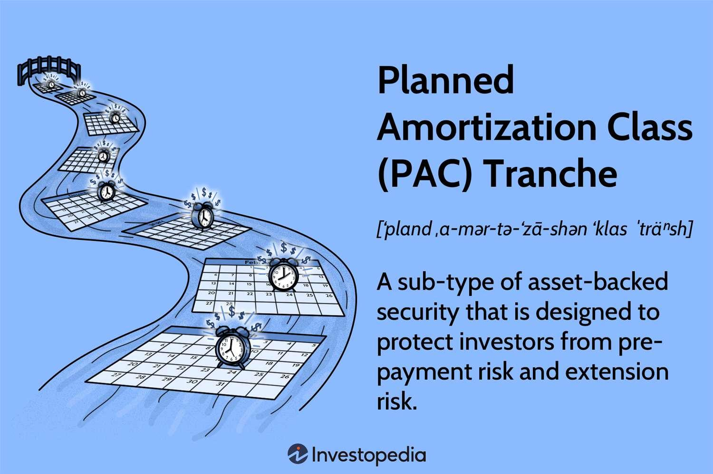

## Table of Contents

## What is amortizing security?

An amortizing security is a type of financial product where the principal amount is paid back over time, along with interest. This means that with each payment, a part of the money goes toward reducing the principal and another part goes toward paying the interest. Common examples of amortizing securities include mortgages and car loans. These payments are usually set up on a schedule, so borrowers know exactly how much they need to pay each month.

The main benefit of an amortizing security is that it helps borrowers manage their debt more easily. Since the payments are spread out over time, it's easier to budget for them. Also, as the principal gets smaller with each payment, the amount of interest charged also goes down. This makes the overall cost of borrowing less than it would be if the entire principal had to be paid back at once, along with all the interest.

## How does amortizing security differ from traditional security measures?

Amortizing security is about financial products like loans, where you pay back the money you borrowed little by little over time. It's different from traditional security measures, which are all about keeping things safe and secure. Traditional security measures could be things like locks on doors, security cameras, or passwords for your computer. They help protect against theft, damage, or unauthorized access.

When you talk about amortizing security, you're thinking about how to manage debt. For example, with a mortgage, you pay a bit of the loan and some interest every month until it's all paid off. This makes it easier to handle big purchases over time. On the other hand, traditional security measures focus on preventing bad things from happening, like someone breaking into your house or hacking into your computer. So, while amortizing security is about financial planning and debt management, traditional security is about safety and protection.

## What are the basic principles behind amortizing security?

Amortizing security is all about paying back a loan little by little over time. When you take out a loan like a mortgage or a car loan, you don't have to pay it all back at once. Instead, you make regular payments, usually every month. Each payment includes a bit of the money you borrowed, which is called the principal, and a bit of interest, which is the cost of borrowing the money. As you keep making these payments, the amount you owe, or the principal, gets smaller and smaller.

The main idea behind amortizing security is to make big purchases more manageable. Instead of having to come up with a huge amount of money all at once, you can spread out the cost over many months or even years. This helps you budget better because you know exactly how much you need to pay each month. Plus, as you pay down the principal, the interest you owe also goes down, making the overall cost of the loan less than if you had to pay it all back at once.

## Can you provide examples of amortizing security in everyday applications?

One everyday example of amortizing security is a home mortgage. When you buy a house, you usually don't pay for it all at once. Instead, you take out a loan called a mortgage. You then make monthly payments to the bank that gave you the loan. Each payment includes a part that goes toward paying off the actual cost of the house (the principal) and a part that covers the interest on the loan. Over time, as you keep making these payments, the amount you owe on the house gets smaller and smaller until you own the house outright.

Another example is a car loan. When you want to buy a car but don't have enough money to pay for it all at once, you can get a car loan. Just like with a mortgage, you make monthly payments to the lender. Each payment reduces the amount you owe on the car (the principal) and also covers some interest. As you continue to make these payments, the car becomes more and more yours until you've paid off the entire loan. This way, you can drive a new car without needing to save up the full amount before buying it.

## What are the benefits of implementing amortizing security in a system?

Implementing amortizing security in a system, like a loan, makes it easier for people to handle big purchases. Instead of having to pay a huge amount all at once, people can spread out the cost over time. This means they can buy things like houses or cars without needing to save up the full amount first. It helps with budgeting because people know exactly how much they need to pay each month, making financial planning simpler.

Another benefit is that as people pay off the loan, the amount of interest they owe goes down. This happens because each payment reduces the principal, which is the amount of money borrowed. As the principal gets smaller, the interest charged on it also decreases. Over time, this can save borrowers a lot of money compared to paying back the entire loan and all the interest at once. This makes amortizing security a smart way to manage debt and keep costs down.

## What are the potential drawbacks or limitations of amortizing security?

One drawback of amortizing security is that it can take a long time to pay off the loan. For example, a home mortgage might take 30 years to pay off completely. During that time, you have to keep making payments every month. This means you're committed to the loan for a long time, and if something changes in your life, like losing your job, it might be hard to keep up with the payments.

Another limitation is that even though you're paying off the loan over time, you still have to pay interest. In the early years of the loan, most of your payment goes toward interest and not the principal. This means you're not reducing the actual amount you owe very quickly. Over the life of the loan, you might end up paying a lot more in interest than if you could pay off the loan all at once.

## How can amortizing security be integrated into existing security frameworks?

Amortizing security can be integrated into existing security frameworks by treating it as a financial planning tool that works alongside traditional security measures. For example, if a company is planning to buy new security equipment, like cameras or alarm systems, they might use an amortizing loan to spread out the cost. This way, they can improve their security without having to pay a large amount upfront. The regular payments on the loan can be planned into the company's budget, making it easier to manage both the financial and security aspects of the business.

This integration helps because it allows businesses to enhance their security over time without straining their finances. As the loan is paid off, the principal amount decreases, and so does the interest, making the overall cost more manageable. This approach can be particularly useful for small businesses or organizations that need to upgrade their security systems but have limited funds. By using amortizing security, they can ensure that their security measures are up-to-date and effective, while also keeping their financial situation stable.

## What are the key metrics used to evaluate the effectiveness of amortizing security?

The main way to check if amortizing security is working well is by looking at the loan's payment schedule. This schedule shows how much money is being paid each month and how it is split between the principal, which is the amount borrowed, and the interest, which is the cost of borrowing. If the payments are being made on time and the principal is going down as expected, that's a good sign that the amortizing security is effective. Another important thing to look at is the total interest paid over the life of the loan. If the interest is less than it would have been with a different type of loan, then the amortizing security is helping to save money.

Another key metric is the borrower's ability to keep up with the payments. If the monthly payments are manageable and fit well into the borrower's budget, then the amortizing security is doing its job. This helps the borrower to not feel too much financial stress and to keep making the payments on time. Also, looking at the loan's term, or how long it takes to pay off the loan, can show if the amortizing security is effective. A shorter term might mean less interest paid overall, but it could also mean higher monthly payments, so it's important to find a good balance that works for the borrower.

## How does amortizing security adapt to evolving threats and technologies?

Amortizing security doesn't change much with new threats or technology because it's about paying back loans over time. It's a financial tool, not a way to keep things safe from new dangers. But, the things you buy with the loan, like security cameras or computer systems, can be updated or replaced to deal with new threats. So, while the way you pay for these things stays the same, what you buy with the loan can change to keep up with new technology.

If you need to upgrade your security because of new threats, you can use an amortizing loan to spread out the cost of the new equipment. This means you can keep your security up to date without having to pay a lot of money all at once. The loan payments stay the same, but you can use the money to buy the latest security gadgets or software that can better protect against new risks. So, while amortizing security itself doesn't adapt, it helps you afford the tools that do.

## What are the advanced techniques used in the design of amortizing security systems?

When designing amortizing security systems, one advanced technique is to use adjustable interest rates. This means the [interest rate](/wiki/interest-rate-trading-strategies) on the loan can change over time based on the market. This can help borrowers save money if rates go down, but it also means payments could go up if rates increase. Another technique is to offer different payment schedules, like bi-weekly or accelerated payments. These options can help people pay off their loans faster and save on interest. Designers also use complex algorithms to figure out the best way to split each payment between the principal and the interest, making sure the loan is paid off on time and as cheaply as possible.

Another advanced technique is to include prepayment options in the loan design. This lets borrowers pay more than the required amount each month or make a big payment to reduce the principal faster. This can save a lot of money on interest over time. Designers also use financial modeling to predict how changes in the economy might affect the loan. This helps them create a loan that can handle different economic situations, making it more flexible and useful for borrowers. By using these techniques, designers can make amortizing security systems that are more efficient and adaptable to the needs of borrowers.

## Can you discuss a case study where amortizing security significantly improved security outcomes?

A small business called "SafeTech Solutions" needed to upgrade their security system because they were worried about theft and break-ins. They didn't have enough money to pay for new cameras and alarms all at once, so they decided to use an amortizing loan. With this loan, they could spread out the cost over 5 years. They bought new security cameras and an alarm system that helped them keep a close eye on their store. Because they could afford these upgrades, they felt much safer and noticed fewer thefts happening.

Over time, as SafeTech Solutions made their monthly loan payments, the amount they owed got smaller. This meant they were also paying less in interest, which saved them money in the long run. The new security system worked well, and they were happy with their decision to use an amortizing loan. It helped them improve their security without having to pay a big amount upfront, and it fit nicely into their monthly budget. This case shows how amortizing security can help businesses stay safe and manage their money better.

## What future developments or research areas in amortizing security should we be aware of?

One area to watch in the future of amortizing security is how it might work with new financial technology, or fintech. As more people use apps and online tools to manage their money, there could be new ways to make paying back loans easier and more flexible. For example, future systems might let you change your payment amounts or dates more easily through a smartphone app. This could help people manage their loans better and make sure they can keep up with their payments, even if their financial situation changes.

Another important area for research is how to make amortizing security more fair for everyone. Right now, some people might find it hard to get these kinds of loans because of their credit scores or other reasons. Future research could look into ways to make these loans available to more people, maybe by using different ways to check if someone can pay back a loan. This could help more people buy things like homes or cars without having to pay a lot of money all at once.

## What are Amortizing Securities and How Do They Work?

Amortizing securities are a form of debt instrument that uniquely structure their payment schedules to include both interest and a reduction of the principal amount at regular intervals. This characteristic distinguishes them from non-amortizing options where the principal is repaid in a single lump sum at maturity. Among the most common examples of amortizing securities are mortgage-backed securities and certain bonds that stipulate periodic principal repayments.

The bundling of amortizing loans—such as home mortgages and auto loans—into securities is a prevalent financial practice. By converting these loans into securities, issuers can create investment products that generate a steady cash flow for investors while simultaneously providing a mechanism to distribute credit risk. The regular repayment of the principal portion diminishes the outstanding loan balance over time, which gradually reduces the credit risk for investors. This aspect is particularly appealing for risk-averse individuals who prioritize the security of their investment principal.

For instance, consider a home mortgage amortized over a set term, which can be mathematically represented using an amortization formula to determine the periodic payment amount:

$$

A = \frac{P \times r(1 + r)^n}{(1 + r)^n - 1} 
$$

where:
- $A$ represents the periodic payment amount.
- $P$ is the initial principal balance of the loan.
- $r$ denotes the periodic interest rate.
- $n$ is the total number of payments or periods.

This formula exemplifies how each payment contributes towards both the interest owed and a reduction of the loan principal, thereby steadily decreasing the principal over the repayment term. As the principal balance reduces, the portion of each subsequent payment allocated to interest decreases, which is a core feature of amortizing securities.

By packaging these loans into securities, financial institutions can offer investors a product that grants predictable repayment schedules and diminishes exposure to credit risk over the security's lifespan. As such, amortizing securities serve as a cornerstone for creating diversified investment portfolios that emphasize gradual risk reduction and stable income generation.

## References & Further Reading

[1]: ["Amortizing securities in practice: The cash flows and risks of mortgage-backed securities"](https://onlinelibrary.wiley.com/doi/abs/10.1002/9781118266649.ch8) by CFA Institute Research Foundation

[2]: ["Fixed-Income Securities: Tools for Today's Markets"](https://www.amazon.com/Fixed-Income-Securities-Markets-Finance/dp/1119835550) by Bruce Tuckman and Angel Serrat

[3]: ["Mortgage-Backed Securities: Products, Structuring, and Analytical Techniques"](https://www.amazon.com/Mortgage-Backed-Securities-Structuring-Analytical-Techniques/dp/1118004698) by Frank J. Fabozzi

[4]: ["Advances in Financial Machine Learning"](https://www.amazon.com/Advances-Financial-Machine-Learning-Marcos/dp/1119482089) by Marcos Lopez de Prado

[5]: ["Quantitative Financial Analytics: The Path to Investment Profits"](https://www.amazon.com/Quantitative-Financial-Analytics-Investment-Profits/dp/9813224258) by Edward E. Williams

[6]: ["Machine Learning for Algorithmic Trading: Predictive models to extract signals from market and alternative data for systematic trading strategies with Python"](https://github.com/stefan-jansen/machine-learning-for-trading) by Stefan Jansen