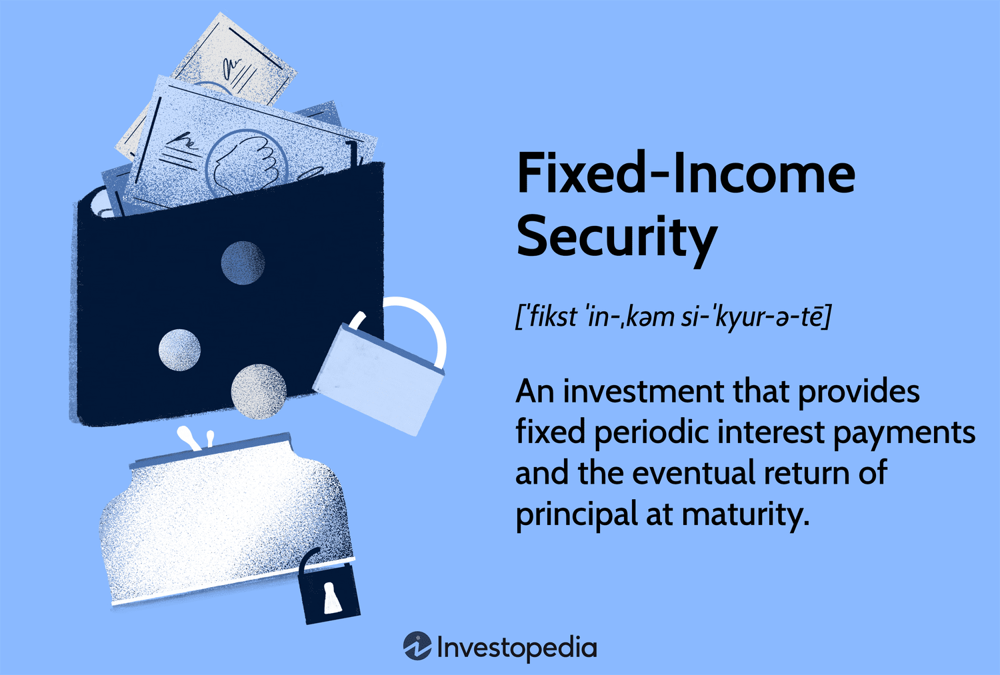

Understanding a range of financial instruments is essential in today's dynamic financial environment. Among these, amortizing securities are noteworthy, significantly impacting investment strategies and algorithmic trading. These securities are a type of investment where the borrower makes scheduled payments that cover both interest and a portion of the principal, gradually reducing the debt until it's fully paid. Unlike non-amortizing securities, where the principal is repaid in a lump sum at maturity, amortizing securities offer a predictable pattern of cash flows, which is beneficial for both risk management and financial planning.

Investors and trading algorithms favor amortizing securities for their unique ability to provide steady income streams while concurrently reducing exposure to credit risk over time. This characteristic makes them particularly attractive in applications like algorithmic trading, where consistent cash flows are essential for optimizing trading strategies and managing portfolio risks efficiently.



This article examines the fundamental characteristics of amortizing securities, their strategic relevance in algorithmic trading, and the implications for investors. The focus will be on understanding the mechanics of these instruments, leveraging their benefits, and navigating the inherent risks associated with them. By defining what amortizing securities are and exploring their role within the context of automated investment strategies, we aim to provide insight into how these instruments can be effectively deployed. By the end of this discussion, investors and financial analysts will gain a comprehensive understanding of how to integrate amortizing securities into algorithmic trading frameworks, potentially optimizing investment portfolios for better risk-adjusted returns.

## Table of Contents

## Understanding Amortizing Securities

Amortizing securities are a form of debt instrument that uniquely structure their payment schedules to include both interest and a reduction of the principal amount at regular intervals. This characteristic distinguishes them from non-amortizing options where the principal is repaid in a single lump sum at maturity. Among the most common examples of amortizing securities are mortgage-backed securities and certain bonds that stipulate periodic principal repayments.

The bundling of amortizing loans—such as home mortgages and auto loans—into securities is a prevalent financial practice. By converting these loans into securities, issuers can create investment products that generate a steady cash flow for investors while simultaneously providing a mechanism to distribute credit risk. The regular repayment of the principal portion diminishes the outstanding loan balance over time, which gradually reduces the credit risk for investors. This aspect is particularly appealing for risk-averse individuals who prioritize the security of their investment principal.

For instance, consider a home mortgage amortized over a set term, which can be mathematically represented using an amortization formula to determine the periodic payment amount:

$$

A = \frac{P \times r(1 + r)^n}{(1 + r)^n - 1} 
$$

where:
- $A$ represents the periodic payment amount.
- $P$ is the initial principal balance of the loan.
- $r$ denotes the periodic interest rate.
- $n$ is the total number of payments or periods.

This formula exemplifies how each payment contributes towards both the interest owed and a reduction of the loan principal, thereby steadily decreasing the principal over the repayment term. As the principal balance reduces, the portion of each subsequent payment allocated to interest decreases, which is a core feature of amortizing securities.

By packaging these loans into securities, financial institutions can offer investors a product that grants predictable repayment schedules and diminishes exposure to credit risk over the security's lifespan. As such, amortizing securities serve as a cornerstone for creating diversified investment portfolios that emphasize gradual risk reduction and stable income generation.

## Benefits and Risks of Investing in Amortizing Securities

Amortizing securities are favored by many investors for their ability to provide a predictable and steady cash flow. This characteristic appeals particularly to risk-averse investors seeking dependable income streams. The structure of these securities, which includes periodic principal repayments along with interest, ensures that investors receive a portion of their principal back over time. This setup reduces the outstanding principal balance gradually, which can lower credit risk and enhance the security's safety profile. 

Furthermore, amortizing securities often yield higher returns compared to traditional bonds. This elevated yield serves as compensation for the inherent prepayment risk. Prepayment risk arises when borrowers repay their loans earlier than expected, typically during periods of declining interest rates. When prepayment occurs, investors receive their principal back sooner but may face reinvestment risk. Reinvestment risk is a potential challenge as investors might need to reinvest the returned principal at lower interest rates, thereby diminishing their future income potential.

Investors must carefully balance these benefits against the associated risks. A key consideration is the investment horizon; amortizing securities can be more attractive for those with a shorter to intermediate-term investment outlook, as they provide ongoing principal repayment. However, for those with longer-term investment goals, the possibility of having to reinvest returned principal at lower rates may require a more strategic approach.

Risk tolerance is another crucial [factor](/wiki/factor-investing). Investors with a lower risk tolerance may appreciate the credit risk reduction that comes with the declining principal balance. Conversely, those willing to accept higher risk might look for opportunities to exploit prepayment patterns or [interest rate](/wiki/interest-rate-trading-strategies) movements. 

Ultimately, the decision to invest in amortizing securities should align with the investor’s broader portfolio strategy, taking into account their risk appetite and investment timeframe. By understanding the trade-offs, investors can better position themselves to maximize the potential benefits while managing the inherent risks of these financial instruments.

## Algorithmic Trading in the Context of Amortizing Securities

Algorithmic trading utilizes sophisticated statistical models and automated systems to execute trades rapidly and efficiently, capitalizing on fleeting market inefficiencies. Within this high-speed trading framework, incorporating amortizing securities presents unique challenges and opportunities. These securities, often characterized by their regular principal repayments and prepayment risk, necessitate tailored algorithmic strategies to effectively manage these distinctive features.

One of the primary challenges in [algorithmic trading](/wiki/algorithmic-trading) with amortizing securities is handling prepayment risk. This risk arises when borrowers decide to repay their loans earlier than scheduled, impacting the cash flow and yield of these investments. To account for this uncertainty, algorithmic trading systems must incorporate advanced predictive models that can better estimate the likelihood of prepayments. Machine learning and other predictive analytics tools are particularly useful in refining these estimations, allowing traders to adjust their strategies dynamically in response to evolving market conditions.

Platforms that incorporate [machine learning](/wiki/machine-learning) can analyze vast datasets to identify patterns and trends related to borrower behavior and macroeconomic indicators. These insights can then be used to bolster the accuracy of prepayment models, enabling algorithms to anticipate changes and adapt trading strategies accordingly. By accurately modeling prepayment risk, traders can optimize the timing and pricing of trades involving amortizing securities, thus enhancing the potential for profit while managing risk exposure.

Furthermore, the integration of amortizing securities into algorithmic trading systems serves to diversify investment portfolios. The unique characteristics of these securities often mean they respond differently to market shifts compared to more traditional investments. This diversification can lead to improved risk-adjusted returns, as the securities' cash flow structure and amortization characteristics can offset risks associated with other portfolio elements.

For example, a Python-based algorithm could be employed to predict prepayment likelihood using machine learning techniques such as random forests or neural networks. Such an algorithm would analyze historical data sets, including interest rate movements, historical prepayment records, and economic indicators, to forecast future prepayment rates. Here is a simplified conceptual illustration of how a machine learning model might be developed in Python:

```python
from sklearn.ensemble import RandomForestRegressor
from sklearn.model_selection import train_test_split
from sklearn.metrics import mean_squared_error

# Sample dataset with features such as interest rates and previous prepayment rates
data = fetch_data()  # Replace with actual data fetching logic
features = data[['interest_rate', 'economic_indicator', 'historical_prepayment']]
target = data['future_prepayment']

# Split the data into training and testing sets
X_train, X_test, y_train, y_test = train_test_split(features, target, test_size=0.2, random_state=42)

# Initialize and train the model
model = RandomForestRegressor(n_estimators=100, random_state=42)
model.fit(X_train, y_train)

# Make predictions and evaluate the model
predictions = model.predict(X_test)
mse = mean_squared_error(y_test, predictions)
print(f"Mean Squared Error: {mse}")

# Further model optimization steps would follow here
```

In conclusion, the effective integration of amortizing securities into algorithmic trading requires the development of sophisticated models and strategies to manage their unique attributes, particularly prepayment risk. By employing advanced analytics and leveraging machine learning, traders can more effectively integrate these securities into diversified portfolios, potentially enhancing risk-adjusted returns and exploiting new market opportunities.

## Challenges and Opportunities in Algo Trading with Amortizing Securities

Algorithmic trading with amortizing securities presents a unique set of challenges and opportunities. The primary challenge lies in accurately predicting prepayments. Prepayment risk refers to the likelihood that a borrower will repay a loan ahead of schedule, affecting the cash flow and value of amortizing securities. This risk complicates the modeling and valuation of these instruments within an algorithmic trading framework.

One way to address this challenge is through advanced data analytics and machine learning techniques. Machine learning models can analyze extensive datasets to identify patterns and variables influencing prepayment behaviors, significantly improving the accuracy of predictions. For instance, incorporating variables such as interest rate fluctuations, economic indicators, and borrower credit profiles into predictive models can refine prepayment estimations.

Opportunities for profit arise from integrating enhanced prepayment modeling into trading strategies. By leveraging accurate prepayment forecasts, traders can optimize the timing and execution of trades to exploit price movements. These more precise models can lead to strategies that anticipate and capitalize on market conditions, increasing the probability of achieving favorable returns.

The rapid evolution of data processing and machine learning technologies offers new avenues to better exploit the characteristics of amortizing securities. Techniques such as natural language processing and sentiment analysis can also provide valuable insights by analyzing qualitative data sources, like news articles or market reports, which may indicate potential shifts in prepayment trends.

Python remains a popular tool for developing these models due to its rich ecosystem of libraries and frameworks. For example, packages like scikit-learn or TensorFlow can be used to build and fine-tune machine learning algorithms designed to predict prepayment risk with high accuracy.

```python
from sklearn.ensemble import RandomForestRegressor
from sklearn.model_selection import train_test_split

# Example dataset (hypothetical): features include interest rates, borrower credit scores, and economic indicators
X = dataset[['interest_rate', 'credit_score', 'economic_indicator']]
y = dataset['prepayment_risk']

# Splitting data into training and testing sets
X_train, X_test, y_train, y_test = train_test_split(X, y, test_size=0.2, random_state=42)

# Building a random forest regressor model to predict prepayment risk
model = RandomForestRegressor(n_estimators=100, random_state=42)
model.fit(X_train, y_train)

# Evaluate the model
score = model.score(X_test, y_test)
print(f"Model R^2 score: {score:.2f}")
```

This use of machine learning not only addresses the prepayment prediction challenge but also provides an opportunity for traders to diversify their strategies. By incorporating amortizing securities into broader algorithmic trading programs, traders can expand their investment portfolios, potentially improving risk-adjusted returns. The diversification benefits stem from the distinct risk-return profiles of these securities, which can reduce the overall [volatility](/wiki/volatility-trading-strategies) of a portfolio. As technology and analytical techniques continue to advance, the fusion of amortizing securities with algorithmic trading will undoubtedly yield even more innovative and profitable opportunities.

## Conclusion

Amortizing securities provide a distinctive avenue for investment, offering a structured repayment plan that reduces credit risk while generating regular cash flow. When these securities are incorporated into algorithmic trading, investors can leverage their potential by utilizing advanced data analytics and machine learning. The systematic nature of amortizing securities, with predictable cash flows, makes them suitable for algorithmic models that thrive on consistency and data patterns.

As technology evolves, the methodologies for integrating amortizing securities with algorithmic trading are continuously improving. The use of predictive analytics for prepayment modeling, for example, enhances the accuracy and profitability of trading strategies. Investors who understand the characteristics of these instruments—such as prepayment risk and its consequent reinvestment challenges—are better positioned to optimize risk-adjusted returns.

The future holds expanding opportunities for combining these two fields, driven by advances in data processing capabilities and increased access to financial data. Informed investors can strategically incorporate amortizing securities within algorithmic portfolios to achieve diversification, potentially yielding superior performance outcomes. By balancing the dynamics of risk and return, these investors can adeptly navigate the complexities of modern financial markets, enhancing portfolio efficiency and achieving investment objectives.

## References & Further Reading

[1]: ["Amortizing securities in practice: The cash flows and risks of mortgage-backed securities"](https://onlinelibrary.wiley.com/doi/abs/10.1002/9781118266649.ch8) by CFA Institute Research Foundation

[2]: ["Fixed-Income Securities: Tools for Today's Markets"](https://www.amazon.com/Fixed-Income-Securities-Markets-Finance/dp/1119835550) by Bruce Tuckman and Angel Serrat

[3]: ["Mortgage-Backed Securities: Products, Structuring, and Analytical Techniques"](https://www.amazon.com/Mortgage-Backed-Securities-Structuring-Analytical-Techniques/dp/1118004698) by Frank J. Fabozzi

[4]: ["Advances in Financial Machine Learning"](https://www.amazon.com/Advances-Financial-Machine-Learning-Marcos/dp/1119482089) by Marcos Lopez de Prado

[5]: ["Quantitative Financial Analytics: The Path to Investment Profits"](https://www.amazon.com/Quantitative-Financial-Analytics-Investment-Profits/dp/9813224258) by Edward E. Williams

[6]: ["Machine Learning for Algorithmic Trading: Predictive models to extract signals from market and alternative data for systematic trading strategies with Python"](https://github.com/stefan-jansen/machine-learning-for-trading) by Stefan Jansen