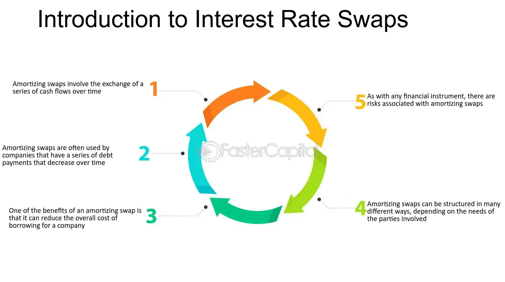

## Table of Contents

## What is an amortizing swap?

An amortizing swap is a type of financial agreement where the amount of money involved gets smaller over time. Imagine you have a loan that you pay back little by little each month. An amortizing swap works in a similar way, but instead of a loan, it's about swapping payments with someone else. One person might pay a fixed amount, while the other pays a changing amount based on something like interest rates. As time goes on, the total amount they swap gets smaller.

These swaps are often used by people or businesses that have loans or other debts that decrease over time. For example, if a company has a mortgage that they're paying off slowly, they might use an amortizing swap to manage the risk of interest rate changes. By using this kind of swap, they can make sure their payments stay more predictable even as their debt goes down. This can help them plan their finances better and avoid surprises.

## How does an amortizing swap differ from a standard swap?

An amortizing swap and a standard swap are both types of financial agreements where two parties exchange payments, but they differ in how the payment amounts change over time. In a standard swap, the amounts exchanged usually stay the same throughout the life of the swap. For example, one party might pay a fixed rate, and the other might pay a floating rate based on interest rates, but the total amount they swap stays constant.

In contrast, an amortizing swap has payments that decrease over time, similar to how a loan might be paid off gradually. This type of swap is designed to match the declining balance of a loan or other debt. So, if a company is paying off a mortgage, they might use an amortizing swap to manage their interest rate risk as the amount they owe gets smaller. This makes the swap more tailored to their specific financial situation, helping them manage their payments more predictably as their debt decreases.

## What are the main components of an amortizing swap?

An amortizing swap has a few key parts that make it work. First, there are the two parties involved in the swap. One party usually pays a fixed rate, while the other pays a floating rate that changes with market interest rates. The important thing is that the total amount they swap gets smaller over time, kind of like paying off a loan bit by bit.

The second main part is the schedule that shows how the swap amount decreases. This schedule matches the way the underlying debt, like a mortgage, is paid down. As the debt gets smaller, the amount swapped each period also gets smaller. This helps the parties manage their payments better because it fits with their changing financial situation.

## Who typically uses amortizing swaps and why?

Amortizing swaps are mostly used by businesses or people who have debts that get smaller over time, like mortgages or car loans. They help these borrowers manage the risk of changing interest rates. If someone has a loan with a floating interest rate, they might not know how much they'll have to pay each month. By using an amortizing swap, they can trade their floating rate payments for fixed rate payments, which makes their payments more predictable even as their loan amount goes down.

For example, a company with a big mortgage on its office building might use an amortizing swap to keep its payments steady. As the company pays off the mortgage little by little, the swap amount also goes down. This helps the company plan its budget better because it knows what to expect with its payments. It's like having a financial safety net that adjusts to their needs as they pay off their debt.

## How is the notional principal of an amortizing swap scheduled to decrease?

The notional principal of an amortizing swap is the amount of money that the swap is based on, and it gets smaller over time. This decrease follows a schedule that matches the way the underlying debt, like a mortgage, is paid off. For example, if a company is paying down a loan each month, the notional principal of their amortizing swap will also go down each month in the same way.

This schedule is set up at the start of the swap and can be based on different methods. Sometimes it's a straight line where the same amount is taken off each period. Other times, it might follow the actual payments of the loan, which might start off bigger and then get smaller. The important thing is that the notional principal decreases in a way that matches the borrower's needs, helping them manage their payments better as their debt goes down.

## What are the benefits of using an amortizing swap for managing interest rate risk?

An amortizing swap helps people and businesses manage interest rate risk by making their payments more predictable. When someone has a loan with a floating interest rate, their payments can change a lot if interest rates go up or down. By using an amortizing swap, they can switch from paying a floating rate to a fixed rate. This means they know exactly how much they'll pay each month, even as their loan amount gets smaller. This is really helpful for planning a budget because it takes away the surprise of changing payments.

Another benefit is that the swap amount goes down as the loan gets paid off. This matches how the loan works, so it's a good fit for people with debts that shrink over time, like mortgages or car loans. As the debt gets smaller, the swap amount also gets smaller, which makes the whole thing easier to handle. This way, the swap stays useful throughout the life of the loan, helping to keep payments steady and manageable no matter what happens with interest rates.

## Can you explain the cash flow mechanics of an amortizing swap?

In an amortizing swap, two parties agree to exchange payments over time, but the total amount they swap gets smaller as time goes on. One party usually pays a fixed rate, like a steady amount every month, while the other pays a floating rate that changes with interest rates. The key thing is that the amount of money they swap, called the notional principal, goes down. This happens because it follows a schedule that matches the way a loan, like a mortgage, is paid off. So, if someone is paying down their loan each month, the swap amount also gets smaller each month.

The cash flow works like this: at each payment date, the party paying the fixed rate sends a set amount of money to the other party. At the same time, the party paying the floating rate sends an amount based on the current interest rate. But, because it's an amortizing swap, both of these payments are based on a notional principal that's getting smaller. As the loan gets paid off, the notional principal shrinks, and so do the payments. This helps the person or business with the loan because it makes their payments more predictable and easier to manage, even as the loan amount goes down.

## What are the common amortization schedules used in amortizing swaps?

Amortizing swaps use different schedules to make the notional principal smaller over time. One common schedule is the straight-line method. In this method, the same amount is taken off the notional principal every period. For example, if the notional principal starts at $100,000 and the swap lasts for 10 years, you might take off $10,000 each year. This makes the swap amount go down in a steady way, which is easy to understand and plan for.

Another common schedule is the one that matches the actual payments of the loan. This method follows how the loan is paid off, which might start with bigger payments and then get smaller. If someone is paying off a mortgage, the early payments might be bigger because they include more interest, and as the loan gets smaller, the payments also get smaller. The notional principal of the swap goes down in the same way, making sure the swap stays a good fit for the loan. Both methods help people and businesses manage their payments better as their debt goes down.

## How do amortizing swaps help in matching cash flows with specific financial obligations?

Amortizing swaps help match cash flows with specific financial obligations by making sure the amount of money swapped gets smaller over time, just like a loan that's being paid off. If someone has a loan, like a mortgage, that they're paying down each month, they can use an amortizing swap to manage the interest rate risk. The swap follows the same schedule as the loan, so as the loan gets smaller, the swap amount also gets smaller. This means the payments stay in line with what the person or business owes, making it easier to plan and budget.

For example, a company with a big mortgage on its office building can use an amortizing swap to keep its payments steady. As the company pays off the mortgage little by little, the swap amount also goes down. This helps the company because it knows what to expect with its payments, even if interest rates change. By matching the cash flows of the swap to the loan, the company can manage its finances better and avoid surprises.

## What are the risks associated with entering into an amortizing swap?

When you enter into an amortizing swap, there are some risks you should know about. One big risk is called counterparty risk. This means that the other person or company you're swapping with might not be able to pay what they owe. If they run into money problems, you could be left without the payments you were counting on. Another risk is that the interest rates might not move the way you expect. If you're trying to protect yourself from rising rates but they actually fall, you might end up paying more than you would have without the swap.

Another risk is what's called basis risk. This happens if the floating rate in your swap doesn't match the rate on your loan perfectly. If there's a difference, the swap might not protect you as well as you hoped. Also, there's the risk that the terms of the swap might not match your loan perfectly. If the swap's schedule doesn't line up exactly with your loan payments, it might not help you manage your cash flows as well as you need. So, it's important to make sure the swap is set up to fit your specific financial situation.

## How do you price an amortizing swap and what factors influence its valuation?

Pricing an amortizing swap is a bit like figuring out how much something is worth when it gets smaller over time. You start by looking at the fixed rate and the floating rate that the two parties will swap. The fixed rate is usually set at the start, but the floating rate changes with market interest rates. To price the swap, you need to figure out the present value of all the future cash flows. This means you take each payment that will happen in the future and calculate what it's worth today, using the current interest rates. Since the notional principal of an amortizing swap gets smaller, you have to do this for each period, using the smaller notional principal each time.

Several factors can change the price of an amortizing swap. The most important one is the interest rates. If interest rates go up, the value of the swap to the person paying the fixed rate might go down, because they're locked into a lower rate. The opposite is true if rates go down. Another [factor](/wiki/factor-investing) is how the notional principal decreases. If it goes down faster or slower than expected, that can change the value of the swap. Also, the creditworthiness of the people involved matters. If one party looks riskier, the other might want a higher rate to make up for that risk. All these things together help decide what the swap is worth.

## Can you provide a real-world example of how an amortizing swap was used effectively?

A big company that owns a lot of shopping malls decided to use an amortizing swap to help manage their debt. They had a huge mortgage on their malls that they were paying off slowly over time. The interest rate on the mortgage was floating, which meant it could change and make their payments go up or down. They didn't want their payments to be a surprise, so they used an amortizing swap. This swap let them trade their floating rate payments for fixed rate payments. As they paid off their mortgage little by little, the amount they swapped also got smaller. This helped them plan their budget better because they knew what to expect with their payments, even as the amount they owed went down.

The swap worked out well for the company. They were able to keep their payments steady, even when interest rates went up. This made it easier for them to manage their money and keep their malls running smoothly. By matching the swap to their mortgage payments, they didn't have to worry about sudden changes in their costs. The amortizing swap gave them the stability they needed to focus on their business without the stress of unpredictable interest rates.

## What is an Interest Rate Swap?

Interest rate swaps are financial derivative contracts between two parties to exchange streams of interest payments, typically involving one party paying a fixed rate while the other pays a floating rate, based on a notional principal amount. These instruments facilitate the swapping of interest cash flows without the exchange of the underlying principal amount, catering to financial strategies aimed at risk management and cost efficiency.

The mechanics of an [interest rate](/wiki/interest-rate-trading-strategies) swap entail two primary payment streams: a fixed-rate flow and a floating-rate flow. The fixed payment is calculated by applying a predetermined interest rate to the notional principal. In contrast, the floating payment is determined by multiplying the notional principal by a reference interest rate, such as the London Interbank Offered Rate (LIBOR), which fluctuates over the contract's duration. The formula for calculating the interest payments can be expressed as follows:

- **Fixed Payment Calculation**:  
$$
  \text{Fixed Payment} = \text{Fixed Rate} \times \text{Notional Principal}

$$

- **Floating Payment Calculation**:  
$$
  \text{Floating Payment} = \text{Floating Rate Index (e.g., LIBOR)} \times \text{Notional Principal}

$$

These payments are exchanged at specified intervals, with the actual cash flow reflecting only the net difference between the fixed and floating payment amounts, reducing transaction costs and complexities.

Interest rate swaps are primarily utilized to manage interest rate risk and ensure cash flow stability. By engaging in these swaps, institutions can either hedge against interest rate [volatility](/wiki/volatility-trading-strategies) or speculate on future interest movements. For instance, an entity with a floating rate debt might enter into a swap to secure predictable payments by receiving a fixed rate while paying a floating rate, thereby hedging against potential hikes in interest rates. Conversely, if a firm anticipates a decline in interest rates, it might prefer a floating rate to capitalize on lower future payments.

Moreover, swaps can play a strategic role in aligning a company's financial liabilities with its revenue streams. This alignment provides enhanced predictability of net interest expenses, aiding in effective budgeting and financial planning. Companies also leverage swaps to [arbitrage](/wiki/arbitrage) differences between fixed and floating market interest rates, optimizing their debt portfolios for better financial performance.

Interest rate swaps, thus, serve as versatile tools in financial markets, enabling entities to effectively manage their exposure to interest rate fluctuations while contributing to stable cash flow management and strategic financial optimization.

## References & Further Reading

1. Hull, John C. *Options, Futures, and Other Derivatives*. Pearson, 2018. This comprehensive textbook provides a detailed examination of financial derivatives, including interest rate swaps, with a focus on valuation and risk management techniques.

2. Kolb, Robert W., and Overdahl, James A. *Financial Derivatives: Pricing and Risk Management*. Wiley, 2009. A resourceful book covering the fundamentals and advanced aspects of financial derivatives, giving special attention to swaps and their applications in risk mitigation.

3. Sundaram, Rangarajan K., and Das, Sanjiv R. *Derivatives: Principles and Practice*. McGraw-Hill Education, 2010. This book offers a practical approach to understanding derivatives, focusing on the principles and usage of interest rate swaps within corporate finance strategies.

4. Choudhry, Moorad. *The Money Markets Handbook: A Practitioner’s Guide*. Wiley, 2011. Choudhry provides insights into money markets and interest rate derivatives, including swaps, as critical components of financial market operations.

5. Stulz, René M. *Risk Management and Derivatives*. Thomson South-Western, 2003. Stulz investigates into risk management strategies using derivatives, with detailed sections on interest rate swaps and their role in hedging against financial uncertainties.

6. *Office of Financial Research Working Papers.* U.S. Department of the Treasury. https://www.financialresearch.gov/working-papers/. This collection contains extensive research papers on financial derivatives and offers regulatory insights into interest rate swaps.

7. *International Swaps and Derivatives Association (ISDA).* Access educational materials and industry standards concerning interest rate swaps and other derivatives at https://www.isda.org.

8. Nefcy, Scott, et al. “Integrating Interest Rate Swaps in Algorithmic Trading Models: A Case Study.” *Journal of Financial Economics and Algorithmic Trading*, vol. 12, no. 3, 2022, pp. 123-145. This journal article examines the application of interest rate swaps in algorithmic trading, providing valuable insights and empirical evidence.

9. Wilmott, Paul. *Paul Wilmott Introduces Quantitative Finance*. Wiley, 2007. A fundamental resource for understanding quantitative finance methods, including mathematical modeling of interest rate swap strategies.

10. Python Software Foundation. Python. Retrieved from https://www.python.org. For exploring algorithmic trading and financial modeling with interest rate swaps through coding, Python offers extensive libraries and frameworks.

