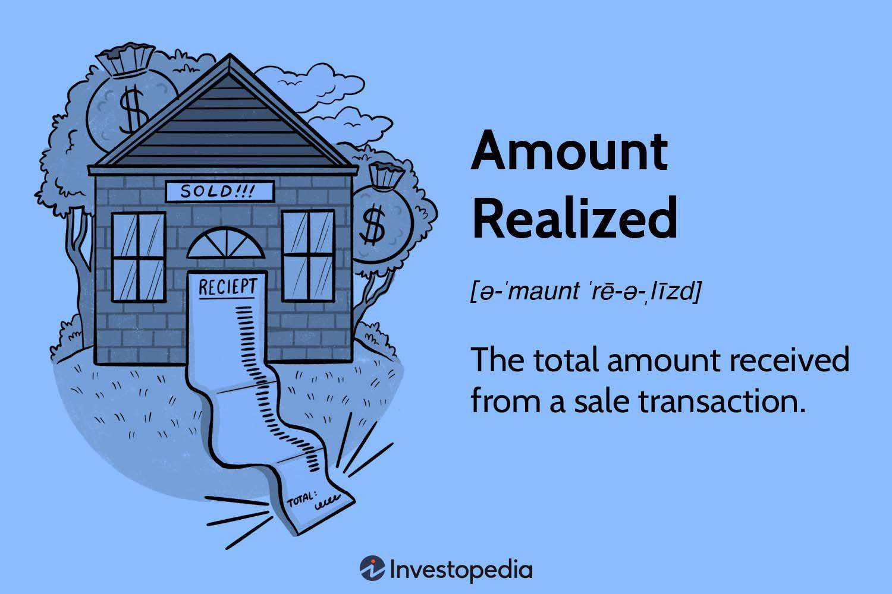

## Table of Contents

## What is the basic definition of 'Amount Realized' in finance?

Amount Realized is a term used in finance and taxation that refers to the total amount of money or value a person gets from selling an asset. This could be a house, stocks, or any other type of property. The amount realized is important because it helps determine if you made a profit or a loss on the sale. It includes not only the cash you receive but also the value of any other assets or payments you get as part of the deal.

For example, if you sell a piece of land for $100,000 and you also receive a car worth $20,000 as part of the sale, your amount realized would be $120,000. This total amount is used to calculate your capital gain or loss, which is the difference between the amount realized and the original cost of the asset. Understanding the amount realized is key for tax purposes because it affects how much tax you might owe on the sale.

## How is 'Amount Realized' calculated in a simple transaction?

In a simple transaction, calculating the 'Amount Realized' is straightforward. Imagine you're selling something you own, like a bike. If you sell your bike for $200, then the amount realized is just that $200. It's the total money you get from the sale.

Sometimes, the transaction might include more than just cash. For example, if you sell your bike for $200 but also get a helmet worth $50 as part of the deal, you add the value of the helmet to the cash. So, your amount realized would be $250 in total. This total amount helps you figure out if you made a profit or a loss on what you sold.

## Can you explain the difference between 'Amount Realized' and 'Cost Basis'?

'Amount Realized' and 'Cost Basis' are two important terms when you're dealing with selling things like stocks, houses, or any other assets. 'Amount Realized' is the total amount of money or value you get when you sell something. It includes not just the cash you receive but also the value of any other items or payments you get as part of the sale. For example, if you sell your car for $5,000 and also get a bike worth $500, your amount realized would be $5,500.

On the other hand, 'Cost Basis' is the original cost of the asset you're selling. It's what you paid for it in the first place, plus any additional costs you might have had, like fees or improvements. If you bought that car for $4,000 and spent another $1,000 on repairs, your cost basis would be $5,000. The difference between the amount realized and the cost basis helps you figure out if you made a profit or a loss on the sale. If your amount realized is more than your cost basis, you have a gain. If it's less, you have a loss.

## In what types of financial transactions is 'Amount Realized' relevant?

'Amount Realized' is important in many types of financial transactions where you sell something you own. This could be when you sell stocks, bonds, or even real estate like a house or land. Whenever you sell an asset, the amount realized is the total money or value you get from the sale. It's not just the cash you receive but also includes the value of any other things you get as part of the deal. For example, if you sell your house and get cash plus a car, the value of the car is added to the cash to find the amount realized.

This concept is especially important for figuring out taxes. When you sell something, the difference between the amount realized and what you originally paid for it (called the cost basis) helps you know if you made a profit or a loss. If you made a profit, you might have to pay taxes on it. The amount realized is used in tax calculations to see how much tax you owe. So, whether you're selling stocks, a piece of art, or a business, understanding the amount realized helps you manage your finances and taxes better.

## How does 'Amount Realized' affect the calculation of capital gains or losses?

When you sell something you own, like a stock or a house, the 'Amount Realized' is how much money or value you get from the sale. This includes not just the cash you receive but also the value of anything else you get as part of the deal. For example, if you sell your bike for $100 and also get a helmet worth $20, your amount realized is $120. This total amount is important because it helps you figure out if you made a profit or a loss on what you sold.

To calculate your capital gain or loss, you subtract the 'Cost Basis' from the 'Amount Realized'. The cost basis is what you originally paid for the item, plus any extra costs like fees or improvements. If your amount realized is more than your cost basis, you have a capital gain, which means you made a profit. For example, if you bought the bike for $80 and your amount realized is $120, your capital gain is $40. If your amount realized is less than your cost basis, you have a capital loss, meaning you lost money on the sale. Understanding the amount realized helps you know exactly how much you gained or lost, which is important for tax purposes.

## What are the tax implications of 'Amount Realized' for an individual investor?

When you sell something like stocks or a house, the 'Amount Realized' is how much money you get from the sale. This includes cash and the value of anything else you get. For an individual investor, this number is important because it helps figure out if you made money or lost money on what you sold. If the amount realized is more than what you originally paid (called the cost basis), you have a capital gain. This means you made a profit and might have to pay taxes on it. If the amount realized is less than the cost basis, you have a capital loss, and you might be able to use this to reduce your taxes.

The tax you owe on a capital gain depends on how long you owned the thing you sold. If you owned it for a year or less, it's a short-term capital gain, and you pay regular income tax on it. If you owned it for more than a year, it's a long-term capital gain, and the tax rate is usually lower. For example, if you bought some stock for $1,000 and sold it for $1,500 after a year, your amount realized is $1,500. Your capital gain is $500, and you'll pay long-term capital gains tax on that $500. Understanding the amount realized helps you know how much tax you might owe when you sell your investments.

## How do adjustments and expenses impact the 'Amount Realized' in real estate transactions?

When you sell a house, the 'Amount Realized' is the total money you get from the sale. But it's not just the price the buyer pays. You need to think about any adjustments and expenses too. For example, if the buyer gives you money back at closing for repairs they have to do, that money reduces your amount realized. Or if you have to pay for things like real estate agent fees or closing costs, those expenses also reduce the amount realized. So, the final amount realized is the sale price minus any money you have to give back to the buyer or pay for costs related to the sale.

Understanding how these adjustments and expenses work is important because they affect how much money you actually get to keep. If you sell your house for $300,000 but have to pay $18,000 in real estate agent fees and another $2,000 in closing costs, your amount realized would be $280,000. This number is used to figure out if you made a profit or a loss on the sale of your house. Knowing your amount realized helps you plan for taxes and see how much money you'll have after selling your home.

## What role does 'Amount Realized' play in corporate mergers and acquisitions?

In corporate mergers and acquisitions, 'Amount Realized' is important because it tells companies how much money or value they get when they sell a business or part of a business. It's not just the cash they receive but also includes the value of any other things they get, like stocks or other assets. For example, if Company A sells a division to Company B for $1 million in cash and also gets shares in Company B worth $200,000, the amount realized for Company A is $1.2 million. This total amount helps Company A figure out if they made a profit or a loss on the sale.

This number is also key for figuring out taxes. When a company sells something, the difference between the amount realized and what they originally paid (the cost basis) tells them if they made a profit. If the amount realized is more than the cost basis, they have a capital gain and might have to pay taxes on it. If it's less, they have a capital loss, which can help reduce their taxes. So, understanding the amount realized helps companies plan for taxes and see how much money they'll have after the sale in a merger or acquisition.

## How is 'Amount Realized' treated differently in different countries' tax systems?

The way 'Amount Realized' is treated in tax systems can be different from one country to another. In the United States, when you sell something, the amount realized is the total money or value you get from the sale. This includes not just the cash but also the value of any other things you get. The difference between the amount realized and what you originally paid (called the cost basis) helps you figure out if you made a profit or a loss. If you made a profit, you might have to pay taxes on it. In the U.S., this tax can be different depending on how long you owned the thing you sold.

In other countries, the rules can be different. For example, in Canada, the amount realized is also used to calculate capital gains or losses, but the tax rates and rules might be different from the U.S. In some countries, like the United Kingdom, the amount realized might be treated differently for different types of assets, like property or stocks. Each country has its own rules about what counts as part of the amount realized and how it affects your taxes. So, it's important to know the specific tax laws of the country you're in to understand how the amount realized will impact your taxes.

## Can you discuss any recent changes or proposed changes to the rules governing 'Amount Realized'?

Recent changes or proposed changes to the rules governing 'Amount Realized' can vary by country. In the United States, there have been discussions about how to treat [cryptocurrency](/wiki/cryptocurrency) transactions. The IRS has proposed rules that would clarify how to calculate the amount realized when you sell or trade cryptocurrencies. These rules aim to make it easier for people to know how much they owe in taxes when they deal with digital assets. The idea is to treat cryptocurrencies more like traditional assets, so the amount realized would include the value of any other cryptocurrencies or assets you get in a trade.

In other countries, changes might focus on different areas. For example, in the United Kingdom, there have been proposals to adjust the rules around the amount realized for property sales. These changes could affect how much people pay in taxes when they sell their homes or other real estate. The goal is to make the tax system fairer and simpler, so people know exactly how much they'll get to keep after selling their property. These changes show how important it is to keep up with the latest tax laws in your country to understand how the amount realized will impact your finances.

## How do complex financial instruments like options and futures affect the calculation of 'Amount Realized'?

When you deal with complex financial instruments like options and futures, figuring out the 'Amount Realized' can be a bit trickier than with simple assets like stocks or real estate. An option gives you the right to buy or sell something at a set price, and a future is a contract to buy or sell something at a set price in the future. When you close out these contracts, the amount realized is the money you get from closing them. For example, if you sell an option for $500, that's your amount realized. But if you get other things in the deal, like stocks or more options, you add their value to the cash to find the total amount realized.

These instruments can also involve different ways to close out the contracts, which can change how you calculate the amount realized. If you exercise an option, the amount realized might include the difference between the option's strike price and the market price of the underlying asset. For futures, if you close out your position before it expires, the amount realized is the profit or loss you make from that closing transaction. Understanding these details is important because the amount realized helps you figure out if you made a profit or a loss, which matters for taxes. So, even though options and futures are more complex, the basic idea of amount realized is the same: it's the total value you get when you close out your position.

## What advanced strategies can investors use to optimize their 'Amount Realized' in sophisticated investment scenarios?

Investors can use several strategies to optimize their 'Amount Realized' in sophisticated investment scenarios. One approach is to use tax-loss harvesting, where investors sell assets that have gone down in value to realize a loss, which can then be used to offset gains from other investments. This can help lower the overall tax bill by reducing the amount of capital gains. Another strategy is to carefully time the sale of assets to take advantage of lower tax rates. For example, holding onto an asset for more than a year can qualify the gain as long-term, which often comes with a lower tax rate than short-term gains.

Another effective strategy involves using options to manage the timing and amount of realized gains. For instance, investors can use put options to sell assets at a higher price than the current market value, thereby increasing the amount realized. Similarly, call options can be used to buy assets at a lower price, which can also affect the cost basis and ultimately the amount realized when the asset is sold. By strategically using these financial instruments, investors can better control when and how they realize gains, optimizing their overall financial outcomes.

## What is Understanding Amount Realized?

Amount realized represents the total amount received from a sale transaction, encompassing cash, the fair market value of any assets, and any liabilities assumed. This financial metric is pivotal in the domain of taxation since it is used to determine realized gains and losses, fundamental elements of financial strategy. 

In practice, the amount realized signifies a comprehensive measurement that incorporates all forms of remuneration received from a transaction. This measurement is more inclusive than realized income, offering a broader perspective of a transaction's financial outcome. For instance, when calculating the amount realized, one should consider not just cash payments but also any property or assets transferred as part of the sale, as well as any liabilities the buyer agrees to assume. This broader consideration ensures the calculation reflects the transaction's total economic impact.

Mathematically, the amount realized can be expressed as:

$$
\text{Amount Realized} = \text{Cash Received} + \text{Fair Market Value of Assets Received} + \text{Liabilities Assumed by Buyer}
$$

This calculation ensures that all components of compensation in a sales transaction are accounted for, presenting a holistic view of its financial implications. By providing a complete picture of the resources exchanged, the amount realized is integral for financial planning, particularly in tax assessments where precise calculations are essential to meet regulatory requirements and optimize financial outcomes.

## How is Amount Realized Calculated?

The calculation of the amount realized from a transaction is a critical process in financial analysis, as it provides a comprehensive view of the financial outcome. To determine the amount realized, one must sum up all forms of compensation received from the sale, including cash payments, any properties exchanged, and liabilities assumed by the buyer. This figure is pivotal in assessing taxable gains and contributes to a holistic accounting of the transaction's impact.

### Calculation Process
The formula to calculate the amount realized is:

$$
\text{Amount Realized} = \text{Cash Received} + \text{Fair Market Value of Property} + \text{Liabilities Assumed}
$$

This formula takes into account all elements of the compensation received, providing a complete picture of the transaction. For instance, in a situation where a seller receives cash and transfers a liability, such as a mortgage, to the buyer, the assumption of the mortgage by the buyer is added to the total amount realized.

### Example
Consider a scenario where an individual sells a property for $300,000, and the buyer assumes an existing mortgage of $100,000 on the property. The cash received from the sale is $300,000, and the assumed mortgage is $100,000. The amount realized in this transaction is calculated as follows:

$$
\text{Amount Realized} = 300,000 + 100,000 = 400,000
$$

In this example, the seller would consider $400,000 as the total amount received from the sale, which will later be used to determine any taxable gain or loss.

### Illustrative Example in Code
To automate this calculation, you can use the following Python code. This script calculates the amount realized based on the inputs for cash received, fair market value of exchanged property, and liabilities assumed.

```python
def calculate_amount_realized(cash_received, property_value, liabilities_assumed):
    return cash_received + property_value + liabilities_assumed

# Example usage
cash_received = 300000
property_value = 0  # Property hasn't an additional fair market value apart from assumed liability.
liabilities_assumed = 100000

amount_realized = calculate_amount_realized(cash_received, property_value, liabilities_assumed)
print(f"The amount realized from the transaction is: ${amount_realized}")
```

This basic script provides a useful tool for quickly determining the amount realized, facilitating the financial analysis of transactions and enabling traders and analysts to make informed decisions. Understanding these calculations is crucial for accurate financial assessments and strategic financial planning.

## What is the conclusion?

Understanding the amount realized is crucial for anyone involved in financial transactions or trading. This financial concept serves as a fundamental building block in determining the realized gains or losses from any transaction. By encompassing all forms of compensation, including cash, property, and liabilities assumed, the amount realized offers a comprehensive view of the financial outcome of a transaction. This has significant implications for traders and financial planners alike.

Incorporating the principles of amount realized into financial calculations is essential as they heavily influence trading strategies and outcomes. For instance, algorithmic traders who are adept at incorporating sophisticated financial metrics into their models are more likely to optimize their risk-return profiles. They achieve this by better understanding how various elements, such as market conditions and transaction specifics, affect the realized returns. This can be expressed mathematically as:

$$
\text{Amount Realized} = \text{Cash Received} + \text{Fair Market Value of Property} + \text{Liabilities Assumed}
$$

Incorporating an accurate computation of the amount realized within financial planning enhances informed decision-making. Traders and investors can thereby make strategic choices that are based on comprehensive financial data, aligning their actions with broader financial goals and market conditions. By mastering these calculations, individuals and firms are better equipped to manage their portfolios effectively, minimize risks, and optimize the financial performance. Ultimately, the concept of amount realized plays a strategic role in achieving sustainable and informed financial success.

## References & Further Reading

[1]: Bergstra, J., Bardenet, R., Bengio, Y., & Kégl, B. (2011). ["Algorithms for Hyper-Parameter Optimization."](https://dl.acm.org/doi/10.5555/2986459.2986743) Advances in Neural Information Processing Systems 24.

[2]: ["Advances in Financial Machine Learning"](https://www.amazon.com/Advances-Financial-Machine-Learning-Marcos/dp/1119482089) by Marcos Lopez de Prado

[3]: ["Evidence-Based Technical Analysis: Applying the Scientific Method and Statistical Inference to Trading Signals"](https://www.amazon.com/Evidence-Based-Technical-Analysis-Scientific-Statistical/dp/0470008741) by David Aronson

[4]: ["Machine Learning for Algorithmic Trading"](https://github.com/stefan-jansen/machine-learning-for-trading) by Stefan Jansen

[5]: ["Quantitative Trading: How to Build Your Own Algorithmic Trading Business"](https://www.amazon.com/Quantitative-Trading-Build-Algorithmic-Business/dp/1119800064) by Ernest P. Chan