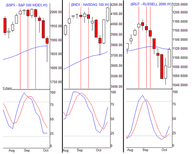

In the fast-paced world of financial markets, algorithmic trading is a crucial method for securing a competitive edge. Among the various techniques employed in this field, amplitude calculations are pivotal for predicting market behavior and optimizing trade execution strategies. This concept involves measuring the degree of change in market prices over time, providing essential insights into market volatility and price fluctuations, which, in turn, significantly impact trading outcomes.

Amplitude is central to mathematical models used in algorithmic trading that aim to forecast market movements. By understanding this measure, traders can develop algorithms that respond more accurately to market changes, enhancing predictive capabilities. Utilizing amplitude in trading algorithms is not just about monitoring price changes; it is about integrating these insights into trading strategies that outperform traditional methods.



This article will explore the complexities and advantages of using amplitude calculations in trading algorithms. By leveraging amplitude, traders and firms can interpret market signals more effectively, allowing for more informed decision-making and robust trading strategies. The implementation of amplitude data in trading offers a path to capitalize on changing market conditions, identify profitable entry and exit points, and adjust risk management practices accordingly.

Understanding amplitude can be transformative for traders, offering a strategic tool that enhances algorithm functionality and trading performance. Before examining the methodologies and benefits associated with amplitude, it is essential to clarify what amplitude means in the context of algorithmic trading and to understand its significance as a key driver of trading innovation and success.

## Table of Contents

## Understanding Amplitude in Trading Algorithms

Amplitude, in the context of financial markets, refers to the degree of change in market prices over a specified period. It is a crucial metric for evaluating volatility and price fluctuations, which can directly affect trading outcomes. This measurement enables traders to assess the strength and direction of market movements, thereby facilitating informed decision-making and strategic planning.

In algorithmic trading, amplitude forms a core component of many predictive models used to anticipate future market behavior. These models often exploit mathematical algorithms that rely on historical price data, among other variables. By quantifying amplitude, traders can construct algorithms that are more responsive to market shifts, enhancing their ability to predict market trends with greater accuracy.

The utility of amplitude in [algorithmic trading](/wiki/algorithmic-trading) is often enhanced by its integration with various technical indicators that do not explicitly measure the same parameters. For instance, while indicators like moving averages or the Relative Strength Index (RSI) provide insights into trends or [momentum](/wiki/momentum), amplitude provides direct measurements of price changes' magnitude. This distinction allows traders to use amplitude as an additional data point that complements other indicators, offering a broader view of market conditions.

A clear example of amplitude's application can be demonstrated through the calculation of the Average True Range (ATR), an indicator that looks at the degree of price [volatility](/wiki/volatility-trading-strategies) by examining the range of asset prices over a set period. The ATR can be considered a form of amplitude, representing the average price movement range, thereby helping traders anticipate potential breakouts or reversals.

To illustrate, consider a simple Python example for calculating the ATR:

```python
import pandas as pd

def calculate_atr(data, period=14):
    data['high-low'] = data['High'] - data['Low']
    data['high-prev_close'] = abs(data['High'] - data['Close'].shift(1))
    data['low-prev_close'] = abs(data['Low'] - data['Close'].shift(1))

    ranges = data[['high-low', 'high-prev_close', 'low-prev_close']].max(axis=1)
    atr = ranges.rolling(window=period).mean()

    return atr

# Example usage with a given dataset 'data'
data = pd.DataFrame({'High': [...], 'Low': [...], 'Close': [...]})
atr_values = calculate_atr(data)
```

This script computes the ATR using a rolling mean over a defined period, typically 14 days. The result is an array of ATR values to gauge price volatility.

Amplitude is preferred in sophisticated trading strategies for its direct focus on price change magnitude, allowing for more precise predictions of potential price movements. By incorporating amplitude into trading algorithms, traders can enhance their market responsiveness, ultimately driving superior predictive performance and profitability.

## Technical Approaches to Calculating Amplitude

There are several technical methods for calculating amplitude within algorithmic trading, each offering unique insights and benefits. Key approaches include Fourier analysis, time series analysis, and statistical methods, which help assess oscillation patterns in market data, ultimately enhancing algorithm precision and fulfilling specific trading objectives.

Fourier analysis is instrumental in decomposing complex market signals into simpler sinusoidal components. This technique transforms time-domain data into the frequency domain, enabling traders to identify dominant cycles and periodic behaviors in market prices. The Fourier Transform (FT) is expressed as:

$$
X(f) = \int_{-\infty}^{\infty} x(t) \cdot e^{-j2\pi ft} \, dt
$$

where $X(f)$ is the frequency-domain representation of the signal $x(t)$, and $f$ represents frequency. This mathematical transformation is particularly advantageous for identifying repetitive patterns and cyclical trends, which can be pivotal in forecasting future price movements. A disadvantage is its inefficiency in handling non-stationary data, leading to the development of techniques such as the Short-Time Fourier Transform (STFT) and Wavelet Transforms, which provide time-frequency analysis.

Time series analysis is another indispensable approach for understanding amplitude, focusing directly on data points indexed in time order. Techniques like Autoregressive Integrated Moving Average (ARIMA) and Generalized Autoregressive Conditional Heteroskedasticity (GARCH) models allow traders to model and forecast the volatility and price fluctuations. These models are adept at capturing temporal dependencies in market data and can adjust predictions based on new data points. However, they require assumptions about data stationarity and may encounter challenges with sudden market shifts.

Statistical methods for amplitude measurement often involve examining oscillation patterns through metrics like the standard deviation and variance, which infer the extent of deviation from the mean price level. Bollinger Bands, a prevalent tool in this category, use standard deviation to create a dynamic range around a simple moving average, serving as a visual and analytical risk assessment tool. The challenge with purely statistical methods is their limited capability to capture non-linear dynamics in trading data.

Consider implementing these calculations using the Python programming language for practical applications, leveraging libraries like NumPy for numerical computations and SciPy for more advanced signal processing. Below is a Python snippet illustrating how to compute the Fast Fourier Transform (FFT) using NumPy, a common method for analyzing market oscillations:

```python
import numpy as np

# Sample time series data (e.g., closing prices)
prices = np.array([10, 12, 11, 14, 13, 15, 14, 16])

# Perform Fast Fourier Transform
fft_vals = np.fft.fft(prices)

# Print the magnitude of the frequency components
amplitude = np.abs(fft_vals)
print(amplitude)
```

This code computes the FFT of a dataset representing market closing prices, providing the magnitude of frequency components—a measure of amplitude. By interpreting these results, traders can discern predominant frequencies and potential cyclical behaviors in price data.

In summary, each method—whether Fourier, time series, or statistical—provides distinct analytical strengths and limitations. By leveraging these techniques appropriately, traders can enhance their algorithm's responsiveness to market dynamics and improve predictive accuracy.

## Integrating Amplitude Calculations into Trading Strategies

Integrating amplitude calculations into trading strategies allows traders to harness market volatility for more precise and profitable trades. Amplitude, a measure of price change, plays a crucial role in identifying optimal entry and [exit](/wiki/exit-strategy) points, adjusting risk parameters, and optimizing trade execution.

Firstly, amplitude serves as an effective signal for entry and exit points in trades. By analyzing amplitude, traders can gauge the intensity of price movements and make informed decisions regarding when to enter or exit a position. This is especially useful in volatile markets where price movements can be rapid and significant. For instance, if a trader observes a high amplitude indicating substantial price volatility, they may decide to enter a trade when the amplitude suggests a potential reversal or continuation pattern.

The integration of amplitude into trading strategies requires algorithms that can process and respond to real-time data. Trading algorithms need to be designed to react promptly to changes in amplitude, ensuring they capture profitable opportunities as they arise. This real-time responsiveness is crucial for maintaining alignment with market dynamics and maximizing trading efficiency. For example, a Python-based algorithm might continuously monitor amplitude, adjusting buy or sell orders as thresholds are crossed. A simple example of integrating real-time amplitude calculations is as follows:

```python
def calculate_amplitude(prices):
    return max(prices) - min(prices)

class TradingAlgorithm:
    def __init__(self, threshold):
        self.threshold = threshold

    def execute_trades(self, market_data):
        amplitude = calculate_amplitude(market_data)
        if amplitude > self.threshold:
            self.enter_trade()
        elif amplitude < self.threshold:
            self.exit_trade()

    def enter_trade(self):
        print("Entering trade based on amplitude signal.")

    def exit_trade(self):
        print("Exiting trade based on amplitude signal.")

# Example usage
algorithm = TradingAlgorithm(threshold=5)
market_data = [100, 102, 105, 103, 99]
algorithm.execute_trades(market_data)
```

Real-world trading strategies leveraging amplitude data focus on achieving consistent profits. These strategies often include dynamic stop-loss orders that adjust according to amplitude changes to safeguard against unfavorable market conditions while capitalizing on profitable trends. For instance, in a highly volatile market segment, calculated amplitude can guide adjustments to stop-loss levels, ensuring that trades remain protected against sudden adverse price movements without being prematurely stopped out.

Several top trading firms have successfully integrated amplitude calculations into their algorithms, yielding strategic trading advantages. For instance, [quantitative trading](/wiki/quantitative-trading) firms often use amplitude as part of their statistical [arbitrage](/wiki/arbitrage) models to evaluate mispricings between related financial instruments. By incorporating amplitude measurements, these firms can better evaluate and exploit short-term pricing inefficiencies, ultimately enhancing their profitability.

In conclusion, integrating amplitude into trading strategies provides traders with a robust framework for optimizing trade execution and risk management. By leveraging amplitude data, traders can better navigate volatile markets, ensuring their strategies remain both adaptive and profitable.

## Benefits of Using Amplitude in Algo Trading

Amplitude plays a pivotal role in enhancing trading accuracy and efficiency within algorithmic trading. By incorporating amplitude calculations, traders can refine their strategies to better adapt to market conditions and optimize asset management.

Amplitude's influence on risk management and asset allocation is profound. By analyzing the degree of price fluctuations, traders can identify optimal entry and exit points, leading to more precise risk assessments. This improved risk management is critical for safeguarding investments and maximizing potential returns.

Amplitude data facilitates the development of dynamic and adaptive trading strategies. By allowing trading algorithms to react swiftly to price changes, amplitude gives traders a competitive edge. This flexibility is crucial in volatile markets, where rapid responses often dictate successful trading outcomes.

Back-testing is an integral part of trading strategy optimization. With amplitude calculations, traders can simulate various market scenarios to test the robustness of their strategies. This iterative process helps traders fine-tune their algorithms, increasing predictive accuracy and overall trading efficacy. For instance, using amplitude data as a feature in [machine learning](/wiki/machine-learning) models could enhance the model's capacity to predict market trends.

Several empirical studies highlight the benefits of amplitude in algorithmic trading. Research indicates that trading strategies incorporating amplitude calculations consistently outperform those that do not. These studies demonstrate that understanding and leveraging amplitude can significantly improve trading performance and resilience in diverse market conditions.

In summary, the integration of amplitude within algorithmic trading frameworks yields numerous advantages. From better risk management to enhanced strategy optimization, amplitude serves as a critical component for traders seeking improved trading outcomes.

## Challenges and Considerations

Despite their advantages, amplitude calculations in algorithmic trading present a set of challenges that must be carefully managed. One significant challenge is the complexity and computational demand associated with certain amplitude measurement techniques. Calculating amplitude often involves sophisticated mathematical approaches such as Fourier analysis or advanced time series analysis. These methods require significant computational power, considering the [volume](/wiki/volume-trading-strategy) and velocity of market data. This computational intensity can become a bottleneck, especially in high-frequency trading environments where latency must be minimized. Traders need to ensure that their systems are equipped with ample computational resources and optimized algorithms to handle these demands efficiently.

The integration of volume and price data adds another layer of complexity. Accurate amplitude measurements necessitate the incorporation of both price fluctuations and trading volume, as both factors are crucial for capturing market dynamics comprehensively. This integration requires high-quality data feeds and reliable data processing capabilities, posing challenges in terms of data acquisition, processing speed, and storage. Sophisticated software solutions are essential to handle this integration seamlessly, underscoring the need for robust IT infrastructure and advanced data management strategies.

Market anomalies and external economic factors represent additional hurdles that can influence the effectiveness of amplitude-based trading strategies. Financial markets are subject to sudden shifts due to geopolitical events, regulatory changes, or unexpected market news, which can cause deviations from typical amplitude patterns. These anomalies can disrupt predictive models, leading to erroneous trading signals. Therefore, traders must remain vigilant and dynamically adjust their algorithms to account for these variances. Incorporating machine learning techniques to recognize and adapt to such outliers may enhance the resilience and adaptability of amplitude-based strategies.

Practical solutions to these challenges include investing in high-performance computing solutions and leveraging cloud-based technologies for scalable processing capabilities. To address data integration hurdles, traders should utilize advanced data analytics platforms that offer real-time processing and can seamlessly blend diverse data sets. Meanwhile, to mitigate the impact of market anomalies, continuous monitoring and updating of algorithmic models are critical. Employing machine learning to refine models in response to new data and market conditions can also provide a competitive advantage, ensuring that amplitude calculations remain a potent element of algorithmic trading strategies. 

Overall, while there are notable challenges associated with applying amplitude calculations in algorithmic trading, strategic planning, and technology adoption can significantly mitigate these issues, providing traders with a powerful tool for navigating complex and rapidly changing financial markets.

## Conclusion

The calculation of amplitude in algorithmic trading is a powerful tool that, when used appropriately, can greatly influence trading success. By understanding and incorporating amplitude into trading algorithms, traders can better navigate the complexities of financial markets. This enhanced ability to interpret market signals enables traders to make more informed decisions, particularly concerning price fluctuations and volatility.

As trading environments continue to evolve, the role of amplitude in building adaptive and responsive trading strategies will become increasingly significant. Amplitude calculations enable algorithms to adjust in real-time, maintaining alignment with dynamic market conditions. This real-time adaptability is crucial for capitalizing on opportunities and mitigating risks swiftly as they arise in the market.

We encourage traders and firms to explore and experiment with amplitude calculations to uncover their full potential in trading optimization. By integrating amplitude into existing algorithms, traders can refine their strategies and enhance their predictive capabilities. Back-testing these strategies can provide valuable insights, helping traders to optimize their approach continuously.

In conclusion, amplitude is not just a metric but a critical driver of sophisticated and successful algorithmic trading. It provides a framework for developing strategies that are both robust and flexible, catering to the ever-changing landscape of financial markets. As traders harness the power of amplitude, they position themselves at the forefront of modern trading technology, poised to achieve sustained success.

## References & Further Reading

[1]: ["Advances in Financial Machine Learning"](https://www.amazon.com/Advances-Financial-Machine-Learning-Marcos/dp/1119482089) by Marcos Lopez de Prado

[2]: ["Evidence-Based Technical Analysis: Applying the Scientific Method and Statistical Inference to Trading Signals"](https://www.amazon.com/Evidence-Based-Technical-Analysis-Scientific-Statistical/dp/0470008741) by David Aronson

[3]: ["Machine Learning for Algorithmic Trading"](https://github.com/stefan-jansen/machine-learning-for-trading) by Stefan Jansen

[4]: ["Quantitative Trading: How to Build Your Own Algorithmic Trading Business"](https://www.amazon.com/Quantitative-Trading-Build-Algorithmic-Business/dp/1119800064) by Ernest P. Chan

[5]: Bollerslev, T. (1986). ["Generalized Autoregressive Conditional Heteroskedasticity"](https://www.sciencedirect.com/science/article/pii/0304407686900631). Journal of Econometrics, 31(3), 307-327.

[6]: Black, F. (1976). ["Studies of Stock Market Volatility Changes."](https://www.scirp.org/reference/ReferencesPapers?ReferenceID=1969803) Proceedings of the American Statistical Association, Business and Economics Statistics Section, 177-181.

[7]: Pardo, R. (2008). ["The Evaluation and Optimization of Trading Strategies"](https://onlinelibrary.wiley.com/doi/book/10.1002/9781119196969). Wiley Trading.

[8]: Cochrane, J. H. (2005). ["Asset Pricing"](https://www.johnhcochrane.com/research-all/asset-pricing) (Revised Edition). Princeton University Press.