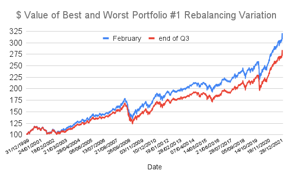

## Table of Contents

## What is rebalancing in the context of investment portfolios?

Rebalancing is when you adjust your investment portfolio to keep it in line with your original plan. Imagine you decided to put 60% of your money in stocks and 40% in bonds. Over time, if stocks do really well, you might end up with more than 60% in stocks. Rebalancing means selling some stocks and buying more bonds to get back to your 60-40 split.

It's important because it helps you stick to your investment strategy and manage risk. If you don't rebalance, your portfolio might become too risky or not grow as you expected. Rebalancing usually happens once or twice a year, but you can do it whenever you feel it's needed. It's like making sure your investment ship stays on course, even when the financial seas get choppy.

## Why is rebalancing important for maintaining a portfolio's risk and return profile?

Rebalancing is important because it helps keep your investments in line with how much risk you want to take and the returns you expect. When you start investing, you pick a mix of stocks, bonds, or other things based on your goals. Over time, some parts of your portfolio might grow faster than others. If stocks do really well, you might end up with more money in stocks than you planned. This can make your portfolio riskier than you want. By rebalancing, you sell some of what's grown a lot and buy more of what hasn't, getting back to your original plan.

Doing this keeps your portfolio balanced and helps you stick to your investment strategy. Without rebalancing, your portfolio might drift away from what you wanted, either becoming too safe or too risky. Rebalancing makes sure you're not taking more risk than you're comfortable with, and it can help you keep the returns you're aiming for. It's like checking your car's tires regularly to make sure they're all at the right pressure, so your ride stays smooth and safe.

## What are the common methods used for rebalancing a portfolio?

There are a few common ways to rebalance a portfolio. One way is the calendar method, where you set specific times during the year, like every six months or once a year, to check and adjust your investments. This method is easy because it follows a regular schedule, so you don't have to keep an eye on your portfolio all the time. Another way is the threshold method, where you rebalance whenever any part of your portfolio moves away from your target by a certain percentage, like 5% or 10%. This method can help you stay closer to your original plan, but it might mean you need to check your investments more often.

A third method is a mix of both calendar and threshold methods, where you check your portfolio at set times but only make changes if it's drifted too far from your target. This can be a good middle ground, giving you the benefits of a regular schedule and the flexibility to adjust when needed. No matter which method you choose, the goal is the same: to keep your investments in line with your plan and manage your risk and return.

## How does rebalancing performance dispersion affect portfolio outcomes?

Rebalancing performance [dispersion](/wiki/dispersion-trading) means how much the different parts of your portfolio are growing at different speeds. When some parts of your portfolio do much better than others, it can make your investments unbalanced. If you don't rebalance, you might end up with too much money in the parts that grew a lot, which can be riskier than you want. By rebalancing, you sell some of what did well and buy more of what didn't, keeping your portfolio closer to your original plan. This helps manage risk and can lead to better long-term results because you're not letting one part take over your whole investment strategy.

Rebalancing also helps you take advantage of buying low and selling high. When you rebalance, you're selling parts of your portfolio that have gone up a lot and buying more of the parts that haven't grown as much. Over time, this can smooth out your returns and help your portfolio grow more steadily. It's like making sure all the tires on your car are equally inflated so you have a smoother ride. By keeping your investments balanced, you're more likely to reach your financial goals without taking on too much risk.

## What factors contribute to the dispersion in rebalancing performance?

Dispersion in rebalancing performance can happen because different parts of your portfolio grow at different speeds. For example, if you have stocks and bonds, stocks might go up a lot while bonds stay the same. This can make your portfolio unbalanced. Things like how the economy is doing, what's happening in the stock market, or even big news events can make some investments do better than others. Also, if you have different types of stocks, like tech stocks and utility stocks, they might not grow at the same rate because they are affected by different things.

Another reason for dispersion is how often you rebalance. If you wait a long time between rebalancing, the differences in how your investments are growing can get bigger. On the other hand, if you rebalance more often, you can keep those differences smaller. The rules you set for rebalancing, like deciding to do it every six months or only when your portfolio drifts too far from your plan, can also affect how much dispersion you see. By understanding these factors, you can make better choices about when and how to rebalance your portfolio to keep it in line with your goals.

## Can you explain the concept of performance dispersion in rebalancing?

Performance dispersion in rebalancing means that the different parts of your investment portfolio grow at different speeds. When you have a mix of investments, like stocks and bonds, some might do really well while others don't grow as much. This can make your portfolio unbalanced. For example, if your stocks go up a lot but your bonds stay the same, you might end up with more money in stocks than you planned. This can be risky because if the stock market goes down, you could lose more money than you expected.

Rebalancing helps you deal with this performance dispersion. By selling some of the investments that have grown a lot and buying more of the ones that haven't, you can get your portfolio back to your original plan. This keeps your investments balanced and helps you manage risk. Over time, rebalancing can help you have smoother returns and reach your financial goals without taking on too much risk.

## What metrics are typically used to measure rebalancing performance?

When people want to see how well rebalancing works, they look at a few key things. One important metric is the portfolio's return, which shows how much money the investments have made over time. Another one is the risk, often measured by something called standard deviation, which tells you how much the returns go up and down. People also check the Sharpe Ratio, which compares the return of the portfolio to its risk, to see if the extra return is worth the extra risk.

Another way to measure rebalancing performance is by looking at how well it keeps the portfolio in line with the original plan. This is called tracking error, which measures how much the actual portfolio differs from the target. Lower tracking error means the rebalancing is doing a good job of keeping things balanced. Finally, turnover rate is also important, as it shows how often you're buying and selling investments. A high turnover rate can mean more costs and taxes, so it's good to keep this low while still getting the benefits of rebalancing.

## How do different rebalancing frequencies impact performance dispersion?

Different rebalancing frequencies can affect how much the parts of your portfolio grow at different speeds, which we call performance dispersion. If you rebalance often, like every month or quarter, you keep the differences between your investments small. This means your portfolio stays closer to your original plan, and you might not see big swings in how your investments are doing. It's like checking your car's tires often to make sure they're all at the right pressure, so your ride stays smooth.

On the other hand, if you rebalance less often, like once a year or even less, the differences between your investments can get bigger. This can lead to more performance dispersion because the parts of your portfolio that are doing well can grow a lot more than the others. While this might mean you miss out on some gains from the fast-growing parts, it can also make your portfolio riskier. It's like only checking your car's tires once a year; you might have a bumpier ride because the tires could be very unevenly worn.

## What are the potential benefits and drawbacks of different rebalancing strategies?

Different rebalancing strategies have their own benefits and drawbacks. The calendar method, where you rebalance at set times like every six months, is simple and easy to remember. It helps you stick to a regular schedule without having to watch your portfolio all the time. However, the downside is that if the market changes a lot between your rebalancing dates, your portfolio might get too far away from your plan. This means you could miss out on some gains or take on more risk than you want.

The threshold method, where you rebalance when your portfolio moves away from your target by a certain percentage, can keep your investments closer to your plan. It's good for managing risk because it reacts to big changes in the market. But, this method might mean you need to check your portfolio more often, which can be more work. Also, if you're rebalancing a lot, you might have to pay more in trading fees and taxes.

Using a mixed method, where you check your portfolio at set times but only rebalance if it's drifted too far, can be a good middle ground. It gives you the benefits of a regular schedule and the flexibility to adjust when needed. The challenge with this approach is finding the right balance between how often you check and how much you let your portfolio drift. If you don't get it right, you might still end up with more risk or miss out on some returns.

## How can historical data be used to analyze rebalancing performance dispersion?

Historical data can be a big help in looking at how rebalancing affects performance dispersion. By looking at past numbers, you can see how different parts of your portfolio grew over time. For example, you might find that stocks grew a lot more than bonds in some years, which made your portfolio unbalanced. By studying this data, you can see if rebalancing at different times or using different rules would have kept your portfolio closer to your plan. This can help you figure out the best way to rebalance in the future.

Using historical data also lets you test different rebalancing strategies without real money. You can pretend you rebalanced every month, every six months, or only when your portfolio got too far off track. Then, you can compare how each strategy worked over the years. This kind of "backtesting" can show you which method might work best for keeping your investments balanced and managing risk. It's like practicing a sport; the more you practice with past data, the better you get at making smart choices with your real investments.

## What advanced statistical methods can be applied to study rebalancing performance dispersion?

Advanced statistical methods can help you understand how rebalancing affects the different parts of your portfolio. One way is by using something called Monte Carlo simulations. This method lets you pretend to rebalance your portfolio many times over with different market conditions. By doing this, you can see how rebalancing might work in the future and how it could change the way your investments grow at different speeds. Another method is regression analysis, which helps you see how different parts of your portfolio are related to each other and to the market. This can show you if rebalancing at certain times or using certain rules makes a big difference in keeping your investments balanced.

You can also use something called time-series analysis to look at how rebalancing affects your portfolio over time. This method helps you see patterns and trends in your investments, so you can figure out if rebalancing often or less often makes your portfolio grow more evenly. Another useful tool is cluster analysis, which groups different parts of your portfolio based on how they grow. This can help you see if certain types of investments always grow at different speeds and how rebalancing can help balance them out. By using these advanced methods, you can get a clearer picture of how rebalancing can help manage the risk and growth of your investments.

## How does the choice of asset classes influence rebalancing performance dispersion?

The choice of asset classes in your portfolio can really change how much rebalancing you need to do. If you have a mix of things like stocks, bonds, and real estate, each one can grow at a different speed. For example, stocks might go up a lot during a good economy, while bonds might stay the same or even go down. This means your portfolio can get out of balance quickly. If you have a lot of different types of stocks, like tech stocks and utility stocks, they might not grow at the same rate because they are affected by different things. So, the more different your asset classes are, the more you might need to rebalance to keep your portfolio in line with your plan.

On the other hand, if you stick to similar asset classes, like just different kinds of bonds, the growth might be more even. This can mean less performance dispersion, so you might not need to rebalance as often. But, having a mix of different asset classes can help spread out your risk and might give you better returns over time. It's a balance between keeping things simple and trying to get the best growth for your money. By choosing the right mix of asset classes, you can manage how often you need to rebalance and keep your investments working towards your financial goals.

## What are the Data and Methodology used in the study?

The data examined in this study spans the period from 1999 to 2022 and was deployed to construct two distinct investment portfolios. This approach allows for a comprehensive assessment of different rebalancing frequencies and their corresponding impacts on portfolio performance. The chosen frequencies for rebalancing include daily, weekly, monthly, quarterly, and yearly intervals. These intervals are crucial for assessing how varying the frequency of rebalancing can influence the returns and risk profiles of the portfolios.

The initial step involves gathering historical data for the assets that will comprise the two portfolios. The selection of these assets is based on historical performance data available from reliable financial data sources. The data set includes various asset classes such as equities, fixed income, commodities, and alternative investments, allowing for diverse portfolio construction. Each asset is assigned an initial weight based on performance criteria as of the 31st December 1999, thereby serving as a baseline for subsequent modifications according to different rebalancing strategies.

An essential component of the analysis is the examination of correlations within and between the two designed portfolios. Correlation analysis provides insights into how the assets within each portfolio move in relation to one another and how these dynamics affect the rebalancing outcomes. The mathematical formula for calculating correlation (Pearson's correlation coefficient $r$) is given by:

$$
r_{xy} = \frac{\sum (x_i - \bar{x})(y_i - \bar{y})}{\sqrt{\sum (x_i - \bar{x})^2 \sum (y_i - \bar{y})^2}}
$$

where $x_i$ and $y_i$ are individual sample points of two distinct asset returns, and $\bar{x}$ and $\bar{y}$ are their respective means. By applying this formula, we can determine the level of correlation among portfolio assets and subsequently identify how this correlation impacts the effectiveness of various rebalancing strategies.

The application of these different rebalancing frequencies to both portfolios aims to provide a detailed understanding of how often adjustments are necessary to maintain the desired asset allocation. The varying frequency leads to distinct paths of portfolio evolution and performance, which are quantitively analyzed using statistical and computational methods.

Given the long time span of the data, [backtesting](/wiki/backtesting) methods are employed to simulate how each rebalancing strategy would have performed historically. These models are implemented using Python, enabling the handling of large datasets and complex calculations efficiently. The backtesting results furnish a clear perspective of the potential risks and returns associated with each rebalancing frequency, thus guiding investors in making informed decisions about the optimal rebalancing schedule.

## References & Further Reading

[1]: Arnott, R. D., & Lovell, R. (1993). ["Rebalancing: What Is the Expected Cost?"](https://www.semanticscholar.org/paper/Rebalancing%3A-Why-When-How-Often-Arnott-Lovell/c592615a05a9c706a6af713ff001c69cbc522b56) Financial Analysts Journal.

[2]: Ilmanen, A. (2011). ["Expected Returns: An Investor's Guide to Harvesting Market Rewards"](https://onlinelibrary.wiley.com/doi/pdf/10.1002/9781118467190.fmatter) by Antti Ilmanen.

[3]: Plaxco, L. M., & Arnott, R. D. (2002). ["Rebalancing a Global Policy Benchmark"](https://www.researchgate.net/publication/247906190_Rebalancing_a_Global_Policy_Benchmark) The Journal of Investing.

[4]: Perold, A., & Sharpe, W. (1988). ["Dynamic Strategies for Asset Allocation"](https://www.jstor.org/stable/4479087) The Journal of Portfolio Management.

[5]: Solnik, B. H. (1974). ["The International Pricing of Risk: An Empirical Investigation of the World Capital Market Structure"](https://ideas.repec.org/a/bla/jfinan/v29y1974i2p365-78.html) The Journal of Finance.

[6]: Kupiec, P. H. (1998). ["Stress Testing in a Value at Risk Framework"](https://www.cambridge.org/core/books/risk-management/stress-testing-in-a-value-at-risk-framework/17B89E2A7344626BF073E4F10D7C6FBB) The Journal of Derivatives.