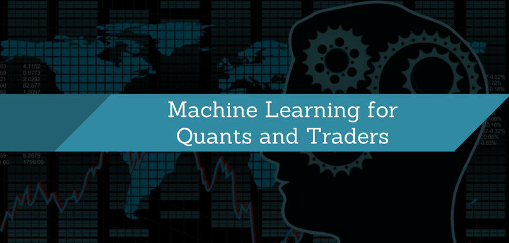

## Table of Contents

## What is machine learning and how does it apply to quantitative trading?

Machine learning is a type of artificial intelligence where computers learn from data to make decisions or predictions. It's like teaching a computer to recognize patterns or make choices by showing it lots of examples. For instance, if you want a computer to tell the difference between cats and dogs, you would show it many pictures of cats and dogs, and the computer would learn what features make a cat a cat and a dog a dog.

In quantitative trading, machine learning is used to analyze large amounts of financial data to find patterns that can help predict stock prices or market trends. Traders use these predictions to decide when to buy or sell stocks. For example, a machine learning model might look at past stock prices, news articles, and other data to predict if a stock's price will go up or down. This can help traders make better decisions and potentially earn more money.

## What are the basic types of machine learning models used in trading?

In trading, one common type of machine learning model is called supervised learning. This is when the model is trained using data that has known outcomes. For example, a trader might use past stock prices and other information to teach the model to predict future stock prices. The model learns from this data and then tries to make accurate predictions about new data it hasn't seen before. It's like learning from a teacher who gives you the right answers to study.

Another type is unsupervised learning, where the model tries to find patterns in data without being told what the outcomes should be. Traders might use this to group similar stocks together or find hidden trends in the market. It's like exploring a new place without a map and trying to figure out where things are on your own.

There's also [reinforcement learning](/wiki/reinforcement-learning), which is less common but still used in trading. This is when the model learns by trying different actions and getting feedback on how well it did. It's like learning to play a game by trying different moves and seeing which ones lead to winning. In trading, the model might try different strategies and learn which ones make the most money over time.

## How can machine learning improve trading strategies?

Machine learning can improve trading strategies by finding patterns in lots of data that humans might miss. For example, a [machine learning](/wiki/machine-learning) model can look at past stock prices, news articles, and other information to predict what might happen next. This can help traders make better decisions about when to buy or sell stocks. By using these predictions, traders can make more money and avoid losing money on bad trades.

Another way machine learning helps is by constantly learning and getting better over time. As the model sees more data, it can adjust its predictions to be more accurate. This means that the trading strategy can improve without the trader having to do a lot of work. It's like having a smart helper that gets better at its job the more it learns, making the trader's job easier and more successful.

## What data sources are commonly used in machine learning for quantitative trading?

In machine learning for [quantitative trading](/wiki/quantitative-trading), traders often use data from stock prices. This includes the opening price, closing price, highest price, and lowest price of a stock each day. They also look at trading [volume](/wiki/volume-trading-strategy), which is how many shares of the stock were bought and sold. This data helps the model understand how the stock has moved in the past and predict where it might go in the future.

Another common data source is financial news and reports. News articles, company earnings reports, and economic indicators like unemployment rates or inflation can all affect stock prices. By including this information, the machine learning model can better understand why stock prices change and make more accurate predictions. This helps traders make smarter decisions about buying and selling stocks.

Some traders also use [alternative data](/wiki/best-alternative-data) sources like social media sentiment, satellite imagery, or credit card transaction data. These can provide unique insights into what people are thinking and doing, which can influence stock prices. For example, positive tweets about a company might mean its stock price will go up. By using all these different types of data, machine learning models can give traders a more complete picture of the market and help them improve their trading strategies.

## What are the challenges of applying machine learning to financial markets?

One big challenge of using machine learning in financial markets is the quality and amount of data. Financial data can be messy and incomplete, which makes it hard for machine learning models to learn the right patterns. Also, the markets are always changing, so the data from the past might not be useful for predicting the future. This means the models need a lot of good data that's up-to-date, which can be hard to get.

Another challenge is that financial markets can be unpredictable. Things like unexpected news or global events can cause big changes in stock prices that are hard to predict. Machine learning models can struggle with these sudden changes because they rely on patterns from the past. So, even if a model works well for a while, it might not keep working if the market changes in a way it hasn't seen before.

Lastly, there's the risk of overfitting. This happens when a model learns too much from the data it's given and starts to see patterns that aren't really there. In trading, this can lead to bad decisions because the model might think it's found a sure way to make money, but it's actually just following random noise. Traders need to be careful to avoid this and make sure their models are really finding useful patterns in the data.

## How do you evaluate the performance of machine learning models in trading?

To evaluate the performance of machine learning models in trading, traders look at how well the model predicts stock prices or market trends. They use something called "[backtesting](/wiki/backtesting)," where they take the model and apply it to past data to see if it would have made good trading decisions. If the model's predictions match what actually happened in the past, it's a good sign that it might work well in the future. Traders also use measures like accuracy, which shows how often the model's predictions are correct, and profit, which shows how much money the model would have made if its predictions were used for trading.

Another important way to evaluate these models is by looking at how they handle risk. Traders use metrics like the Sharpe ratio, which compares the model's returns to the risk it takes. A high Sharpe ratio means the model is making good returns without taking too much risk. They also look at the drawdown, which is the biggest loss the model would have experienced. A smaller drawdown means the model is less likely to lose a lot of money at once. By considering both the model's ability to predict and its risk management, traders can get a full picture of how well the model might work in real trading situations.

## What are some advanced machine learning techniques used in quantitative trading?

One advanced machine learning technique used in quantitative trading is [deep learning](/wiki/deep-learning). Deep learning uses special kinds of models called neural networks, which are good at finding complex patterns in data. In trading, these models can look at lots of different types of data like stock prices, news articles, and even pictures or videos to make predictions. For example, a deep learning model might use a type of [neural network](/wiki/neural-network) called a [convolutional neural network](/wiki/convolutional-neural-network) (CNN) to analyze satellite images of parking lots to predict how well a retail company is doing based on how full the lots are. This can help traders make better decisions by giving them more information about what's happening in the market.

Another technique is ensemble learning, which combines the predictions of many different machine learning models to make better overall predictions. In trading, traders might use several models that look at different parts of the market, like stock prices, economic indicators, and social media sentiment. By combining the predictions from all these models, the final prediction can be more accurate and reliable. This can help traders make smarter trading decisions because they're not relying on just one model's guess, but on the combined wisdom of many models.

## How does reinforcement learning play a role in algorithmic trading?

Reinforcement learning is like learning by doing. In [algorithmic trading](/wiki/algorithmic-trading), it's used to teach a computer to make better trading decisions over time. The computer tries different trading strategies and gets feedback on how well it did. If the strategy makes money, the computer learns to use it more often. If it loses money, the computer learns to avoid it. This way, the computer can find the best ways to trade without someone telling it exactly what to do.

This method is helpful because the financial markets are always changing. What worked yesterday might not work today. With reinforcement learning, the computer can keep learning and adapting to these changes. It's like having a trader that never stops learning and getting better at its job. By using reinforcement learning, traders can create strategies that adjust to new market conditions and potentially make more money over time.

## What is the impact of machine learning on high-frequency trading?

Machine learning has made high-frequency trading faster and smarter. In high-frequency trading, computers buy and sell stocks very quickly, often in just a few seconds. Machine learning helps these computers make better decisions by looking at a lot of data really fast. For example, it can predict small changes in stock prices by looking at past data and other information. This means high-frequency traders can make more money because they can buy and sell stocks at the best times.

But using machine learning in high-frequency trading also has some challenges. The markets can change quickly, and what the computer learned might not work anymore. This means the machine learning models need to keep learning and adjusting to new information all the time. Also, because high-frequency trading is so fast, even small mistakes can lead to big losses. So, traders need to be careful and make sure their models are working well and not making bad trades.

## How can machine learning be used to manage risk in trading?

Machine learning helps manage risk in trading by looking at lots of data to predict what might happen in the market. It can find patterns that show when the market might be risky, like when stock prices might go down a lot. By using these predictions, traders can decide to sell their stocks before they lose too much money or avoid buying stocks that might be too risky. This helps them protect their money and make smarter decisions about what to do with their investments.

Another way machine learning helps with risk is by constantly learning and getting better over time. As it sees more data, the machine learning model can adjust its predictions to be more accurate. This means it can spot new risks that it didn't see before and help traders avoid them. By using machine learning, traders can keep their strategies up-to-date and reduce the chances of losing money due to unexpected market changes.

## What ethical considerations should be taken into account when using machine learning in trading?

When using machine learning in trading, it's important to think about fairness. Machine learning models learn from data, and if the data is biased, the model can make unfair decisions. For example, if a model is trained on data that doesn't include information from certain groups of people, it might not work well for everyone. This can lead to some traders getting an unfair advantage over others. It's important to make sure the data used is fair and includes information from all kinds of people and situations.

Another ethical issue is transparency. Machine learning models can be very complex, and it can be hard to understand how they make their decisions. In trading, it's important for traders to know why a model is telling them to buy or sell a stock. If the model's decisions are not clear, it can be hard to trust it. Traders and regulators need to make sure that machine learning models are transparent and that people can understand how they work. This helps keep the trading fair and honest for everyone involved.

## What are the current trends and future directions in machine learning research for quantitative trading?

One current trend in machine learning for quantitative trading is the use of more advanced deep learning models. These models, like neural networks, can look at lots of different types of data at once, including things like stock prices, news articles, and even satellite images. By using these models, traders can get a better understanding of what's happening in the market and make smarter trading decisions. Another trend is the use of ensemble learning, where many different models work together to make better predictions. This helps traders because they can combine the strengths of different models to get more accurate results.

Looking to the future, machine learning research in quantitative trading is likely to focus on making models that can adapt to changing markets even better. This means developing models that can learn from new data quickly and change their strategies to fit new conditions. Another direction is the use of reinforcement learning, where models learn by trying different actions and getting feedback. This can help traders create strategies that keep improving over time, making their trading more successful. Overall, the goal is to make machine learning models smarter, faster, and more reliable, so traders can make better decisions and manage their risks more effectively.

## What are the applications of machine learning in quantitative trading?

Machine learning (ML) techniques are profoundly impacting quantitative trading by offering tools for the analysis of extensive datasets and the identification of complex patterns, which are often elusive with traditional statistical methods. The dynamic nature of financial markets makes machine learning an invaluable asset to traders seeking to enhance prediction accuracy and strategic decision-making.

Supervised learning models are particularly useful in price prediction tasks. These models are trained on historical market data, enabling the prediction of future market movements based on patterns learned from past data. A classic example of a supervised learning algorithm is the linear regression model, which can be employed to estimate the relationship between a dependent variable, such as stock prices, and one or more independent variables, such as time or economic indicators. Other sophisticated models like support vector machines (SVM) and random forests are also utilized for their ability to predict with high precision by considering nonlinear relationships and complex interactions within data.

The formula for a simple linear regression model, which establishes a linear relationship between variables, is given by:

$$

Y = \beta_0 + \beta_1 X + \epsilon 
$$

where $Y$ represents the predicted value, $X$ is the independent variable, $\beta_0$ is the y-intercept, $\beta_1$ is the slope of the line, and $\epsilon$ is the error term.

Unsupervised learning, on the other hand, is instrumental in uncovering hidden structures within trading data, without requiring labeled outcomes. Through techniques such as clustering and dimensionality reduction, traders can gain insights into market behaviors and latent structures. For instance, clustering algorithms like k-means can group similar sets of data points together, aiding in the segmentation of stocks or identification of patterns over time that may inform strategic decisions.

By leveraging these machine learning methodologies, quantitative traders can enhance their decision-making frameworks, develop adaptive and responsive trading strategies, and ultimately, strive for improved performance metrics in the financial markets. The application of machine learning in this sector continues to expand, promising increasingly refined and efficient trading techniques.

## References & Further Reading

[1]: Bergstra, J., Bardenet, R., Bengio, Y., & Kégl, B. (2011). ["Algorithms for Hyper-Parameter Optimization."](https://papers.nips.cc/paper/4443-algorithms-for-hyper-parameter-optimization) Advances in Neural Information Processing Systems 24.

[2]: ["Advances in Financial Machine Learning"](https://www.amazon.com/Advances-Financial-Machine-Learning-Marcos/dp/1119482089) by Marcos Lopez de Prado

[3]: ["Evidence-Based Technical Analysis: Applying the Scientific Method and Statistical Inference to Trading Signals"](https://www.amazon.com/Evidence-Based-Technical-Analysis-Scientific-Statistical/dp/0470008741) by David Aronson

[4]: ["Machine Learning for Algorithmic Trading"](https://github.com/stefan-jansen/machine-learning-for-trading) by Stefan Jansen

[5]: ["Quantitative Trading: How to Build Your Own Algorithmic Trading Business"](https://books.google.com/books/about/Quantitative_Trading.html?id=j70yEAAAQBAJ) by Ernest P. Chan