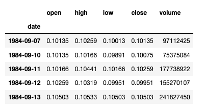

Algorithmic trading has markedly transformed financial markets by bringing automation to complex trading strategies, leveraging advanced computational algorithms. This approach has grown in popularity among financial professionals who seek to optimize trading efficiency and performance.

Among the myriad of data providers that support algorithmic trading, Stooq is a lesser-known yet valuable resource. Based in Poland, Stooq supplies a wide array of financial data that includes both historic and current market prices, encompassing securities, commodities, indices, forex, and cryptocurrencies. This data can play a crucial role in the design and execution of algorithmic trading strategies by providing the foundational information needed for market analysis and decision-making.



In this article, we will examine how traders and financial professionals can effectively employ Stooq data in algorithmic trading, focusing on the range of data it offers and how it stands against other data sources. We aim to offer a comprehensive guide, showcasing how to integrate Stooq data into trading strategies and enhance their effectiveness. By understanding how to utilize this data provider, traders can better tailor their strategies to match their specific needs and improve their market engagement.

## Table of Contents

## Overview of Stooq Data

Stooq is a financial data platform based in Poland that offers extensive data resources for various global financial instruments. It provides free access to OHLCV (Open, High, Low, Close, Volume) data, covering over 21,000 global securities, inclusive of ETFs, enabling detailed market analysis. The data is available from global stock exchanges, commodities markets, indices, [forex](/wiki/forex-system), and cryptocurrencies, catering to a wide range of financial analysis needs.

One of Stooq's main advantages is its provision of minute-level data, which is crucial for algorithmic trading strategies that require precise and granular data analysis. Such high-frequency data allows traders and analysts to perform detailed time series analysis and develop nuanced trading strategies that capitalize on short term market movements.

Despite not offering an official API, users can easily access Stooq data through straightforward download links. These links provide data in CSV format, making integration with analytical tools seamless and efficient. This compatibility is especially useful for users of Python's Pandas library, a popular tool for data manipulation and analysis. Handling CSV data with Pandas enables users to perform complex data operations, such as filtering, aggregation, and visualization, thereby supporting the preparation and application of sophisticated trading models.

The lack of an API may initially seem like a drawback; however, the simplicity of accessing data via download links can offset this limitation. Users can automate data retrieval processes by scripting the download of these CSV files, thereby creating a pseudo-API environment tailored to their specific data needs. In practice, users can write Python scripts to automate the download and processing of Stooq data efficiently.

For example, users can utilize the Python `requests` library to automate data downloads:

```python
import requests

url = 'https://stooq.com/q/d/l?'
params = {
    's': 'AAPL.US',  # Example: Apple stock
    'd1': '20220101',  # Start date
    'd2': '20221031',  # End date
    'i': 'd'  # Daily data
}
response = requests.get(url, params=params)

with open('AAPL.csv', 'wb') as file:
    file.write(response.content)
```

This script automates downloading data for Apple Inc. from Stooq in daily intervals, saving it as a CSV file. Such scripts, when scheduled regularly, can ensure the user has an updated data set without manual intervention.

In summary, Stooq is a valuable resource for algorithmic traders and data analysts, providing comprehensive financial data in an accessible format, suitable for integration with modern data analysis tools, and instrumental for a wide array of [quantitative trading](/wiki/quantitative-trading) strategies.

## Using Stooq in Python for Algorithmic Trading

Creating a robust data handling environment is essential for successful [algorithmic trading](/wiki/algorithmic-trading) applications. Python, with its versatile libraries, provides an ideal setup. This section outlines how to utilize Stooq data using Python, focusing on setting up the environment, downloading the data, and preparing it for time series analysis.

To begin, install the necessary Python libraries that facilitate data manipulation and retrieval. The primary libraries required include Jupyter Notebook for an interactive coding environment, Pandas for data manipulation, and Pandas-DataReader for retrieving financial data. Ensure you have Python installed on your machine, which can be done via the Python website or through package managers such as Anaconda.

```bash
pip install jupyter pandas pandas-datareader
```

**Downloading and Preparing Stooq Data in Python**

Once the environment is set up, you can start downloading Stooq data. Although Stooq does not offer an official API, data can be accessed directly through CSV download links. To retrieve this data using Python, construct the URL to directly access the desired financial data set from Stooq. For instance, to download historical price data for a specific stock, you can use links with a format resembling `https://stooq.com/q/d/l/?s={ticker}&i=d`, where `{ticker}` represents the stock ticker symbol.

Here's an example of how to download, process, and prepare Stooq data using Python:

```python
import pandas as pd

# Define the URL with the stock ticker
ticker = 'AAPL.US'
url = f'https://stooq.com/q/d/l/?s={ticker}&i=d'

# Download the data into a DataFrame
stooq_data = pd.read_csv(url)

# Preview the data
print(stooq_data.head())
```

**Processing Stooq Data for Time Series Analysis**

After downloading the data, it is crucial to process it into a format suitable for time series analysis. Ensure the date column is converted to a DateTime object and set it as the DataFrame's index:

```python
# Convert the Date column to datetime
stooq_data['Date'] = pd.to_datetime(stooq_data['Date'])

# Set the Date as index
stooq_data.set_index('Date', inplace=True)

# Sort the data by the index (Date)
stooq_data.sort_index(inplace=True)
```

**Accessing, Cleaning, and Visualizing Data**

With the processed data, implement data cleaning and visualization techniques to enhance analysis quality. Cleaning typically includes handling missing values, duplicate entries, and outlier detection. For visualization, leveraging Pandas and libraries like Matplotlib can facilitate a better understanding of data trends:

```python
import matplotlib.pyplot as plt

# Handle missing values, if any
stooq_data.fillna(method='ffill', inplace=True)

# Plotting the closing prices
plt.figure(figsize=(10, 5))
plt.plot(stooq_data.index, stooq_data['Close'])
plt.title('Closing Prices of AAPL')
plt.xlabel('Date')
plt.ylabel('Price')
plt.grid(True)
plt.show()
```

**Building a MultiIndexed DataFrame**

For more sophisticated analyses, such as combining different securities' data, a MultiIndexed DataFrame can be advantageous. This structure allows simultaneous operations on multiple datasets, fostering comprehensive insights.

```python
# Assume 'tickers' is a list of stock ticker symbols
tickers = ['AAPL.US', 'MSFT.US']
data_frames = []

for ticker in tickers:
    url = f'https://stooq.com/q/d/l/?s={ticker}&i=d'
    df = pd.read_csv(url)
    df['Ticker'] = ticker
    df['Date'] = pd.to_datetime(df['Date'])
    df.set_index(['Date', 'Ticker'], inplace=True)
    data_frames.append(df)

# Combine all DataFrames
combined_data = pd.concat(data_frames)

print(combined_data)
```

By following these steps, you can effectively set up a Python environment and harness Stooq data for algorithmic trading. Exploiting this data's potential allows for analyzing historical trends, which is pivotal in crafting effective trading strategies.

## Creating Trading Strategies with Stooq Data

Algorithmic trading strategies can significantly benefit from the historical and real-time financial data provided by Stooq. Here, we explore three popular trading strategies: [momentum](/wiki/momentum) trading, mean reversion, and [arbitrage](/wiki/arbitrage). Utilizing Stooq's comprehensive dataset, which includes OHLCV data, algorithmic traders can refine these strategies and improve their performance prior to real-world deployment.

### Momentum Trading

Momentum trading involves buying securities that have performed well in the past and selling those that have performed poorly, based on the belief that these trends will continue. To implement a momentum strategy using Stooq data, traders can calculate the moving average of a security’s past prices and develop signals to buy or sell.

#### Example:
Calculate a simple moving average (SMA) for a 50-day period and a 200-day period using Python and Pandas. Generate buy and sell signals based on crossovers between these SMAs.

```python
import pandas as pd

# Load Stooq data
data = pd.read_csv('stooq_data.csv')
data['Date'] = pd.to_datetime(data['Date'])
data.set_index('Date', inplace=True)

# Calculate the short and long moving averages
data['SMA_50'] = data['Close'].rolling(window=50).mean()
data['SMA_200'] = data['Close'].rolling(window=200).mean()

# Generate signals
data['Signal'] = 0
data['Signal'][50:] = np.where(data['SMA_50'][50:] > data['SMA_200'][50:], 1, 0)
data['Positions'] = data['Signal'].diff()

```

This code snippet computes the 50-day and 200-day SMAs and flags buy/sell signals when the short-term SMA crosses above or below the long-term SMA.

### Mean Reversion

Mean reversion is based on the assumption that the price of a security will tend to return to its mean or average level over time. This strategy is effective when there are clear oscillations around a consistent mean.

#### Example:
Using Stooq data, calculate the z-score of the closing price to identify divergences from the mean.

```python
# Calculate rolling mean and standard deviation
data['Rolling Mean'] = data['Close'].rolling(window=20).mean()
data['Rolling Std'] = data['Close'].rolling(window=20).std()

# Calculate z-score
data['Z-score'] = (data['Close'] - data['Rolling Mean']) / data['Rolling Std']

# Identify buy/sell conditions
data['Buy Signal'] = (data['Z-score'] < -2).astype(int)
data['Sell Signal'] = (data['Z-score'] > 2).astype(int)
```

A z-score below -2 could suggest a buy signal, indicating the stock is undervalued, whereas a score above 2 could suggest a sell signal.

### Arbitrage

Arbitrage exploits price differentials of the same asset across different markets or related assets. Stooq can provide data necessary to identify and execute arbitrage opportunities.

#### Example:
Identify an arbitrage scenario using pairs trading, which involves exploiting the price divergence between two correlated financial instruments.

```python
# Assume you have two datasets for instruments A and B
data_A = pd.read_csv('stooq_data_A.csv', index_col='Date')
data_B = pd.read_csv('stooq_data_B.csv', index_col='Date')

# Calculate spread and z-score for pairs trading
spread = data_A['Close'] - data_B['Close']
z_score_spread = (spread - spread.mean()) / spread.std()

# Determine buy/sell signals based on the spread z-score
data['Buy_Spread'] = (z_score_spread < -2).astype(int)
data['Sell_Spread'] = (z_score_spread > 2).astype(int)
```

Pairs trading signals are generated when the spread significantly deviates from its mean, suggesting rebalancing trades.

### Backtesting and Performance Improvement

Backtesting these strategies using historical data from Stooq allows traders to evaluate their effectiveness over various market conditions. By leveraging past performance metrics such as Sharpe ratio, return on investment, and drawdown periods, traders can validate the robustness of their strategies before executing them live.

In conclusion, implementing trading strategies with Stooq data involves a systematic approach to data handling, calculation, and signal generation. The ability to backtest such strategies ensures that traders can refine their algorithms to optimize performance in a real-world trading environment.

## Limitations and Considerations

When utilizing Stooq data for algorithmic trading, several limitations and considerations need to be addressed to ensure effective use of the data. One of the primary challenges users encounter is the lack of an official API, which impedes seamless data integration and requires additional steps for data retrieval and management. Traders must manually download data files in CSV format, which can be time-consuming and prone to errors if not consistently managed. Implementing automated scripts using languages such as Python can mitigate this challenge by programmatically downloading and updating data sets.

Data quality and nomenclature issues also pose potential hurdles. Stooq's data may lack standardization, especially in adjusted data for dividends or splits, which can lead to inaccurate analyses if not properly handled. Adjusted historical data is crucial to reflect corporate actions accurately, and inconsistencies here can skew [backtesting](/wiki/backtesting) results and strategy assessments. To address these problems, traders can adopt best practices such as conducting regular data integrity checks, including verifying data against another reliable source, and employing data cleaning techniques to rectify discrepancies.

One effective approach is to utilize Python's Pandas library for data handling and preprocessing. By loading Stooq data into Pandas DataFrames, users can apply various data validation techniques. For example, checking for missing values, correcting inconsistent naming conventions, and handling stock splits by adjusting data accordingly. Here's a basic example of how one might handle data integrity in Python:

```python
import pandas as pd

# Load Stooq data into a DataFrame
data = pd.read_csv('stooq_data.csv')

# Check for missing values
missing_values = data.isnull().sum()
print("Missing values per column:")
print(missing_values)

# Handle stock splits by adjusting price data
def adjust_for_splits(df, split_ratio_column, price_columns):
    for column in price_columns:
        df[column] = df[column] / df[split_ratio_column]
    return df

adjusted_data = adjust_for_splits(data, 'Split Ratio', ['Open', 'High', 'Low', 'Close'])

# Verify data integrity by comparing against a secondary source
# Placeholder for verification code
```

By employing such data validation techniques, users can mitigate issues related to data quality and nomenclature, allowing for more reliable trading decisions. Another important consideration is documentation; keeping detailed records of data sources, and data handling procedures helps ensure traceability and repeatability in trading strategies, fostering trust in the models' outputs.

Lastly, while Stooq offers extensive global coverage and data types, limitations exist in intraday data granularity compared to proprietary data providers. If higher granularity is required, users may need to integrate Stooq data with other data sources to achieve a more comprehensive dataset. This hybrid approach can enhance data coverage while benefiting from Stooq's accessibility and cost-effectiveness.

## Comparison with Other Data Providers

Stooq, Yahoo Finance, AlphaVantage, and Tiingo are key players in providing financial data for algorithmic trading, each with distinct attributes regarding cost, accessibility, and data coverage.

**Cost and Accessibility**: Stooq stands out for offering free financial data, which makes it highly accessible to traders who have constraints on data procurement costs. In contrast, Yahoo Finance provides both free and premium data services, allowing users access to basic data sets at no cost while charging for more advanced features through Yahoo Finance Plus. AlphaVantage offers a tiered pricing model, beginning with a free plan that covers a limited number of daily requests, escalating to paid plans for increased data access needs. Tiingo operates similarly, by providing premium services beyond its base free offering, which includes institutional-grade data packages.

**Data Coverage**: Stooq offers comprehensive data coverage, including global securities, commodities, indices, forex, and cryptocurrencies, primarily in OHLCV (Open, High, Low, Close, Volume) formats. It includes an impressive array of over 21,000 global securities and ETFs. However, its lack of an official API might pose a challenge for users requiring seamless data retrieval. Yahoo Finance and AlphaVantage support robust equities data including historical and real-time pricing, but AlphaVantage extends additional support for forex and cryptocurrencies with a fully featured API. Tiingo, while strong on US securities, supplements its offering with forex and cryptocurrency data and provides a well-documented API for ease of integration.

**Scenarios Favoring Stooq**: Stooq is preferable for traders who require extensive historical data across various global markets without incurring costs. It is ideal for those who prioritize breadth over precision or specialized feeds that often require subscriptions. Traders focused on constructing comprehensive backtesting environments can benefit from Stooq's diverse range of accessible data without budget constraints.

**Alternative Preferences**: Traders requiring granular real-time data might find Yahoo Finance, AlphaVantage, or Tiingo better suited. These platforms offer features like advanced real-time APIs and higher quality adjustment for dividends and splits, which are critical for high-frequency trading algorithms and sophisticated portfolio analytics. AlphaVantage can be more attractive for developers needing extensive API support for custom application development.

**Data Integration Insights**: Integrating Stooq data with other sources involves harmonizing varying data formats and nomenclature. For comprehensive analysis, employing Python's Pandas library can facilitate data integration, allowing traders to align Stooq's OHLCV with other data sets like economic indicators from Yahoo Finance, or alternative asset data from AlphaVantage or Tiingo. Such integration ensures a holistic view of the market landscape, enhancing decision-making in strategy development and execution. A sample Python integration might involve fetching data via URLs from Stooq and merging it using Pandas with real-time updates from AlphaVantage, as demonstrated below:

```python
import pandas as pd

# Example function to fetch and merge data
def fetch_and_merge_data(stooq_url, av_url):
    stooq_data = pd.read_csv(stooq_url)
    av_data = pd.read_csv(av_url)
    combined_data = pd.merge(stooq_data, av_data, on='Date', suffixes=('_stooq', '_av'))
    return combined_data

stooq_url = "https://stooq_data_url.csv"
av_url = "https://alphavantage_data_url.csv"

combined_data = fetch_and_merge_data(stooq_url, av_url)
print(combined_data.head())
```

These dynamics highlight the versatility required in selecting a data provider based on specific trading needs, balancing between cost, data formatting, and the need for up-to-date, extensive market insights.

## Conclusion

In this article, we explored the use of Stooq data in algorithmic trading, emphasizing its potential as a valuable resource for traders seeking comprehensive financial data. Stooq's provision of OHLCV data across a broad range of global securities supports varied trading strategies, such as momentum and mean reversion. Despite the lack of an official API, the platform's downloadable CSV format facilitates integration with analytical tools like Python's Pandas, enabling efficient data handling and strategy development.

Choosing the appropriate data provider is crucial for aligning one's trading objectives with the available data's scope and quality. Stooq offers unique advantages due to its extensive coverage and accessibility, especially for those requiring detailed historical data without incurring high costs. However, it is essential to be mindful of the potential limitations such as data integrity and the need for additional handling steps due to the absence of a standardized API.

Traders are encouraged to further experiment with Stooq data to develop and refine robust trading strategies. Doing so can enhance their understanding and application of algorithmic trading, ensuring more informed decision-making processes.

Looking ahead, the landscape of data provision for algorithmic trading continues to evolve. Improvements in data accessibility, integration, and quality are anticipated as the demand for more sophisticated and comprehensive data sources grows. Future developments may also include enhancements in data delivery mechanisms, making it even more convenient for traders to access and utilize financial data effectively in real time. As these trends progress, traders equipped with the knowledge and tools to capitalize on such advancements will be better positioned to achieve success in this dynamic field.

## References & Further Reading

[1]: ["Advances in Financial Machine Learning"](https://www.amazon.com/Advances-Financial-Machine-Learning-Marcos/dp/1119482089) by Marcos Lopez de Prado

[2]: ["Evidence-Based Technical Analysis: Applying the Scientific Method and Statistical Inference to Trading Signals"](https://www.amazon.com/Evidence-Based-Technical-Analysis-Scientific-Statistical/dp/0470008741) by David Aronson

[3]: ["Machine Learning for Algorithmic Trading"](https://github.com/stefan-jansen/machine-learning-for-trading) by Stefan Jansen

[4]: ["Quantitative Trading: How to Build Your Own Algorithmic Trading Business"](https://books.google.com/books/about/Quantitative_Trading.html?id=j70yEAAAQBAJ) by Ernest P. Chan

[5]: ["Python for Finance Cookbook: Over 50 Recipes for Applying Modern Python Libraries to Financial Data Analysis"](https://books.google.com/books/about/Python_for_Finance_Cookbook.html?id=O0fODwAAQBAJ) by Eryk Lewinson