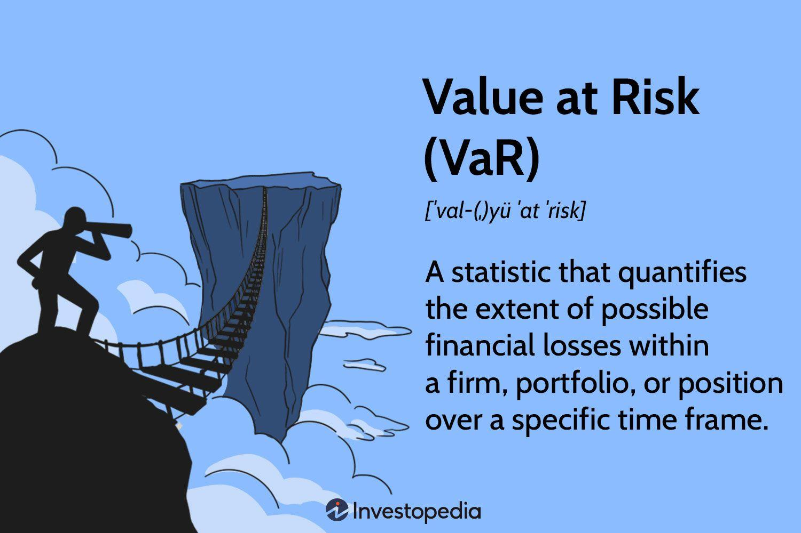

Value at Risk (VaR) represents a fundamental tool in risk management, particularly useful in evaluating potential losses within portfolio management systems. This is especially pertinent in algorithmic trading, where swift market movements require precise and robust risk assessment methodologies. VaR measures the maximum potential loss in the value of a financial portfolio, with a specific probability, over a designated period. Such quantifications are done under the assumption of normal market conditions. It is pivotal for traders and risk managers to possess a clear understanding of VaR to anticipate and mitigate risks effectively.

The complexity and dynamism of financial markets necessitate using VaR for different scenarios and periods. This article introduces the principal methodologies for calculating VaR, vital for constructing resilient quantitative trading strategies. Among these methods are historical simulation, parametric methods involving normal distribution and Generalized Autoregressive Conditional Heteroskedasticity (GARCH) models, and Monte Carlo simulations. Each approach offers a unique perspective on risk, catering to various market conditions and portfolio compositions.



Historical simulation relies on past price movements to forecast future risks, leveraging historical returns data to derive potential loss estimates. This method is lauded for its simplicity, requiring minimal assumptions about return distributions. Parametric methods, on the other hand, assume asset returns follow a specific distribution, typically the normal distribution, allowing for analytical precision through statistical measures like mean and standard deviation. Here, GARCH models introduce a layer of sophistication, modeling volatility that dynamically adjusts to market fluctuations. Lastly, Monte Carlo simulations employ random sampling techniques over specified distribution models, accommodating a broader range of scenarios, including non-linear dependencies and extreme events.

Understanding and implementing these Value at Risk methodologies equip traders and financial analysts with a robust framework for managing risks, essential for navigating the unpredictable waters of financial markets. These techniques form the bedrock of risk management strategies, ensuring sustainable portfolio performance even amid market uncertainties.

## Table of Contents

## What is Value at Risk?

Value at Risk (VaR) is a statistical measure used to assess the level of financial risk within a portfolio over a set time frame. VaR estimates the maximum potential loss in value of a portfolio with a given probability under normal market conditions. At its core, VaR measures two key parameters: the time horizon over which the risk is assessed and the confidence level at which the potential loss is presented. For example, a one-day VaR of $1 million at a 95% confidence level suggests that there is only a 5% chance that the portfolio will lose more than $1 million in a single day.

Mathematically, VaR can be expressed as:
$$
\text{VaR}_{\alpha}(X) = \inf \{x \in \mathbb{R} : P(X \leq x) \geq \alpha \}
$$
where $\alpha$ is the confidence level (e.g., 0.95 for 95%), and $X$ represents the return distribution of the portfolio.

One of the primary advantages of VaR is its simplicity and the intuitive understanding it provides regarding risk exposure. However, VaR also has notable limitations. It is inherently backward-looking, relying on historical data to estimate future risks, which can lead to inaccuracies should market conditions deviate significantly from past patterns. Additionally, VaR does not predict potential losses beyond the specified threshold, known as the VaR breach, which can be substantial in times of extreme market [volatility](/wiki/volatility-trading-strategies). This limitation can be represented by the Conditional Value at Risk (CVaR), which provides an average of losses beyond the VaR threshold, thus giving a more comprehensive risk assessment in such scenarios.

While VaR is a pivotal tool in risk management, its effectiveness largely depends on the chosen methodology and the underlying assumptions about market conditions. Understanding these limitations is crucial for portfolio managers to effectively use VaR in conjunction with other risk management tools to paint a more complete picture of potential financial exposures.

## Calculation Methods

Value at Risk (VaR) can be calculated using a variety of methods, each of which carries distinct assumptions and suitability for different situations. The primary approaches to VaR calculation include Historical Simulation, the Parametric Method, and Monte Carlo Simulation.

The **Historical Simulation** method bases its estimates on the premise that historical market behavior will persist into the future. This method involves analyzing historical returns to assess potential future losses. The simplicity of this approach is advantageous, as it does not require assumptions regarding the distribution of returns. Instead, it estimates VaR as a specific quantile of historical returns, commonly the 5th quantile, which represents a straightforward quantile-based approach to calculating potential loss within given confidence intervals. However, reliance on historical data means it might lag in its responsiveness, particularly during periods marked by high volatility.

The **Parametric Method**, also known as the Variance-Covariance method, assumes that asset returns follow a specific distribution, typically the normal distribution. It estimates VaR by utilizing parameters such as the mean and standard deviation of historical returns. Under this method, VaR can be calculated using the formula:

$$
\text{VaR}_{\alpha} = \mu + z_{\alpha} \times \sigma
$$

where $\mu$ represents the mean of the portfolio returns, $z_{\alpha}$ is the z-score corresponding to the desired confidence level $\alpha$, and $\sigma$ signifies the standard deviation. This approach offers precision and simplicity but relies heavily on the assumption of normality, which may not hold in all market conditions, as financial returns often exhibit heavier tails.

The **Monte Carlo Simulation Method** provides an alternative that can accommodate more complex distributions. This method involves generating a large number of random samples from a pre-defined distribution model to simulate possible future returns. Monte Carlo simulations allow for flexibility in assuming distributions beyond normal, thus potentially offering more realistic representations of market conditions. Despite being computationally intense, this method is highly robust, catering to non-linear relationships and capturing extreme market events through a comprehensive modeling approach. 

Each of these methods carries unique advantages and challenges, dictated by the nature of the financial portfolios being managed and the specific risk profiles they entail. The choice of method should be aligned with the characteristics of the trading strategy and the existing market conditions to provide the most accurate risk assessments.

## Historical Simulation

Historical simulation is a widely utilized method for calculating Value at Risk (VaR) by leveraging historical returns data to forecast potential future losses. This non-parametric approach eschews assumptions about the distribution of asset returns, making it accessible and straightforward for risk managers and analysts.

At its core, historical simulation operates on the premise that past market behavior can serve as a reliable indicator of future risk. It involves collecting historical return data for the portfolio or asset in question and then treating these returns as potential outcomes for the future. To calculate VaR using historical simulation, the returns are first sorted in ascending order. The VaR at a certain confidence level (e.g., 95% or 99%) is determined by finding the corresponding quantile in the sorted return series. For instance, the VaR at the 95th confidence level is the value below which 5% of the historical returns fall. Mathematically, if we denote the sorted returns as $R_1, R_2, \ldots, R_n$, the 5th-quantile VaR would be approximated as $R_{\lfloor 0.05n \rfloor}$.

One of the primary advantages of historical simulation is its simplicity. It does not require estimating parameters for a specific return distribution, such as the mean or standard deviation, which can reduce the computational burden and complexity typically associated with parametric methods. This advantage makes it particularly attractive for practitioners seeking an intuitive and straightforward approach to risk management.

However, the reliance on historical data also introduces certain limitations. Notably, historical simulation may fail to capture new market dynamics or changing volatility environments, especially during periods of financial stress or when market conditions deviate significantly from the historical norm. This can lead to an underestimation or overestimation of risk exposure if future market conditions differ substantially from those observed in the past.

Despite these limitations, historical simulation remains a compelling tool in the risk management toolkit, particularly for those who prioritize simplicity and transparency over computational complexity. Its effectiveness, however, depends on the relevance and integrity of the historical data used, making it crucial for practitioners to continually update and review their datasets to ensure their VaR estimates remain pertinent and robust.

## Parametric Method

The Parametric Method for calculating Value at Risk (VaR) assumes that asset returns adhere to a specific statistical distribution, most commonly the Normal (Gaussian) distribution. This method primarily relies on the key statistical parameters of the distribution, namely the mean ($\mu$) and the standard deviation ($\sigma$) of historical asset returns. 

To calculate VaR using this approach, the methodology follows these steps:

1. **Determine the Mean and Standard Deviation**: Calculate the mean ($\mu$) and standard deviation ($\sigma$) of the asset's historical returns. These give an indication of the central tendency and dispersion of the returns, respectively.

2. **Select the Confidence Level**: Choose a confidence level ($c$), commonly set at 95% or 99%, which reflects the probability that the loss will not exceed the VaR estimate.

3. **Compute the Inverse of the Normal Distribution**: Using the selected confidence level, determine the corresponding z-score from the standard normal distribution. This z-score represents the number of standard deviations the VaR point is away from the mean. The z-score ($Z$) can be obtained from statistical tables or calculated using software libraries in Python, for example:

   ```python
   import scipy.stats as stats
   confidence_level = 0.95
   z_score = stats.norm.ppf(1 - confidence_level)
   ```

4. **Calculate VaR**: The VaR at the chosen confidence level is then calculated using the formula:
$$
   \text{VaR} = \mu + Z \times \sigma

$$

   Here, $Z$ is negative due to the loss context in VaR calculations, meaning it scales down the mean by a number of standard deviations representing potential losses.

The primary advantage of the Parametric Method is its simplicity and the ease of computation due to the relatively straightforward calculations involved. However, the assumption that returns are normally distributed can be a significant limitation. Financial returns often exhibit skewness and kurtosis that deviate from the standard bell curve of a normal distribution, particularly during times of market stress or in the presence of heavy tails and extreme outlier events. Such deviations can lead to underestimation or overestimation of risk if the actual distribution of returns significantly diverges from normality. Consequently, while the Parametric Method is efficient and provides a quick estimate of VaR, its applications should be carefully considered against the backdrop of the underlying asset's return distribution characteristics and market conditions.

## Monte Carlo Simulation Method

Monte Carlo Simulation is a method utilized to estimate the Value at Risk (VaR) by generating a multitude of random scenarios of possible future market movements. This is accomplished through sampling from a predefined distribution, which can be tailored to reflect the specific characteristics of the financial market under scrutiny. 

### Process of Monte Carlo Simulation

1. **Modeling the Distribution**: The first step in applying the Monte Carlo Simulation method is to model the expected distribution of returns. Unlike the parametric method, which typically assumes a normal distribution, Monte Carlo simulation provides the flexibility to use alternative distributions that might be more suitable in capturing the peculiarities of market data, such as fat tails or skewness.

2. **Generating Random Samples**: Once a suitable distribution is selected, random samples of future asset price changes are generated. For example, if a trader assumes returns follow a normal distribution, they might use a mean and a standard deviation derived from historical data to produce random samples.

3. **Simulating Portfolio Values**: These generated random samples are then used to simulate the future values of the portfolio. This involves recalculating the portfolio value under each simulated scenario, which might consider thousands or even millions of possible outcomes.

4. **Calculating VaR**: The potential losses can be estimated by arranging these simulated portfolio values in ascending order and determining the loss at a specified confidence level. For instance, the 5% VaR would be the loss where 5% of the simulated values are worse (i.e., more negative).

### Advantages and Considerations

- **Flexibility in Model Selection**: Unlike other methods, Monte Carlo simulations can incorporate a variety of distribution models, making it capable of reflecting actual market dynamics more accurately. This is especially useful in markets characterized by extreme movements, where normal distribution assumptions fall short.

- **Non-linear Dependencies**: Monte Carlo Simulation excels in scenarios involving complex, non-linear dependencies between financial instruments. By simulating each component of the portfolio individually and then aggregating these to assess overall risk, this method can capture and account for intricate interactions within a portfolio.

- **Computational Intensity**: A notable drawback is the computational demand. Running thousands of simulations for large portfolios can be resource-intensive, requiring significant processing power and time, which might limit its execution in real-time trading environments.

### Implementation Example in Python

To illustrate the Monte Carlo Simulation process, consider the following Python snippet:

```python
import numpy as np

# Parameters
initial_price = 100  # initial asset price
mu = 0.05  # expected return
sigma = 0.2  # standard deviation
num_simulations = 10000
time_horizon = 1  # one-year horizon

# Generate random future price paths
returns = np.random.normal(mu, sigma, num_simulations)
future_prices = initial_price * np.exp(returns)

# Calculate VaR at 95% confidence level
VaR_95 = np.percentile(future_prices, 5)

print(f"VaR at 95% confidence level: {initial_price - VaR_95}")
```

This script generates a distribution of future prices based on normally-distributed returns, and calculates the 5% VaR by identifying the 5th percentile of the simulated price distribution.

Monte Carlo Simulation is a powerful tool in financial risk management, providing flexibility and robustness in estimating potential losses. Despite its computational demands, the insights it offers into market risk make it an invaluable method for [algorithmic trading](/wiki/algorithmic-trading) strategies.

## Comparative Analysis of Methods

Each method for calculating Value at Risk (VaR) offers distinct advantages and encounters specific challenges concerning its application, which vary based on the trading strategy and risk profile of the portfolio.

The Historical Simulation method is known for its straightforward approach, leveraging historical returns to directly estimate potential losses. Its reliance on past data allows for intuitive understanding and implementation without the need for complex assumptions about the distribution of returns. However, the main drawback of Historical Simulation is its lack of responsiveness, particularly during periods of high market volatility. Since it depends entirely on historical data, significant shifts in market conditions that are not reflected in the past data set can lead to inaccurate VaR estimations. This method is generally suited for stable market environments where historical data is indicative of future market behavior.

Parametric methods, which typically assume that asset returns follow a specific distribution such as the Normal distribution, offer precision in VaR calculation under normal market conditions. These methods utilize the mean and standard deviation of returns to estimate potential losses, allowing for a precise and analytically tractable formulation. However, the assumption of normality may not always hold, particularly in markets that exhibit skewness or excess kurtosis. To address volatility clustering and time-varying volatility that may not be well captured by simple parametric models, Generalized Autoregressive Conditional Heteroskedasticity (GARCH) models can be employed. GARCH models enhance parametric methods by providing a more dynamic estimate of volatility, better accommodating fluctuating market conditions.

Monte Carlo simulations represent a powerful alternative, providing a flexible framework that accommodates different types of return distributions beyond the normal. This method entails generating a large number of random scenarios to simulate future portfolio returns, capturing complex, non-linear relationships and extreme market events. While Monte Carlo simulations can offer a more realistic representation of potential market risks, their implementation is computationally intensive, requiring significant processing resources and time to generate accurate estimates.

Overall, the choice of VaR calculation method should be tailored to the specific characteristics and needs of the trading strategy and portfolio risk profile. Historical Simulation provides a practical approach for stable markets, while Parametric methods, particularly when integrated with GARCH for dynamic volatility modeling, are effective under typical market conditions. Monte Carlo simulations, though resource-intensive, are invaluable for scenarios demanding detailed risk modeling, offering resilience against market non-linearities and extreme events.

## Conclusion and Future Insights

The effectiveness of Value at Risk (VaR) as a risk management tool in algorithmic trading largely depends on choosing the appropriate methodology corresponding to the specific trading strategies and requirements of a portfolio. Each method for calculating VaR has its advantages and limitations. Historical Simulation provides simplicity but may not be responsive during high-volatility market periods. Parametric methods offer precision, particularly in stable market conditions, while the Monte Carlo Simulation allows for flexibility by accommodating different types of return distributions.

To address the limitations of VaR, it is beneficial to integrate advanced techniques such as Conditional Value at Risk (CVaR) and conditional drawdown analysis. CVaR, also known as Expected Shortfall, further examines the tail of the loss distribution by calculating the average loss beyond the VaR threshold, thereby providing a deeper insight into extreme market conditions. This makes CVaR a valuable enhancement to VaR, especially in capturing potential losses that VaR might underestimate.

Implementing VaR alongside a broad spectrum of risk management practices helps ensure a comprehensive approach to mitigate potential losses and optimize risk exposure. Integrating techniques such as stress testing, scenario analysis, and diversification strategies can complement VaR, providing a more robust risk management framework. This multi-faceted strategy not only protects against unfavorable market movements but also assists in identifying opportunities for optimizing returns relative to the associated risks.

As financial markets continue to evolve with increasing complexity, ongoing advancements in computational power and modeling techniques are expected to enhance the precision and applicability of VaR methodologies. Expanding into [machine learning](/wiki/machine-learning) and big data analytics could further revolutionize risk management by providing more dynamic and real-time risk assessment tools, ultimately leading to more resilient and adaptive trading strategies.

## References & Further Reading

[1]: Jorion, P. (2006). ["Value at Risk: The New Benchmark for Managing Financial Risk."](https://books.google.com/books/about/Value_at_Risk_3rd_Ed.html?id=nnblKhI7KP8C) McGraw Hill.

[2]: Mina, J., & Xiao, J. Y. (2001). ["Return to RiskMetrics: The Evolution of a Standard."](https://www.msci.com/documents/10199/dbb975aa-5dc2-4441-aa2d-ae34ab5f0945) RiskMetrics Group.

[3]: Dowd, K. (2002). ["Measuring Market Risk."](https://onlinelibrary.wiley.com/doi/book/10.1002/9781118673485) John Wiley & Sons.

[4]: Hull, J. C. (2018). ["Options, Futures, and Other Derivatives."](https://www.pearson.com/nl/en_NL/higher-education/subject-catalogue/finance/Options-Futures-and-Other-Derivatives-Hull.html) Pearson Education.

[5]: Glasserman, P. (2003). ["Monte Carlo Methods in Financial Engineering."](https://link.springer.com/book/10.1007/978-0-387-21617-1) Springer.

[6]: Alexander, C. (2008). ["Market Risk Analysis, Volume III: Pricing, Hedging and Trading Financial Instruments."](https://www.wiley.com/en-us/Market+Risk+Analysis%2C+Volume+III%2C+Pricing%2C+Hedging+and+Trading+Financial+Instruments-p-9780470997895) John Wiley & Sons.