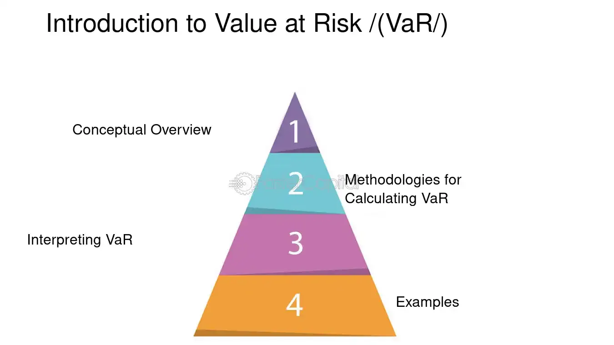

## Table of Contents

## What is Value at Risk (VaR) and why is it important in finance?

Value at Risk, or VaR, is a way to measure how much money you could lose on an investment over a certain period of time. It tells you the maximum amount you might lose, with a certain level of confidence, usually 95% or 99%. For example, if your VaR is $100,000 at a 95% confidence level over one day, it means that there's only a 5% chance you'll lose more than $100,000 in a single day.

VaR is important in finance because it helps people and companies understand and manage the risks of their investments. By knowing the potential losses, they can make better decisions about how much risk to take. It's like a safety net that helps prevent big surprises and losses. Many banks and financial institutions use VaR to set limits on how much risk they are willing to take, making the financial system more stable and secure.

## How does VaR help in assessing risk in financial portfolios?

VaR helps in assessing risk in financial portfolios by giving investors a clear idea of the worst-case scenario they might face. It tells them the maximum amount of money they could lose over a specific time period, like a day or a month, with a certain level of confidence. For example, if the VaR of a portfolio is $50,000 at a 95% confidence level over one day, it means there's only a 5% chance that the portfolio will lose more than $50,000 in a single day. This helps investors understand the potential downside and make informed decisions about their investments.

By using VaR, investors can compare the risks of different portfolios or investment strategies. If one portfolio has a higher VaR than another, it means it's riskier. This allows investors to balance their desire for higher returns with their tolerance for risk. For instance, someone who is more cautious might choose a portfolio with a lower VaR, even if it means lower potential returns. In this way, VaR acts as a tool for managing risk, helping investors to stay within their comfort zone and avoid unexpected large losses.

## What are the basic components needed to calculate VaR?

To calculate Value at Risk (VaR), you need three main pieces of information: the time period, the confidence level, and the data about the investment's past performance. The time period is how long you want to measure the risk for, like a day or a month. The confidence level is how sure you want to be about your VaR number, usually 95% or 99%. The data about the investment's past performance helps you understand how much the investment's value has changed in the past.

Once you have these pieces, you can use different methods to calculate VaR. One common method is the historical simulation method, where you look at how much the investment lost on its worst days in the past and use that to predict future losses. Another method is the variance-covariance method, which uses math formulas to estimate how much the investment might lose based on its average returns and how much those returns vary. No matter which method you use, the goal is to give you a number that tells you the most you might lose over your chosen time period, with your chosen level of confidence.

## Can you explain the three main methodologies used to calculate VaR?

There are three main ways to calculate Value at Risk (VaR): the historical simulation method, the variance-covariance method, and the Monte Carlo simulation method. The historical simulation method looks at how much an investment lost on its worst days in the past. If you want to know the VaR for the next day, you look at all the daily losses in the past and find the worst one that happens less than 5% of the time (for a 95% confidence level). This method is easy to understand because it uses real past data, but it assumes that the future will be a lot like the past.

The variance-covariance method uses math formulas to estimate how much an investment might lose. It looks at the average return of the investment and how much those returns vary, which is called the standard deviation. By using these numbers in a formula, you can calculate the VaR. This method is quick and easy to use, but it assumes that the returns follow a normal distribution, which might not always be true in real life. 

The Monte Carlo simulation method uses a computer to create many different possible future scenarios for the investment. It randomly changes the returns based on past data and calculates the losses for each scenario. After running thousands of these simulations, it picks out the worst losses that happen less than 5% of the time (for a 95% confidence level) to find the VaR. This method can handle complex investments and doesn't assume that returns follow a normal distribution, but it needs a lot of computer power and time.

## What is the variance-covariance method of VaR and how is it applied?

The variance-covariance method of calculating Value at Risk (VaR) uses math formulas to estimate how much money you might lose on an investment. It looks at two main things: the average return of the investment and how much those returns can change, which is called the standard deviation. By using these numbers in a formula, you can figure out the VaR. This method assumes that the returns of the investment follow a normal distribution, which means they are spread out in a bell-shaped curve. If the returns are normally distributed, you can use a standard formula to find the VaR at different confidence levels, like 95% or 99%.

To apply the variance-covariance method, you first need to gather data on the past returns of the investment. You calculate the average return and the standard deviation of those returns. Then, you choose your confidence level and time period. For example, if you want a 95% confidence level over one day, you use a standard value from the normal distribution table, which is about 1.65. You multiply this value by the standard deviation of the returns and then by the current value of the investment. The result is the VaR, telling you the most you might lose over that day, with 95% confidence. This method is quick and easy to use, but it works best when the returns really do follow a normal distribution, which isn't always the case in real life.

## How does the historical simulation method work in calculating VaR?

The historical simulation method for calculating Value at Risk (VaR) looks at how much an investment lost on its worst days in the past. If you want to know the VaR for the next day, you look at all the daily losses from the past and find the worst one that happens less than 5% of the time, if you're using a 95% confidence level. This method is easy to understand because it uses real past data. You don't need to use complicated math formulas; you just sort the past losses from biggest to smallest and pick the one at the 5% mark.

For example, if you have data on the daily returns of a stock for the last year, you would calculate the daily percentage changes in the stock's value. Then, you would sort these changes from the biggest loss to the smallest loss. If you want a 95% confidence level, you would find the loss that is worse than 95% of the other losses. This loss is your VaR for the next day. The historical simulation method assumes that the future will be a lot like the past, which can be a good way to estimate risk, but it might not work well if the future turns out to be very different from what happened before.

## What are the steps involved in the Monte Carlo simulation approach to VaR?

The Monte Carlo simulation approach to calculating Value at Risk (VaR) uses a computer to create many different possible future scenarios for an investment. It starts by looking at the past returns of the investment and using this data to randomly generate thousands of possible future returns. Each of these future scenarios is different, but they all follow the patterns seen in the past data. The computer calculates the losses for each scenario, taking into account how the investment might change over time. This method is useful because it can handle complex investments and doesn't assume that returns follow a normal distribution, which means it can be more accurate for real-world situations.

After running all these simulations, the computer sorts the results to find the worst losses. If you want a VaR at a 95% confidence level, you look for the loss that is worse than 95% of the other losses in the simulations. This loss is your VaR, telling you the most you might lose over your chosen time period, with 95% confidence. The Monte Carlo method needs a lot of computer power and time because it runs so many simulations, but it gives a detailed picture of the possible risks, helping investors understand the potential downside of their investments.

## What are the advantages and limitations of each VaR calculation method?

The historical simulation method for calculating VaR is easy to understand because it uses real past data. It doesn't need complicated math formulas; you just look at the biggest losses from the past and pick the one that happens less than 5% of the time if you want a 95% confidence level. This method is great for showing how an investment might behave based on what happened before. But, it has a big limitation: it assumes the future will be a lot like the past. If something new happens that changes how the investment works, this method might not predict the risk well.

The variance-covariance method uses math formulas to estimate how much you might lose. It's quick and easy because it looks at the average return of the investment and how much those returns can change, called the standard deviation. This method works well when the returns follow a normal distribution, which means they spread out in a bell-shaped curve. But the big problem is that real-life returns often don't follow a normal distribution. If the returns are not normal, this method might not give a good estimate of the risk.

The Monte Carlo simulation method uses a computer to create many different possible future scenarios for the investment. It's good at handling complex investments and doesn't assume the returns follow a normal distribution, which makes it more accurate for real-world situations. After running thousands of simulations, it picks out the worst losses to find the VaR. The main advantage is that it gives a detailed picture of the possible risks. But, it needs a lot of computer power and time, which can be a limitation. Also, if the model used to create the simulations is wrong, the VaR estimate might not be right.

## How can VaR be used for regulatory and risk management purposes?

VaR is very important for banks and big financial companies because it helps them follow the rules set by regulators. Regulators want to make sure that banks don't take too much risk with people's money. So, they use VaR to check if banks are keeping their risk within safe limits. For example, a bank might have to report its VaR to show that it's not taking too big of a chance on losing money. If the VaR is too high, the regulators might tell the bank to hold more money as a safety cushion or to change its investments to lower the risk.

VaR is also a key tool for managing risk within a company. It helps managers understand how much they could lose on their investments and make better decisions. For example, if a company's VaR shows that it might lose a lot of money, the managers might decide to sell some risky investments or buy safer ones. By knowing the potential losses, they can set limits on how much risk they are willing to take. This way, they can avoid big surprises and keep the company's money safe.

## What are some common criticisms and challenges associated with VaR?

One big criticism of VaR is that it can make people think they know more about risk than they really do. VaR gives a number that says, "You might lose this much money," but it doesn't tell the whole story. It doesn't say anything about how bad things could get if the losses are bigger than the VaR number. Some people call this the "tail risk," which is the risk of really big losses that happen very rarely. Also, VaR can be hard to understand because it depends on a lot of guesses about the future, like how the investment will behave. If those guesses are wrong, the VaR number might not be very useful.

Another challenge with VaR is that it can be tricky to calculate correctly. Different methods, like historical simulation, variance-covariance, and Monte Carlo simulation, can give different answers. Which method you use can change the VaR number a lot. Plus, VaR needs a lot of data about past returns, and if that data isn't good or if the future turns out to be different from the past, the VaR might not be right. Some people also worry that VaR can make companies take more risks than they should because they think the VaR number is a safe limit, but it's really just a guess.

## How can VaR be integrated with other risk measures like Expected Shortfall?

VaR can be integrated with other risk measures like Expected Shortfall to get a better picture of risk. Expected Shortfall, sometimes called Conditional VaR, looks at the average of all losses that are worse than the VaR number. So, while VaR tells you the most you might lose with a certain level of confidence, Expected Shortfall tells you how bad things could get if you do lose more than that. By using both measures together, you can see not just the worst-case scenario but also how bad things could get beyond that point. This helps people understand the risk better and make smarter decisions about their investments.

For example, if a portfolio's VaR at a 95% confidence level is $100,000, it means there's a 5% chance of losing more than $100,000 in a day. But Expected Shortfall might tell you that if you do lose more than $100,000, the average loss could be $150,000. Knowing both numbers helps you plan for the worst-case scenario and also for what could happen if things go even worse. By combining VaR with Expected Shortfall, investors and risk managers get a fuller understanding of the risks they face, which can lead to better risk management and more informed decision-making.

## What advanced techniques can be used to improve the accuracy of VaR calculations?

To make VaR calculations more accurate, you can use something called [backtesting](/wiki/backtesting). Backtesting means you check how well your VaR predictions did in the past. If your VaR says you'll lose no more than $100,000 on the worst 5% of days, you look back and see if that was true. If it wasn't, you can tweak your model to make it better. Another way to improve VaR is by using more data. The more past data you have, the better your VaR can predict the future. But you have to be careful because old data might not be as useful if the world has changed a lot since then.

Another advanced technique is stress testing. This means you imagine really bad situations that might happen, like a big stock market crash, and see how your investments would do. Stress testing can show you what could happen if things go much worse than your VaR predicts. Also, you can use something called scenario analysis, where you make up different stories about the future and see how your investments would do in each one. By combining these techniques, you can get a better idea of the risks you face and make your VaR calculations more reliable.

## What are Calculation Methods?

Value at Risk (VaR) can be calculated using a variety of methods, each of which carries distinct assumptions and suitability for different situations. The primary approaches to VaR calculation include Historical Simulation, the Parametric Method, and Monte Carlo Simulation.

The **Historical Simulation** method bases its estimates on the premise that historical market behavior will persist into the future. This method involves analyzing historical returns to assess potential future losses. The simplicity of this approach is advantageous, as it does not require assumptions regarding the distribution of returns. Instead, it estimates VaR as a specific quantile of historical returns, commonly the 5th quantile, which represents a straightforward quantile-based approach to calculating potential loss within given confidence intervals. However, reliance on historical data means it might lag in its responsiveness, particularly during periods marked by high [volatility](/wiki/volatility-trading-strategies).

The **Parametric Method**, also known as the Variance-Covariance method, assumes that asset returns follow a specific distribution, typically the normal distribution. It estimates VaR by utilizing parameters such as the mean and standard deviation of historical returns. Under this method, VaR can be calculated using the formula:

$$
\text{VaR}_{\alpha} = \mu + z_{\alpha} \times \sigma
$$

where $\mu$ represents the mean of the portfolio returns, $z_{\alpha}$ is the z-score corresponding to the desired confidence level $\alpha$, and $\sigma$ signifies the standard deviation. This approach offers precision and simplicity but relies heavily on the assumption of normality, which may not hold in all market conditions, as financial returns often exhibit heavier tails.

The **Monte Carlo Simulation Method** provides an alternative that can accommodate more complex distributions. This method involves generating a large number of random samples from a pre-defined distribution model to simulate possible future returns. Monte Carlo simulations allow for flexibility in assuming distributions beyond normal, thus potentially offering more realistic representations of market conditions. Despite being computationally intense, this method is highly robust, catering to non-linear relationships and capturing extreme market events through a comprehensive modeling approach. 

Each of these methods carries unique advantages and challenges, dictated by the nature of the financial portfolios being managed and the specific risk profiles they entail. The choice of method should be aligned with the characteristics of the trading strategy and the existing market conditions to provide the most accurate risk assessments.

## What is a Parametric Method?

The Parametric Method for calculating Value at Risk (VaR) assumes that asset returns adhere to a specific statistical distribution, most commonly the Normal (Gaussian) distribution. This method primarily relies on the key statistical parameters of the distribution, namely the mean ($\mu$) and the standard deviation ($\sigma$) of historical asset returns. 

To calculate VaR using this approach, the methodology follows these steps:

1. **Determine the Mean and Standard Deviation**: Calculate the mean ($\mu$) and standard deviation ($\sigma$) of the asset's historical returns. These give an indication of the central tendency and dispersion of the returns, respectively.

2. **Select the Confidence Level**: Choose a confidence level ($c$), commonly set at 95% or 99%, which reflects the probability that the loss will not exceed the VaR estimate.

3. **Compute the Inverse of the Normal Distribution**: Using the selected confidence level, determine the corresponding z-score from the standard normal distribution. This z-score represents the number of standard deviations the VaR point is away from the mean. The z-score ($Z$) can be obtained from statistical tables or calculated using software libraries in Python, for example:

   ```python
   import scipy.stats as stats
   confidence_level = 0.95
   z_score = stats.norm.ppf(1 - confidence_level)
   ```

4. **Calculate VaR**: The VaR at the chosen confidence level is then calculated using the formula:
$$
   \text{VaR} = \mu + Z \times \sigma

$$

   Here, $Z$ is negative due to the loss context in VaR calculations, meaning it scales down the mean by a number of standard deviations representing potential losses.

The primary advantage of the Parametric Method is its simplicity and the ease of computation due to the relatively straightforward calculations involved. However, the assumption that returns are normally distributed can be a significant limitation. Financial returns often exhibit skewness and kurtosis that deviate from the standard bell curve of a normal distribution, particularly during times of market stress or in the presence of heavy tails and extreme outlier events. Such deviations can lead to underestimation or overestimation of risk if the actual distribution of returns significantly diverges from normality. Consequently, while the Parametric Method is efficient and provides a quick estimate of VaR, its applications should be carefully considered against the backdrop of the underlying asset's return distribution characteristics and market conditions.

## References & Further Reading

[1]: Jorion, P. (2006). ["Value at Risk: The New Benchmark for Managing Financial Risk."](https://books.google.com/books/about/Value_at_Risk_3rd_Ed.html?id=nnblKhI7KP8C) McGraw Hill.

[2]: Mina, J., & Xiao, J. Y. (2001). ["Return to RiskMetrics: The Evolution of a Standard."](https://www.msci.com/documents/10199/dbb975aa-5dc2-4441-aa2d-ae34ab5f0945) RiskMetrics Group.

[3]: Dowd, K. (2002). ["Measuring Market Risk."](https://onlinelibrary.wiley.com/doi/book/10.1002/9781118673485) John Wiley & Sons.

[4]: Hull, J. C. (2018). ["Options, Futures, and Other Derivatives."](https://www.pearson.com/nl/en_NL/higher-education/subject-catalogue/finance/Options-Futures-and-Other-Derivatives-Hull.html) Pearson Education.

[5]: Glasserman, P. (2003). ["Monte Carlo Methods in Financial Engineering."](https://link.springer.com/book/10.1007/978-0-387-21617-1) Springer.

[6]: Alexander, C. (2008). ["Market Risk Analysis, Volume III: Pricing, Hedging and Trading Financial Instruments."](https://www.wiley.com/en-us/Market+Risk+Analysis%2C+Volume+III%2C+Pricing%2C+Hedging+and+Trading+Financial+Instruments-p-9780470997895) John Wiley & Sons.