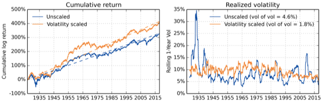

## Table of Contents

## What is volatility targeting?

Volatility targeting is a strategy used by investors to manage the risk in their investment portfolios. It involves adjusting the amount of money invested in different assets based on how much their prices are expected to move up or down. The goal is to keep the overall risk of the portfolio at a level that the investor is comfortable with. For example, if the stock market is expected to be very volatile, an investor might reduce their stock holdings to lower the risk.

This strategy is often used by hedge funds and other professional investors. They use mathematical models to predict how volatile the market will be and then adjust their investments accordingly. By doing this, they can try to achieve a more stable return on their investments, even when the market is going through ups and downs. It's like trying to keep a boat steady in choppy waters by adjusting the sails.

## Why is volatility targeting important in investment strategies?

Volatility targeting is important in investment strategies because it helps investors manage risk. When the market goes up and down a lot, it can be scary for investors. By using volatility targeting, investors can adjust how much they invest in different things to keep their overall risk at a level they are okay with. This means they can feel more secure and not worry as much about big losses.

This strategy also helps investors get more consistent returns over time. Instead of having big wins and big losses, volatility targeting tries to smooth things out. It's like driving a car at a steady speed instead of speeding up and slowing down a lot. By keeping the ups and downs smaller, investors can have a more predictable and stable investment experience.

## How does volatility targeting differ from traditional asset allocation?

Volatility targeting and traditional asset allocation are two ways to manage investments, but they work differently. Traditional asset allocation is about deciding how much money to put into different types of investments, like stocks, bonds, and cash. It's based on things like how long you plan to invest, how much risk you want to take, and what you want to achieve. The idea is to spread your money around to balance risk and reward. Once you set up your asset allocation, you might not change it much unless your goals or situation change.

Volatility targeting, on the other hand, focuses on keeping the ups and downs of your investments at a certain level. Instead of just setting a mix of investments and leaving it, you keep an eye on how much the market is moving. If the market starts to get too wild, you might move some money out of risky investments into safer ones. This way, you're always adjusting your investments to keep the risk at a level you're comfortable with. It's like constantly tuning a radio to get the best sound, while traditional asset allocation is more like setting the station and leaving it.

## What are the key components of a volatility targeting strategy?

A volatility targeting strategy has a few main parts. First, you need a way to guess how much the market will move up or down. This is called volatility forecasting. People use math and past data to make these guesses. Once you know how much the market might move, you can decide if you need to change your investments. This is the second part, called portfolio rebalancing. If the market is going to be too wild, you might move some money from risky things like stocks to safer things like bonds.

The third part is setting a target for how much you want your investments to move. This is called the volatility target. It's like setting a speed limit for your investments. You keep checking if your investments are moving too much or too little compared to your target. If they are, you adjust them. This way, you keep your investments at a risk level you're okay with. It's all about keeping things steady, even when the market is going up and down a lot.

## How do you measure volatility in financial markets?

Measuring volatility in financial markets is about figuring out how much prices move up and down over time. One common way to do this is by using something called standard deviation. It's a math tool that tells you how spread out the prices are from their average. If the prices jump around a lot, the standard deviation will be high, which means the market is very volatile. If the prices stay pretty close to the average, the standard deviation will be low, showing that the market is calm.

Another way to measure volatility is by looking at the historical volatility, which is just a fancy way of saying how much prices have moved in the past. People often use the last 30 days or another time period to figure this out. They look at the daily price changes and calculate the standard deviation of those changes. This gives them an idea of how wild the market has been recently. There's also something called implied volatility, which is a guess about how much the market might move in the future. It's based on what people are willing to pay for options, which are bets on where prices will go. If people are willing to pay a lot for options, it means they think the market will be very volatile.

## What are the common methods used to implement volatility targeting?

To implement volatility targeting, investors often use a method called dynamic asset allocation. This means they keep changing how much money they have in different investments based on how much the market is moving. If the market starts to get too wild, they might move some money from risky things like stocks to safer things like bonds. They do this to keep the overall risk of their investments at a level they are comfortable with. It's like adjusting the sails on a boat to keep it steady in choppy waters.

Another common method is using derivatives, like options and futures, to manage volatility. These are special financial tools that let investors bet on where prices will go without actually buying the stocks or bonds. By using these tools, investors can protect their investments from big swings in the market. For example, if they think the market will be very volatile, they might buy options that will pay off if the market moves a lot. This way, they can keep their investments safe even when the market is going up and down a lot.

## Can you explain the concept of volatility scaling?

Volatility scaling is a way to adjust how much you invest in something based on how much its price is expected to move up or down. Imagine you have a bucket of water and you want to keep the water level steady, even if the bucket is being shaken. If the bucket starts shaking a lot, you might take some water out to keep the level from spilling over. In investing, if the market starts to move a lot, you might reduce how much you invest in it to keep your risk at a comfortable level.

To do volatility scaling, you first need to guess how much the market will move, which is called volatility forecasting. Once you have that guess, you can change how much you invest in different things to keep your overall risk at the level you want. It's like always adjusting the [volume](/wiki/volume-trading-strategy) on your radio to keep the sound just right, even if the music gets louder or softer. By doing this, you can try to keep your investments steady, even when the market is going through ups and downs.

## What are the potential benefits of using a volatility targeting approach?

Using a volatility targeting approach can help investors keep their investments steady, even when the market is going up and down a lot. By always checking how much the market might move and adjusting their investments, investors can keep their risk at a level they are okay with. This means they don't have to worry as much about big losses, which can make investing feel less scary. It's like driving a car at a steady speed instead of speeding up and slowing down a lot, which can help investors feel more secure.

Another benefit is that volatility targeting can help investors get more consistent returns over time. Instead of having big wins and big losses, this approach tries to smooth things out. By keeping the ups and downs smaller, investors can have a more predictable and stable investment experience. This can be really helpful for people who want to grow their money without the stress of big market swings.

## What are the risks and limitations associated with volatility targeting?

Volatility targeting can be tricky because it relies on guessing how much the market will move. If these guesses are wrong, it can lead to bad decisions about where to put money. Sometimes the market can be calm and then suddenly become very wild, which can catch investors off guard. Also, changing investments a lot can mean paying more in fees and taxes, which can eat into the money you make.

Another risk is that volatility targeting might not work well in all types of markets. For example, if the market is going down a lot, moving money around might not help much. It's also not a magic fix for all investment problems. It can't stop losses completely, and it might make investors miss out on big gains if the market suddenly goes up a lot. So, while it can help manage risk, it's not perfect and needs to be used carefully.

## How does volatility targeting perform in different market conditions?

Volatility targeting can work well in markets that go up and down a lot. When the market is very wild, this strategy helps by moving money from risky things like stocks to safer things like bonds. This way, investors can keep their risk at a level they are okay with, even when the market is going crazy. It's like putting on a seatbelt when the road gets bumpy, helping to keep things steady.

But, volatility targeting might not be as good in markets that are going down a lot. If the market keeps dropping, moving money around might not help much. Also, if the market suddenly goes up a lot, this strategy might make investors miss out on big gains because they moved money to safer places. So, while it can help in some situations, it's not perfect and can have different results depending on what the market is doing.

## What advanced techniques can be used to enhance a volatility targeting strategy?

One advanced technique to enhance a volatility targeting strategy is using [machine learning](/wiki/machine-learning). Machine learning can help guess how much the market will move better than just using old data. It can look at a lot of different things at once, like news, how people feel about the market, and past prices. By using all this information, machine learning can make smarter guesses about future market moves. This can help investors adjust their investments more accurately to keep their risk at the right level.

Another technique is using more complex financial tools like options and futures. These tools let investors bet on where prices will go without actually buying the stocks or bonds. By using these tools, investors can protect their investments from big swings in the market. For example, if they think the market will be very volatile, they might buy options that will pay off if the market moves a lot. This way, they can keep their investments safe even when the market is going up and down a lot.

## How can volatility targeting be integrated into a broader investment portfolio?

Volatility targeting can be added to a bigger investment plan by using it to keep the risk in your whole set of investments at a level you're okay with. Imagine you have a bunch of different investments, like stocks, bonds, and maybe some real estate. You can use volatility targeting to keep checking how much the market might move and then adjust how much money you have in each type of investment. If the market starts to get too wild, you might move some money from risky things like stocks to safer things like bonds. This way, even if part of your investments is going up and down a lot, your whole set of investments stays steady.

Another way to mix volatility targeting into your bigger investment plan is by using special financial tools called derivatives, like options and futures. These tools let you bet on where prices will go without actually buying the stocks or bonds. By using these tools, you can protect your investments from big swings in the market. For example, if you think the market will be very volatile, you might buy options that will pay off if the market moves a lot. This way, you can keep your investments safe even when the market is going up and down a lot. By doing this, you can make sure your whole investment plan stays on track, no matter what the market is doing.

## What is volatility and how can one target it?

Volatility, a fundamental concept in finance, is often used to measure the degree of variation in the price of a financial instrument over time. It is considered the most prevalent risk metric for stocks and portfolios, as it captures the frequency and magnitude of price movements. High [volatility](/wiki/volatility-trading-strategies) implies significant price changes in a short period, indicating a risky asset, while low volatility suggests minimal price fluctuations, indicating a more stable asset.

The concept of volatility targeting centers around maintaining a portfolio's volatility within a predefined range, thereby managing exposure and ensuring a consistent risk level. This is achieved by dynamically adjusting the leverage of a portfolio or individual assets based on the observed changes in market volatility. Such adjustments are designed to stabilize returns amid varying market conditions.

In practice, volatility targeting involves the calculation of current market volatility and determining the appropriate leverage to align with the target volatility. This can be expressed mathematically as:

$$
\text{Target Leverage} = \frac{\text{Target Volatility}}{\text{Current Volatility}}
$$

Here, the target leverage refers to the amount of exposure adjusted in the portfolio, target volatility is the predetermined volatility level the manager aims to maintain, and current volatility is the volatility observed or estimated over a specific period.

Implementing volatility targeting requires robust risk management frameworks, where careful assessment of market conditions and precise volatility forecasting play crucial roles. Portfolio managers typically use historical volatility as a starting point to estimate future volatility, adjusting their strategies as new data and trends emerge. By keeping the portfolio's risk level aligned with the target, managers can potentially achieve more stable returns and limit the adverse impacts of sudden market upheavals.

In summary, volatility targeting is an essential strategic tool for managing risk in financial markets. It provides a systematic approach to adjusting exposure levels based on volatility estimates, contributing to enhanced portfolio stability and improved risk-adjusted performance.

## What are the Methods of Volatility Targeting?

Volatility targeting encompasses several techniques, each designed to adjust a portfolio's exposure to achieve a target volatility level. This section explores three popular methods: dynamic volatility scaling, volatility switching, and the use of [momentum](/wiki/momentum) filters.

Dynamic volatility scaling involves adjusting the position size in a portfolio based on changes in asset volatility. This method seeks to maintain a constant volatility level by scaling a portfolio's exposure inversely with its realized or forecasted volatility. The fundamental idea is to increase exposure when volatility decreases and reduce it when volatility rises. Mathematically, if $\sigma_t$ represents the current volatility estimate, and $\sigma_{\text{target}}$ is the target volatility, the scaling [factor](/wiki/factor-investing) $k_t$ can be expressed as:

$$
k_t = \frac{\sigma_{\text{target}}}{\sigma_t}
$$

This approach has the benefit of maintaining a stable risk profile across varying market conditions. However, it may lead to increased transaction costs due to frequent rebalancing, and its effectiveness depends on the accuracy of the volatility forecast model.

Volatility switching is another method where the portfolio dynamically shifts between different volatility regimes based on predefined volatility thresholds. This technique allows a trader to switch the underlying strategy or adjust the asset allocation when the observed volatility crosses certain levels. For example, a risk-averse strategy might be applied during high-volatility periods, while a more aggressive approach could be used when volatility is low. The primary advantage of this method is its ability to adapt to changing market conditions quickly. Nevertheless, setting appropriate thresholds is challenging, and incorrect switches could lead to suboptimal performance.

Momentum filters integrate volatility targeting with momentum-based strategies, blending market trend analysis with volatility adjustments. In this context, momentum filters adjust the volatility targeting mechanism based on the momentum signal. If a positive momentum is detected, leading to increased confidence in a continued trend, the portfolio's exposure might be increased even amidst rising volatility. Conversely, a negative momentum signal could lead to a reduction in exposure, even during low volatility. The combination of momentum and volatility targeting can potentially enhance returns by aligning risk exposure with prevailing market trends. However, reliance on momentum signals can also introduce additional complexity and potential false signals that could affect performance.

Each of these methods provides unique benefits and potential drawbacks. Dynamic volatility scaling ensures a consistent risk level but may incur higher transaction costs. Volatility switching offers adaptability to market regimes but requires precise volatility thresholds. Momentum filters exploit market trends but introduce additional complexity and signal uncertainty. Therefore, adopting a specific method requires careful consideration of a portfolio's characteristics, investment goals, and market environment.

## What are Computational Models for Volatility Targeting?

Volatility targeting relies heavily on accurate volatility calculation. Three primary models are typically used to calculate historical volatility, which includes the Simple Model, the Exponentially Weighted Moving Average (EWMA), and Generalized Autoregressive Conditional Heteroskedasticity (GARCH). These models assist traders and portfolio managers in predicting future volatility and help in making informed decisions to achieve optimal asset allocation.

### Simple Model
The Simple Model calculates volatility by measuring the standard deviation of asset returns over a specific period. This method assumes that returns are normally distributed and uses the formula:

$$
\sigma = \sqrt{\frac{\sum_{i=1}^{n} (R_i - \bar{R})^2}{n - 1}}
$$

where $\sigma$ is the volatility, $R_i$ are the individual returns, $\bar{R}$ is the average return, and $n$ is the number of observations. This approach is straightforward but may not capture the full dynamics of market volatility since it treats all observations equally, disregarding patterns and trends.

### Exponentially Weighted Moving Average (EWMA)
The EWMA model assigns exponentially decreasing weights to older data points. More recent data are given more weight, which allows the model to be more responsive to recent changes in market conditions. The formula for EWMA is:

$$
\sigma_t^2 = (1 - \lambda) R_{t-1}^2 + \lambda \sigma_{t-1}^2
$$

where $\sigma_t^2$ is the predicted variance for period $t$, $R_{t-1}^2$ is the squared return from the previous period, and $\lambda$ is the smoothing parameter (normally between 0.94 and 0.97 for daily financial data).

### GARCH Model
The GARCH model extends the ARCH model by incorporating lagged terms of both the volatility itself and past squared returns. The GARCH(1,1) model, a commonly used variant, is represented by:

$$
\sigma_t^2 = \alpha_0 + \alpha_1 R_{t-1}^2 + \beta_1 \sigma_{t-1}^2
$$

where $\alpha_0$, $\alpha_1$, and $\beta_1$ are parameters to be estimated. This model captures both short-term volatility clustering and long-term mean reversion, making it particularly useful in financial contexts.

### Implementation in Trading Strategies
Implementing these models requires a systematic approach to modulate a portfolio's leverage based on calculated volatility. Here is a basic Python code example illustrating the calculation using the EWMA model:

```python
import numpy as np

# Sample returns data
returns = np.array([0.01, -0.02, 0.015, -0.005, 0.01])

# Initialize variables
lambda_ = 0.94
volatility = np.sqrt(np.sum((1 - lambda_) * (lambda_ ** np.arange(len(returns))) * returns[::-1] ** 2))

print("EWMA Volatility:", volatility)
```

By utilizing such models, traders can adjust their portfolio's exposure dynamically, adhering to a desired risk level while adapting to changes in market volatility. They provide a structured framework for managing the variability inherent in financial markets, enabling more stable financial performance.

## What are some examples of volatility targeting in practice?

Volatility targeting is a strategic approach aiming to stabilize portfolio volatility by adjusting asset positions in response to fluctuations in market volatility. This section provides practical examples of how such strategies can be implemented in trading and investment portfolios using methods like simple volatility targeting and the Exponentially Weighted Moving Average (EWMA) volatility targeting.

### Simple Volatility Targeting

Simple volatility targeting involves scaling portfolio positions to achieve a desired level of volatility. Consider a portfolio where the target volatility is denoted as $\sigma^*$, and the current portfolio volatility is $\sigma_t$. The required scaling factor $\kappa_t$ is determined as:

$$
\kappa_t = \frac{\sigma^*}{\sigma_t}
$$

By applying this factor, the portfolio positions are scaled to align with the target volatility. This approach requires regular volatility estimation; one common method is using historical data to calculate the standard deviation of returns over a given window.

### EWMA Volatility Targeting

EWMA volatility targeting builds upon the simple method by using a more refined approach to estimate volatility. The EWMA model assigns exponentially decreasing weights to past observations, allowing more recent data to have a greater influence. The EWMA estimate of volatility $\sigma_t$ can be calculated using:

$$
\sigma_t^2 = \lambda \cdot \sigma_{t-1}^2 + (1-\lambda) \cdot r_{t-1}^2
$$

where $\lambda$ is the smoothing parameter (usually between 0.94 and 0.97 for financial data), and $r_{t-1}$ represents the asset return at $t-1$. This model offers a dynamic response to changing market conditions.

### Implementation

To implement these strategies, a trader or portfolio manager must adjust the exposure to different assets based on the calculated scaling factors. For instance, in Python, this might look like:

```python
import numpy as np

# Sample returns data
returns = np.array([...])

# Target volatility
sigma_star = 0.10

# Exponentially Weighted Moving Average
lambda_ = 0.94
ewma_vol = np.sqrt(np.mean((1 - lambda_) * (returns**2) + lambda_ * np.roll((returns**2), 1)))

# Scaling factor for EWMA
kappa_ewma = sigma_star / ewma_vol

# Adjusted positions
adjusted_positions = original_positions * kappa_ewma
```

### Real Case Studies

Real-world applications of volatility targeting demonstrate its effectiveness during periods of market stress. For example, during the 2008 financial crisis, funds implementing volatility targeting strategies managed to smooth out extreme drawdowns by reducing leverage as market volatility spiked. This resilience not only protected capital but also instilled greater confidence among investors.

These cases highlight the potential of volatility targeting to enhance the performance and stability of investment portfolios. By consistently managing risk exposure, volatility targeting allows investors to navigate turbulent markets more effectively, ultimately leading to improved risk-adjusted returns.

## References & Further Reading

[1]: Black, F. (1976). ["Studies of Stock Price Volatility Changes."](https://public.econ.duke.edu/~boller/Published_Papers/AB_Volatility_Contents_18.pdf) Proceedings of the American Statistical Association, Business and Economic Statistics Section.

[2]: Bollerslev, T. (1986). ["Generalized Autoregressive Conditional Heteroskedasticity."](https://www.sciencedirect.com/science/article/pii/0304407686900631) Journal of Econometrics, 31, 307-327.

[3]: Poon, S.-H., & Granger, C. W. J. (2003). ["Forecasting Volatility in Financial Markets: A Review."](https://papers.ssrn.com/sol3/papers.cfm?abstract_id=331800) Journal of Economic Literature, 41(2), 478-539.

[4]: Engle, R. F. (1982). ["Autoregressive Conditional Heteroscedasticity with Estimates of the Variance of United Kingdom Inflation."](https://www.semanticscholar.org/paper/Autoregressive-conditional-heteroscedasticity-with-Engle/2ee6cb87fc81ecd78d161c4a92c9dfce00c8961c) Econometrica, 50(4), 987-1007.

[5]: ["The Econometrics of Financial Markets"](https://web.mit.edu/~alo/www/Books/efm_desc.html) by John Y. Campbell, Andrew W. Lo, and A. Craig MacKinlay.

[6]: Alexander, C. (2001). ["Market Models: A Guide to Financial Data Analysis"](https://www.casact.org/sites/default/files/old/marketmodels.pdf) by Wiley Finance.

[7]: Carhart, M. M. (1997). ["On Persistence in Mutual Fund Performance."](https://onlinelibrary.wiley.com/doi/full/10.1111/j.1540-6261.1997.tb03808.x) The Journal of Finance, 52(1), 57-82.