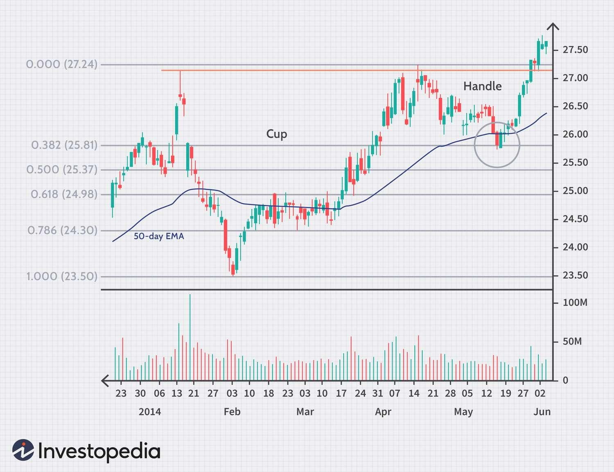

## Table of Contents

## What is the 50-day EMA and how is it calculated?

The 50-day EMA, or Exponential Moving Average, is a type of moving average that gives more weight to recent prices. It is used by traders and investors to help them understand the trend of a stock or other financial asset over a 50-day period. The 50-day EMA is popular because it can help show if a stock is in an uptrend or downtrend, and it reacts more quickly to price changes than a simple moving average.

To calculate the 50-day EMA, you start with the closing prices of the asset for the past 50 days. First, you calculate the simple moving average (SMA) of these 50 days. Then, you use a formula to give more importance to the most recent prices. The formula for the first EMA value is: EMA = (Current Price - Previous EMA) * (2 / (Time period + 1)) + Previous EMA. For the 50-day EMA, you would use 2 / (50 + 1), which equals about 0.0392. After calculating the first EMA, you use this value as the "Previous EMA" to find the next day's EMA, and so on. This way, the EMA keeps updating every day, always giving more weight to the latest prices.

## Why is the 50-day EMA considered important in technical analysis?

The 50-day EMA is considered important in technical analysis because it helps traders and investors see the overall trend of a stock or asset over a medium-term period. It smooths out the daily price fluctuations, making it easier to spot if a stock is generally going up or down. When the price of a stock stays above the 50-day EMA, it often means the stock is in an uptrend, which can be a good sign for people looking to buy. On the other hand, if the price stays below the 50-day EMA, it might suggest a downtrend, which could be a warning for investors to be careful or sell.

Another reason the 50-day EMA is important is that it reacts more quickly to price changes than a simple moving average. This makes it useful for traders who want to make decisions based on recent price movements. Many traders watch for the 50-day EMA to cross above or below the 200-day EMA, which is known as the "golden cross" or "death cross." These events can signal big changes in the market trend and are watched closely by many investors. Overall, the 50-day EMA is a key tool that helps people make better decisions about when to buy or sell stocks.

## How can the 50-day EMA be used to identify trends in stock prices?

The 50-day EMA helps traders and investors see the general direction of a stock's price over a medium period of time. It does this by smoothing out the daily ups and downs, making it easier to see if the stock is generally going up or down. If the stock price stays above the 50-day EMA, it usually means the stock is in an uptrend. This can be a good sign for people thinking about buying the stock because it shows that the price is trending upwards. On the other hand, if the stock price stays below the 50-day EMA, it might mean the stock is in a downtrend, which could be a warning for investors to be careful or think about selling.

Another way the 50-day EMA helps identify trends is by reacting quickly to changes in the stock's price. This makes it useful for traders who want to make decisions based on what's happening recently. For example, if the stock price moves above the 50-day EMA after being below it, this could be a sign that the stock is starting a new uptrend. Similarly, if the price drops below the 50-day EMA after being above it, it might signal the start of a downtrend. By watching these movements, traders can get a better sense of when to buy or sell to take advantage of the trend.

## What are the basic trading strategies involving the 50-day EMA?

One basic trading strategy using the 50-day EMA is to buy when the stock price moves above the 50-day EMA and sell when it moves below it. This strategy works on the idea that when the price is above the 50-day EMA, the stock is in an uptrend, which is a good time to buy. When the price falls below the 50-day EMA, it might be in a downtrend, so it could be a good time to sell. Traders using this strategy watch the stock price closely and make their decisions based on where the price is compared to the 50-day EMA.

Another strategy involves using the 50-day EMA along with the 200-day EMA. This is called the "golden cross" and "death cross" strategy. A golden cross happens when the 50-day EMA moves above the 200-day EMA, which is a strong sign that the stock might be starting a long-term uptrend. Traders might see this as a good time to buy. On the other hand, a death cross happens when the 50-day EMA moves below the 200-day EMA, which can signal a long-term downtrend. This might be a good time for traders to sell or avoid buying the stock. By watching these crosses, traders can make decisions based on big changes in the stock's trend.

## How does the 50-day EMA strategy apply specifically to Intel (INTC) stock?

When looking at Intel (INTC) stock, the 50-day EMA can help traders see if the stock is going up or down over a medium period of time. If the price of Intel stock stays above the 50-day EMA, it means the stock might be in an uptrend. This could be a good time for traders to buy Intel stock because it shows that the price is generally moving up. On the other hand, if the price of Intel stock stays below the 50-day EMA, it might be in a downtrend. This could be a warning for traders to be careful or think about selling their Intel stock.

Another way to use the 50-day EMA with Intel stock is to watch for the "golden cross" and "death cross" with the 200-day EMA. If the 50-day EMA of Intel stock moves above the 200-day EMA, it's called a golden cross. This is a strong sign that Intel stock might be starting a long-term uptrend, which could be a good time to buy. But if the 50-day EMA moves below the 200-day EMA, it's called a death cross. This can signal that Intel stock might be starting a long-term downtrend, so it might be a good time to sell or avoid buying Intel stock. By watching these crosses, traders can make decisions based on big changes in Intel's stock trend.

## How does the 50-day EMA strategy apply specifically to Apple (AAPL) stock?

When looking at Apple (AAPL) stock, the 50-day EMA can help traders see if the stock is going up or down over a medium period of time. If the price of Apple stock stays above the 50-day EMA, it means the stock might be in an uptrend. This could be a good time for traders to buy Apple stock because it shows that the price is generally moving up. On the other hand, if the price of Apple stock stays below the 50-day EMA, it might be in a downtrend. This could be a warning for traders to be careful or think about selling their Apple stock.

Another way to use the 50-day EMA with Apple stock is to watch for the "golden cross" and "death cross" with the 200-day EMA. If the 50-day EMA of Apple stock moves above the 200-day EMA, it's called a golden cross. This is a strong sign that Apple stock might be starting a long-term uptrend, which could be a good time to buy. But if the 50-day EMA moves below the 200-day EMA, it's called a death cross. This can signal that Apple stock might be starting a long-term downtrend, so it might be a good time to sell or avoid buying Apple stock. By watching these crosses, traders can make decisions based on big changes in Apple's stock trend.

## What are the potential risks and limitations of using the 50-day EMA for trading?

One big risk of using the 50-day EMA for trading is that it can give false signals. Sometimes, the stock price might move above or below the 50-day EMA, but then quickly go back to where it was. This can trick traders into buying or selling at the wrong time. Also, the 50-day EMA is based on past prices, so it can't predict the future. If something big happens in the market or with the company, the stock price can change a lot, and the 50-day EMA might not help traders see that coming.

Another limitation is that the 50-day EMA works best when the market is moving in a clear trend, either up or down. If the market is moving sideways, with the stock price going up and down without a clear direction, the 50-day EMA can be confusing. Traders might see the price moving above and below the 50-day EMA a lot, making it hard to know when to buy or sell. Also, the 50-day EMA is just one tool, and it's important for traders to use other tools and information too, like looking at the company's news or using other types of charts and indicators.

## How can the 50-day EMA be combined with other indicators to improve trading decisions?

Combining the 50-day EMA with other indicators can help traders make better decisions. One common way is to use the 50-day EMA with the Relative Strength Index (RSI). The RSI measures how fast a stock's price is going up or down and can show if a stock is overbought or oversold. If the stock price is above the 50-day EMA and the RSI is not overbought, it might be a good time to buy. But if the stock price is below the 50-day EMA and the RSI is oversold, it might be a good time to sell or wait.

Another way to improve trading decisions is to use the 50-day EMA with the Moving Average Convergence Divergence (MACD). The MACD helps traders see if the stock's trend is getting stronger or weaker. If the stock price is above the 50-day EMA and the MACD line crosses above the signal line, it can be a strong sign to buy. But if the stock price is below the 50-day EMA and the MACD line crosses below the signal line, it might be a good time to sell. By using the 50-day EMA with other indicators, traders can get a better picture of what's happening with the stock and make smarter choices.

## Can you provide a case study of a successful trade using the 50-day EMA on INTC?

In early 2023, a trader noticed that Intel (INTC) stock was moving above its 50-day EMA after being below it for several weeks. This was a sign that the stock might be starting an uptrend. The trader decided to buy INTC stock when it closed above the 50-day EMA at around $28 per share. A few weeks later, the stock continued to rise and stayed above the 50-day EMA, reaching a high of about $32 per share. The trader then sold the stock, making a profit of about $4 per share.

To make sure this was a good decision, the trader also looked at the RSI, which showed that INTC was not overbought when the price moved above the 50-day EMA. This gave the trader more confidence in the buy signal. The trader kept an eye on the stock and the 50-day EMA every day. When the price started to move away from the 50-day EMA and the RSI started to show that the stock might be overbought, the trader knew it was time to sell. This careful use of the 50-day EMA, along with another indicator, helped the trader make a successful trade on INTC stock.

## Can you provide a case study of a successful trade using the 50-day EMA on AAPL?

In late 2022, a trader saw that Apple (AAPL) stock was moving above its 50-day EMA after being below it for a while. This was a sign that the stock might be starting to go up. The trader decided to buy AAPL stock when it closed above the 50-day EMA at around $140 per share. Over the next few weeks, the stock kept going up and stayed above the 50-day EMA, reaching a high of about $155 per share. The trader then sold the stock, making a profit of about $15 per share.

To make sure this was a good decision, the trader also looked at the MACD, which showed that AAPL was getting stronger when the price moved above the 50-day EMA. This gave the trader more confidence in the buy signal. The trader watched the stock and the 50-day EMA every day. When the price started to move away from the 50-day EMA and the MACD started to show that the stock might be getting weaker, the trader knew it was time to sell. This careful use of the 50-day EMA, along with another indicator, helped the trader make a successful trade on AAPL stock.

## What advanced techniques can be applied to enhance the effectiveness of the 50-day EMA strategy?

One advanced technique to enhance the effectiveness of the 50-day EMA strategy is to use multiple time frames. Traders can look at the 50-day EMA on both daily and weekly charts. If the stock price is above the 50-day EMA on both charts, it can give a stronger signal that the stock is in an uptrend. This can help traders feel more confident about buying. On the other hand, if the stock price is below the 50-day EMA on both charts, it might be a stronger sign of a downtrend, which could be a good time to sell.

Another technique is to use the 50-day EMA with [volume](/wiki/volume-trading-strategy) analysis. If the stock price moves above the 50-day EMA with high trading volume, it can show that more people are buying the stock, making the uptrend more likely to continue. But if the price moves above the 50-day EMA with low volume, it might not be a strong signal. Traders can also look at volume when the price moves below the 50-day EMA. High volume can mean more people are selling, which might make the downtrend stronger. By combining the 50-day EMA with volume, traders can get a better idea of the strength of the trend.

## How have historical trends in INTC and AAPL responded to the 50-day EMA, and what does this suggest for future trading?

Looking back at Intel (INTC) stock, you can see that the 50-day EMA has been a good guide for spotting trends. When INTC's price stayed above the 50-day EMA, it often meant the stock was going up. For example, in 2020, when INTC moved above the 50-day EMA, it kept going up for a while, which was a good time to buy. But when the price dropped below the 50-day EMA, like in early 2022, it usually meant the stock was going down. This tells us that watching the 50-day EMA can help traders know when to buy or sell INTC in the future. If the price goes above the 50-day EMA, it might be a good time to buy, but if it goes below, it might be time to sell or be careful.

Apple (AAPL) stock has also followed the 50-day EMA pretty well over time. When AAPL's price was above the 50-day EMA, it usually meant the stock was in an uptrend. For instance, in late 2021, when AAPL moved above the 50-day EMA, it kept going up for several months, which was a good time to buy. But when the price fell below the 50-day EMA, like in early 2023, it often meant the stock was in a downtrend. This history suggests that traders can use the 50-day EMA to make better decisions about AAPL in the future. If the price is above the 50-day EMA, it might be a good time to buy, and if it's below, it might be a good time to sell or wait.

## What are the basics of the 50-day EMA?

The 50-day Exponential Moving Average (EMA) is a widely used technical indicator that plays a vital role in assessing stock performance in financial markets. Unlike a simple moving average (SMA), which assigns equal weight to all past prices in the period, the EMA places greater importance on more recent prices. This characteristic makes the EMA more responsive to new information, enabling traders to detect trends and shifts in market momentum more dynamically.

### Definition and Calculation

The 50-day EMA is calculated using the formula:

$$
\text{EMA}_{\text{today}} = (\text{Price}_{\text{today}} \times \text{K} ) + (\text{EMA}_{\text{yesterday}} \times (1 - \text{K}))
$$

where $\text{K} = \frac{2}{n+1}$, and $n$ is the number of days (in this case, 50). This formula showcases how the weight decreases exponentially for each preceding day, introducing a smoothing factor to the average.

### Identifying Trends and Market Momentum

One of the primary functions of the 50-day EMA is to help traders and investors identify market trends and [momentum](/wiki/momentum). When the price of a stock consistently remains above its 50-day EMA, it signals an upward trend, suggesting bullish momentum. Conversely, a persistent price below the EMA indicates a potential bearish trend.

### Application with AAPL Stock

In the case of Apple Inc. (AAPL), the 50-day EMA is often utilized to make informed trading decisions. By examining the intersection of AAPL's price with its 50-day EMA, investors can establish potential entry and [exit](/wiki/exit-strategy) points. For instance, a crossover where the price moves above the EMA may indicate a buying opportunity, while a cross below could signal a time to sell or reduce exposure.

### Historical Effectiveness

Historically, the 50-day EMA has proven effective in capturing significant trends for AAPL. In periods of sustained growth or decline, the EMA provides a streamlined snapshot of market sentiment. For example, during Apple's continued growth phases, the stock frequently maintained its position above the 50-day EMA, corroborating bullish sentiment and trend direction.

### Limitations and Considerations

Despite its utility, there are limitations to the 50-day EMA. It may generate false signals during sideways or choppy markets, where prices oscillate around the EMA, leading to potential whipsaw effects. Moreover, reliance on a single indicator, such as the EMA, without assessing other factors or indicators, may not provide a comprehensive view of market conditions.

Investors and traders should consider these strategies as part of a broader analytical framework, ideally integrating additional technical indicators and market insights to enhance accuracy in decision-making. The 50-day EMA serves as a valuable tool within this toolkit, assisting in navigating the complexities of stock market investments.

## How do AAPL and INTC compare in the context of investment strategies?

Apple Inc. (AAPL) and Intel Corp. (INTC) present distinct opportunities and challenges when considered for investment strategies due to their differences in business models, growth trajectories, and market sectors. This section explores these fundamental differences and analyzes the role of technical and algorithmic strategies in optimizing a balanced investment portfolio that includes both stocks.

### Fundamental Differences between AAPL and INTC

AAPL is a technology company renowned for its consumer electronics, software, and services, including the highly successful iPhone, Mac, and iPad. Its business model focuses on innovation, brand loyalty, and an extensive ecosystem of products and services, which has consistently driven high profit margins and a strong market presence. Conversely, INTC is a semiconductor company that specializes in microprocessors, integrated graphics chips, and related technology solutions. INTC's fortunes are tied to the cyclical nature of the semiconductor industry, which is heavily influenced by manufacturing capacity, technological advancements, and the competitive landscape.

### Interplay of Technical Indicators and Algorithmic Tactics

For AAPL, the 50-day Exponential Moving Average (EMA) is a commonly used technical indicator that helps investors spot trends and momentum shifts in the stock's price. The 50-day EMA is calculated using the formula:

$$
\text{EMA}_{50} = \left( \left( P_{\text{today}} - \text{EMA}_{\text{prev}} \right) \times \frac{2}{51} \right) + \text{EMA}_{\text{prev}}
$$

where $P_{\text{today}}$ is the current price, and $\text{EMA}_{\text{prev}}$ is the EMA value of the previous day.

For INTC, [algorithmic trading](/wiki/algorithmic-trading) strategies such as momentum trading, [statistical [arbitrage](/wiki/arbitrage)](/wiki/statistical-arbitrage), and [machine learning](/wiki/machine-learning) models play a crucial role. Algorithms can execute trades at speeds beyond human capabilities, efficiently capitalizing on minor pricing anomalies and trends.

### Combining Strategies for a Balanced Portfolio

By integrating the 50-day EMA analysis for AAPL with algorithmic trading for INTC, investors can achieve a diversified and balanced portfolio. For example, the EMA for AAPL can serve as a signal to adjust portfolio weightings in response to detected trends. Concurrently, algorithmic models for INTC might uncover short-term trading opportunities that can further enhance returns and mitigate risks through quick execution and precise timing.

### Scenarios for Using EMA and Algorithms in Tandem

Consider a scenario where an investor monitors the 50-day EMA for AAPL to identify uptrends and downtrends. During an upward movement, the investor might increase exposure to AAPL within the portfolio. Simultaneously, an algorithmic trading strategy applied to INTC can exploit short-term price fluctuations, providing a hedge against broader market [volatility](/wiki/volatility-trading-strategies) affecting the tech sector.

### Insights on Diversification and Risk Management

Diversification is crucial in tech stock investments due to inherent volatility and sector-specific risks. Including both AAPL, with its robust growth and consumer loyalty, and INTC, with its cyclical but potentially high-reward nature, can enhance diversification. The interplay of technical indicators and algorithmic trading not only allows investors to tap into different aspects of the tech industry but also offers a means of spreading risk across varied investment approaches.

In conclusion, leveraging both the 50-day EMA for AAPL and algorithmic trading strategies for INTC can create a comprehensive strategy that maximizes potential returns and minimizes risks in a tech-focused investment portfolio.

## References & Further Reading

[1]: Bergstra, J., Bardenet, R., Bengio, Y., & Kégl, B. (2011). ["Algorithms for Hyper-Parameter Optimization."](https://papers.nips.cc/paper/4443-algorithms-for-hyper-parameter-optimization) Advances in Neural Information Processing Systems 24.

[2]: ["Advances in Financial Machine Learning"](https://www.amazon.com/Advances-Financial-Machine-Learning-Marcos/dp/1119482089) by Marcos Lopez de Prado

[3]: ["Evidence-Based Technical Analysis: Applying the Scientific Method and Statistical Inference to Trading Signals"](https://www.amazon.com/Evidence-Based-Technical-Analysis-Scientific-Statistical/dp/0470008741) by David Aronson

[4]: ["Machine Learning for Algorithmic Trading"](https://github.com/stefan-jansen/machine-learning-for-trading) by Stefan Jansen

[5]: ["Quantitative Trading: How to Build Your Own Algorithmic Trading Business"](https://www.amazon.com/Quantitative-Trading-Build-Algorithmic-Business/dp/1119800064) by Ernest P. Chan