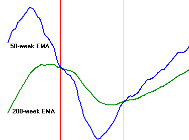

In today's financial markets, characterized by relentless fluctuations and rapid technological advancements, having a robust investment strategy is paramount for investors seeking to navigate uncertainty and optimize returns. Investment strategies offer frameworks that help in making informed decisions, thereby reducing risks and enhancing the potential for gains. Apple Inc. (AAPL) and Intel Corp. (INTC) stand out as prominent components in many investment portfolios due to their substantial influence on the technology sector and the broader market. These companies are recognized not only for their financial performance but also for their innovation and market leadership.

Technical indicators, such as the 50-day Exponential Moving Average (EMA), play a vital role in technical analysis by helping investors identify trends and assess market momentum. The 50-day EMA is a widely used tool that smooths out price data by applying more weight to recent prices, thus making it more responsive to new information compared to a simple moving average. It serves as a valuable indicator for short- to medium-term market trends, particularly in analyzing stocks like AAPL where trend identification is crucial for timing investment entries and exits.



Simultaneously, algorithmic trading has become an increasingly influential force in financial markets, leveraging computational algorithms to execute trades at speeds and frequencies beyond human capability. This approach is especially pertinent for stocks like INTC, where algorithms can analyze vast datasets and identify trading opportunities with heightened efficiency and precision. Algorithmic trading strategies can vary from simple rules based on technical indicators to complex models using machine learning, offering a spectrum of tools for optimizing trading performance.

The purpose of this article is to explore investment strategies utilizing the 50-day EMA for AAPL and algorithmic trading for INTC. We aim to provide actionable insights that investors can employ to enhance their investment returns. By examining these strategies, the article seeks to illuminate the potential benefits of combining traditional technical analysis with modern computational techniques, ultimately guiding investors towards more informed and effective investment decisions.

## Table of Contents

## Understanding the Basics of 50-day EMA

The 50-day Exponential Moving Average (EMA) is a widely used technical indicator that plays a vital role in assessing stock performance in financial markets. Unlike a simple moving average (SMA), which assigns equal weight to all past prices in the period, the EMA places greater importance on more recent prices. This characteristic makes the EMA more responsive to new information, enabling traders to detect trends and shifts in market momentum more dynamically.

### Definition and Calculation

The 50-day EMA is calculated using the formula:

$$
\text{EMA}_{\text{today}} = (\text{Price}_{\text{today}} \times \text{K} ) + (\text{EMA}_{\text{yesterday}} \times (1 - \text{K}))
$$

where $\text{K} = \frac{2}{n+1}$, and $n$ is the number of days (in this case, 50). This formula showcases how the weight decreases exponentially for each preceding day, introducing a smoothing factor to the average.

### Identifying Trends and Market Momentum

One of the primary functions of the 50-day EMA is to help traders and investors identify market trends and [momentum](/wiki/momentum). When the price of a stock consistently remains above its 50-day EMA, it signals an upward trend, suggesting bullish momentum. Conversely, a persistent price below the EMA indicates a potential bearish trend.

### Application with AAPL Stock

In the case of Apple Inc. (AAPL), the 50-day EMA is often utilized to make informed trading decisions. By examining the intersection of AAPL's price with its 50-day EMA, investors can establish potential entry and [exit](/wiki/exit-strategy) points. For instance, a crossover where the price moves above the EMA may indicate a buying opportunity, while a cross below could signal a time to sell or reduce exposure.

### Historical Effectiveness

Historically, the 50-day EMA has proven effective in capturing significant trends for AAPL. In periods of sustained growth or decline, the EMA provides a streamlined snapshot of market sentiment. For example, during Apple's continued growth phases, the stock frequently maintained its position above the 50-day EMA, corroborating bullish sentiment and trend direction.

### Limitations and Considerations

Despite its utility, there are limitations to the 50-day EMA. It may generate false signals during sideways or choppy markets, where prices oscillate around the EMA, leading to potential whipsaw effects. Moreover, reliance on a single indicator, such as the EMA, without assessing other factors or indicators, may not provide a comprehensive view of market conditions.

Investors and traders should consider these strategies as part of a broader analytical framework, ideally integrating additional technical indicators and market insights to enhance accuracy in decision-making. The 50-day EMA serves as a valuable tool within this toolkit, assisting in navigating the complexities of stock market investments.

## Analyzing AAPL Through the Lens of 50-day EMA

The 50-day Exponential Moving Average (EMA) is a popular technical indicator that analysts and investors use to gauge the historical performance and potential future trends of stocks like Apple Inc. (AAPL). Analyzing AAPL through the lens of the 50-day EMA provides insights into price trends, market momentum, and potential entry or exit points for traders.

### Historical Performance of AAPL Using the 50-day EMA Strategy

Historically, applying the 50-day EMA to AAPL stock involves calculating the average price over the past 50 days, with more weight given to the most recent prices. This technique smooths out short-term [volatility](/wiki/volatility-trading-strategies) and highlights the underlying trend direction. 

For example, when AAPL's stock price consistently remains above its 50-day EMA, it suggests a strong upward trend, often interpreted as a bullish signal. Conversely, if the price drops below the 50-day EMA, it might indicate bearish momentum and foreshadow potential declines.

### Impact of Market Conditions on EMA Readings

Various market conditions can significantly affect 50-day EMA readings for AAPL. Bull and bear markets, economic announcements, [interest rate](/wiki/interest-rate-trading-strategies) changes, and technological advancements are key influencers. During periods of high volatility, the divergence between AAPL's price and its 50-day EMA can increase, potentially offering more trading signals. 
For instance, in volatile markets, sharp price movements might cause the 50-day EMA to lag, emphasizing the importance of supplementary indicators and confirmation signals.

### Recent Trends and News Impacting AAPL's Stock Price

Recent trends such as shifts in consumer preferences, supply chain constraints, and regulatory changes can have immediate effects on AAPL's stock price. Apple's financial results, product launches, and innovation initiatives are closely monitored events that frequently cause fluctuations in their stock price, consequently altering the 50-day EMA readings.

Notably, news related to Apple's environmental sustainability efforts, diversification into services like Apple Music and Apple TV+, or moves into new markets can substantially sway investor sentiment, reflected in the stock's EMA trend.

### Successful Case Studies of the 50-day EMA Strategy on AAPL

Several historical instances demonstrate the success of the 50-day EMA strategy for AAPL. For instance, during bullish phases post-major product announcements or earnings beats, traders using the 50-day EMA might have capitalized on the momentum. These traders often entered positions when the price crossed above the EMA and held until it crossed below, riding the upward trend for maximum returns.

### Insights on Monitoring EMA for Investment Decisions

Effective monitoring of the 50-day EMA involves recognizing crossovers, which occur when stock prices move above or below the EMA line. These are key signals for entering or exiting trades. 

To implement the strategy, a straightforward Python script can assist in tracking EMA crossovers:

```python
import pandas as pd
import numpy as np

# Assuming 'data' is a pandas DataFrame with a Date and Close column for AAPL stock
data['EMA_50'] = data['Close'].ewm(span=50, adjust=False).mean()

# Generate buy and sell signals
data['Position'] = np.where(data['Close'] > data['EMA_50'], 1, -1)

# Strategy overview
buy_signals = data[data['Position'].diff() == 2]
sell_signals = data[data['Position'].diff() == -2]

print("Buy signals:\n", buy_signals[['Date', 'Close']])
print("Sell signals:\n", sell_signals[['Date', 'Close']])
```

This code helps traders identify optimal buy and sell points based on EMA crossovers. Monitoring the EMA and keeping abreast of market developments are essential for adapting to rapid changes in stock price.

In conclusion, the 50-day EMA offers a robust framework for analyzing AAPL, provided traders remain vigilant about market conditions and integrate other indicators to bolster investment decisions.

## Algorithmic Trading Strategies for INTC

Algorithmic trading, often referred to as algo-trading, has transformed the landscape of financial markets by leveraging computational power to facilitate fast and efficient trade execution. In trading stocks like Intel Corporation (INTC), algorithmic systems provide significant advantages by processing large volumes of data and executing trades at speeds unattainable by human traders. 

Algorithms, through pre-defined rules and complex mathematical models, optimize the trading process by executing orders based on criteria such as timing, price, and [volume](/wiki/volume-trading-strategy). This capability allows institutions to swiftly capitalize on market inefficiencies and predicted price movements, reinforcing the role of speed and precision in modern trading environments.

### Popular Algorithmic Strategies for INTC

#### Momentum Trading

One popular algorithmic strategy applied to INTC is momentum trading. This strategy involves identifying and capitalizing on stocks that are trending strongly in one direction. Algorithms monitor technical indicators and market signals to determine when a stock exhibits momentum. For instance, a Python-based momentum strategy might look like this:

```python
import numpy as np

def momentum_strategy(prices, window=5):
    return np.sign(prices.diff(window).fillna(0))

# Assuming 'prices' is a pandas Series of INTC stock prices
signals = momentum_strategy(intc_prices)
```

Here, the strategy generates buy or sell signals based on changes in price over a specified rolling window, highlighting potential upward or downward trends.

#### Statistical Arbitrage

Statistical [arbitrage](/wiki/arbitrage) involves exploiting price discrepancies between correlated stocks or markets. For INTC, this can mean identifying and acting on pricing anomalies in relation to benchmark indices or related technology stocks. Algorithms use statistical models to evaluate historical relationships and predict temporary mispricings.

#### Machine Learning Models

The application of [machine learning](/wiki/machine-learning) (ML) in trading has become increasingly prevalent. Machine learning models can uncover complex patterns and correlations that traditional statistical methods might miss. For INTC, these models can process vast datasets to improve prediction accuracy. A sample ML approach might involve:

```python
from sklearn.ensemble import RandomForestClassifier

# Features for model training, assuming relevant data preprocessing steps are performed.
features = ['price', 'volume', 'volatility', ...]
X = intc_data[features]
y = intc_data['target']  # Target variable indicating price movement direction

model = RandomForestClassifier()
model.fit(X, y)
predictions = model.predict(X)
```

This model might predict future price movements, enabling informed trading decisions.

### Infrastructure for Algorithmic Trading

Successful [algorithmic trading](/wiki/algorithmic-trading) requires robust technological infrastructure. Key components include advanced hardware for computational speed, reliable data feeds for real-time information, and sophisticated software capable of executing complex algorithms.

### Risks and Ethical Considerations

Despite its benefits, algorithmic trading carries certain risks and ethical concerns. High-frequency trading ([HFT](/wiki/high-frequency-trading-strategies)), a common form of algorithmic trading, has been criticized for potentially contributing to market volatility and unfair advantages due to latency arbitrage. Moreover, the opaque nature of some algorithms can lead to ethical dilemmas if they inadvertently manipulate markets or create systemic risks.

To mitigate such issues, regulatory bodies enforce strict compliance standards and transparency in algorithmic operations. Continuous monitoring of algorithmic systems and adherence to fair trading practices are essential to maintaining market integrity.

Algorithmic trading in INTC exemplifies the blend of technology and finance, facilitating optimal trading outcomes while presenting unique challenges that require ongoing diligence.

## Comparing AAPL and INTC in the Context of Investment Strategies

Apple Inc. (AAPL) and Intel Corp. (INTC) present distinct opportunities and challenges when considered for investment strategies due to their differences in business models, growth trajectories, and market sectors. This section explores these fundamental differences and analyzes the role of technical and algorithmic strategies in optimizing a balanced investment portfolio that includes both stocks.

### Fundamental Differences between AAPL and INTC

AAPL is a technology company renowned for its consumer electronics, software, and services, including the highly successful iPhone, Mac, and iPad. Its business model focuses on innovation, brand loyalty, and an extensive ecosystem of products and services, which has consistently driven high profit margins and a strong market presence. Conversely, INTC is a semiconductor company that specializes in microprocessors, integrated graphics chips, and related technology solutions. INTC's fortunes are tied to the cyclical nature of the semiconductor industry, which is heavily influenced by manufacturing capacity, technological advancements, and the competitive landscape.

### Interplay of Technical Indicators and Algorithmic Tactics

For AAPL, the 50-day Exponential Moving Average (EMA) is a commonly used technical indicator that helps investors spot trends and momentum shifts in the stock's price. The 50-day EMA is calculated using the formula:

$$
\text{EMA}_{50} = \left( \left( P_{\text{today}} - \text{EMA}_{\text{prev}} \right) \times \frac{2}{51} \right) + \text{EMA}_{\text{prev}}
$$

where $P_{\text{today}}$ is the current price, and $\text{EMA}_{\text{prev}}$ is the EMA value of the previous day.

For INTC, algorithmic trading strategies such as momentum trading, [statistical arbitrage](/wiki/statistical-arbitrage), and machine learning models play a crucial role. Algorithms can execute trades at speeds beyond human capabilities, efficiently capitalizing on minor pricing anomalies and trends.

### Combining Strategies for a Balanced Portfolio

By integrating the 50-day EMA analysis for AAPL with algorithmic trading for INTC, investors can achieve a diversified and balanced portfolio. For example, the EMA for AAPL can serve as a signal to adjust portfolio weightings in response to detected trends. Concurrently, algorithmic models for INTC might uncover short-term trading opportunities that can further enhance returns and mitigate risks through quick execution and precise timing.

### Scenarios for Using EMA and Algorithms in Tandem

Consider a scenario where an investor monitors the 50-day EMA for AAPL to identify uptrends and downtrends. During an upward movement, the investor might increase exposure to AAPL within the portfolio. Simultaneously, an algorithmic trading strategy applied to INTC can exploit short-term price fluctuations, providing a hedge against broader market volatility affecting the tech sector.

### Insights on Diversification and Risk Management

Diversification is crucial in tech stock investments due to inherent volatility and sector-specific risks. Including both AAPL, with its robust growth and consumer loyalty, and INTC, with its cyclical but potentially high-reward nature, can enhance diversification. The interplay of technical indicators and algorithmic trading not only allows investors to tap into different aspects of the tech industry but also offers a means of spreading risk across varied investment approaches.

In conclusion, leveraging both the 50-day EMA for AAPL and algorithmic trading strategies for INTC can create a comprehensive strategy that maximizes potential returns and minimizes risks in a tech-focused investment portfolio.

## Conclusion and Future Outlook

The analysis of investment strategies utilizing AAPL's 50-day EMA and algorithmic trading for INTC offers significant insights into optimizing financial market engagement. The key takeaway from this exploration is the evident benefit of integrating traditional technical analysis with algorithmic trading techniques. The 50-day EMA has been a valuable tool for identifying trends and momentum in AAPL's stock, aiding investors in making well-informed decisions. Meanwhile, algorithmic trading presents an opportunity to enhance trading efficiency and efficacy for stocks like INTC by executing trades rapidly and reliably.

The evolution of these strategies suggests an increasingly sophisticated financial environment where technology and traditional analysis coexist and complement each other. As algorithmic trading becomes more prevalent, its synergy with established technical indicators like the 50-day EMA will likely become more pronounced. This fusion can potentially lead to more robust investment strategies capable of navigating complex market conditions.

Investors should remain proactive in their educational pursuits to effectively harness the benefits of new and existing methodologies. The financial landscape is constantly evolving, driven by technological advances and shifting market dynamics, necessitating a commitment to continuous learning.

Ultimately, investors are encouraged to assess their individual risk tolerance and investment objectives meticulously. By doing so, they can tailor their portfolios to align with personal financial goals while mitigating risks. A thoughtful combination of technical analysis and cutting-edge algorithmic strategies can play a crucial role in achieving diversified and resilient investment portfolios.

## References & Further Reading

[1]: Bergstra, J., Bardenet, R., Bengio, Y., & Kégl, B. (2011). ["Algorithms for Hyper-Parameter Optimization."](https://papers.nips.cc/paper/4443-algorithms-for-hyper-parameter-optimization) Advances in Neural Information Processing Systems 24.

[2]: ["Advances in Financial Machine Learning"](https://www.amazon.com/Advances-Financial-Machine-Learning-Marcos/dp/1119482089) by Marcos Lopez de Prado

[3]: ["Evidence-Based Technical Analysis: Applying the Scientific Method and Statistical Inference to Trading Signals"](https://www.amazon.com/Evidence-Based-Technical-Analysis-Scientific-Statistical/dp/0470008741) by David Aronson

[4]: ["Machine Learning for Algorithmic Trading"](https://github.com/stefan-jansen/machine-learning-for-trading) by Stefan Jansen

[5]: ["Quantitative Trading: How to Build Your Own Algorithmic Trading Business"](https://www.amazon.com/Quantitative-Trading-Build-Algorithmic-Business/dp/1119800064) by Ernest P. Chan