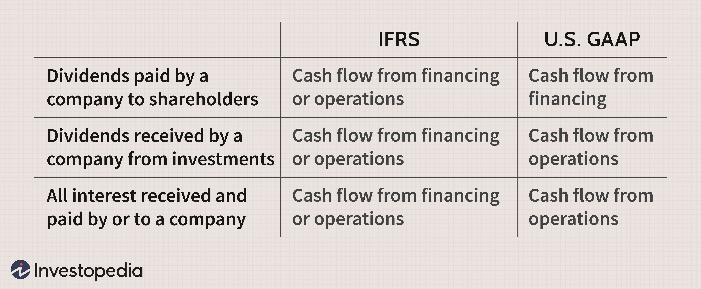

Understanding financial statements, especially the cash flow statement, is critical for individuals involved in finance and investing. The cash flow statement provides essential insights into the financial condition and performance of a company by detailing the movement of cash within an organization over a specific period. This movement is broken down into three main areas: operating activities, investing activities, and financing activities. Such information is crucial as it allows investors, analysts, and business managers to evaluate how well a company can generate cash to cover its expenses, fund its operations, and engage in growth initiatives.

In the context of algorithmic trading, the reliance on precise and accurate financial data is paramount. Algorithmic trading involves using complex algorithms and high-speed computer programs to make trading decisions, often capitalizing on market inefficiencies and price arbitrage opportunities too fleeting for a human trader to exploit. Cash flow statements play a vital role in providing the necessary data to these algorithms. By incorporating this financial information, trading models can gain deeper insights into the company's operational efficiency and liquidity position, further refining trading strategies.



This article examines how cash flow analysis can improve financial understanding and enhance algorithmic trading strategies. By leveraging the data obtained from cash flow statements, financial analysts and traders can sharpen their predictions and make more informed investment decisions.

## Table of Contents

## Understanding Cash Flow Statement

A cash flow statement (CFS) is a critical financial document that captures the inflows and outflows of cash within a company over a specific period. The statement is fundamentally structured into three key segments: cash flows from operating activities, investing activities, and financing activities. Each section provides distinct insights into the company’s cash dynamics and overall financial condition.

1. **Operating Activities**: This component reflects the cash generated and utilized from the core business operations. It includes transactions like cash receipts from sales of goods and services, payments to suppliers, and cash paid for operating expenses. Positive cash flow from operating activities is generally indicative of a company’s ability to sustain its operational requirements with the revenues produced from its principal business activities.

2. **Investing Activities**: This part of the CFS outlines cash transactions related to the acquisition and disposal of long-term investments and capital assets. Typical transactions include the purchase or sale of property, plant, and equipment, or financial investments such as marketable securities. These activities provide insights into the company’s growth strategies and investment in future operations. Cash flow from investing activities can often be negative if a company is actively investing in its growth.

3. **Financing Activities**: This section pertains to cash flows related to a company's funding operations. It includes cash transactions such as borrowing funds, issuing shares, and repaying loans or equity dividends. Understanding these cash flows is crucial for evaluating how a company funds its operational and investment activities, thus shedding light on its capital structure and long-term solvency.

The cash flow statement offers a transparent view of a company’s [liquidity](/wiki/liquidity-risk-premium), enabling stakeholders to assess how well a company is managing its cash to fulfill short-term obligations, fund ongoing operations, and make strategic investments. An accurate cash flow analysis contributes significantly to understanding the financial health and sustainability of the company’s business model.

## Components of a Cash Flow Statement

A cash flow statement is divided into three main components, each providing distinct insights into different aspects of a company's financial transactions. These components are essential for understanding how a business generates, allocates, and manages its cash resources.

### Cash Flow from Operating Activities

This section outlines the cash generated or consumed by a company's core business activities. It includes all transactions that do not involve investing or financing activities, representing the net cash provided by everyday business operations. Operating activities typically encompass cash receipts from sales of goods and services and cash payments to suppliers and employees. The goal of this section is to reflect a company's ability to generate sufficient cash from its regular business operations to maintain its activities without relying on external financing.

The calculation generally starts with net income and adjusts for non-cash items and changes in working capital. A simple formula representing cash flow from operating activities can be expressed as:

$$
\text{CFO} = \text{Net Income} + \text{Non-Cash Expenses} - \text{Changes in Working Capital}
$$

Python code to compute cash flow from operating activities could look like this:

```python
def cash_flow_from_operating_activities(net_income, non_cash_expenses, change_in_working_capital):
    return net_income + non_cash_expenses - change_in_working_capital
```

### Cash Flow from Investing Activities

Cash flow from investing activities reports the cash used in or generated from investment in business assets. This section typically includes transactions associated with the purchase and sale of long-term assets, such as property, plant, and equipment (PPE), and investment in other companies. Investments indicate a company's growth strategy and commitment to maintaining or expanding its operational capacity. Negative cash flow in this section generally suggests capital expenditure aimed at growth, whereas positive cash flow may result from the sale of business assets.

Investing activities can be represented by:

$$
\text{CFI} = \text{Cash Inflows from Sale of Assets} - \text{Cash Outflows for Purchasing Assets}
$$

### Cash Flow from Financing Activities

This section reflects transactions with a company's owners and creditors, indicating changes in the financial structure of the business. It includes cash flows related to borrowing and repaying bank loans, the issuance and repurchase of stock, and dividend payments. Cash flow from financing activities provides insight into a company's financial strategy regarding capital structure and long-term solvency.

The net cash flow from financing activities is often calculated as:

$$
\text{CFF} = \text{Cash Inflows from Loans and Issuances} - \text{Cash Outflows from Repayments and Dividends}
$$

The cash flow statement provides a comprehensive look at a company’s ability to generate cash and sustain its financial health over time. Understanding these components helps stakeholders assess whether a company has sufficient liquidity, how it is funding its operations, and where it is focusing its resources for growth.

## Financial Analysis and Its Importance

Financial analysis plays a pivotal role in evaluating a company's financial stability by scrutinizing various financial statements, with the cash flow statement holding significant importance. The cash flow statement, together with balance sheets and income statements, provides a comprehensive overview of financial health by tracking cash transactions during a particular period. 

Analyzing cash flows involves assessing three main activities: operating, investing, and financing. Operating activities encompass the core business functions that generate revenue. A strong cash flow from operating activities signals a company’s ability to sustain its operations and meet short-term obligations, enhancing operational efficiency. Investing activities pertain to the acquisition or disposal of long-term assets and investments, reflecting the company’s growth strategies and long-term viability. A positive cash flow from investing activities generally indicates reliable asset management and forward-thinking investments. Finally, financing activities involve transactions with shareholders and creditors, affecting the company’s capital structure and indicating its strategies for maintaining or expanding financial leverage.

This analysis is indispensable for investors, as it provides insights into a company's liquidity—its ability to meet short-term liabilities—and operational efficiency—how effectively it utilizes resources to generate revenue. By assessing cash flows across these activities, investors are better equipped to make informed decisions regarding the potential risks and rewards of investing in a particular company.

Furthermore, a detailed cash flow analysis can contribute to the development of robust investment strategies. Investors can use data derived from cash flow statements to predict future cash flows, enhancing the accuracy of their financial models. Such analyses help in distinguishing between companies with consistent cash generation capabilities and those reliant on external financing, thereby allowing for strategic asset allocation and portfolio diversification. 

Overall, understanding and analyzing cash flows provide a critical foundation for sound decision-making in investment strategy, offering a clear picture of a company's financial stability and operational efficiency over time.

## Algorithmic Trading and Financial Statements

Algorithmic trading involves the use of complex algorithms to streamline and automate trading processes, making precision and completeness of data paramount. At the core of these trading systems lies the utilization of financial statements, including cash flow statements, which serve as vital sources of information concerning a company's financial standing. Cash flow statements provide critical insights into the inflow and outflow of cash within a company, offering traders a clearer picture of its liquidity and financial health.

By analyzing cash flow statements, algorithmic traders can adjust their trading models to better reflect the financial realities of the companies they are engaging with. This involves scrutinizing the three primary components: operating activities, investing activities, and financing activities. For instance, consistent positive cash flow from operating activities may indicate a company’s robust core operations, influencing algorithms to favor trades involving that company's stock.

Integrating cash flow analysis into [algorithmic trading](/wiki/algorithmic-trading) can significantly enhance the predictive accuracy of the trading models used. By factoring in cash flow health, algorithms can be refined to issue trading signals that are more aligned with a company's financial reality. For example, a sudden spike in cash flows from financing activities might trigger caution in trading algorithms, as it might indicate a company is taking on significant debt.

To further improve trading outcomes, algorithmic traders can integrate cash flow data with other financial indicators. Python, widely used for algorithmic trading, can be utilized to code these integrations. A sample Python function might look as follows:

```python
def analyze_cash_flow(cash_flows):
    if cash_flows['operating'] > 0 and cash_flows['investing'] < 0:
        trading_signal = 'buy'
    elif cash_flows['operating'] < 0 and cash_flows['financing'] > 0:
        trading_signal = 'sell'
    else:
        trading_signal = 'hold'
    return trading_signal

# Example usage
company_cash_flows = {'operating': 5000, 'investing': -2000, 'financing': 1000}
signal = analyze_cash_flow(company_cash_flows)
print(signal)
```

In this script, the algorithmic strategy is to issue a 'buy' signal if operating cash flows are positive and investing cash flows are negative, reflecting potential growth balanced by strong operations. Conversely, a 'sell' signal is recommended when operating cash flows are negative and financing cash flows indicate increased borrowing, potentially signaling financial distress.

In summary, by integrating cash flow statements into trading algorithms, traders are better equipped to create models that react to actual financial health indicators. This ensures that operations are not only automated but also optimized for sound investment decisions.

## Limitations of Cash Flow Statements

Cash flow statements are essential for evaluating a company’s financial well-being, but they do come with limitations that must be considered by analysts and investors. One primary limitation is their inability to project future financial potential. Cash flow statements offer a historical view, summarizing cash inflows and outflows over a specific period. They do not inherently account for future market conditions or strategic shifts that could impact a company's finances. Therefore, while they are valuable for assessing past and current liquidity, they should not be solely relied upon to predict future financial outcomes.

Another limitation of cash flow statements is that they must be evaluated alongside other financial statements, such as the income statement and balance sheet, to form a comprehensive picture of a company's financial health. This is because cash flow statements provide isolated insights into cash movements but lack the context of profitability and asset-liability structure that these other documents offer. 

Furthermore, cash flow figures can be influenced by temporary fluctuations due to one-time events or seasonal activities. These can distort the true financial position of a company if not properly adjusted or noted. For instance, a company may experience a temporary surge in cash flow due to a one-time asset sale, which may not indicate ongoing financial strength. Investors should exercise caution and identify these anomalies to avoid misinterpretation of the company’s financial stability.

In summary, while cash flow statements are a critical tool for financial analysis, their limitations necessitate a cautious approach and complementary analysis with other financial documents to ensure a balanced financial assessment.

## Conclusion

Mastering cash flow statement analysis is a crucial skill for enhancing both financial analysis and trading strategies. Cash flow statements provide essential insights into the liquidity and financial stability of a company, offering investors and traders valuable data to base their decisions. By integrating cash flow data into algorithmic trading models, traders can significantly enhance the accuracy and effectiveness of their strategies. This integration helps adjust trading algorithms by offering a clearer picture of a company’s financial health, ultimately improving predictive accuracy and trading outcomes.

For instance, algorithmic traders can program their models to evaluate changes in cash flow from operating activities, which might indicate a shift in a company’s core business functionality. Such data allow traders to act on substantial evidence rather than market speculation, refining their trading signals.

Furthermore, a deep understanding of cash flow and financial statements is fundamental for sound investment decisions. Investors equipped with the knowledge to analyze cash flow statements can better assess a company's ability to generate cash, manage debts, and invest in growth opportunities. This comprehension aids in identifying companies with robust financial health and potential for long-term growth, thus supporting informed investment choices that align with investor goals. Ultimately, blending cash flow analysis with algorithmic trading provides a comprehensive approach to maximizing returns while managing risks effectively.

## References & Further Reading

[1]: ["Understanding Financial Statements"](https://online.hbs.edu/blog/post/how-to-read-financial-statements) by Lyn M. Fraser

[2]: ["Financial Statement Analysis and Security Valuation"](https://www.mheducation.com/highered/product/Financial-Statement-Analysis-and-Security-Valuation-Penman.html) by Stephen Penman

[3]: Ferri, M. G., & Jones, W. E. (2004). ["Fundamentals of Investment Management."](https://onlinelibrary.wiley.com/doi/10.1111/j.1540-6261.1979.tb02130.x) McGraw-Hill/Irwin.

[4]: ["The Basics of Finance: An Introduction to Financial Markets, Business Finance, and Portfolio Management"](https://www.amazon.com/Basics-Finance-Introduction-Financial-Management/dp/0470609710) by Pamela Peterson Drake and Frank J. Fabozzi

[5]: ["Algorithmic Trading: Winning Strategies and Their Rationale"](https://www.amazon.com/Algorithmic-Trading-Winning-Strategies-Rationale-ebook/dp/B00CY5HC0U) by Ernest P. Chan

[6]: ["The Cash Flow Management Book for Non-Financial Managers"](https://www.amazon.com/Understanding-Finance-Fundamentals-Nonfinancial-Managers/dp/0471103861) by Jo Ann Hankin