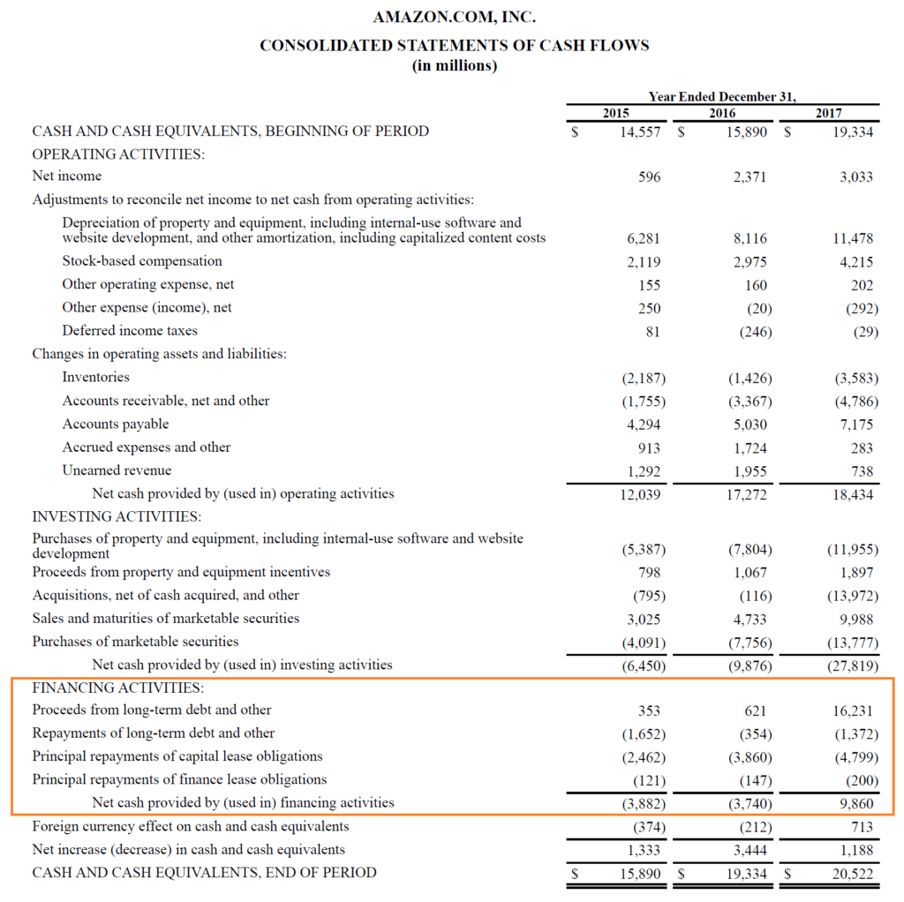

## Table of Contents

## What is cash flow from financing activities?

Cash flow from financing activities is the section of a company's cash flow statement that shows the net amount of money received or spent on financing activities. This includes transactions like borrowing money, repaying loans, issuing stocks, and paying dividends to shareholders. It helps investors understand how a company is funding its operations and growth, and how it's managing its capital structure.

For example, if a company issues new shares of stock, it will show up as a positive amount in the cash flow from financing activities because the company is receiving money. On the other hand, if the company pays dividends to its shareholders, it will be shown as a negative amount because money is leaving the company. By looking at this section, you can see whether a company is raising money or paying it out, which can give insights into its financial strategy and health.

## How is cash flow from financing activities different from operating and investing activities?

Cash flow from financing activities is different from operating and investing activities because it shows how a company gets money from or pays money to its investors and creditors. This includes things like borrowing money, paying back loans, selling stocks, or paying dividends. It's all about how the company manages its money with outside sources. On the other hand, cash flow from operating activities shows the money a company makes from its main business, like selling products or services. It's about the day-to-day running of the business and how much cash it generates from its core operations.

Cash flow from investing activities, meanwhile, focuses on the money spent on or received from investments like buying or selling equipment, property, or other businesses. This part of the cash flow statement tells you about the company's long-term investments and how it's using its money to grow or improve its operations. So, while financing activities deal with money from outside the company, operating activities are about the core business, and investing activities are about long-term growth and asset management. Each section gives a different view of the company's financial health and strategy.

## What are common examples of cash inflows from financing activities?

Cash inflows from financing activities are the ways a company gets money from outside sources. One common way is by issuing new shares of stock. When a company sells its stock to investors, it gets cash in return. This is a big way for companies, especially new ones, to raise money to grow their business. Another way is by taking out loans or issuing bonds. When a company borrows money from a bank or sells bonds to investors, it receives cash that it can use for its operations or projects.

Sometimes, companies can also get cash inflows from financing activities by getting money from their owners or shareholders. For example, if the owners of a small business decide to put more of their own money into the company, this counts as a cash inflow from financing activities. These different ways of getting money help companies manage their finances and plan for the future.

## What are typical examples of cash outflows from financing activities?

Cash outflows from financing activities are when a company pays money to its investors or creditors. A common example is when a company pays back loans it took from banks or other lenders. This means the company sends money back to those who lent it, reducing the amount it owes. Another example is when a company buys back its own shares from investors. This is called a share repurchase, and it means the company uses its cash to take back some of its stock, which can make the remaining shares more valuable.

Another typical cash outflow is when a company pays dividends to its shareholders. Dividends are payments made to people who own the company's stock, as a way to share the company's profits. When a company decides to pay dividends, it sends money out to its shareholders, which reduces the cash the company has on hand. These outflows show how a company is returning money to its investors and managing its debts, which is an important part of its overall financial strategy.

## How do you calculate net cash provided by or used in financing activities?

To calculate net cash provided by or used in financing activities, you need to look at the cash inflows and outflows related to financing on a company's cash flow statement. Start by adding up all the cash inflows from financing activities. These are things like money received from issuing new shares of stock, taking out loans, or receiving contributions from owners. Then, add up all the cash outflows from financing activities. These include payments made to repay loans, buy back shares, or pay dividends to shareholders.

Once you have the totals for both inflows and outflows, you subtract the total outflows from the total inflows. If the result is positive, it means the company had net cash provided by financing activities, which means it got more money from financing than it paid out. If the result is negative, it means the company used more cash in financing activities than it received, showing a net cash used in financing activities. This calculation helps show how a company is managing its money with outside sources and can give insights into its financial health and strategy.

## Why is it important to analyze cash flow from financing activities?

Analyzing cash flow from financing activities is important because it shows how a company is getting money from or paying money to its investors and creditors. This part of the cash flow statement tells you if the company is borrowing money, paying back loans, selling stocks, or paying dividends. By looking at this, you can understand how the company is managing its money with outside sources. It helps you see if the company is relying on debt or equity to fund its operations and growth, which can tell you a lot about its financial strategy and health.

This analysis can also give you clues about the company's future plans. For example, if a company is issuing a lot of new stock, it might be planning to grow or invest in new projects. On the other hand, if it's paying back a lot of loans or buying back its own shares, it might be trying to reduce its debt or return money to shareholders. By understanding these moves, investors and analysts can make better decisions about whether to invest in the company or how to value its stock. It's a key piece of the puzzle when looking at a company's overall financial picture.

## How can changes in financing activities impact a company's financial health?

Changes in financing activities can have a big impact on a company's financial health. If a company is borrowing a lot of money or issuing new stocks, it means they are getting more cash to use for their business. This can be good if they use the money to grow or invest in new projects that will make more money in the future. But, it can also be risky because more debt means more money they have to pay back later, and issuing more stocks can dilute the value of existing shares.

On the other hand, if a company is paying back loans or buying back its own shares, it shows they are using their cash to reduce debt or return money to shareholders. This can be a sign of a healthy company because it means they have extra cash to do these things. But, if they are using all their cash to pay back loans and not investing in growth, it could mean they are not growing as fast as they could. So, looking at how a company is managing its financing activities helps us understand if they are in a strong financial position or if they might be taking on too much risk.

## What does a positive cash flow from financing activities indicate about a company?

A positive cash flow from financing activities means a company is getting more money from outside sources than it is paying out. This can happen if the company is borrowing money, selling new shares of stock, or getting money from its owners. When a company has a positive cash flow from financing activities, it shows they are bringing in money to help them grow or keep their business running. This can be a good sign if they are using the money wisely to invest in new projects or expand their operations.

However, having a positive cash flow from financing activities isn't always a good thing. If a company is borrowing a lot of money, it means they will have to pay it back later, which could be risky. Also, if they are selling a lot of new stock, it might make the value of the existing shares go down. So, while a positive cash flow from financing activities can help a company get the money it needs, it's important to look at how they are using that money and if they can handle the costs of borrowing or issuing new stock in the future.

## What does a negative cash flow from financing activities suggest about a company's strategy?

A negative cash flow from financing activities means a company is paying out more money to investors or creditors than it is bringing in. This can happen when a company is paying back loans, buying back its own shares, or paying dividends to shareholders. When a company has a negative cash flow from financing activities, it might mean they are trying to reduce their debt or return money to investors. This can be a good sign because it shows the company has enough cash to do these things without needing to borrow more money.

However, a negative cash flow from financing activities can also suggest that the company is not getting new money from outside sources. This might mean they are not planning to grow or invest in new projects right now. If a company is using all its cash to pay back loans and not investing in growth, it could mean they are focusing on staying stable instead of expanding. So, while a negative cash flow from financing activities can show a company is financially healthy, it's important to look at why they are paying out more money and what it means for their future plans.

## How do different financing activities affect a company's balance sheet and income statement?

When a company does financing activities, it changes its balance sheet and income statement in different ways. For example, if a company borrows money, it gets cash, which goes up on the balance sheet under assets. But, it also has to show the loan as a liability, which means the company owes money. If the company issues new stocks, the cash goes up too, but so does the equity part of the balance sheet because the company is selling part of itself to investors. Paying back loans or buying back shares makes the cash go down, and it also reduces the liabilities or equity on the balance sheet.

Financing activities can also affect the income statement, but usually in a smaller way. When a company pays interest on its loans, that shows up as an expense on the income statement, which can lower the company's profit. If a company pays dividends, it doesn't show up on the income statement because dividends are not an expense; they are a way of sharing profits with shareholders. But, paying dividends does reduce the cash the company has, which you can see on the cash flow statement. So, financing activities can change how much cash a company has, how much it owes, and how much profit it makes, all of which are important for understanding the company's financial health.

## What are the implications of using debt versus equity financing on cash flow?

When a company uses debt financing, it borrows money from a bank or by issuing bonds. This means the company gets cash right away, which shows up as a positive amount in the cash flow from financing activities. But, the company has to pay back the loan over time, and it also has to pay interest on the loan. These payments show up as negative amounts in the cash flow from financing activities when the company makes them. So, debt financing gives the company cash now but means it has to pay money out later, which can affect its cash flow in the future.

On the other hand, when a company uses equity financing, it sells new shares of stock to investors. This also brings in cash right away, which is a positive amount in the cash flow from financing activities. Unlike debt, the company doesn't have to pay this money back, but it does have to share its profits with the new shareholders through dividends. When the company pays dividends, it shows up as a negative amount in the cash flow from financing activities. So, equity financing gives the company cash without the need to pay it back, but it can still affect cash flow when dividends are paid out.

## How can advanced ratio analysis be used to interpret cash flow from financing activities more deeply?

Advanced ratio analysis can help us understand cash flow from financing activities better by looking at things like the debt-to-equity ratio and the interest coverage ratio. The debt-to-equity ratio tells us how much a company is relying on debt compared to equity to finance its operations. If this ratio is high, it means the company is using a lot of debt, which can be risky because it has to pay back the loans and interest. On the other hand, if the ratio is low, it means the company is using more equity, which is less risky but might mean it's not growing as fast. By looking at this ratio, we can see how the company's financing activities are affecting its overall financial health and risk level.

The interest coverage ratio is another useful tool. It shows how easily a company can pay the interest on its debt with its earnings before interest and taxes (EBIT). If this ratio is high, it means the company can easily cover its interest payments, which is a good sign. But if it's low, it means the company might struggle to pay its interest, which could be a problem. By using these ratios, we can get a clearer picture of how a company's financing activities are affecting its cash flow and financial stability. This helps us understand if the company is managing its debt well or if it's taking on too much risk.

## What are the components of a Cash Flow Statement?

A cash flow statement is divided into three main components, each providing distinct insights into different aspects of a company's financial transactions. These components are essential for understanding how a business generates, allocates, and manages its cash resources.

### Cash Flow from Operating Activities

This section outlines the cash generated or consumed by a company's core business activities. It includes all transactions that do not involve investing or financing activities, representing the net cash provided by everyday business operations. Operating activities typically encompass cash receipts from sales of goods and services and cash payments to suppliers and employees. The goal of this section is to reflect a company's ability to generate sufficient cash from its regular business operations to maintain its activities without relying on external financing.

The calculation generally starts with net income and adjusts for non-cash items and changes in working capital. A simple formula representing cash flow from operating activities can be expressed as:

$$
\text{CFO} = \text{Net Income} + \text{Non-Cash Expenses} - \text{Changes in Working Capital}
$$

Python code to compute cash flow from operating activities could look like this:

```python
def cash_flow_from_operating_activities(net_income, non_cash_expenses, change_in_working_capital):
    return net_income + non_cash_expenses - change_in_working_capital
```

### Cash Flow from Investing Activities

Cash flow from investing activities reports the cash used in or generated from investment in business assets. This section typically includes transactions associated with the purchase and sale of long-term assets, such as property, plant, and equipment (PPE), and investment in other companies. Investments indicate a company's growth strategy and commitment to maintaining or expanding its operational capacity. Negative cash flow in this section generally suggests capital expenditure aimed at growth, whereas positive cash flow may result from the sale of business assets.

Investing activities can be represented by:

$$
\text{CFI} = \text{Cash Inflows from Sale of Assets} - \text{Cash Outflows for Purchasing Assets}
$$

### Cash Flow from Financing Activities

This section reflects transactions with a company's owners and creditors, indicating changes in the financial structure of the business. It includes cash flows related to borrowing and repaying bank loans, the issuance and repurchase of stock, and dividend payments. Cash flow from financing activities provides insight into a company's financial strategy regarding capital structure and long-term solvency.

The net cash flow from financing activities is often calculated as:

$$
\text{CFF} = \text{Cash Inflows from Loans and Issuances} - \text{Cash Outflows from Repayments and Dividends}
$$

The cash flow statement provides a comprehensive look at a company’s ability to generate cash and sustain its financial health over time. Understanding these components helps stakeholders assess whether a company has sufficient [liquidity](/wiki/liquidity-risk-premium), how it is funding its operations, and where it is focusing its resources for growth.

## References & Further Reading

[1]: ["Understanding Financial Statements"](https://online.hbs.edu/blog/post/how-to-read-financial-statements) by Lyn M. Fraser

[2]: ["Financial Statement Analysis and Security Valuation"](https://www.mheducation.com/highered/product/Financial-Statement-Analysis-and-Security-Valuation-Penman.html) by Stephen Penman

[3]: Ferri, M. G., & Jones, W. E. (2004). ["Fundamentals of Investment Management."](https://onlinelibrary.wiley.com/doi/10.1111/j.1540-6261.1979.tb02130.x) McGraw-Hill/Irwin.

[4]: ["The Basics of Finance: An Introduction to Financial Markets, Business Finance, and Portfolio Management"](https://www.amazon.com/Basics-Finance-Introduction-Financial-Management/dp/0470609710) by Pamela Peterson Drake and Frank J. Fabozzi

[5]: ["Algorithmic Trading: Winning Strategies and Their Rationale"](https://www.amazon.com/Algorithmic-Trading-Winning-Strategies-Rationale-ebook/dp/B00CY5HC0U) by Ernest P. Chan

[6]: ["The Cash Flow Management Book for Non-Financial Managers"](https://www.amazon.com/Understanding-Finance-Fundamentals-Nonfinancial-Managers/dp/0471103861) by Jo Ann Hankin