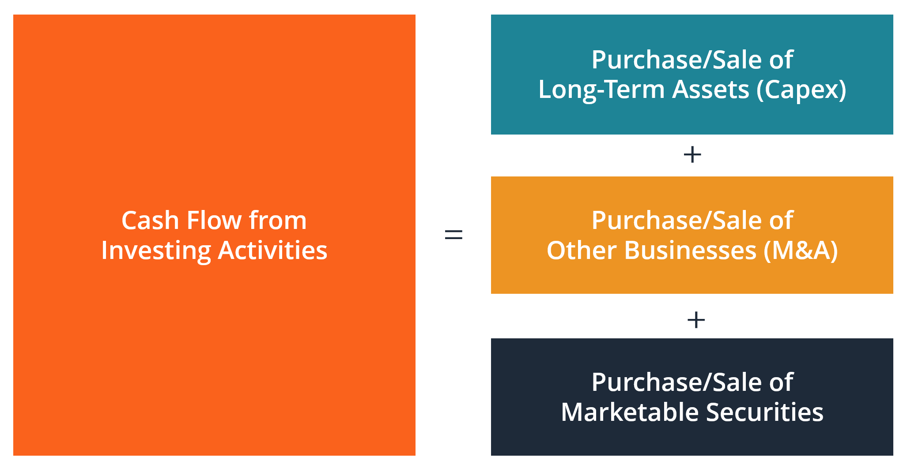

## Table of Contents

## What is cash flow from investing activities?

Cash flow from investing activities is the section of a company's cash flow statement that shows how much money the company has spent on or received from its investments. This can include buying or selling things like buildings, equipment, or stocks and bonds. It's called "investing activities" because these actions are usually aimed at growing the business or earning more money in the future.

When a company buys new equipment or a new factory, it spends money, which is shown as a negative number in this section of the cash flow statement. On the other hand, if the company sells an old building or some of its stocks, it gets money back, which is shown as a positive number. By looking at this part of the cash flow statement, you can see if the company is investing a lot in its future growth or if it's selling off assets to get cash.

## Why is it important to analyze cash flow from investing activities?

Analyzing cash flow from investing activities is important because it tells us how a company is using its money to grow or change. When a company spends money on new equipment, buildings, or other businesses, it shows they are investing in their future. This can be a good sign because it might mean the company is trying to get bigger or better at what they do. But, if they are spending a lot without making money back soon, it could also be risky.

On the other hand, if a company is selling off its assets, like buildings or stocks, it might mean they need cash quickly. This could be a warning sign that the company is in trouble and needs money to keep going. By looking at the cash flow from investing activities, we can understand if the company is growing, shrinking, or just trying to stay afloat. This helps investors and managers make smart decisions about the company's future.

## What types of transactions are included in cash flow from investing activities?

Cash flow from investing activities includes money spent on buying long-term assets, like buildings, equipment, and vehicles. It also includes money spent on buying other businesses or investing in stocks, bonds, and other securities. These kinds of spending are investments because the company hopes they will help it grow or make more money in the future.

On the other hand, cash flow from investing activities also includes money received from selling these long-term assets or investments. For example, if a company sells an old factory or some of its stocks, the money it gets back is shown here. By looking at this part of the cash flow statement, you can see if the company is spending a lot on new things or if it is selling off old things to get cash.

## How do you calculate cash flow from investing activities?

To calculate cash flow from investing activities, you need to look at all the money the company has spent on buying long-term assets and investments, and all the money it has received from selling them. Start by adding up all the money spent on things like new buildings, equipment, and buying other businesses. Also, include money spent on buying stocks, bonds, or other securities. This will give you the total amount of money the company has spent on investing activities.

Next, add up all the money the company has received from selling these kinds of assets or investments. This includes money from selling old buildings, equipment, or stocks and bonds. Once you have these two totals, subtract the money spent from the money received. If the company spent more than it received, the cash flow from investing activities will be a negative number. If it received more than it spent, it will be a positive number. This calculation helps you see how much cash the company's investing activities have used or provided during a certain period.

## What is the difference between cash inflows and outflows in investing activities?

Cash inflows in investing activities are the money a company gets when it sells things like buildings, equipment, or investments like stocks and bonds. When a company decides to sell an old factory or some of its shares in another company, the money it receives from these sales is called a cash inflow. This money coming in can be used for other things, like paying bills or investing in new projects.

Cash outflows, on the other hand, are the money a company spends when it buys new buildings, equipment, or investments. If a company decides to buy a new machine or invest in another company's stocks, the money it spends is called a cash outflow. This spending is important because it shows how much the company is investing in its future growth, but it also means less cash is available for other uses right now.

## Can you provide examples of cash inflows from investing activities?

One example of a cash inflow from investing activities is when a company sells an old factory. Imagine a business has a factory that it no longer needs, so it decides to sell it. When someone buys the factory, the company gets money from the sale. This money coming into the company is a cash inflow from investing activities because the company is getting cash by selling a long-term asset.

Another example is when a company sells stocks or bonds that it owns. Let's say a company invested in the stocks of another business a few years ago. Now, it decides to sell those stocks. When it does, it gets money from the sale of the stocks. This money coming back to the company is also a cash inflow from investing activities because it's money received from selling an investment.

## Can you provide examples of cash outflows from investing activities?

One example of a cash outflow from investing activities is when a company buys new equipment. Imagine a business needs a new machine to make its products faster. When it buys this machine, it spends money. This spending is a cash outflow from investing activities because the company is using its money to buy a long-term asset that will help it grow in the future.

Another example is when a company invests in another business by buying its stocks or bonds. Let's say a company thinks another business will do well, so it decides to buy some of its stocks. The money the company spends to buy these stocks is a cash outflow from investing activities. This is because the company is using its money to make an investment that it hopes will pay off later.

## How does cash flow from investing activities impact a company's financial health?

Cash flow from investing activities can tell us a lot about a company's financial health. When a company spends money on new buildings, equipment, or investments, it shows they are trying to grow and make more money in the future. This can be good because it means the company is working on getting bigger and better. But, if they spend a lot of money and don't get money back soon, it can also be risky. If a company keeps spending more than it gets back, it might not have enough cash to pay its bills or keep running smoothly.

On the other hand, if a company is selling off its assets, like buildings or stocks, it might mean they need cash quickly. This can be a warning sign that the company is in trouble and needs money to keep going. If a company is selling things to get cash, it might not be able to grow or might be struggling to stay afloat. By looking at the cash flow from investing activities, we can understand if the company is healthy, growing, or facing problems. This helps investors and managers make smart decisions about the company's future.

## What are common trends or patterns to look for when analyzing cash flow from investing activities?

When you look at a company's cash flow from investing activities, one common trend to watch is how much they are spending on new things like buildings or equipment. If a company is spending a lot of money to buy new stuff, it usually means they are trying to grow their business. This can be a good sign because it shows they are planning for the future. But if they keep spending a lot without getting money back from their investments soon, it could be risky. They might run out of cash and struggle to pay bills.

Another pattern to look for is if a company is selling off its assets, like old buildings or stocks. If they are doing this a lot, it might mean they need cash quickly. This can be a warning sign that the company is in trouble and trying to stay afloat. On the other hand, if they are selling some old things to buy new, better things, it could be part of a smart plan to improve the business. By watching these trends, you can get a better idea of whether the company is healthy and growing or if it might be facing problems.

## How can negative cash flow from investing activities be interpreted?

When a company has negative cash flow from investing activities, it means they are spending more money on buying things like buildings, equipment, or stocks than they are getting back from selling these kinds of things. This can be a good sign because it shows the company is investing in its future. They might be buying new machines to make their products faster or investing in other businesses to grow bigger. It's like planting seeds for a bigger harvest later.

But, negative cash flow from investing activities can also be a warning sign. If a company keeps spending a lot of money without getting any back soon, they might run out of cash. This could make it hard for them to pay their bills or keep running smoothly. It's important to look at how much they are spending and if they have a plan to make money back from their investments. If they don't, the negative cash flow could mean the company is taking big risks.

## What advanced metrics or ratios can be used to further analyze cash flow from investing activities?

One useful metric to look at when analyzing cash flow from investing activities is the Capital Expenditure (CapEx) to Sales Ratio. This ratio shows how much a company is spending on buying new things like buildings and equipment compared to how much money they are making from selling their products or services. A high ratio might mean the company is investing a lot in its future growth, which can be good if they have a plan to make more money from these investments. But if the ratio is too high and they don't have enough money coming in, it could be risky.

Another helpful ratio is the Free Cash Flow to Capital Expenditure Ratio. This tells us how much cash a company has left over after paying for new things like buildings and equipment. If this ratio is high, it means the company has a lot of extra cash, which is good because it can use this money for other things like paying off debts or giving money back to investors. If the ratio is low, it might mean the company is spending a lot on new things and not making enough money back, which could be a warning sign that they might run into cash problems.

By looking at these ratios, you can get a better idea of how a company is using its money to grow and if they are doing it in a smart way. It's important to think about these numbers along with other information about the company to understand their overall financial health and future plans.

## How do different industries vary in their cash flow from investing activities, and what does this indicate about their business models?

Different industries can have very different cash flows from investing activities because their business models are different. For example, a tech company might spend a lot of money on research and development, buying new computers and software. This means they might have a lot of negative cash flow from investing activities because they are putting money into new ideas and technology. On the other hand, a manufacturing company might spend a lot on buying new machines and factories to make their products. Their negative cash flow from investing activities shows they are investing in making more things to sell.

These differences tell us a lot about how each industry works. A tech company's focus on research and development means they are trying to come up with new ideas and products. They might not see money back from these investments right away, but if their new ideas work, they could make a lot of money later. A manufacturing company's investment in new machines and factories shows they are trying to make more products to sell. They might see money back from these investments sooner because they can start making and selling more things right away. By looking at how much and where a company spends its money, we can understand what kind of business they are and what they are planning for the future.

## What are some strategies and examples of algorithmic trading?

Algorithmic trading relies on a variety of strategic approaches to leverage computational power for optimal trading outcomes. Key strategies include trend-following, [arbitrage](/wiki/arbitrage), and index fund rebalancing. These methods use algorithms to systematically analyze market data, identifying patterns and executing trades with minimal human intervention.

Trend-following strategies aim to capitalize on market [momentum](/wiki/momentum) by identifying and trading in the direction of prevailing market trends. A common technique involves the use of moving averages to determine trend directions and generate signals for buying or selling. For example, a simple moving average (SMA) strategy might involve buying a security when its short-term SMA crosses above its long-term SMA, signaling an upward trend. The mathematical expression for an SMA is:

$$
\text{SMA}_n = \frac{1}{n} \sum_{i=0}^{n-1} P_i
$$

where $P_i$ represents the price at the $i$-th time period, and $n$ is the number of periods considered.

Arbitrage strategies exploit inefficiencies in market prices to make risk-free profits. These strategies involve simultaneously buying and selling equivalent assets in different markets to benefit from price discrepancies. For instance, [statistical arbitrage](/wiki/statistical-arbitrage) uses mathematical models to identify slight divergences between related securities expected to revert to the mean, allowing traders to profit when these prices converge.

Index fund rebalancing involves adjusting the composition of a portfolio of stocks to maintain alignment with a specific index. Algorithms can automatically execute trades to maintain the desired allocation, ensuring that the portfolio accurately reflects the index's performance. This strategy benefits from algorithmic efficiency, especially given the transaction cost savings through optimized trade execution.

The implementation of these strategies has been significantly enhanced by programming languages such as Python, which provides extensive libraries for data handling, analysis, and visualization. Python's popular libraries include NumPy for numerical operations, pandas for data manipulation, and scikit-learn for [machine learning](/wiki/machine-learning), all of which facilitate the development of complex trading strategies. The ability to process real-time data and perform quick analyses is critical for the success of [algorithmic trading](/wiki/algorithmic-trading) strategies, which must respond dynamically to market conditions.

Algorithmic trading reduces the error rate associated with manual trading and allows for the execution of complex, data-driven strategies with improved accuracy and speed. By minimizing human error and biases, these strategies enhance the overall efficiency of trading operations, offering investors a sophisticated toolset for navigating the financial markets.

## References & Further Reading

Bergstra, J., et al. 'Algorithms for Hyper-Parameter Optimization.' Advances in Neural Information Processing Systems 24. This paper is a comprehensive resource on hyper-parameter optimization algorithms, which are crucial for enhancing the predictive power of machine learning models in financial applications, including algorithmic trading.

Lopez de Prado, M., 'Advances in Financial Machine Learning.' This book is a fundamental resource exploring the intersection of financial markets and machine learning, providing practical techniques for implementing machine learning strategies in investment and trading.

Aronson, D., 'Evidence-Based Technical Analysis: Applying the Scientific Method and Statistical Inference to Trading Signals.' Aronson introduces rigorous methods for evaluating the validity of technical analysis signals, emphasizing the use of statistical inference to distinguish genuine trading opportunities from noise.

Jansen, S., 'Machine Learning for Algorithmic Trading.' Jansen's work is dedicated to leveraging machine learning algorithms for designing and executing algorithmic trading strategies, providing insights into using data-driven techniques for financial market analysis.

Chan, E.P., 'Quantitative Trading: How to Build Your Own Algorithmic Trading Business.' This book serves as a guide to establishing a [quantitative trading](/wiki/quantitative-trading) business, covering the essentials of developing algorithmic strategies, risk management, and integrating financial data into trading algorithms.

